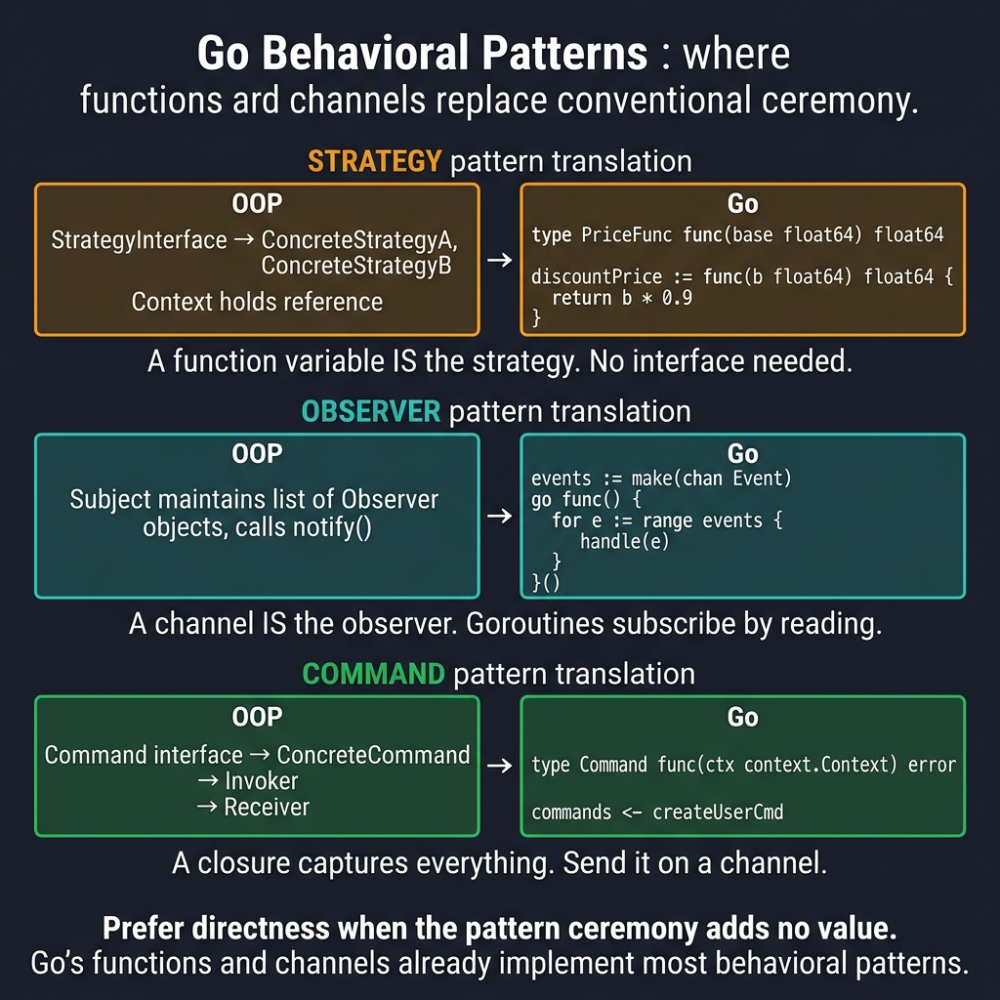

<!-- tags: golang, design-patterns, behavioral -->
# 🎭 Behavioral Patterns — Strategy, Observer, Chain of Responsibility

> **Idiom**: Go manages behaviors using interfaces (Strategy), channels (Observer), and middleware pipelines (Chain of Responsibility).

📅 Created: 2026-03-24 · 🔄 Updated: 2026-04-14 · ⏱️ 10 min read

> ⚠️ **Bridge page**: Canonical behavioral patterns reside within [assets/design-pattern/behavioral](../../design-pattern/behavioral/README.md). Should you require detailed insight investigating Go-specific pipelines, consult [Pipelines, Worker Pools & Cancellation](../idioms/03-pipelines-worker-pools-and-cancellation.md) immediately.

## 1. DEFINE

Classical object-oriented languages rely on massive hierarchies to dictate how objects communicate. Go simplifies behavior routing by treating functions as first-class citizens and using channels for async communication. 

Consequently, **Behavioral Patterns** in Go avoid creating massive controller classes. Instead, we plug interfaces into structs (Strategy), pass messages securely across boundaries (Observer), and wrap handlers sequentially (Chain of Responsibility).

### 1.1 Invariants & Failure Modes

- Strategies should be interchangeable through interfaces without modifying the core execution engine.
- Observers running as asynchronous goroutines must execute deterministically without causing data races.
- Chain of Responsibility handlers must check conditions and either call or halt the next handler in the sequence.

## 2. VISUAL

Go's first-class functions and channels already implement most behavioral patterns. The diagram below shows how OOP ceremony maps to Go primitives.



*Figure: Strategy becomes a function variable, Observer becomes a channel read loop, Command becomes a closure on a channel. When pattern ceremony adds no value, use the Go primitive directly.*

## 3. CODE

This section anchors theoretical mental models applying behavioral patterns via executable applications.

### Example 1: Basic — Strategy

> **Goal**: Swap core execution algorithms dynamically without modifying the caller.
> **Approach**: Structure unified interface definitions and inject specific implementations matching contextual requirements directly.
> **Complexity**: O(1) strategy selection scaling based on algorithmic costs.

```go
// NestJS: @Injectable() strategies → Go: interface
package strategy

import "context"

type NotificationStrategy interface {
	Send(ctx context.Context, to, message string) error
}

type emailNotifier struct{ /* client *smtp.Client */ }
func (n *emailNotifier) Send(ctx context.Context, to, msg string) error { return nil }

type smsNotifier struct{ /* apiKey string */ }
func (n *smsNotifier) Send(ctx context.Context, to, msg string) error { return nil }

type pushNotifier struct{ /* fcmClient *fcm.Client */ }
func (n *pushNotifier) Send(ctx context.Context, to, msg string) error { return nil }

// Service uses strategy
type NotificationService struct {
	strategy NotificationStrategy
}

func NewNotificationService(strategy NotificationStrategy) *NotificationService {
	return &NotificationService{strategy: strategy}
}

func (s *NotificationService) Notify(ctx context.Context, to, msg string) error {
	return s.strategy.Send(ctx, to, msg) // Behavior depends on the injected strategy
}

// svc := NewNotificationService(&emailNotifier{client: smtpClient})
// svc := NewNotificationService(&smsNotifier{apiKey: "xxx"})
```

> **Takeaway**: Strategies separate algorithm selection from execution. Go interfaces make dependency injection native and safe.

---

### Example 2: Intermediate — Observer (Event Bus)

> **Goal**: Let subscribers react to published events without tight coupling.
> **Approach**: An internal event bus dispatches to registered handlers. Each handler runs in its own goroutine.
> **Complexity**: O(N) per publish, where N is the subscriber count.

```go
package observer

import "sync"

type EventBus struct {
	subscribers map[string][]func(data any)
	mu          sync.RWMutex
}

func NewEventBus() *EventBus {
	return &EventBus{subscribers: make(map[string][]func(data any))}
}

func (eb *EventBus) Subscribe(event string, handler func(data any)) {
	eb.mu.Lock()
	defer eb.mu.Unlock()
	eb.subscribers[event] = append(eb.subscribers[event], handler) // Register observer
}

func (eb *EventBus) Publish(event string, data any) {
	eb.mu.RLock()
	defer eb.mu.RUnlock()
	for _, handler := range eb.subscribers[event] {
		go handler(data) // Broadcast async without blocking publisher
	}
}

// Usage:
// bus := NewEventBus()
// bus.Subscribe("user.created", func(d any) { sendWelcomeEmail(d) })
// bus.Subscribe("user.created", func(d any) { createAuditLog(d) })
// bus.Publish("user.created", user)
```

> **Takeaway**: Observers remove hard-wired caller→callee links. But unbounded goroutine spawning causes memory exhaustion — cap the concurrent handler count.

---

### Example 3: Advanced — Chain of Responsibility (Middleware)

> **Goal**: Process a request through a series of conditional checks without a monolithic handler.
> **Approach**: Each middleware wraps the next handler. Failed checks halt the chain early.
> **Complexity**: O(N) where N is the middleware count.

```go
// This IS the middleware pattern in Gin/Fiber!
package chain

import "context"

type Request struct { Path string; Token string }
type Response struct { Status int }
type Logger interface { Info(msg string, args ...any) }
type AuthService interface { Verify(token string) bool }

type Handler func(ctx context.Context, req Request) (Response, error)
type Middleware func(Handler) Handler

func WithLogging(logger Logger) Middleware {
	return func(next Handler) Handler {
		return func(ctx context.Context, req Request) (Response, error) {
			logger.Info("request started", "path", req.Path)
			resp, err := next(ctx, req) // Proceed to next link in chain
			logger.Info("request completed", "status", resp.Status)
			return resp, err
		}
	}
}

func WithAuth(authSvc AuthService) Middleware {
	return func(next Handler) Handler {
		return func(ctx context.Context, req Request) (Response, error) {
			if !authSvc.Verify(req.Token) {
				return Response{Status: 401}, nil // Halt execution
			}
			return next(ctx, req)
		}
	}
}

// Chain middlewares: the last registered middleware wraps first
func Chain(handler Handler, middlewares ...Middleware) Handler {
	for i := len(middlewares) - 1; i >= 0; i-- {
		handler = middlewares[i](handler)
	}
	return handler
}

// final := Chain(myHandler, WithLogging(logger), WithAuth(authSvc))
```

> **Takeaway**: Middleware chains are the backbone of Go web frameworks. Placing auth after the database handler skips authorization entirely.

## 4. PITFALLS

Behavioral patterns fail when the abstraction costs more than the directness it replaces.

| # | Severity | Defect | Fix |
|---|----------|--------|-----|
| 1 | 🟡 Common | Creating a Strategy interface for a simple if/else. | Use a plain function. Add the interface when a third implementation appears. |
| 2 | 🔴 Fatal | Spawning unbounded goroutines per observer event. | Use a bounded worker pool. Cap goroutine count with a semaphore channel. |
| 3 | 🔴 Fatal | Auth middleware placed after the database handler. | Order middlewares: logging → auth → rate-limit → business handler. |

## 5. REF

| Resource | Type | Link |
| --- | --- | --- |
| Go Patterns | Reference | [refactoring.guru/design-patterns/go](https://refactoring.guru/design-patterns/go) |
| Go Proverbs | Reference | [go-proverbs.github.io](https://go-proverbs.github.io/) |
| Effective Go | Official docs | [go.dev/doc/effective_go](https://go.dev/doc/effective_go) |

## 6. RECOMMEND

Behavioral patterns lead into concurrency and event-driven architectures.

| Extension | When to proceed | Rationale |
| --- | --- | --- |
| [Worker Pools](../idioms/03-pipelines-worker-pools-and-cancellation.md) | Observer goroutines need bounds. | Bounded pools prevent memory exhaustion under high event load. |
| [Cobra/Viper](../cli/01-cobra-viper.md) | CLI needs runtime strategy selection. | Maps command flags to strategy implementations. |
| [Canonical Behavioral Hub](../../design-pattern/behavioral/README.md) | Language-independent theory. | Textbook definitions without Go-specific constraints. |

**Navigation**: [← Structural Patterns](./02-structural.md) · [→ Go Idioms Hub](../idioms/README.md)
