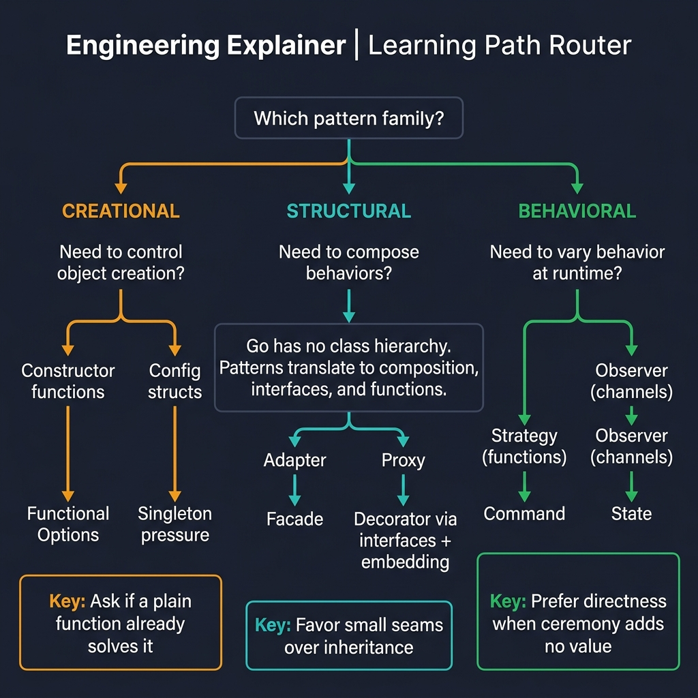

<!-- tags: golang, overview, design-patterns -->
# Legacy Bridge — Design Patterns in Go

> **Idiom**: Bridging classical object-oriented design patterns with Go's idiomatic architecture by replacing heavy classes with composition and interfaces.

📅 Created: 2026-03-24 · 🔄 Updated: 2026-04-14 · ⏱️ 6 min read

## 1. DEFINE

When transitioning to Go from languages like Java or C#, teams often carry over Gang of Four (GoF) design patterns. While the vocabulary remains useful for communication, textbook implementations fail in Go. Go lacks inheritance and classes, favoring structural typing and behavior-driven interfaces. 

This bridge layer does not teach the theory of design patterns. Instead, it takes common terms like "Factory" or "Decorator" and shows how to achieve the exact same operational result using Go idioms.

### 1.1 Signals & Boundaries

- Use this guide when your team is debating how to implement a classical OOP pattern in Go.
- For pure theoretical pattern definitions, read the general [Design Pattern Hub](../../design-pattern/README.md).
- To bypass patterns entirely and read pure idioms, see the [Idioms collection](../idioms/README.md).

### 1.2 Learning Lanes

- `01-creational.md`: Object instantiation, including factory functions and functional options.
- `02-structural.md`: Combining types using embedding and wrapper interfaces.
- `03-behavioral.md`: Managing state transitions and control flow across system boundaries.

## 2. VISUAL

Each pattern family addresses a different pressure point. The decision starts with the underlying problem — not with the pattern name.



*Figure: Three families map to three Go primitives — Creational collapses into constructor functions and options, Structural into interface composition and embedding, Behavioral into first-class functions and channels.*

## 3. CODE

This routing code snippet encapsulates the navigation logic of this bridge module.

### Example 1: Router pattern mapping

> **Goal**: Group classical patterns by their underlying Go solutions.
> **Approach**: A switch statement routes pattern terminology to the correct Go translation file.
> **Complexity**: O(1) routing allocation.

```go
func choosePatternTranslation(problem string) string {
	switch problem {
	case "factory", "builder", "singleton", "construction":
		return "./01-creational.md"
	case "adapter", "decorator", "proxy", "facade":
		return "./02-structural.md"
	case "strategy", "observer", "command", "state":
		return "./03-behavioral.md"
	default:
		return "./README.md"
	}
}
```

> **Takeaway**: Pattern names are communication tools, not implementation blueprints. Ask what the code needs — creation, composition, or behavior dispatch — then pick the Go primitive.

## 4. PITFALLS

Importing OOP class hierarchies into Go creates coupling problems that the language was designed to avoid.

| # | Severity | Defect | Fix |
|---|----------|--------|-----|
| 1 | 🔴 Fatal | Copying Java class trees into Go structs. | Drop inheritance. Use struct embedding with small, focused interfaces. |
| 2 | 🟡 Common | Labeling a pattern where a language feature suffices. | A package-level `var` replaces most Singleton ceremonies. |
| 3 | 🟡 Common | Declaring interfaces before knowing the second implementation. | Return concrete structs. Add an interface only when two callers need different behaviors. |

## 5. REF

| Resource | Type | Link |
| --- | --- | --- |
| Effective Go | Official docs | [go.dev/doc/effective_go](https://go.dev/doc/effective_go) |
| CodeReviewComments | Official wiki | [go.dev/wiki/CodeReviewComments](https://go.dev/wiki/CodeReviewComments) |
| Go Proverbs | Reference | [go-proverbs.github.io](https://go-proverbs.github.io/) |

## 6. RECOMMEND

Pick the family that matches your current design pressure.

| Extension | When to proceed | Rationale |
| --- | --- | --- |
| [Creational Patterns](./01-creational.md) | Object initialization grows complex. | Covers factories, builders, functional options, and singleton guards. |
| [Structural Patterns](./02-structural.md) | Types need to compose or adapt. | Adapter, decorator, and facade via interfaces and embedding. |
| [Behavioral Patterns](./03-behavioral.md) | Runtime behavior must vary. | Strategy (interfaces), observer (channels), middleware chains. |
| [Canonical Pattern Hub](../../design-pattern/README.md) | Language-independent theory. | Textbook definitions decoupled from any runtime. |
