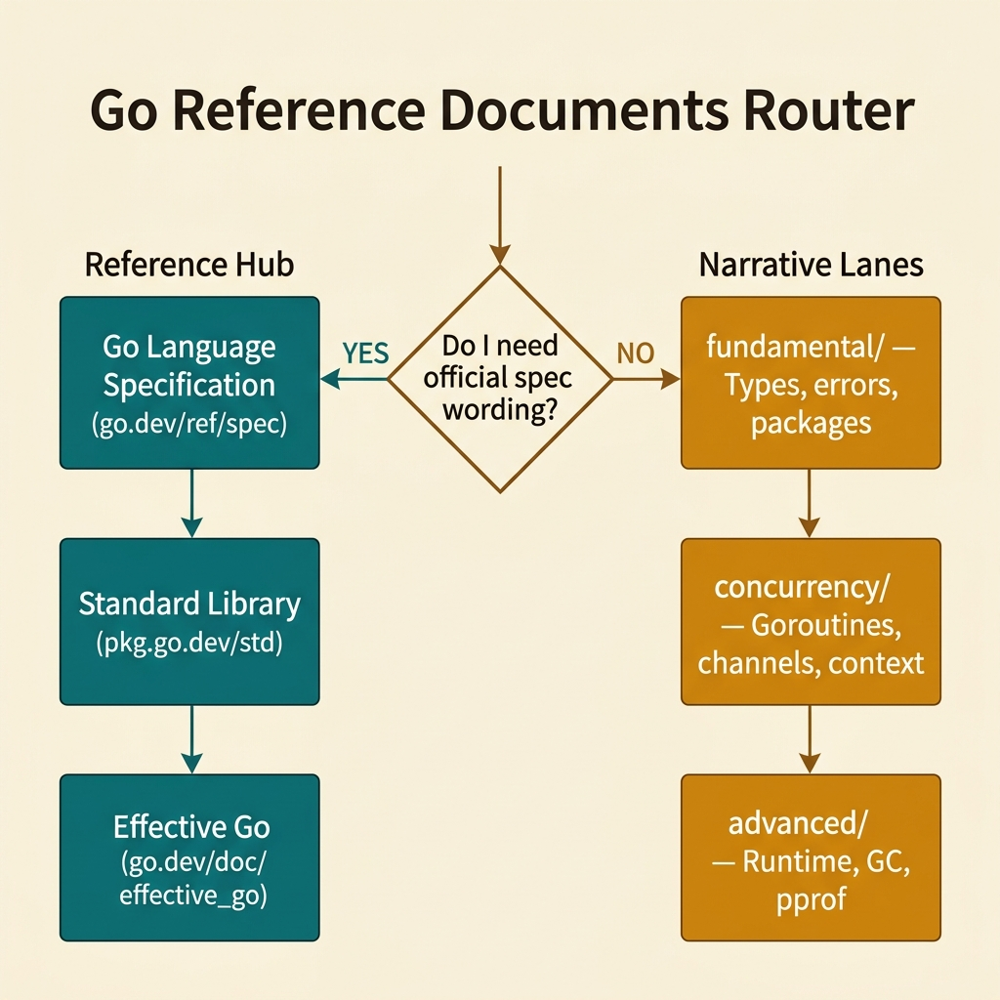
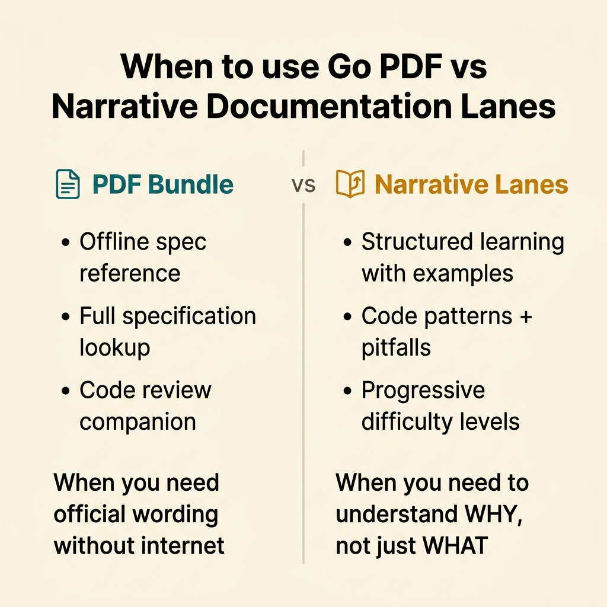

<!-- tags: go, documentation, reference -->
# Go — Reference Documents

> This hub maps Go's official specification, standard library reference, and idiomatic guides to the documentation lanes in this project. Use it when you need to trace a claim back to an authoritative source.

📅 Updated: 2026-04-10 · ⏱️ 6 min read

## 1. DEFINE

Go has three tiers of official documentation. The language specification defines what Go is. Effective Go defines how to write it well. The standard library reference (`pkg.go.dev/std`) defines every type, function, and method in the standard library.

This hub exists for one reason: when a documentation lane in this project makes a claim about Go behavior, this hub tells you which official source to verify it against.

### 1.1 Signals & Boundaries

- Open this hub when you need to verify a technical claim against Go's official specification or standard library.
- Use the PDF bundle when you need offline access to the full Go reference.
- Return to the Go Programming Hub when your question is about project architecture, not language semantics.

### 1.2 Learning Lanes

- Start with `fundamental/` if you need to understand Go's type system, error handling, or package structure.
- Move to `concurrency/` when your question involves goroutines, channels, or `context.Context`.
- Move to `advanced/` when you are investigating runtime performance, GC tuning, or profiling.
- This hub is a reference anchor, not a learning path. Read the lanes for explanations; read this hub for source verification.

## 2. VISUAL

The visual below shows when to use this reference hub versus the narrative documentation lanes.



*Figure: Two paths diverge at the question "Do I need official spec wording?" — YES routes to this reference hub (spec, pkg.go.dev, Effective Go); NO routes to the narrative lanes (fundamental/, concurrency/, advanced/).*



*Figure: PDF bundle is for offline review and full-spec lookup. Narrative lanes are for structured learning with code examples and pitfalls.*

## 3. CODE

The router below compresses this hub's navigation logic into a single function.

### Example 1: Router artifact — selecting the right reference surface

> **Goal**: Choose between the reference hub and a narrative lane based on reading intent.
> **Complexity**: Basic

```go
func chooseGoReferenceSurface(goal string) string {
	switch goal {
	case "spec", "package-api", "official-wording", "pdf-review":
		return "./README.md"
	case "fundamental-reasoning":
		return "../fundamental/README.md"
	case "runtime", "heap", "pprof":
		return "../advanced/README.md"
	case "concurrency", "context", "goroutine":
		return "../concurrency/README.md"
	default:
		return "../README.md"
	}
}
```

**Why?** This function is not production code. It captures the decision model: official spec questions stay in this hub, conceptual questions route to narrative lanes. If you find yourself reading the spec for a "how to" question, you are in the wrong lane.

## 4. PITFALLS

| # | Severity | Defect | Consequence | Fix |
|---|----------|--------|-------------|-----|
| 1 | 🔴 Fatal | Reading the language spec to learn a concept | The spec describes behavior precisely but does not explain why. You get the rule but miss the reasoning. | Use the spec to verify, not to learn. Start with the narrative lane, then verify against the spec. |
| 2 | 🟡 Common | Skipping the spec when writing documentation | Claims about Go behavior may be inaccurate or outdated. | Always verify claims against `go.dev/ref/spec` before publishing. |
| 3 | 🟡 Common | Confusing Effective Go with the spec | Effective Go is a style guide with opinions. The spec is the normative source. They can disagree on emphasis. | Treat the spec as ground truth. Treat Effective Go as recommended practice. |
| 4 | 🔵 Minor | Losing context by jumping between reference and learning lanes | Fragmented reading session with no clear takeaway. | Pick one intent per session: verify or learn. Return here to redirect. |

## 5. REF

| Resource | Link | Description |
| --- | --- | --- |
| The Go Programming Language | [go.dev/doc/](https://go.dev/doc/) | Top-level documentation index for the Go project |
| Effective Go | [go.dev/doc/effective_go](https://go.dev/doc/effective_go) | Idiomatic Go writing guide — style, conventions, patterns |
| Go Language Specification | [go.dev/ref/spec](https://go.dev/ref/spec) | Normative specification defining Go's syntax and semantics |
| pkg.go.dev | [pkg.go.dev/std](https://pkg.go.dev/std) | Standard library API reference — every type, function, and method |

## 6. RECOMMEND

| Extension | When to read next | Rationale | File/Link |
| --- | --- | --- | --- |
| Go PDF Bundle | When you need offline access to the full specification | Portable reference for code review or travel | [golang.pdf](./golang.pdf) |
| Go Programming Hub | When your question is about project structure, not language semantics | Top-level router for all Go documentation lanes | [../README.md](../README.md) |
| Go Fundamental | When you need to learn Go basics: types, errors, packages, testing | Foundation lane with explanations and code examples | [../fundamental/README.md](../fundamental/README.md) |
| Go Concurrency | When you need to understand goroutines, channels, or context | Concurrency lane with race detection and pipeline patterns | [../concurrency/README.md](../concurrency/README.md) |
| Go Advanced | When you need runtime profiling, GC tuning, or escape analysis | Performance lane with pprof and memory optimization | [../advanced/README.md](../advanced/README.md) |
