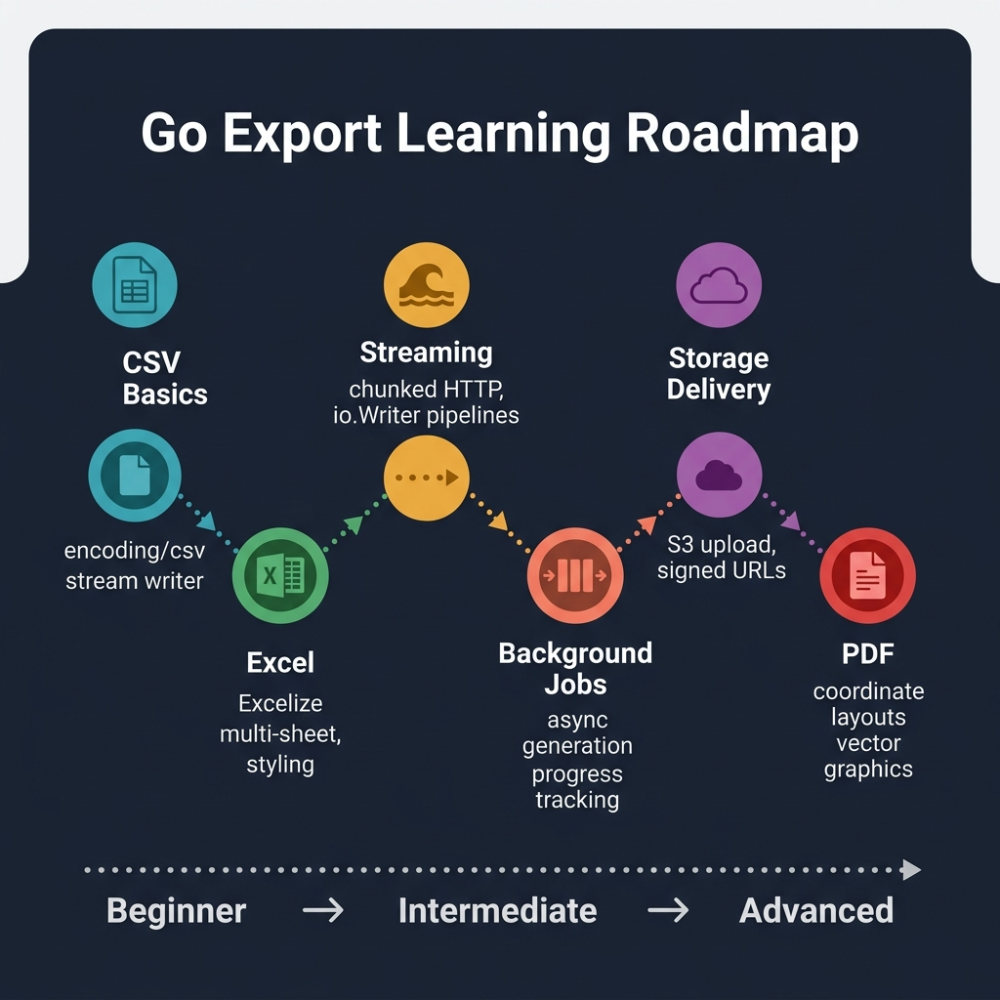

<!-- tags: golang, export, roadmap -->
# 🧭 Go Export Roadmap

> **Advanced Integration**: Structuring export frameworks evaluating asynchronous background jobs orchestrating final storage architectures securely.

📅 Created: 2026-03-27 · 🔄 Updated: 2026-04-14 · ⏱️ 3 min read

---

## 1. DEFINE

Building export paths demands separating raw file generation logic separating heavy background delivery orchestrations cleanly.

- `CSV` and `Excel` isolate structural mapping logic writing bounded tabular domains .
- `Streaming` bounds initial HTTP architectures processing continuous byte chunks bypassing memory limits .
- `Storage Delivery` uploads completed files generating secure Cloud URLs isolating application servers perfectly.
- `Background Jobs` offloads massive generation sequences tracking precise job states navigating HTTP timeouts securely.
- `PDF` renders specific visual documents translating domain entities evaluating pure presentation logic efficiently.

## 2. VISUAL



*Figure: Route specific export mechanisms evaluating distinct generation limits routing delivery logic perfectly.*

Evaluating export structures requires segregating data generation limits preventing monolithic HTTP failures directly.

## 3. CODE

### Example 1: Router artifact — Segregating export boundary rules processing variable targets securely

> **Goal**: Evaluate string targets testing explicit variables separating export paths cleanly.
> **Approach**: Configure a string router isolating distinct logical domains routing documentation mapping checks efficiently.
> **Complexity**: Basic

```go
func chooseExportConcern(symptom string) string {
    switch symptom {
    case "download ngay", "csv", "tabular":
        return "./csv/README.md"
    case "workbook", "multi sheet", "styling":
        return "./excel/README.md"
    case "memory pressure", "large stream files":
        return "./streaming/README.md"
    case "signed url", "artifact delivery":
        return "./storage-delivery/README.md"
    case "progress", "retry", "background job":
        return "./background-jobs/README.md"
    case "pdf":
        return "./pdf/README.md"
    default:
        // Returns strict base documentation bounding unmatched variable paths cleanly.
        return "./README.md"
    }
}
```

> **Why segregate format export logic?** (Why)
> Combining rendering paths parsing streaming constraints generates complex monolithic functions failing maintenance checks quickly. Isolating individual logic mechanisms limits configuration scopes protecting specific boundary implementations independently.

## 4. PITFALLS

| # | Severity | Defect | Fix |
|---|----------|--------|-----|
| 1 | 🔴 Fatal | Accumulating millions mapping variable arrays crashing servers blocking operational capacity. | Construct streaming sequences evaluating chunk loops isolating specific array boundaries completely. |
| 2 | 🔴 Fatal | Executing massive loops triggering Nginx HTTP timeouts resolving 504 errors abruptly. | Dispatch background tasks tracking asynchronous limits generating distinct delivery payloads cleanly. |
| 3 | 🟡 Common | Serving exported formats mapping binary streams overloading primary network throughput bounds. | Upload artifacts structuring object storage buckets distributing expiring direct download URLs proactively. |

## 5. REF

| Resource | Link | Note |
| --- | --- | --- |
| encoding/csv | [https://pkg.go.dev/encoding/csv](https://pkg.go.dev/encoding/csv) | Tabular export building blocks in Go |
| Excelize docs | [https://xuri.me/excelize/en/](https://xuri.me/excelize/en/) | Workbook-oriented export in Go |
| net/http | [https://pkg.go.dev/net/http](https://pkg.go.dev/net/http) | Download delivery, streaming response, header semantics |

## 6. RECOMMEND

| Extension | When to proceed | Rationale | File/Link |
| --- | --- | --- | --- |
| **Tabular Formats** | Rendering concurrent grids extracting simple CSV data limiting complex array memory. | Constructs simple tabular components defining bounded CSV generators. | [./csv/README.md](./csv/README.md) |
| **Streaming Bytes** | Processing distinct arrays dumping million-row databases resolving immediate client downloads smoothly. | Evaluates byte chunking limits streaming unbounded query cursors securely. | [./streaming/README.md](./streaming/README.md) |
| **Signed URLs** | Segregating massive outputs shifting network payload architectures securing file transfers securely. | Uploads storage files defining strict expiry bounds preventing server overload. | [./storage-delivery/README.md](./storage-delivery/README.md) |
| **Job Queues** | Shielding architecture timeouts tracking independent asynchronous limits routing heavy document generation . | Dispatches worker queues processing massive array logic routing notification flows cleanly. | [./background-jobs/README.md](./background-jobs/README.md) |

---
