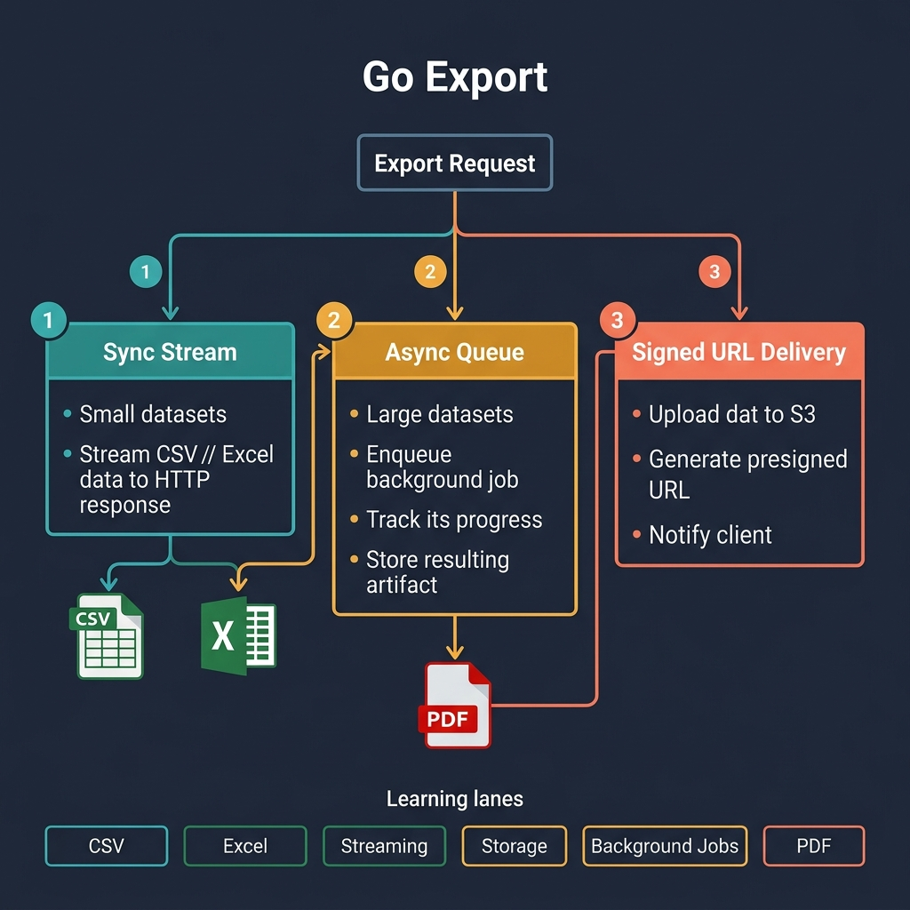

<!-- tags: golang, export, overview -->
# Go Export

> Streaming large files, formatting documents, running background jobs, and delivering artifacts — without crashing the server.

📅 Created: 2026-04-05 · 🔄 Updated: 2026-04-14 · ⏱️ 6 min read

---

## 1. DEFINE

Export systems fail when developers load million-row datasets into memory and serialize them in a single HTTP handler. **Go Export** defines patterns that prevent out-of-memory crashes during long-running file generation.

> *Loading a million-row result set into a `[]byte` before writing the response guarantees an OOM kill.*

### 1.1 Signals & Boundaries

- Open this domain when building background processes that extract large datasets into CSV, Excel, or PDF.
- Isolate async jobs to protect primary HTTP handlers from timeout pressure.
- Bound memory usage with streaming pipelines so the garbage collector stays healthy under load.

### 1.2 Learning Lanes

- `CSV Export` — streaming writes, HTTP download headers, and buffer management.
- `Excel Export` — multi-sheet workbooks, cell styling, and Excelize patterns.
- `Streaming Export` — chunked HTTP delivery with constant memory footprint.
- `Storage & Delivery` — uploading artifacts to S3 and generating signed URLs.
- `Background Jobs` — queue-based generation with progress tracking and retries.
- `PDF Export` — coordinate-based layouts and vector graphics rendering.

## 2. VISUAL



*Figure: Six learning lanes organized by output format and execution model. Sync paths stream directly. Async paths queue work and deliver via signed URLs.*

### Level 1

```text
Identify Request Payload
-> Select Format Strategy (CSV/Excel/PDF)
-> Determine Execution Context (Sync/Async)
-> Connect Delivery Mechanism
```

*Figure: High-level routing separates format selection from execution context to prevent handler overload.*

### Level 2

```text
Sync: Stream bytes directly to the HTTP response (CSV, small Excel).
Async: Enqueue a background job, track progress, store the artifact.
Deliver: Upload to S3, generate a signed URL, notify the client.
```

*Figure: Long-running generations store final files in object storage, decoupling generation from HTTP timeouts.*

## 3. CODE

### Example 1: Router artifact — choosing the right export lane

> **Goal**: Map a user's export intent to the right documentation lane.
> **Approach**: Route by format name or symptom description.
> **Complexity**: O(1) switch routing.

```go
// router.go — Route users to the right export doc.
func chooseLane(goal string) string {
    switch goal {
    case "csv", "download now":
        return "./csv/README.md"
    case "excel", "multi sheet", "styling":
        return "./excel/README.md"
    case "streaming", "memory pressure":
        return "./streaming/README.md"
    case "signed url", "artifact delivery":
        return "./storage-delivery/README.md"
    case "background job", "progress", "retry":
        return "./background-jobs/README.md"
    case "pdf":
        return "./pdf/README.md"
    default:
        return "./README.md"
    }
}
```

> **Why a router for exports?**
> CSV streams and PDF renders require different memory strategies. Routing by format ensures each handler operates within its memory budget.

## 4. PITFALLS

| # | Severity | Defect | Fix |
|---|----------|--------|-----|
| 1 | 🔴 Fatal | Loading the entire result set into a single `[]byte` | Stream from a database cursor with bounded chunk sizes |
| 2 | 🔴 Fatal | Generating large files inside the HTTP handler thread | Delegate to a background queue with progress tracking |
| 3 | 🟡 Common | Forgetting `defer` on file/buffer handles | Release temporary resources immediately after use |

## 5. REF

| Resource | Link | Note |
| --- | --- | --- |
| encoding/csv | [https://pkg.go.dev/encoding/csv](https://pkg.go.dev/encoding/csv) | Tabular export building blocks in Go |
| Excelize docs | [https://xuri.me/excelize/en/](https://xuri.me/excelize/en/) | Workbook-oriented export in Go |
| net/http | [https://pkg.go.dev/net/http](https://pkg.go.dev/net/http) | Download delivery and streaming response behavior |

## 6. RECOMMEND

Choose the next lane based on your export bottleneck.

| Extension | When to proceed | Rationale | File/Link |
| --- | --- | --- | --- |
| **Streaming** | Memory grows linearly with row count | Chunked HTTP delivery keeps memory constant | [./streaming/README.md](./streaming/README.md) |
| **Background Jobs** | HTTP requests timeout during generation | Queue-based processing decouples generation from the request | [./background-jobs/README.md](./background-jobs/README.md) |
| **Object Storage** | Generated files exceed response size limits | S3 + signed URLs offload delivery from the app server | [./storage-delivery/README.md](./storage-delivery/README.md) |

---
