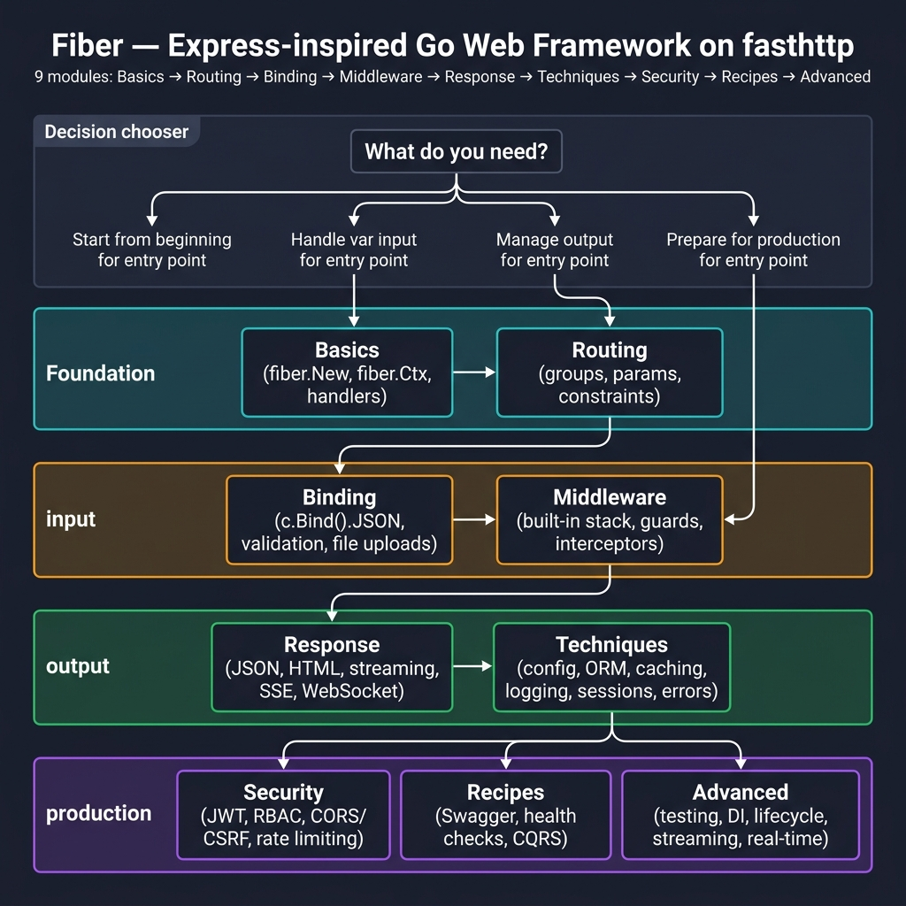
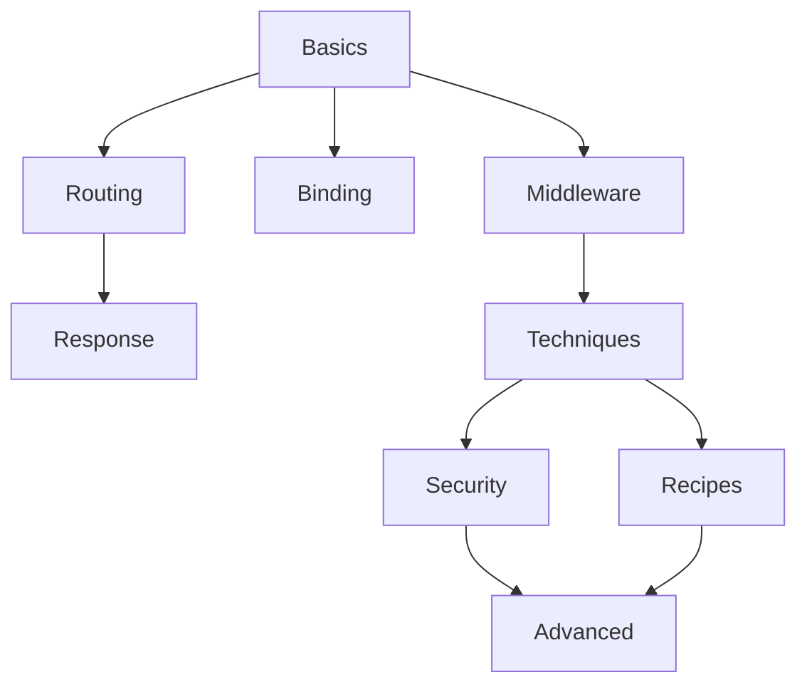
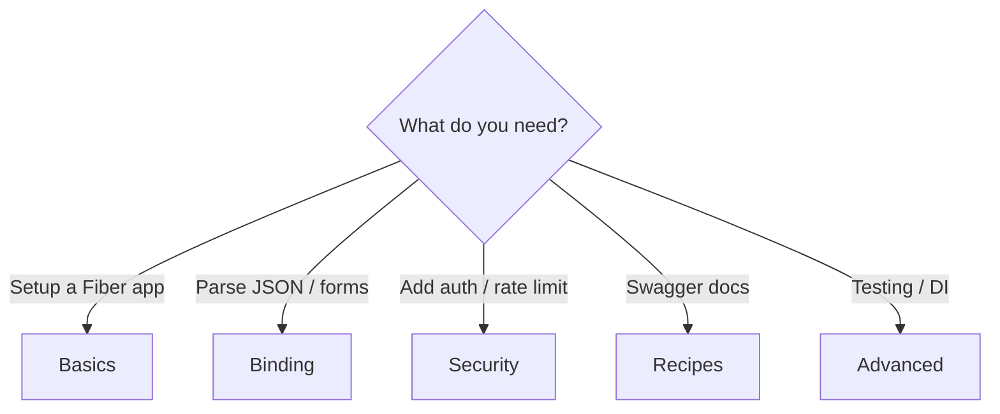

<!-- tags: golang, overview -->
# Fiber Web Framework 

> **Goal**: Express-inspired Go web framework built on fasthttp — maps NestJS patterns to idiomatic Fiber v3.

📅 Updated: 2026-04-19 · ⏱️ 6 min read

## 1. DEFINE

Fiber is an Express-inspired Go web framework built on fasthttp (not net/http). This hub organizes all Fiber documentation into learning paths, from basic request handling through production-grade security and real-time patterns.

### Learning Paths

- **Basics** → `fiber.New()`, `fiber.Ctx`, handler signatures
- **Routing** → groups, params, constraints, versioning
- **Binding** → `c.Bind().JSON()`, validation, file uploads
- **Middleware** → built-in stack, guards, interceptors, error handlers
- **Response** → JSON, HTML templates, streaming, SSE, WebSocket
- **Techniques** → config, ORM, caching, logging, sessions, errors
- **Security** → JWT auth, RBAC, CORS/CSRF, rate limiting
- **Recipes** → Swagger, health checks, CQRS
- **Advanced** → testing, DI, lifecycle, streaming, real-time

## 2. VISUAL

The module overview maps the learning path from foundation to production. Start at Basics, branch by need.



*Figure: 9-module learning path — Foundation (Basics, Routing) → Input (Binding, Middleware) → Output (Response, Techniques) → Production (Security, Recipes, Advanced). Decision chooser routes you by symptom.*

### Mermaid Fallback





### Quick Navigation

```text
fiber.Ctx failures?    → Basics
Middleware ordering?   → Middleware
Binding / validation?  → Binding
Auth / rate limiting?  → Security
Lifecycle / shutdown?  → Advanced
```

## 3. CODE

### Example 1: Router Artifact

> **Goal**: Navigation helper — route by symptom to the right doc.
> **Complexity**: Simple switch statement, not production code.

```go
func chooseLane(goal string) string {
    switch goal {
    case "ctx", "request lifecycle", "handlers":
        return "./basics/01-app-context-handlers.md"
    case "middleware", "recover", "auth edge":
        return "./middleware/01-builtin-custom.md"
    case "bind", "validation", "multipart":
        return "./binding/01-json-form-validation.md"
    case "jwt", "rbac", "browser security":
        return "./security/01-authentication-jwt.md"
    case "hooks", "shutdown", "streaming", "realtime":
        return "./advanced/README.md"
    default: return "./README.md"
    }
}
```


## 4. PITFALLS

| # | Severity | Defect | Impact | Fix |
| --- | --- | --- | --- | --- |
| 1 | 🔴 Fatal | Skipping Basics and jumping to Advanced | Misunderstanding handler signatures breaks middleware/DI patterns | Complete Basics → Middleware → Techniques before Advanced |

## 5. REF

| Resource | Link | Notes |
| --- | --- | --- |
| Fiber | [https://docs.gofiber.io/](https://docs.gofiber.io/) | Framework guides |
| Fiber Docs | [https://pkg.go.dev/github.com/gofiber/fiber/v3](https://pkg.go.dev/github.com/gofiber/fiber/v3) | Package API behavior |

## 6. RECOMMEND

| Extension | When | Rationale | Resource |
| --- | --- | --- | --- |
| App Context | When you need to understand `fiber.Ctx` and handler signatures | Foundation for all Fiber patterns | [./basics/01-app-context-handlers.md](./basics/01-app-context-handlers.md) |
| Middleware | When you need request/response interception | Built-in stack + custom middleware patterns | [./middleware/01-builtin-custom.md](./middleware/01-builtin-custom.md) |
| JSON Binding | When you need to parse request bodies and validate | `c.Bind().JSON()` + `go-playground/validator` | [./binding/01-json-form-validation.md](./binding/01-json-form-validation.md) |
| JWT Auth | When you need authentication and authorization | JWT + RBAC middleware chain | [./security/01-authentication-jwt.md](./security/01-authentication-jwt.md) |
| Fiber Advanced | When you need testing, DI, or lifecycle hooks | Production deployment patterns | [./advanced/README.md](./advanced/README.md) |
