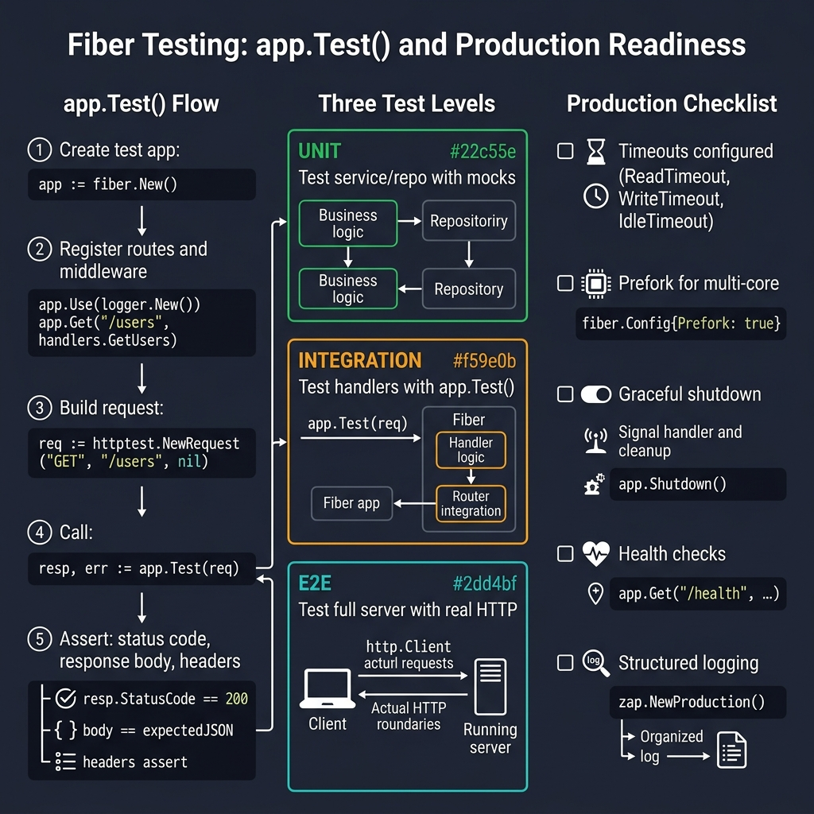
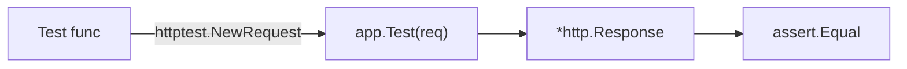

<!-- tags: golang, testing -->
# 🧪 Testing & Production — NestJS Testing → Fiber app.Test()

> **Library**: `app.Test(req)` for HTTP handler tests; `ShutdownWithContext()` for graceful shutdown.

📅 Updated: 2026-04-19 · ⏱️ 12 min read

## 1. DEFINE

Fiber’s `app.Test(req)` replaces `supertest` — pass `httptest.NewRequest()` and get back `*http.Response` without starting a server. Use interfaces for mock injection. For production, configure `ReadTimeout`, `WriteTimeout`, and graceful `ShutdownWithContext()`.

| NestJS                           | Fiber                               |
| -------------------------------- | ----------------------------------- |
| `Test.createTestingModule()`     | `fiber.New()` + `app.Test(req)`     |
| `supertest()`                    | `app.Test(req)`                     |
| `jest.mock()`                    | Interfaces                          |

### Key Invariants

- **Use `app.Test()` not a running server.** No port needed; tests run in-process.
- **Always set production timeouts.** `ReadTimeout: 15s`, `WriteTimeout: 30s`, `IdleTimeout: 120s`.

## 2. VISUAL

The testing pyramid covers unit, integration, and E2E layers with production readiness checklist.



*Figure: Test flow — fiber.New() → register routes → httptest.NewRequest → app.Test(req) → assert status/body. Three levels: Unit (mocks), Integration (app.Test), E2E (real HTTP). Production: timeouts, prefork, graceful shutdown, health checks, logging.*

### Mermaid Fallback




## 3. CODE

### Example 1: Basic — Internal Route Unit Testing

```go
package handler_test

import (
    "io"
    "net/http"
    "net/http/httptest"
    "strings"
    "testing"

    "github.com/gofiber/fiber/v3"
    "github.com/stretchr/testify/assert"
)

// ━━━━━━━━━━━━━━━━━━━━━━━━━━━━━━━━━━━━━━━━━
// Unit test: create Fiber app, register route,
// call app.Test(req), assert on response.
// ━━━━━━━━━━━━━━━━━━━━━━━━━━━━━━━━━━━━━━━━━
func TestGetHealth(t *testing.T) {
    app := fiber.New()
    app.Get("/health", func(c fiber.Ctx) error {
        return c.JSON(fiber.Map{"status": "ok"})
    })

    req := httptest.NewRequest(http.MethodGet, "/health", nil)
    resp, err := app.Test(req)

    assert.NoError(t, err)
    assert.Equal(t, 200, resp.StatusCode)

    body, _ := io.ReadAll(resp.Body)
    assert.Contains(t, string(body), "ok")
}

func TestPostUser(t *testing.T) {
    app := setupApp() 

    body := strings.NewReader(`{"name":"Alice","email":"alice@test.com"}`)
    req := httptest.NewRequest(http.MethodPost, "/api/v1/users", body)
    req.Header.Set("Content-Type", "application/json")
    req.Header.Set("Authorization", "Bearer test-token")

    resp, err := app.Test(req)
    assert.NoError(t, err)
    assert.Equal(t, 201, resp.StatusCode)
}
```

### Example 2: Intermediate — Benchmarking Throughput Parameters

```go
    // ━━━━━━━━━━━━━━━━━━━━━━━━━━━━━━━━━━━━━━━━━
    // Benchmark: use b.Loop() (Go 1.24+) for
    // stable throughput measurement.
    // ━━━━━━━━━━━━━━━━━━━━━━━━━━━━━━━━━━━━━━━━━
    func BenchmarkGetUsers(b *testing.B) {
        app := setupApp()
        req := httptest.NewRequest(http.MethodGet, "/api/v1/users", nil)

        for b.Loop() { 
            app.Test(req)
        }
    }
```

### Example 3: Advanced — Graceful Output Constraints

```go
    // ━━━━━━━━━━━━━━━━━━━━━━━━━━━━━━━━━━━━━━━━━
    // Graceful shutdown: catch SIGTERM, drain
    // connections with 30s timeout.
    // ━━━━━━━━━━━━━━━━━━━━━━━━━━━━━━━━━━━━━━━━━
    func main() {
        app := fiber.New(fiber.Config{
            ReadTimeout:           15 * time.Second,
            WriteTimeout:          30 * time.Second,
            IdleTimeout:           120 * time.Second,
            BodyLimit:             4 * 1024 * 1024,
            DisableStartupMessage: true,
        })

        go func() {
            if err := app.Listen(":3000"); err != nil {
                log.Fatalf("server error: %v", err)
            }
        }()

        quit := make(chan os.Signal, 1)
        signal.Notify(quit, syscall.SIGINT, syscall.SIGTERM)
        <-quit

        log.Println("shutting down...")

        ctx, cancel := context.WithTimeout(context.Background(), 30*time.Second)
        defer cancel()

        if err := app.ShutdownWithContext(ctx); err != nil {
            log.Fatalf("shutdown error: %v", err)
        }

        log.Println("server stopped")
    }
```

---

## 4. PITFALLS

| # | Severity | Defect | Impact | Fix |
| --- | --- | --- | --- | --- |
| 1 | 🔴 Fatal | No graceful shutdown — `app.Listen()` in main goroutine without signal handling | In-flight requests dropped; DB connections leaked on deploy | Use `signal.Notify` + `ShutdownWithContext(ctx)` pattern |
| 2 | 🟡 Common | Starting a real server in tests (`app.Listen()`) | Tests require free ports; slow and flaky | Use `app.Test(req)` — no port, no server process |

---

## 5. REF

| Resource | Link |
| --- | --- |
| Go Testing | [go.dev/doc/tutorial/add-a-test](https://go.dev/doc/tutorial/add-a-test) |
| Fiber Tests | [docs.gofiber.io/recipes/unit-test](https://docs.gofiber.io/recipes/unit-test/) |

---

## 6. RECOMMEND

| Extension | When | Rationale | Resource |
| --- | --- | --- | --- |
| DI | When you need to inject dependencies for testing | Manual / Wire / fx patterns | [./02-dependency-injection.md](./02-dependency-injection.md) |
