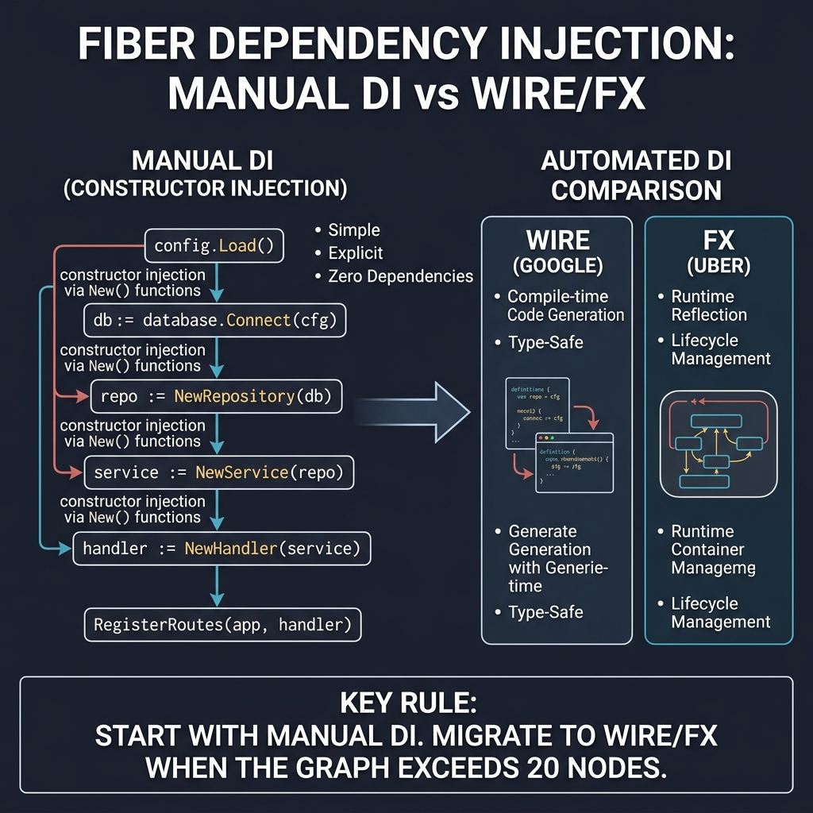
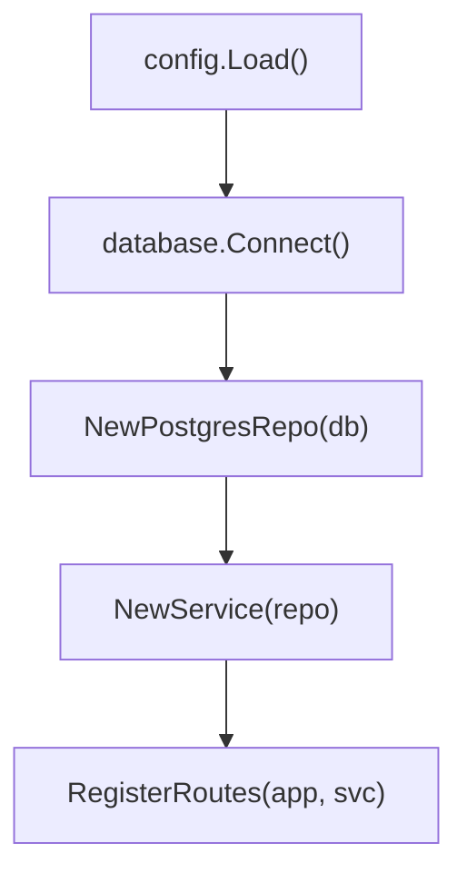

<!-- tags: golang -->
# 💉 Dependency Injection — NestJS DI → Go Manual/Wire/fx

> **Library**: Manual constructor injection, Google Wire (compile-time), or Uber fx (runtime DI).

📅 Updated: 2026-04-19 · ⏱️ 10 min read

## 1. DEFINE

NestJS has a built-in DI container. Go uses three patterns: **Manual** (explicit `New()` constructors), **Wire** (compile-time code generation), and **fx** (runtime DI with lifecycle hooks). Manual is simplest; Wire catches wiring errors at compile time; fx integrates with graceful shutdown.

| NestJS                         | Go                                              |
| ------------------------------ | ----------------------------------------------- |
| `@Injectable()` + DI container | Constructor: `NewService(repo)`                 |
| `@Module({ providers })`       | Manual wiring explicitly                        |
| Auto-resolve dependencies      | Google Wire (compile-time) or Uber fx (runtime) |

### Key Invariants

- **Accept interfaces, return structs.** Constructor takes `Repository` interface, returns `*Service` struct.
- **Manual wiring is fine for small apps.** Don’t add Wire/fx complexity until you have 10+ dependencies.

## 2. VISUAL

Dependency injection starts with manual constructor injection and scales to Wire/fx for complex graphs.



*Figure: Manual DI chain — config.Load() → db.Connect(cfg) → NewRepository(db) → NewService(repo) → NewHandler(service) → RegisterRoutes. Comparison: Manual (simple, explicit), Wire (compile-time, type-safe), fx (runtime, lifecycle). Start manual, migrate at 20+ nodes.*

### Mermaid Fallback




## 3. CODE

### Example 1: Basic — Manual Injection Strategies

```go
    // ━━━━━━━━━━━━━━━━━━━━━━━━━━━━━━━━━━━━━━━━━
    // Manual DI: explicit New() calls in main().
    // Simple, readable, no magic.
    // ━━━━━━━━━━━━━━━━━━━━━━━━━━━━━━━━━━━━━━━━━
    func main() {
        cfg := config.Load()
        db := database.Connect(cfg.Database)

        userRepo := users.NewPostgresRepo(db)
        userService := users.NewService(userRepo)

        app := fiber.New()
        api := app.Group("/api/v1")
        users.RegisterRoutes(api, userService)

        log.Fatal(app.Listen(":" + cfg.App.Port))
    }
```

### Example 2: Intermediate — Wire Compiler Generation

```go
    //go:build wireinject

    // ━━━━━━━━━━━━━━━━━━━━━━━━━━━━━━━━━━━━━━━━━
    // Wire: compile-time DI. `wire.Build()` generates
    // the wiring code. Catches errors at compile time.
    // ━━━━━━━━━━━━━━━━━━━━━━━━━━━━━━━━━━━━━━━━━
    func InitializeApp() (*fiber.App, error) {
        wire.Build(
            config.Load,
            database.Connect,
            users.NewPostgresRepo,
            wire.Bind(new(users.Repository), new(*users.PostgresRepo)),
            users.NewService,
            newFiberApp,
        )
        return nil, nil
    }

    func newFiberApp(userService *users.Service) *fiber.App {
        app := fiber.New()
        api := app.Group("/api/v1")
        users.RegisterRoutes(api, userService)
        return app
    }
```

### Example 3: Advanced — Dynamic Runtime Management

```go
    // ━━━━━━━━━━━━━━━━━━━━━━━━━━━━━━━━━━━━━━━━━
    // Uber fx: runtime DI with lifecycle hooks.
    // Best for apps needing graceful shutdown.
    // ━━━━━━━━━━━━━━━━━━━━━━━━━━━━━━━━━━━━━━━━━
    fx.New(
        fx.Provide(
            config.Load,
            database.Connect,
            users.NewPostgresRepo,
            users.NewService,
            newFiberApp,
        ),
        fx.Invoke(func(lc fx.Lifecycle, app *fiber.App) {
            lc.Append(fx.Hook{
                OnStart: func(ctx context.Context) error {
                    go app.Listen(":3000")
                    return nil
                },
                OnStop: func(ctx context.Context) error {
                    return app.ShutdownWithContext(ctx)
                },
            })
        }),
    ).Run()
```

### Example 4: Expert — Multi-Target Constructor Builders

```go
    // ━━━━━━━━━━━━━━━━━━━━━━━━━━━━━━━━━━━━━━━━━
    // BuildOptions pattern: explicit struct for
    // test injection. No DI framework needed.
    // ━━━━━━━━━━━━━━━━━━━━━━━━━━━━━━━━━━━━━━━━━
    type BuildOptions struct {
        UserRepo users.Repository
        Logger   *slog.Logger
    }

    func BuildFiberApp(opts BuildOptions) *fiber.App {
        service := users.NewService(opts.UserRepo)

        app := fiber.New(fiber.Config{
            ErrorHandler: func(c fiber.Ctx, err error) error {
                opts.Logger.Error("request failed", "error", err)
                return c.Status(fiber.StatusInternalServerError).JSON(fiber.Map{
                    "error": "internal error",
                })
            },
        })

        api := app.Group("/api/v1")
        users.RegisterRoutes(api, service)
        return app
    }
```

---

## 4. PITFALLS

| # | Severity | Defect | Impact | Fix |
| --- | --- | --- | --- | --- |
| 1 | 🔴 Fatal | Accepting concrete types instead of interfaces in constructors | Can’t mock dependencies in tests | `NewService(repo Repository)` not `NewService(repo *PostgresRepo)` |
| 2 | 🟡 Common | Using fx/Wire for a 3-dependency app | Unnecessary complexity; harder to debug wiring | Start with manual DI; migrate to Wire/fx at 10+ deps |

---

## 5. REF

| Resource | Link |
| --- | --- |
| Google Wire | [github.com/google/wire](https://github.com/google/wire) |
| Uber Fx | [github.com/uber-go/fx](https://github.com/uber-go/fx) |

---

## 6. RECOMMEND

| Extension | When | Rationale | Resource |
| --- | --- | --- | --- |
| Hooks | When you need graceful startup/shutdown | `app.Hooks().OnListen()` + `OnShutdown()` | [./03-lifecycle-hooks.md](./03-lifecycle-hooks.md) |
