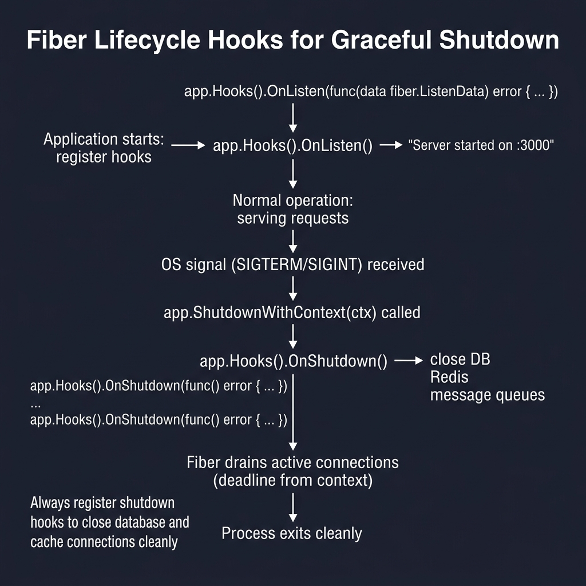
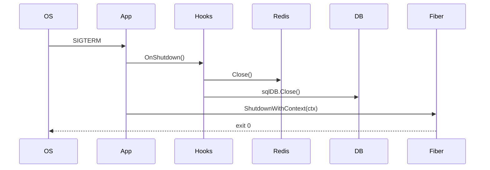

<!-- tags: golang -->
# ♻️ Lifecycle Hooks — NestJS Lifecycle → Fiber app.Hooks()

> **Library**: `app.Hooks().OnListen()` / `OnShutdown()` + `ShutdownWithContext()` for lifecycle.

📅 Updated: 2026-04-19 · ⏱️ 10 min read

## 1. DEFINE

Fiber’s `app.Hooks()` provides `OnListen`, `OnShutdown`, `OnRoute`, etc. Use `OnShutdown` to close DB/Redis connections and drain workers. Combine with `signal.Notify(SIGINT, SIGTERM)` + `ShutdownWithContext(ctx)` for zero-downtime deploys.

| NestJS                   | Fiber                                     |
| ------------------------ | ----------------------------------------- |
| `OnModuleInit`           | Internal instantiation                    |
| `OnApplicationBootstrap` | Hooks evaluating `app.Listen()`           |
| `OnApplicationShutdown`  | `app.ShutdownWithContext(ctx)`            |

### Key Invariants

- **OnShutdown must close ALL external connections.** DB, Redis, message queues — close them here.
- **Set shutdown timeout.** `context.WithTimeout(ctx, 30*time.Second)` prevents hanging shutdown.

## 2. VISUAL

Lifecycle hooks manage startup notification and graceful shutdown with resource cleanup.



*Figure: Startup → OnListen hook → normal operation → SIGTERM received → ShutdownWithContext → OnShutdown hooks (close DB, Redis, queues) → drain connections → process exits. Always register shutdown hooks for clean resource cleanup.*

### Mermaid Fallback




## 3. CODE

### Example 1: Basic — Event Triggers

```go
    // ━━━━━━━━━━━━━━━━━━━━━━━━━━━━━━━━━━━━━━━━━
    // Basic hooks: OnListen logs startup,
    // OnShutdown closes DB + cache.
    // ━━━━━━━━━━━━━━━━━━━━━━━━━━━━━━━━━━━━━━━━━
    app := fiber.New()

    app.Hooks().OnListen(func(ld fiber.ListenData) error {
        slog.Info("server started",
            "host", ld.Host,
            "port", ld.Port,
            "tls", ld.TLS,
        )
        return nil
    })

    app.Hooks().OnShutdown(func() error {
        slog.Info("server shutting down")
        db.Close()
        cache.Close()
        return nil
    })
```

### Example 2: Intermediate — Integrated System Teardown

```go
    // ━━━━━━━━━━━━━━━━━━━━━━━━━━━━━━━━━━━━━━━━━
    // Full lifecycle: hooks + signal.Notify +
    // ShutdownWithContext for zero-downtime.
    // ━━━━━━━━━━━━━━━━━━━━━━━━━━━━━━━━━━━━━━━━━
    func main() {
        cfg := config.Load()
        db := database.Connect(cfg.Database)
        cache := redis.New(cfg.Redis)

        app := fiber.New(fiber.Config{
            AppName:               cfg.App.Name,
            DisableStartupMessage: true,
        })

        app.Hooks().OnListen(func(ld fiber.ListenData) error {
            slog.Info("🚀 API ready", "port", ld.Port)
            return nil
        })

        app.Hooks().OnShutdown(func() error {
            slog.Info("🛑 cleaning up...")
            cache.Close()
            sqlDB, _ := db.DB()
            sqlDB.Close()
            slog.Info("✅ cleanup complete")
            return nil
        })

        setupRoutes(app, db, cache)

        go func() {
            if err := app.Listen(":" + cfg.App.Port); err != nil {
                slog.Error("listen error", "error", err)
            }
        }()

        quit := make(chan os.Signal, 1)
        signal.Notify(quit, syscall.SIGINT, syscall.SIGTERM)
        <-quit

        ctx, cancel := context.WithTimeout(context.Background(), 30*time.Second)
        defer cancel()
        app.ShutdownWithContext(ctx) 
    }
```

### Example 3: Advanced — Draining Connections Safely

```go
    // ━━━━━━━━━━━━━━━━━━━━━━━━━━━━━━━━━━━━━━━━━
    // Connection draining: set ready=false,
    // stop workers, then close DB.
    // ━━━━━━━━━━━━━━━━━━━━━━━━━━━━━━━━━━━━━━━━━
    func (rt *Runtime) mount(app *fiber.App) {
        app.Get("/ready", func(c fiber.Ctx) error {
            if !rt.ready.Load() {
                return c.Status(fiber.StatusServiceUnavailable).JSON(fiber.Map{
                    "status": "draining",
                })
            }
            return c.JSON(fiber.Map{"status": "ready"})
        })

        app.Hooks().OnShutdown(func() error {
            rt.ready.Store(false)

            ctx, cancel := context.WithTimeout(context.Background(), 15*time.Second)
            defer cancel()

            if err := rt.worker.Stop(ctx); err != nil {
                return err
            }

            sqlDB, err := rt.db.DB()
            if err != nil {
                return err
            }
            return sqlDB.Close()
        })
    }
```

---

## 4. PITFALLS

| # | Severity | Defect | Impact | Fix |
| --- | --- | --- | --- | --- |
| 1 | 🔴 Fatal | Calling `os.Exit()` without running shutdown hooks | DB connections leaked; in-flight writes corrupted | Use `ShutdownWithContext(ctx)` which triggers `OnShutdown` hooks |
| 2 | 🟡 Common | No timeout on shutdown context | Hung DB close blocks shutdown forever | Use `context.WithTimeout(ctx, 30*time.Second)` |

---

## 5. REF

| Resource | Link |
| --- | --- |
| Fiber Hooks | [docs.gofiber.io/next/api/app#hooks](https://docs.gofiber.io/next/api/app#hooks) |
| Go Context | [pkg.go.dev/context](https://pkg.go.dev/context) |

---

## 6. RECOMMEND

| Extension | When | Rationale | Resource |
| --- | --- | --- | --- |
| Auth + Rate Limit | When you need production API protection middleware | Custom verifier + rate limiter composition | [./04-auth-rate-limit-production.md](./04-auth-rate-limit-production.md) |
