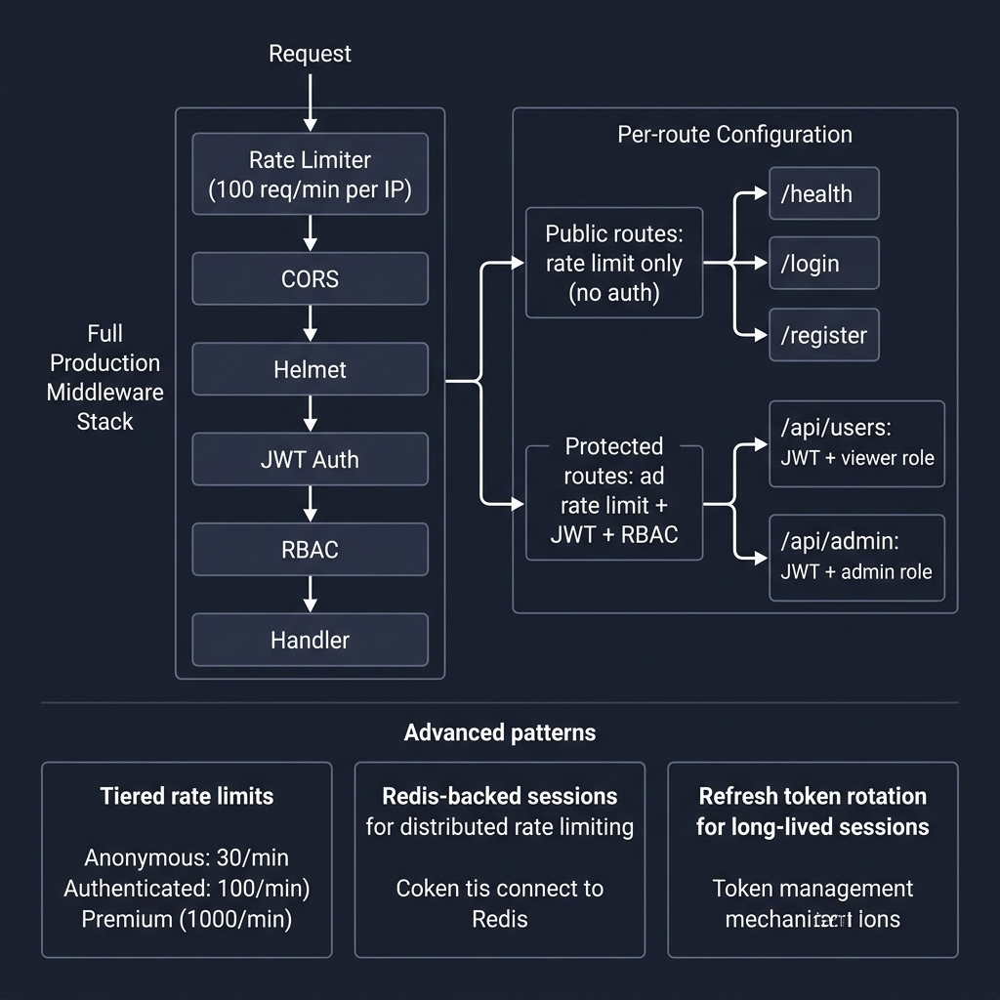
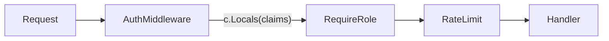

<!-- tags: golang -->
# 🔐 Auth & Rate Limit — Production API Protection in Fiber

> **Library**: Custom `TokenVerifier` interface + in-memory rate limiter for production API protection.

📅 Updated: 2026-04-19 · ⏱️ 16 min read

## 1. DEFINE

This doc builds a production-grade middleware stack from scratch: custom `TokenVerifier` interface for auth (not jwtware), `RequireRole` for RBAC, and an in-memory sliding-window rate limiter keyed by user subject or IP. All three compose into route groups.

| Layer          | Role                                    |
| -------------- | --------------------------------------- |
| Authentication | Identifies explicit caller origins      |
| Authorization  | Limits specific structural roles        |
| Rate Limiting  | Blocks unbounded execution bursts       |

### Key Invariants

- **Use interface for token verification.** `TokenVerifier` interface enables test mocking.
- **Rate limit key = user ID, not just IP.** Authenticated users get per-user limits via `KeyBySubjectOrIP()`.

## 2. VISUAL

Production auth stack combines per-route rate limiting with JWT authentication and role-based access control.



*Figure: Full stack — Rate Limiter → CORS → Helmet → JWT Auth → RBAC → Handler. Public routes: rate limit only. Protected: + JWT + RBAC. Tiered limits: anonymous (30/min), authenticated (100/min), premium (1000/min).*

### Mermaid Fallback




## 3. CODE

### Example 1: Basic — Authentication Verification

```go
package advanced

import (
    "strings"
    "github.com/gofiber/fiber/v3"
)

type Claims struct {
    Subject string
    Role    string
}

type TokenVerifier interface {
    Verify(token string) (Claims, error)
}

// ━━━━━━━━━━━━━━━━━━━━━━━━━━━━━━━━━━━━━━━━━
// Custom auth middleware: validates Bearer token
// via TokenVerifier interface, stores Claims.
// ━━━━━━━━━━━━━━━━━━━━━━━━━━━━━━━━━━━━━━━━━
func AuthMiddleware(verifier TokenVerifier) fiber.Handler {
    return func(c fiber.Ctx) error {
        header := c.Get("Authorization")
        if !strings.HasPrefix(header, "Bearer ") {
            return fiber.NewError(fiber.StatusUnauthorized, "missing bearer token")
        }

        claims, err := verifier.Verify(strings.TrimPrefix(header, "Bearer "))
        if err != nil {
            return fiber.NewError(fiber.StatusUnauthorized, "invalid token")
        }

        c.Locals("claims", claims)
        return c.Next()
    }
}
```

### Example 2: Intermediate — Role Constraints

```go
package advanced

import "github.com/gofiber/fiber/v3"

// ━━━━━━━━━━━━━━━━━━━━━━━━━━━━━━━━━━━━━━━━━
    // Role check: extract claims from Locals,
    // compare role. Return 403 if mismatch.
// ━━━━━━━━━━━━━━━━━━━━━━━━━━━━━━━━━━━━━━━━━
func RequireRole(expected string) fiber.Handler {
    return func(c fiber.Ctx) error {
        value := c.Locals("claims")
        claims, ok := value.(Claims)
        if !ok {
            return fiber.NewError(fiber.StatusUnauthorized, "missing auth context")
        }
        if claims.Role != expected {
            return fiber.NewError(fiber.StatusForbidden, "forbidden")
        }
        return c.Next()
    }
}
```

### Example 3: Advanced — Dynamic Load Throttling

```go
package advanced

import (
    "sync"
    "time"
    "github.com/gofiber/fiber/v3"
)

type bucket struct {
    count   int
    resetAt time.Time
}

// ━━━━━━━━━━━━━━━━━━━━━━━━━━━━━━━━━━━━━━━━━
    // In-memory rate limiter: mutex-protected
    // bucket map, keyed by user or IP.
// ━━━━━━━━━━━━━━━━━━━━━━━━━━━━━━━━━━━━━━━━━
func RateLimit(maxRequests int, window time.Duration, keyFn func(fiber.Ctx) string) fiber.Handler {
    var (
        mu      sync.Mutex
        buckets = map[string]bucket{}
    )

    return func(c fiber.Ctx) error {
        key := keyFn(c)
        now := time.Now()

        mu.Lock()
        b := buckets[key]
        if now.After(b.resetAt) {
            b = bucket{count: 0, resetAt: now.Add(window)}
        }
        b.count++
        buckets[key] = b
        mu.Unlock()

        if b.count > maxRequests {
            c.Set("Retry-After", "60")
            return fiber.NewError(fiber.StatusTooManyRequests, "rate limit exceeded")
        }

        return c.Next()
    }
}

func KeyBySubjectOrIP(c fiber.Ctx) string {
    if value := c.Locals("claims"); value != nil {
        if claims, ok := value.(Claims); ok && claims.Subject != "" {
            return claims.Subject
        }
    }
    return c.IP()
}
```

### Example 4: Expert — Endpoint Composition

```go
package advanced

import (
    "log/slog"
    "time"
    "github.com/gofiber/fiber/v3"
)

// ━━━━━━━━━━━━━━━━━━━━━━━━━━━━━━━━━━━━━━━━━
    // Composition: stack auth + role + rate limit
    // on a route group.
// ━━━━━━━━━━━━━━━━━━━━━━━━━━━━━━━━━━━━━━━━━
func RegisterProtectedRoutes(app *fiber.App, verifier TokenVerifier, logger *slog.Logger) {
    admin := app.Group("/v1/admin")
    admin.Use(AuthMiddleware(verifier))
    admin.Use(RequireRole("admin"))
    admin.Use(RateLimit(20, time.Minute, KeyBySubjectOrIP))

    admin.Get("/reports", func(c fiber.Ctx) error {
        logger.Info("admin report access", "claims", c.Locals("claims"))
        return c.JSON(fiber.Map{"status": "ok"})
    })
}
```

---

## 4. PITFALLS

| # | Severity | Defect | Impact | Fix |
| --- | --- | --- | --- | --- |
| 1 | 🔴 Fatal | Storing untyped `c.Locals("claims")` without type assertion check | Panic on missing or wrong type in Claims | Use `claims, ok := value.(Claims)` with early return |
| 2 | 🟡 Common | Using only IP-based rate limiting for authenticated APIs | All users behind same corporate proxy share one limit | Use `KeyBySubjectOrIP()` to rate limit by user ID when available |

---

## 5. REF

| Resource | Link |
| --- | --- |
| Fiber Auth | [docs.gofiber.io/guide/routing/](https://docs.gofiber.io/guide/routing/) |
| Fiber Throttling | [docs.gofiber.io/api/middleware/limiter/](https://docs.gofiber.io/api/middleware/limiter/) |

---

## 6. RECOMMEND

| Extension | When | Rationale | Resource |
| --- | --- | --- | --- |
| Streaming | When you need file upload/download with large payloads | `SaveFile()` + `SendStream()` + signed URLs | [./05-upload-download-streaming.md](./05-upload-download-streaming.md) |
