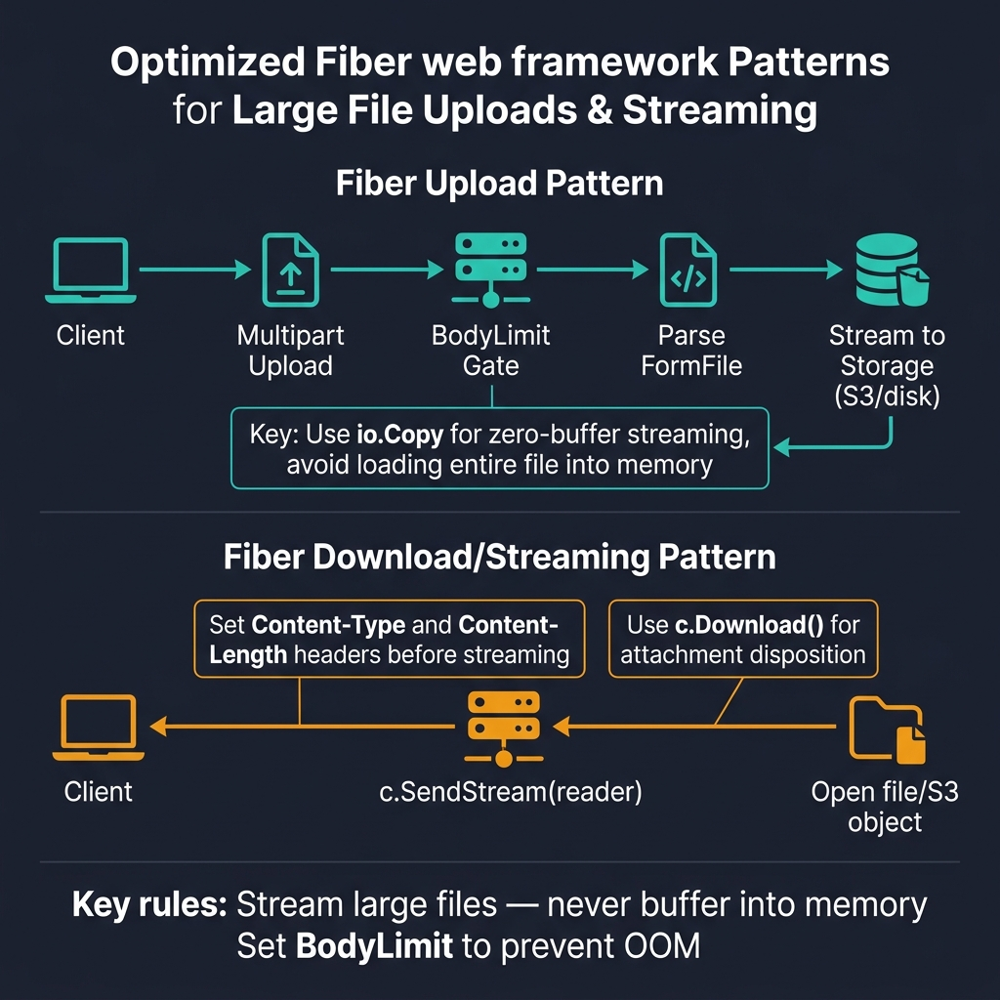
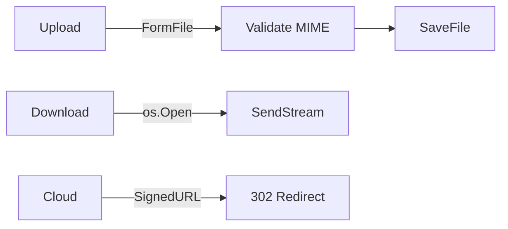

<!-- tags: golang -->
# 📤 Upload & Download Streaming — Large Files in Fiber

> **Library**: `c.FormFile()` for uploads, `c.SendStream()` for downloads, signed URLs for S3.

📅 Updated: 2026-04-19 · ⏱️ 16 min read

## 1. DEFINE

Fiber handles file uploads via `c.FormFile()` + `c.SaveFile()`. For downloads, `c.SendStream()` pipes an `io.Reader` directly to the response without buffering the entire file in memory. For cloud storage, generate signed URLs so the client downloads directly from S3/GCS.

| Concern          | Implementation                          |
| ---------------- | --------------------------------------- |
| Size Limits      | `BodyLimit` in `fiber.Config`           |
| Validation       | `http.DetectContentType()` on first 512 bytes |
| Streaming        | `c.SendStream()` — no full-file buffering |

### Key Invariants

- **Always sanitize filenames.** Use `filepath.Base()` to prevent path traversal.
- **Use `SendStream()` for large files.** Don’t `ioutil.ReadAll()` a 500MB file into memory.

## 2. VISUAL

Upload and streaming patterns use io.Copy for zero-buffer file handling to prevent OOM.



*Figure: Upload — multipart → BodyLimit gate → FormFile → io.Copy to storage (zero-buffer). Download — open file/S3 → c.SendStream(reader) with Content-Type. Rule: stream large files, never buffer into memory.*

### Mermaid Fallback




## 3. CODE

### Example 1: Basic — Physical Upload Persistence

```go
package advanced

import (
    "path/filepath"
    "github.com/gofiber/fiber/v3"
)

// ━━━━━━━━━━━━━━━━━━━━━━━━━━━━━━━━━━━━━━━━━
// Upload: FormFile + filepath.Base() for
// sanitization, then SaveFile to disk.
// ━━━━━━━━━━━━━━━━━━━━━━━━━━━━━━━━━━━━━━━━━
func UploadReport(c fiber.Ctx) error {
    fileHeader, err := c.FormFile("file")
    if err != nil {
        return fiber.NewError(fiber.StatusBadRequest, "missing upload file")
    }

    safeName := filepath.Base(fileHeader.Filename)
    dst := filepath.Join("/tmp/uploads", safeName)
    if err := c.SaveFile(fileHeader, dst); err != nil {
        return fiber.NewError(fiber.StatusInternalServerError, "save file failed")
    }

    return c.Status(fiber.StatusCreated).JSON(fiber.Map{"file": safeName})
}
```

### Example 2: Intermediate — Content Type Verification

```go
package advanced

import (
    "bytes"
    "mime/multipart"
    "net/http"
    "github.com/gofiber/fiber/v3"
)

// ━━━━━━━━━━━━━━━━━━━━━━━━━━━━━━━━━━━━━━━━━
// Content validation: read first 512 bytes,
// use http.DetectContentType() to verify MIME.
// ━━━━━━━━━━━━━━━━━━━━━━━━━━━━━━━━━━━━━━━━━
func ValidateCSV(file multipart.File) error {
    head := make([]byte, 512)
    n, err := file.Read(head)
    if err != nil {
        return err
    }

    contentType := http.DetectContentType(bytes.TrimSpace(head[:n]))
    if contentType != "text/plain; charset=utf-8" && contentType != "text/csv; charset=utf-8" {
        return fiber.ErrUnsupportedMediaType
    }
    return nil
}
```

### Example 3: Advanced — Direct File Streaming

```go
package advanced

import (
    "os"
    "strconv"
    "github.com/gofiber/fiber/v3"
)

// ━━━━━━━━━━━━━━━━━━━━━━━━━━━━━━━━━━━━━━━━━
// Streaming download: os.Open + SendStream.
// Sets Content-Disposition for browser download.
// ━━━━━━━━━━━━━━━━━━━━━━━━━━━━━━━━━━━━━━━━━
func DownloadCSV(c fiber.Ctx) error {
    file, err := os.Open("/tmp/reports/export.csv")
    if err != nil {
        return fiber.NewError(fiber.StatusNotFound, "file not found")
    }

    stat, err := file.Stat()
    if err != nil {
        file.Close()
        return fiber.NewError(fiber.StatusInternalServerError, "stat failed")
    }

    c.Set("Content-Type", "text/csv")
    c.Set("Content-Disposition", `attachment; filename="export.csv"`)
    c.Set("Content-Length", strconv.FormatInt(stat.Size(), 10))
    return c.SendStream(file)
}
```

### Example 4: Expert — Target State Provisioning

```go
package advanced

import (
    "time"
    "github.com/gofiber/fiber/v3"
)

type SignedURLProvider interface {
    CreateDownloadURL(objectKey string, expiresIn time.Duration) (string, error)
}

// ━━━━━━━━━━━━━━━━━━━━━━━━━━━━━━━━━━━━━━━━━
// Signed URL: generate pre-signed S3/GCS URL,
// return to client for direct download.
// ━━━━━━━━━━━━━━━━━━━━━━━━━━━━━━━━━━━━━━━━━
func RequestReportDownload(provider SignedURLProvider) fiber.Handler {
    return func(c fiber.Ctx) error {
        url, err := provider.CreateDownloadURL("reports/export.csv", 15*time.Minute)
        if err != nil {
            return fiber.NewError(fiber.StatusInternalServerError, "signed url generation failed")
        }

        return c.Status(fiber.StatusAccepted).JSON(fiber.Map{
            "delivery": "signed_url",
            "url":      url,
            "expires":  "15m",
        })
    }
}
```

---

## 4. PITFALLS

| # | Severity | Defect | Impact | Fix |
| --- | --- | --- | --- | --- |
| 1 | 🔴 Fatal | Using `fileHeader.Filename` directly as save path | Path traversal attack: `../../etc/passwd` overwrites system files | Always use `filepath.Base(fileHeader.Filename)` |
| 2 | 🔴 Fatal | Reading entire large file into memory with `ioutil.ReadAll()` | OOM crash on 500MB+ files | Use `c.SendStream(file)` to pipe directly to response |

---

## 5. REF

| Resource | Link |
| --- | --- |
| Fiber Upload | [docs.gofiber.io/guide/requests/#form-file](https://docs.gofiber.io/guide/requests/#form-file) |
| Fiber SendStream | [docs.gofiber.io/api/ctx#sendstream](https://docs.gofiber.io/api/ctx#sendstream) |

---

## 6. RECOMMEND

| Extension | When | Rationale | Resource |
| --- | --- | --- | --- |
| Realtime | When you need SSE or WebSocket delivery | `SetBodyStreamWriter` for SSE, `gofiber/contrib/websocket` for WS | [./06-sse-websocket-real-time.md](./06-sse-websocket-real-time.md) |
