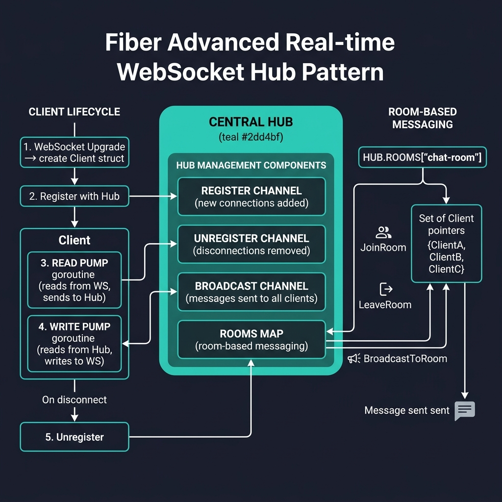
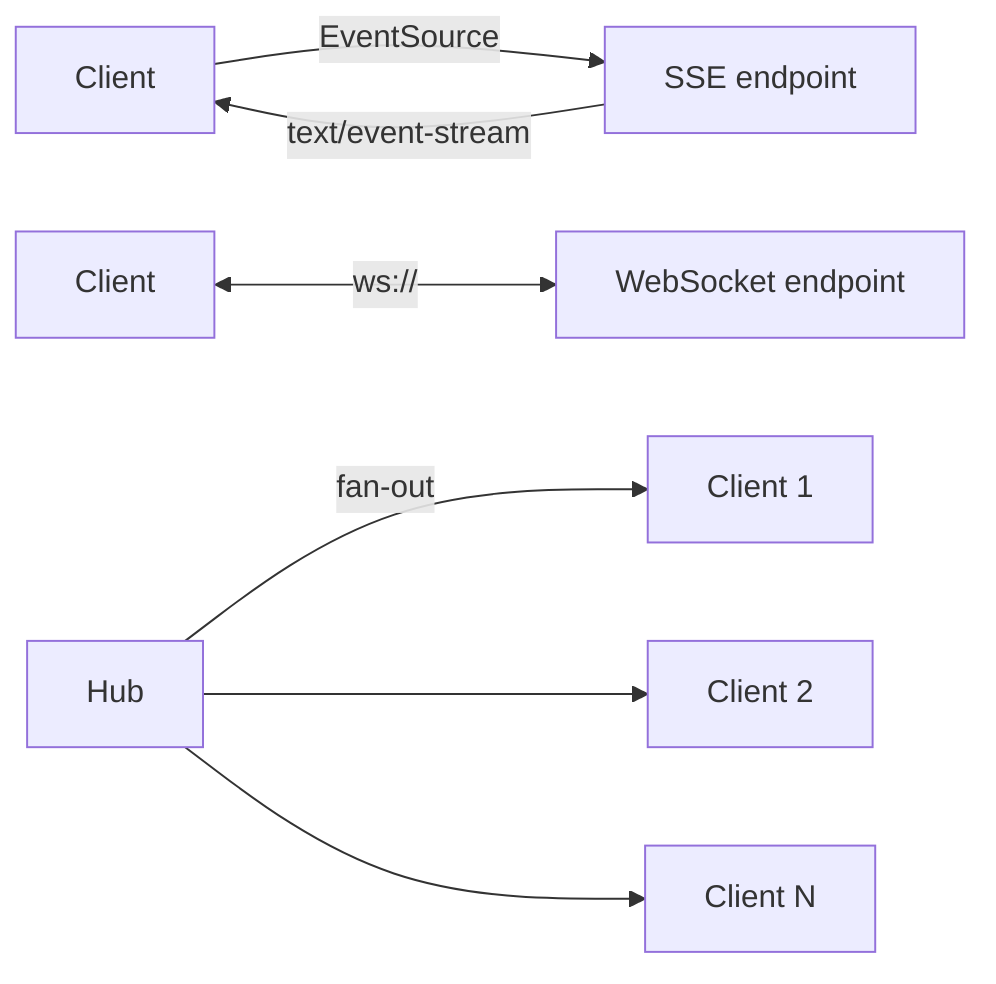

<!-- tags: golang -->
# 📡 SSE & WebSocket — Real-time Delivery Patterns in Fiber

> **Library**: `SetBodyStreamWriter` for SSE, `gofiber/contrib/websocket` for WebSocket, Hub pattern for fan-out.

📅 Updated: 2026-04-19 · ⏱️ 17 min read

## 1. DEFINE

SSE (Server-Sent Events) uses `text/event-stream` for one-way server → client updates. WebSocket provides full-duplex via `gofiber/contrib/websocket`. For multi-client broadcasting, use a Hub pattern with register/unregister channels.

| Transport | Use Case                                  |
| --------- | ----------------------------------------- |
| SSE       | Distinct unidirectional server broadcasts |
| WebSocket | Sustained bidirectional event sequences   |

### Key Invariants

- **SSE for notifications, WS for chat.** Don’t use WebSocket when SSE suffices.
- **Always handle client disconnect.** Check `w.Flush()` errors in SSE; `ReadMessage()` errors in WS.

## 2. VISUAL

The Hub pattern centralizes WebSocket connection management with room-based messaging support.



*Figure: Central Hub manages Register/Unregister/Broadcast channels + Rooms map. Client lifecycle: WS upgrade → register → read pump goroutine → write pump goroutine → disconnect → unregister. Room-based: JoinRoom, LeaveRoom, BroadcastToRoom.*

### Mermaid Fallback




## 3. CODE

### Example 1: Basic — Unidirectional Event Streams

```go
package advanced

import (
    "bufio"
    "fmt"
    "time"
    "github.com/gofiber/fiber/v3"
)

// ━━━━━━━━━━━━━━━━━━━━━━━━━━━━━━━━━━━━━━━━━
// SSE: SetBodyStreamWriter writes event stream.
// Check Flush() errors for client disconnect.
// ━━━━━━━━━━━━━━━━━━━━━━━━━━━━━━━━━━━━━━━━━
func ProgressSSE(c fiber.Ctx) error {
    c.Set("Content-Type", "text/event-stream")
    c.Set("Cache-Control", "no-cache")
    c.Set("Connection", "keep-alive")

    c.Context().SetBodyStreamWriter(func(w *bufio.Writer) {
        for progress := 10; progress <= 100; progress += 10 {
            if _, err := fmt.Fprintf(w, "event: progress\ndata: %d\n\n", progress); err != nil {
                return
            }
            if err := w.Flush(); err != nil {
                return
            }
            time.Sleep(2 * time.Second)
        }
    })

    return nil
}
```

### Example 2: Intermediate — Bidirectional Socket Endpoints

```go
package advanced

import "github.com/gofiber/contrib/websocket"

// ━━━━━━━━━━━━━━━━━━━━━━━━━━━━━━━━━━━━━━━━━
    // WebSocket echo: read message, write it back.
    // conn.ReadMessage() returns error on disconnect.
// ━━━━━━━━━━━━━━━━━━━━━━━━━━━━━━━━━━━━━━━━━
func EchoWebSocket(conn *websocket.Conn) {
    defer conn.Close()

    for {
        messageType, payload, err := conn.ReadMessage()
        if err != nil {
            return
        }
        if err := conn.WriteMessage(messageType, payload); err != nil {
            return
        }
    }
}
```

### Example 3: Advanced — Fan-Out Broadcasting Controllers

```go
package advanced

// ━━━━━━━━━━━━━━━━━━━━━━━━━━━━━━━━━━━━━━━━━
    // Hub fan-out: register/unregister clients,
    // broadcast to all connected clients.
// ━━━━━━━━━━━━━━━━━━━━━━━━━━━━━━━━━━━━━━━━━
type Client struct {
    Send chan []byte
}

type Hub struct {
    Register   chan *Client
    Unregister chan *Client
    Broadcast  chan []byte
    clients    map[*Client]struct{}
}

func NewHub() *Hub {
    return &Hub{
        Register:   make(chan *Client),
        Unregister: make(chan *Client),
        Broadcast:  make(chan []byte, 128),
        clients:    map[*Client]struct{}{},
    }
}

func (h *Hub) Run() {
    for {
        select {
        case client := <-h.Register:
            h.clients[client] = struct{}{}
        case client := <-h.Unregister:
            delete(h.clients, client)
            close(client.Send)
        case msg := <-h.Broadcast:
            for client := range h.clients {
                select {
                case client.Send <- msg:
                default:
                    delete(h.clients, client)
                    close(client.Send)
                }
            }
        }
    }
}
```

### Example 4: Expert — Protocol Policy Provisioning

```go
package advanced

type RealtimeRequirement struct {
    Bidirectional bool
    HighFrequency bool
    ReplayNeeded  bool
}

// ━━━━━━━━━━━━━━━━━━━━━━━━━━━━━━━━━━━━━━━━━
    // Protocol chooser: use SSE for unidirectional,
    // WebSocket for bidirectional or high-frequency.
// ━━━━━━━━━━━━━━━━━━━━━━━━━━━━━━━━━━━━━━━━━
func ChooseRealtimeTransport(req RealtimeRequirement) string {
    if req.Bidirectional {
        return "websocket"
    }
    if req.HighFrequency || req.ReplayNeeded {
        return "websocket"
    }
    return "sse"
}
```

---

## 4. PITFALLS

| # | Severity | Defect | Impact | Fix |
| --- | --- | --- | --- | --- |
| 1 | 🔴 Fatal | Not handling slow consumers in Hub broadcast | Blocked `client.Send <- msg` deadlocks the entire Hub goroutine | Use `select` with `default` to drop messages for unresponsive clients |
| 2 | 🟡 Common | Using WebSocket for simple server → client notifications | Unnecessary complexity; SSE is simpler and works through HTTP/2 | Use SSE when you only need server-to-client push |

---

## 5. REF

| Resource | Link |
| --- | --- |
| Fiber WebSocket | [pkg.go.dev/github.com/gofiber/contrib/websocket](https://pkg.go.dev/github.com/gofiber/contrib/websocket) |
| MDN SSE | [developer.mozilla.org](https://developer.mozilla.org/en-US/docs/Web/API/Server-sent_events) |

---

## 6. RECOMMEND

| Extension | When | Rationale | Resource |
| --- | --- | --- | --- |
| Fiber Hub | When you need the full module overview | All sections and learning paths | [../README.md](../README.md) |
