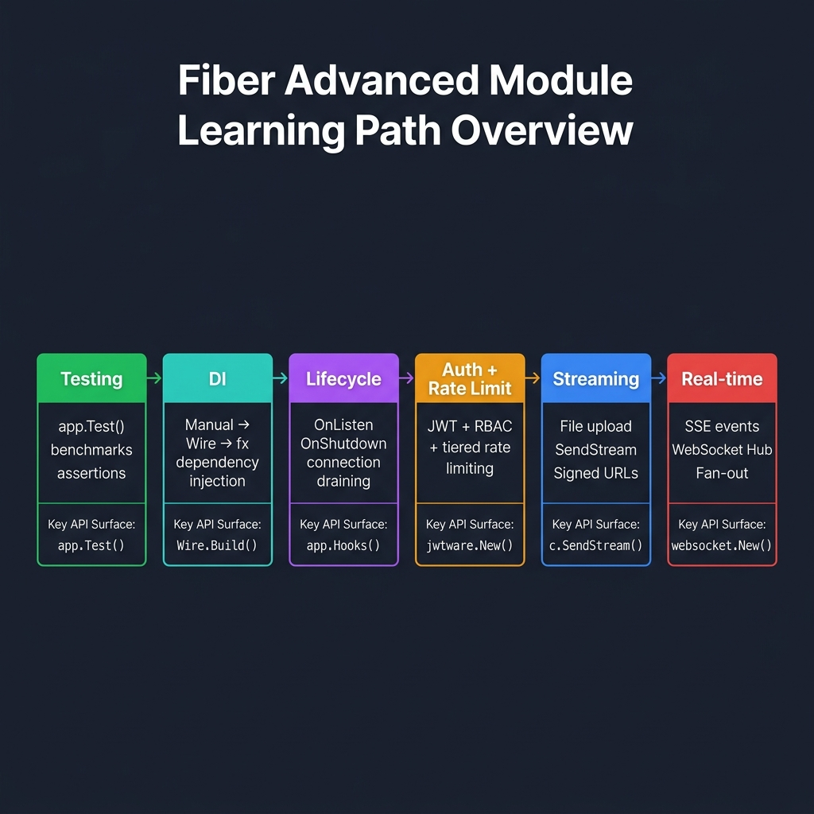
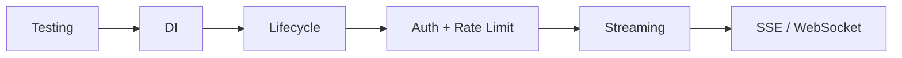

<!-- tags: golang, overview -->
# Fiber Advanced

> **Library**: Advanced Fiber patterns — testing, DI, lifecycle, production security, streaming, real-time.

📅 Updated: 2026-04-19 · ⏱️ 6 min read

## 1. DEFINE

This section covers production-grade patterns beyond basic CRUD: testing with `app.Test()`, dependency injection (manual/Wire/fx), lifecycle hooks for graceful shutdown, layered auth+rate-limit middleware, file upload/download streaming, and SSE/WebSocket real-time delivery.

### Learning Lanes

- `01-testing-production` — Unit tests with `app.Test()`, benchmarks, graceful shutdown.
- `02-dependency-injection` — Manual wiring vs Wire (compile-time) vs fx (runtime).
- `03-lifecycle-hooks` — `OnListen`, `OnShutdown`, connection draining.
- `04-auth-rate-limit-production` — Custom auth middleware + in-memory rate limiter composition.
- `05-upload-download-streaming` — File upload, content validation, `SendStream()`, signed URLs.
- `06-sse-websocket-real-time` — SSE events, WebSocket echo, fan-out Hub pattern.

## 2. VISUAL

The six advanced lanes build on each other — testing foundations enable DI patterns, which feed into lifecycle management, security, streaming, and real-time delivery.



*Figure: Six learning lanes — Testing (app.Test, benchmarks) → DI (Manual → Wire → fx) → Lifecycle (OnListen, OnShutdown, draining) → Auth + Rate Limit (JWT + RBAC + tiered limits) → Streaming (upload, SendStream, signed URLs) → Real-time (SSE, WebSocket Hub, fan-out). Each lane shows the key API surface.*

### Mermaid Fallback



## 3. CODE

### Example 1: Endpoint Router Map

```go
    // ━━━━━━━━━━━━━━━━━━━━━━━━━━━━━━━━━━━━━━━━━
    // Learning lane router: pick a doc by topic.
    // Each file is self-contained with full examples.
    // ━━━━━━━━━━━━━━━━━━━━━━━━━━━━━━━━━━━━━━━━━
    func chooseLane(goal string) string {
        switch goal {
        case "testing production": return "./01-testing-production.md"
        case "dependency injection": return "./02-dependency-injection.md"
        case "lifecycle hooks": return "./03-lifecycle-hooks.md"
        case "auth rate limit production": return "./04-auth-rate-limit-production.md"
        case "upload download streaming": return "./05-upload-download-streaming.md"
        case "sse websocket real time": return "./06-sse-websocket-real-time.md"
        default: return "./README.md"
        }
    }
```

## 4. PITFALLS

| # | Severity | Defect | Impact | Fix |
| --- | --- | --- | --- | --- |
| 1 | 🟡 Common | Skipping graceful shutdown setup | In-flight requests dropped on deploy; database connections leaked | Always implement `ShutdownWithContext()` with timeout |
| 2 | 🟡 Common | No clear learning path through advanced docs | Reader doesn’t know where to start | Follow lanes in order: testing → DI → lifecycle → security → streaming |

## 5. REF

| Resource | Link |
| --- | --- |
| Fiber | [docs.gofiber.io](https://docs.gofiber.io/) |
| Fiber Package | [pkg.go.dev/github.com/gofiber/fiber/v3](https://pkg.go.dev/github.com/gofiber/fiber/v3) |

## 6. RECOMMEND

| Extension | When | Rationale | Resource |
| --- | --- | --- | --- |
| Testing | When you need unit tests and benchmarks | `app.Test()` + `httptest` + graceful shutdown | [./01-testing-production.md](./01-testing-production.md) |
| DI | When you need dependency injection patterns | Manual / Wire / fx comparison | [./02-dependency-injection.md](./02-dependency-injection.md) |
