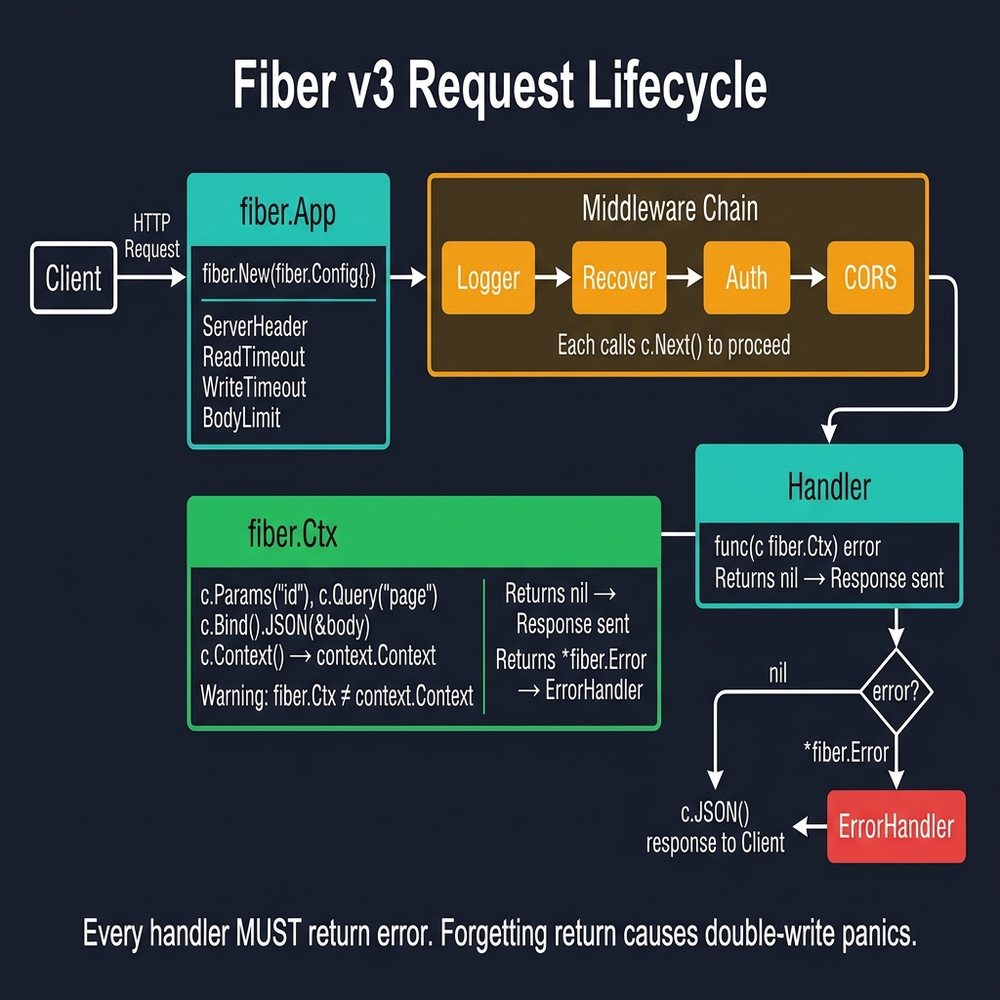
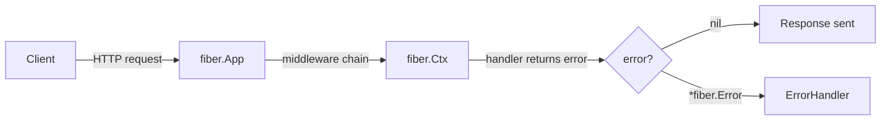

<!-- tags: golang, context -->
# 🚀 App, Context & Handlers — NestJS Bootstrap → Fiber v3

> **Library**: Fiber v3 — Express-inspired framework on fasthttp. Handlers return `error`, context is `fiber.Ctx`.

📅 Updated: 2026-04-19 · ⏱️ 15 min read

| Aspect       | Detail                                                    |
| ------------ | --------------------------------------------------------- |
| **NestJS**   | Express adapter wrapping explicit decorator routes        |
| **Fiber**    | Fasthttp context evaluating HTTP streams precisely        |
| **Key diff** | Handler routines return explicit error distributions      |

---

## 1. DEFINE

Fiber handlers have a different signature than Gin: `func(c fiber.Ctx) error`. Returning a `*fiber.Error` triggers the global `ErrorHandler`. The context `fiber.Ctx` wraps fasthttp, so some stdlib patterns (like `http.ResponseWriter`) don’t apply.

| NestJS                            | Fiber v3                                   |
| --------------------------------- | ------------------------------------------ |
| `create(AppModule)`               | `fiber.New(fiber.Config)`                  |
| `app.listen(3000)`                | `app.Listen(":3000")`                      |
| `@Controller()`                   | `func(c fiber.Ctx) error`                  |
| `@Param('id')`                    | `c.Params("id")`                           |
| `@Body()`                         | `c.Bind().JSON()`                          |
| `throw HttpException`             | `return fiber.NewError(code, msg)`         |

### Key Invariants

- **Handlers must return `error`.** Forgetting `return` leaks responses and causes double-write panics.
- **`fiber.Ctx` is NOT `context.Context`.** Use `c.Context()` to get the stdlib context for DB calls.

---

## 2. VISUAL

The request lifecycle shows how fiber.App dispatches HTTP requests through middleware to handlers. Returned errors route to the global ErrorHandler.



*Figure: Client → fiber.App (config: timeouts, body limit) → Middleware Chain (Logger, Recover, Auth, CORS — each calls c.Next()) → Handler (func(c fiber.Ctx) error). Returns nil = response sent; returns *fiber.Error = ErrorHandler formats error response. Warning: fiber.Ctx ≠ context.Context.*

### Mermaid Fallback



### NestJS → Fiber Quick Reference

```text
  NestJS                              Fiber
  ──────                              ─────
  const app = NestFactory.create()    app := fiber.New()
  app.use(middleware)                 app.Use(middleware)
  app.get('/users', handler)          app.Get("/users", handler)
  app.listen(3000)                    app.Listen(":3000")

  throws mapped filters               returns errors
```

---

## 3. CODE

### Example 1: Basic — Application Bootstrap

```go
package main

import (
    "log"
    "github.com/gofiber/fiber/v3"
)

func main() {
    // ━━━━━━━━━━━━━━━━━━━━━━━━━━━━━━━━━━━━━━━━━
    // Bootstrap: create Fiber app with config, register routes,
    // start listening. Handlers return error (nil = success).
    // ━━━━━━━━━━━━━━━━━━━━━━━━━━━━━━━━━━━━━━━━━
    app := fiber.New(fiber.Config{
        AppName:      "My API v1.0",
        ServerHeader: "Fiber",
    })

    // Root endpoint: returns a welcome JSON response
    app.Get("/", func(c fiber.Ctx) error {
        return c.JSON(fiber.Map{
            "message": "Hello, Fiber!",
        })
    })

    // Health check: returns "OK" for load balancer probes
    app.Get("/health", func(c fiber.Ctx) error {
        return c.SendString("OK")
    })

    // Start HTTP server on port 3000
    log.Fatal(app.Listen(":3000"))
}
```

### Example 2: Intermediate — Context Handlers

```go
package main

import (
    "fmt"
    "log"
    "time"

    "github.com/gofiber/fiber/v3"
)

func main() {
    app := fiber.New()

    // ━━━━━━━━━━━━━━━━━━━━━━━━━━━━━━━━━━━━━━━━━
    // Path parameters: extract :id from URL
    // ━━━━━━━━━━━━━━━━━━━━━━━━━━━━━━━━━━━━━━━━━
    app.Get("/users/:id", func(c fiber.Ctx) error {
        id := c.Params("id")         
        return c.JSON(fiber.Map{"id": id})
    })

    // Query params: page, limit, search with defaults
    app.Get("/users", func(c fiber.Ctx) error {
        page := c.Query("page", "1")     
        limit := c.Query("limit", "20")
        search := c.Query("search")       
        return c.JSON(fiber.Map{
            "page": page, "limit": limit, "search": search,
        })
    })

    // Body binding: parse JSON into struct, return 400 on failure
    app.Post("/users", func(c fiber.Ctx) error {
        var body struct {
            Name  string `json:"name"`
            Email string `json:"email"`
        }
        if err := c.Bind().JSON(&body); err != nil {
            return fiber.NewError(fiber.StatusBadRequest, err.Error())
        }
        return c.Status(fiber.StatusCreated).JSON(body)
    })

    // JSON response: return structured data
    app.Get("/json", func(c fiber.Ctx) error {
        return c.JSON(fiber.Map{"data": "value"})
    })

    app.Get("/error", func(c fiber.Ctx) error {
        return c.Status(fiber.StatusNotFound).JSON(fiber.Map{
            "error": "not found",
        })
    })

    log.Fatal(app.Listen(":3000"))
}
```

### Example 3: Advanced — Global Errors

```go
package main

import (
    "errors"
    "log"
    "time"

    "github.com/gofiber/fiber/v3"
)

func main() {
    // ━━━━━━━━━━━━━━━━━━━━━━━━━━━━━━━━━━━━━━━━━
    // Production config: explicit timeouts prevent slowloris,
    // BodyLimit caps request size, ErrorHandler centralizes errors.
    // ━━━━━━━━━━━━━━━━━━━━━━━━━━━━━━━━━━━━━━━━━
    app := fiber.New(fiber.Config{
        AppName:               "Production API",
        ReadTimeout:           15 * time.Second,
        WriteTimeout:          30 * time.Second,
        IdleTimeout:           120 * time.Second,
        BodyLimit:             4 * 1024 * 1024, 

        ErrorHandler: func(c fiber.Ctx, err error) error {
            code := fiber.StatusInternalServerError

            var e *fiber.Error
            if errors.As(err, &e) {
                code = e.Code
            }

            return c.Status(code).JSON(fiber.Map{
                "error":   true,
                "message": err.Error(),
                "code":    code,
            })
        },
    })

    // Error handling: return fiber.NewError() for
    // HTTP errors, return nil for success.
    app.Get("/users/:id", func(c fiber.Ctx) error {
        id := c.Params("id")
        if id == "0" {
            return fiber.NewError(fiber.StatusNotFound, "user not found")
        }
        return c.JSON(fiber.Map{"id": id, "name": "Alice"})
    })

    log.Fatal(app.Listen(":3000"))
}
```

---

## 4. PITFALLS

| # | Severity | Defect | Impact | Fix |
| --- | --- | --- | --- | --- |
| 1 | 🔴 Fatal | Not returning `error` from handler | Double-write panic; response partially sent then handler continues | Every code path must `return c.JSON(...)` or `return fiber.NewError(...)` |
| 2 | 🟡 Common | Using `fiber.Ctx` as `context.Context` for DB calls | Compile error — `fiber.Ctx` ≠ `context.Context` | Use `c.Context()` to get stdlib context |

---

## 5. REF

| Resource | Link |
| --- | --- |
| Fiber | [docs.gofiber.io](https://docs.gofiber.io/) |
| GitHub | [github.com/gofiber/fiber](https://github.com/gofiber/fiber) |

---

## 6. RECOMMEND

| Extension | When | Rationale |
| --- | --- | --- |
| Prefork | When you need multi-core scaling | Spawns one process per CPU core via `Prefork: true` |
| Proxy | When you need reverse proxy behavior | `middleware/proxy` forwards to upstream servers |
