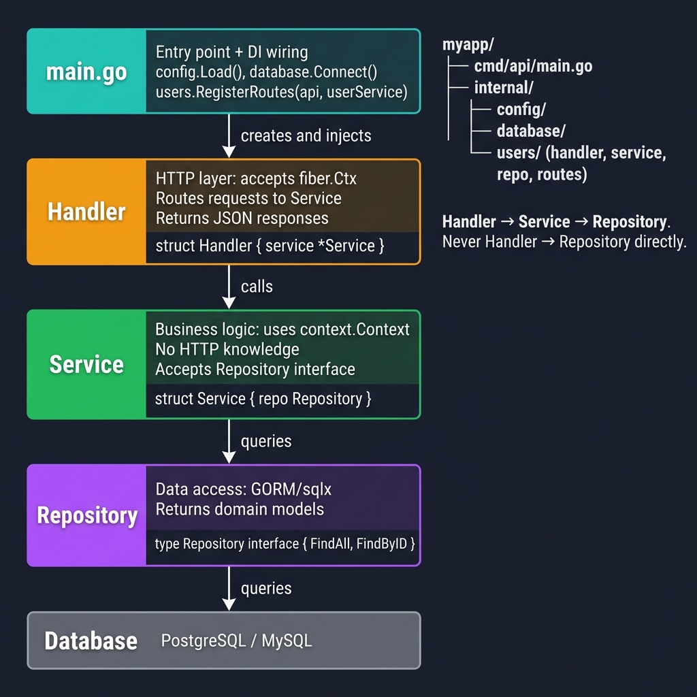
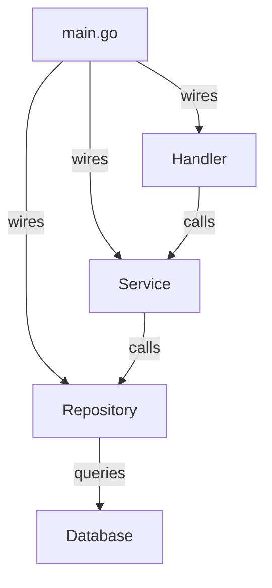

<!-- tags: golang, structs, modules -->
# 🏗️ Project Structure — NestJS Modules → Fiber Architecture

> **Library**: Layer handlers, services, and repositories into Go packages — replacing NestJS module architecture.

📅 Updated: 2026-04-19 · ⏱️ 12 min read

## 1. DEFINE

NestJS organizes code with `@Module()` decorators. Go uses packages — one folder per domain, with `handler.go`, `service.go`, `repository.go`, and `routes.go` inside each. The `main.go` file wires everything together.

| NestJS Concept      | Fiber Equivalent                        |
| ------------------- | --------------------------------------- |
| `@Controller()`     | `Handler` struct with `fiber.Ctx` methods |
| `@Injectable()`     | `Service` struct accepting interfaces   |
| `@Module()`         | `RegisterRoutes(router, service)` func  |
| `bootstrap()`       | `main.go` wiring + `app.Listen()`       |

### Key Invariants

- **One package per domain.** `internal/users/` contains handler, service, repo, and routes.
- **Wire dependencies in `main.go`.** Domain packages never import each other directly.

## 2. VISUAL

The layered architecture diagram shows how main.go wires dependencies top-down. Each layer only knows the interface above it.



*Figure: main.go (entry + DI wiring) → Handler (HTTP layer, accepts fiber.Ctx) → Service (business logic, uses context.Context) → Repository (data access, returns domain models) → Database. Directory layout: cmd/api/main.go + internal/{config, database, users/}. Rule: never skip the service layer.*

### Mermaid Fallback



### Project Layout

```text
myapp/
├── cmd/api/main.go         # Entry point + DI wiring
├── internal/
│   ├── config/             # Config loading
│   ├── database/           # DB connection
│   └── users/              # Domain package
│       ├── handler.go      # HTTP handlers
│       ├── service.go      # Business logic
│       ├── repository.go   # Data access
│       └── routes.go       # RegisterRoutes()
└── go.mod
```

## 3. CODE

### Example 1: Basic — Structuring Handlers

```go
package users

import (
    "github.com/gofiber/fiber/v3"
)

type Handler struct {
    service *Service
}

func NewHandler(service *Service) *Handler {
    return &Handler{service: service}
}

// ━━━━━━━━━━━━━━━━━━━━━━━━━━━━━━━━━━━━━━━━━
// Handler: HTTP layer. Accepts Service via constructor.
// Each method maps to one endpoint.
// ━━━━━━━━━━━━━━━━━━━━━━━━━━━━━━━━━━━━━━━━━
func (h *Handler) List(c fiber.Ctx) error {
    users, err := h.service.FindAll(c.Context())
    if err != nil {
        return fiber.NewError(fiber.StatusInternalServerError, err.Error())
    }
    return c.JSON(fiber.Map{"data": users})
}

func (h *Handler) GetByID(c fiber.Ctx) error {
    user, err := h.service.FindByID(c.Context(), c.Params("id"))
    if err != nil {
        return fiber.NewError(fiber.StatusNotFound, "user not found")
    }
    return c.JSON(fiber.Map{"data": user})
}
```

### Example 2: Intermediate — Structuring Services

```go
package users

import "context"

type Service struct {
    repo Repository
}

func NewService(repo Repository) *Service {
    return &Service{repo: repo}
}

// ━━━━━━━━━━━━━━━━━━━━━━━━━━━━━━━━━━━━━━━━━
// Service: business logic. Accepts Repository interface.
// No HTTP knowledge — uses context.Context.
// ━━━━━━━━━━━━━━━━━━━━━━━━━━━━━━━━━━━━━━━━━
func (s *Service) FindAll(ctx context.Context) ([]User, error) {
    return s.repo.FindAll(ctx)
}

func (s *Service) FindByID(ctx context.Context, id string) (*User, error) {
    return s.repo.FindByID(ctx, id)
}

// RegisterRoutes wires handler endpoints under a router group
func RegisterRoutes(router fiber.Router, service *Service) {
    handler := NewHandler(service)
    users := router.Group("/users")

    users.Get("/", handler.List)
    users.Get("/:id", handler.GetByID)
}
```

### Example 3: Advanced — Production Integration

```go
package main

import (
    "log"
    "myapp/internal/config"
    "myapp/internal/database"
    "myapp/internal/users"
    "github.com/gofiber/fiber/v3"
)

func main() {
    // ━━━━━━━━━━━━━━━━━━━━━━━━━━━━━━━━━━━━━━━━━
    // main.go: wire dependencies and register routes.
    // This is the only place that imports all packages.
    // ━━━━━━━━━━━━━━━━━━━━━━━━━━━━━━━━━━━━━━━━━
    cfg := config.Load()
    db := database.Connect(cfg.Database)

    userRepo := users.NewPostgresRepo(db)
    userService := users.NewService(userRepo)

    app := fiber.New()
    api := app.Group("/api/v1")

    users.RegisterRoutes(api, userService)

    log.Fatal(app.Listen(":" + cfg.App.Port))
}

```

---

## 4. PITFALLS

| # | Severity | Defect | Impact | Fix |
| --- | --- | --- | --- | --- |
| 1 | 🔴 Fatal | Handler importing repository directly (skipping service layer) | Business logic leaks into HTTP layer; untestable | Handler → Service → Repository, never Handler → Repository |
| 2 | 🟡 Common | Circular imports between domain packages | Go compiler error | Extract shared types into a `domain` or `model` package |

---

## 5. REF

| Resource | Link |
| --- | --- |
| Go Layout | [go.dev/doc/modules/layout](https://go.dev/doc/modules/layout) |
| Fiber | [docs.gofiber.io](https://docs.gofiber.io/) |

---

## 6. RECOMMEND

| Extension | When | Rationale |
| --- | --- | --- |
| Routing & Groups | When you need nested route groups with middleware | `app.Group()` scopes middleware to URL prefixes |
