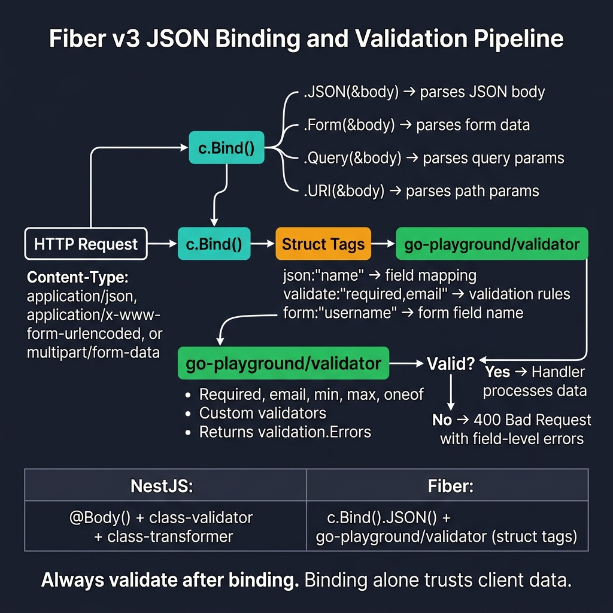
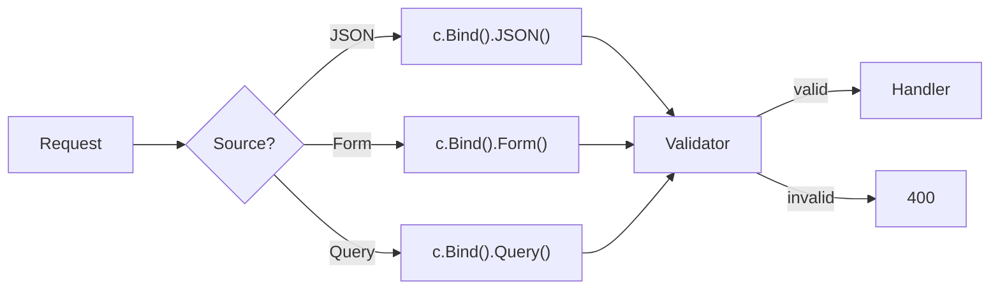

<!-- tags: golang -->
# 📋 JSON, Form & Validation — NestJS Pipes → Fiber Bind()

> **Library**: Parse JSON/Form/Query/Cookie with `c.Bind().JSON()` + validate with `go-playground/validator`.

📅 Updated: 2026-04-19 · ⏱️ 12 min read

## 1. DEFINE

Fiber v3 unifies request parsing under `c.Bind()` — one method per source (JSON, Query, URI, Header, Form, Cookie). Validation uses `go-playground/validator` struct tags, registered globally via `app.SetValidator()`.

| NestJS                       | Fiber v3                                  |
| ---------------------------- | ----------------------------------------- |
| `@Body() dto`                | `c.Bind().JSON(&dto)`                     |
| `@Query() dto`               | `c.Bind().Query(&dto)`                    |
| `@Param() params`            | `c.Bind().URI(&params)`                   |
| `class-validator`            | `validate:"required"`                     |
| `ValidationPipe`             | `app.SetValidator()`                      |

### Key Invariants

- **Always check the error from `c.Bind()`.** Ignoring it means operating on zero-value structs.
- **Register validator globally with `app.SetValidator()`.** Per-handler validation duplicates code.

## 2. VISUAL

The binding pipeline shows how c.Bind() selects the source parser, then routes through struct-tag validation.



*Figure: Request → c.Bind() (JSON/Form/Query/URI/Header/Cookie) → struct tags (json:“name”, validate:“required,email”) → go-playground/validator → valid = Handler, invalid = 400 with field-level errors. NestJS equivalent: @Body() + class-validator + class-transformer.*

### Mermaid Fallback



## 3. CODE

### Example 1: Basic — Binding Sources

```go
package main

import (
    "github.com/gofiber/fiber/v3"
)

// DTO struct with json + validate tags
type CreateUserDTO struct {
    Name  string `json:"name" validate:"required,min=2"`
    Email string `json:"email" validate:"required,email"`
    Age   int    `json:"age" validate:"gte=18,lte=120"`
}

type PaginationDTO struct {
    Page  int    `query:"page" validate:"omitempty,gte=1"`
    Limit int    `query:"limit" validate:"omitempty,gte=1,lte=100"`
    Sort  string `query:"sort" validate:"omitempty,oneof=asc desc"`
}

type UserParams struct {
    ID string `uri:"id" validate:"required"`
}

func main() {
    app := fiber.New()

    // ━━━━━━━━━━━━━━━━━━━━━━━━━━━━━━━━━━━━━━━━━
    // Bind JSON body, query params, and URI params.
    // Return 400 on parse/validation error.
    // ━━━━━━━━━━━━━━━━━━━━━━━━━━━━━━━━━━━━━━━━━
    app.Post("/users", func(c fiber.Ctx) error {
        var dto CreateUserDTO
        if err := c.Bind().JSON(&dto); err != nil {
            return fiber.NewError(fiber.StatusBadRequest, err.Error())
        }
        return c.Status(fiber.StatusCreated).JSON(dto)
    })

    // Query binding: parse page/limit/sort from URL query string
    app.Get("/users", func(c fiber.Ctx) error {
        var q PaginationDTO
        if err := c.Bind().Query(&q); err != nil {
            return fiber.NewError(fiber.StatusBadRequest, err.Error())
        }
        if q.Page == 0 { q.Page = 1 }
        if q.Limit == 0 { q.Limit = 20 }
        return c.JSON(fiber.Map{"page": q.Page, "limit": q.Limit})
    })

    // URI binding: extract :id from path parameter
    app.Get("/users/:id", func(c fiber.Ctx) error {
        var params UserParams
        if err := c.Bind().URI(&params); err != nil {
            return fiber.NewError(fiber.StatusBadRequest, err.Error())
        }
        return c.JSON(fiber.Map{"id": params.ID})
    })

    app.Listen(":3000")
}
```

### Example 2: Intermediate — Struct Validators

```go
package main

import (
    "github.com/go-playground/validator/v10"
    "github.com/gofiber/fiber/v3"
)

type StructValidator struct {
    validate *validator.Validate
}

func (v *StructValidator) Validate(out any) error {
    return v.validate.Struct(out)
}

func main() {
    app := fiber.New()

    // ━━━━━━━━━━━━━━━━━━━━━━━━━━━━━━━━━━━━━━━━━
    // Global validator: register once, all Bind() calls validate.
    // Uses go-playground/validator struct tags.
    // ━━━━━━━━━━━━━━━━━━━━━━━━━━━━━━━━━━━━━━━━━
    app.SetValidator(&StructValidator{
        validate: validator.New(),
    })

    app.Post("/users", func(c fiber.Ctx) error {
        var dto CreateUserDTO
        if err := c.Bind().JSON(&dto); err != nil {
            return fiber.NewError(fiber.StatusBadRequest, err.Error())
        }
        return c.Status(fiber.StatusCreated).JSON(dto)
    })

    app.Listen(":3000")
}
```

### Example 3: Advanced — Forms and Cookies

```go
    // ━━━━━━━━━━━━━━━━━━━━━━━━━━━━━━━━━━━━━━━━━
    // Form and Cookie binding: same Bind() pattern,
    // different struct tags (form:"", cookie:"").
    // ━━━━━━━━━━━━━━━━━━━━━━━━━━━━━━━━━━━━━━━━━
    app.Post("/profile", func(c fiber.Ctx) error {
        var form struct {
            Name string `form:"name" validate:"required"`
            Bio  string `form:"bio" validate:"max=500"`
        }
        if err := c.Bind().Form(&form); err != nil {
            return fiber.NewError(fiber.StatusBadRequest, err.Error())
        }
        return c.JSON(form)
    })

    app.Get("/prefs", func(c fiber.Ctx) error {
        var prefs struct {
            Theme string `cookie:"theme"`
            Lang  string `cookie:"lang"`
        }
        c.Bind().Cookie(&prefs)
        return c.JSON(prefs)
    })
```

---

## 4. PITFALLS

| # | Severity | Defect | Impact | Fix |
| --- | --- | --- | --- | --- |
| 1 | 🔴 Fatal | Ignoring error from `c.Bind().JSON()` | Handler operates on zero-value struct; silent data corruption | `if err := c.Bind().JSON(&dto); err != nil { return ... }` |
| 2 | 🟡 Common | Missing `validate` struct tags | Validator passes any payload including empty fields | Add `validate:"required"` to mandatory fields |

---

## 5. REF

| Resource | Link | 
| --- | --- | 
| Fiber Bind API | [docs.gofiber.io/next/api/bind](https://docs.gofiber.io/next/api/bind) | 
| go-playground/validator | [github.com/go-playground/validator](https://github.com/go-playground/validator) | 

---

## 6. RECOMMEND

| Extension | When | Rationale | Resource |
| --- | --- | --- | --- |
| File Upload | When you need multipart file upload | `c.FormFile()` + size/type checks | [./02-file-upload-multipart.md](./02-file-upload-multipart.md) |
