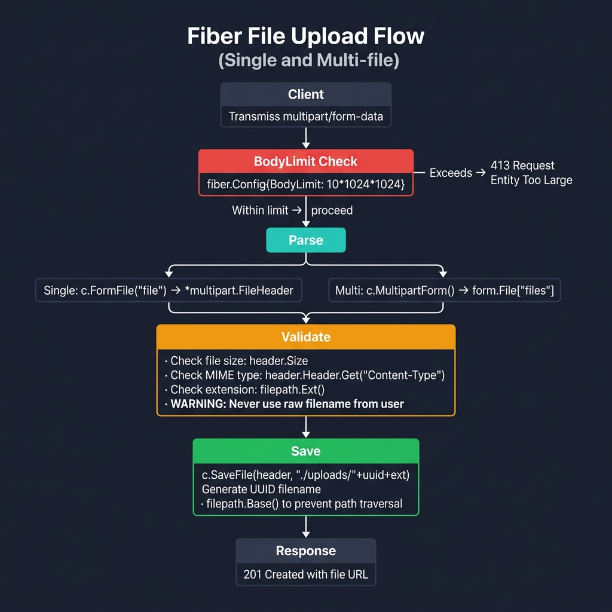
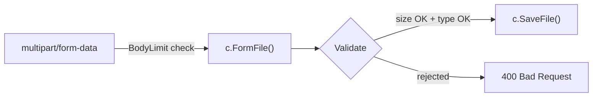

<!-- tags: golang -->
# 📁 File Upload — NestJS Multer → Fiber FormFile

> **Library**: Single/multi file upload via `c.FormFile()`, size limit with `BodyLimit`, type validation.

📅 Updated: 2026-04-19 · ⏱️ 8 min read

## 1. DEFINE

Fiber provides `c.FormFile("file")` for single uploads and `c.MultipartForm()` for batch. Body size is controlled by `fiber.Config{BodyLimit}`. Always validate file type (Content-Type header) and sanitize filenames before saving.

| NestJS                              | Fiber                                       |
| ----------------------------------- | ------------------------------------------- |
| `FileInterceptor`                   | `c.FormFile("file")`                        |
| `@UploadedFile() file`              | `file, err := c.FormFile("file")`           |
| `@UploadedFiles() files`            | `form.File["files"]`                        |
| `MulterModule` config               | `fiber.Config{BodyLimit: limit}`            |

### Key Invariants

- **Set `BodyLimit` in config.** Default is 4MB; without explicit limit, large uploads consume memory.
- **Never use user filenames directly.** Generate UUIDs or use `filepath.Base()` to prevent path traversal.

## 2. VISUAL

The upload flow shows how BodyLimit provides the first defense, then handler validates type and size before saving.



*Figure: Client (multipart/form-data) → BodyLimit gate (exceeds = 413) → Parse (c.FormFile single / c.MultipartForm multi) → Validate (size, MIME type, extension) → Save (c.SaveFile with UUID filename). Warning: never use raw user filenames — generate UUIDs or use filepath.Base().*

### Mermaid Fallback



## 3. CODE

### Example 1: Basic — Single File Upload

```go
    // ━━━━━━━━━━━━━━━━━━━━━━━━━━━━━━━━━━━━━━━━━
    // Single file: c.FormFile() returns *multipart.FileHeader.
    // c.SaveFile() writes to disk.
    // ━━━━━━━━━━━━━━━━━━━━━━━━━━━━━━━━━━━━━━━━━
    app.Post("/upload", func(c fiber.Ctx) error {
        file, err := c.FormFile("file")
        if err != nil {
            return fiber.NewError(fiber.StatusBadRequest, "no file uploaded")
        }

        dst := fmt.Sprintf("./uploads/%s", file.Filename)
        if err := c.SaveFile(file, dst); err != nil {
            return fiber.NewError(fiber.StatusInternalServerError, "save failed")
        }

        return c.JSON(fiber.Map{
            "filename": file.Filename,
            "size":     file.Size,
        })
    })
```

### Example 2: Intermediate — Multiple Files

```go
    // ━━━━━━━━━━━━━━━━━━━━━━━━━━━━━━━━━━━━━━━━━
    // Multiple files: c.MultipartForm() returns the full form.
    // Iterate form.File["files"] to save each.
    // ━━━━━━━━━━━━━━━━━━━━━━━━━━━━━━━━━━━━━━━━━
    app.Post("/uploads", func(c fiber.Ctx) error {
        form, err := c.MultipartForm()
        if err != nil {
            return fiber.NewError(fiber.StatusBadRequest, err.Error())
        }

        files := form.File["files"]
        var uploaded []string

        for _, file := range files {
            dst := fmt.Sprintf("./uploads/%s", file.Filename)
            if err := c.SaveFile(file, dst); err != nil {
                return fiber.NewError(fiber.StatusInternalServerError, err.Error())
            }
            uploaded = append(uploaded, file.Filename)
        }

        return c.JSON(fiber.Map{
            "uploaded": uploaded,
            "count":    len(uploaded),
        })
    })
```

### Example 3: Advanced — Validated Uploading

```go
    // ━━━━━━━━━━━━━━━━━━━━━━━━━━━━━━━━━━━━━━━━━
    // Validated upload: check size + Content-Type before saving.
    // BodyLimit in config provides first line of defense.
    // ━━━━━━━━━━━━━━━━━━━━━━━━━━━━━━━━━━━━━━━━━
    app := fiber.New(fiber.Config{
        BodyLimit: 10 * 1024 * 1024, // 10MB max
    })

    app.Post("/avatar", func(c fiber.Ctx) error {
        file, err := c.FormFile("avatar")
        if err != nil {
            return fiber.NewError(fiber.StatusBadRequest, "avatar required")
        }

        if file.Size > 2*1024*1024 {
            return fiber.NewError(fiber.StatusBadRequest, "max 2MB")
        }

        ct := file.Header.Get("Content-Type")
        if ct != "image/jpeg" && ct != "image/png" {
            return fiber.NewError(fiber.StatusBadRequest, "only JPEG/PNG")
        }

        dst := fmt.Sprintf("./avatars/%s", file.Filename)
        c.SaveFile(file, dst)

        return c.JSON(fiber.Map{"avatar": dst})
    })
```

---

## 4. PITFALLS

| # | Severity | Defect | Impact | Fix |
| --- | --- | --- | --- | --- |
| 1 | 🔴 Fatal | Using user-provided filename in `SaveFile` path | Path traversal: `../../etc/passwd` overwrites system files | Generate UUID filenames or use `filepath.Base()` |
| 2 | 🟡 Common | Not checking Content-Type header | Users upload `.exe` renamed to `.jpg` | Check `file.Header.Get("Content-Type")` against allowlist |

---

## 5. REF

| Resource | Link |
| --- | --- |
| Fiber Upload Recipe | [docs.gofiber.io/recipes/upload-file](https://docs.gofiber.io/recipes/upload-file/) |
| Go multipart | [pkg.go.dev/mime/multipart](https://pkg.go.dev/mime/multipart) |

---

## 6. RECOMMEND

| Extension | When | Rationale | Resource |
| --- | --- | --- | --- |
| JSON Binding | When you need to parse JSON/Form request bodies | `c.Bind().JSON()` + validator | [./01-json-form-validation.md](./01-json-form-validation.md) |
