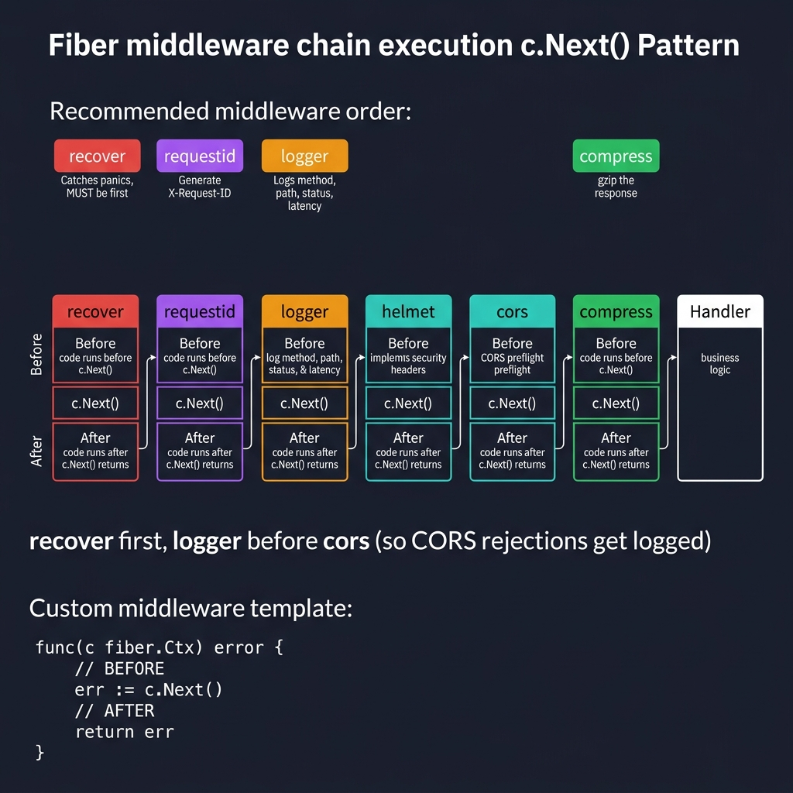
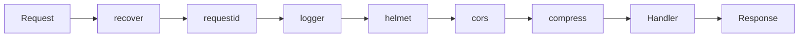

<!-- tags: golang -->
# 🔧 Built-in & Custom Middleware — NestJS Middleware → Fiber

> **Library**: Built-in middleware (logger, cors, helmet, compress) + custom middleware with `c.Next()` pattern.

📅 Updated: 2026-04-19 · ⏱️ 14 min read

## 1. DEFINE

Fiber ships with rich built-in middleware under `middleware/` packages. Custom middleware follows the `func(c fiber.Ctx) error` signature with `c.Next()` to proceed. Middleware order matters: `recover` first, then `requestid`, then `logger`, then business logic.

| NestJS Package           | Fiber Built-in                                |
| ------------------------ | --------------------------------------------- |
| `morgan`                 | `middleware/logger`                           |
| `express-rate-limit`     | `middleware/limiter`                          |
| `helmet`                 | `middleware/helmet`                           |
| `cors`                   | `middleware/cors`                             |
| `compression`            | `middleware/compress`                         |
| `csurf`                  | `middleware/csrf`                             |
| `express-session`        | `middleware/session`                          |
| `cache-manager`          | `middleware/cache`                            |

### Key Invariants

- **`recover` must be the first middleware.** Otherwise panics bypass all other middleware.
- **Middleware order = execution order.** Logger before CORS means CORS rejections aren’t logged.

## 2. VISUAL

The middleware chain shows execution order and the c.Next() before/after pattern.



*Figure: Recommended order — recover (catches panics, MUST be first) → requestid (X-Request-ID) → logger (method, path, latency) → helmet (security headers) → cors (preflight) → compress (gzip) → Handler. Each middleware runs code before c.Next(), then after c.Next() returns. Custom template: func(c fiber.Ctx) error { before; err := c.Next(); after; return err }.*

### Mermaid Fallback



## 3. CODE

### Example 1: Basic — Built-in Stack

```go
package main

import (
    "log"

    "github.com/gofiber/fiber/v3"
    "github.com/gofiber/fiber/v3/middleware/compress"
    "github.com/gofiber/fiber/v3/middleware/cors"
    "github.com/gofiber/fiber/v3/middleware/helmet"
    "github.com/gofiber/fiber/v3/middleware/logger"
    "github.com/gofiber/fiber/v3/middleware/recover"
    "github.com/gofiber/fiber/v3/middleware/requestid"
)

func main() {
    // ━━━━━━━━━━━━━━━━━━━━━━━━━━━━━━━━━━━━━━━━━
    // Production middleware stack: recover first, then
    // requestid, logger, helmet, compress, cors.
    // ━━━━━━━━━━━━━━━━━━━━━━━━━━━━━━━━━━━━━━━━━
    app := fiber.New()

    app.Use(recover.New())                    
    app.Use(requestid.New())                  
    app.Use(logger.New(logger.Config{         
        Format: "${time} | ${status} | ${latency} | ${method} ${path}\n",
    }))
    app.Use(helmet.New())                     
    app.Use(compress.New())                   
    app.Use(cors.New(cors.Config{             
        AllowOrigins: []string{"http://localhost:3000"},
        AllowMethods: []string{"GET", "POST", "PUT", "DELETE"},
    }))

    app.Get("/", func(c fiber.Ctx) error {
        return c.JSON(fiber.Map{"message": "hello"})
    })

    log.Fatal(app.Listen(":3000"))
}
```

### Example 2: Intermediate — Custom Middleware

```go
package middleware

import (
    "log/slog"
    "time"

    "github.com/gofiber/fiber/v3"
)

// ━━━━━━━━━━━━━━━━━━━━━━━━━━━━━━━━━━━━━━━━━
// Custom middleware: code before c.Next() runs pre-handler,
// code after c.Next() runs post-handler (interceptor pattern).
// ━━━━━━━━━━━━━━━━━━━━━━━━━━━━━━━━━━━━━━━━━
func TimingMiddleware(c fiber.Ctx) error {
    start := time.Now()

    slog.Info("→ request", "method", c.Method(), "path", c.Path())

    err := c.Next()

    slog.Info("← response",
        "method", c.Method(),
        "path", c.Path(),
        "status", c.Response().StatusCode(),
        "duration", time.Since(start),
    )

    return err
}

func RequireAuth(c fiber.Ctx) error {
    token := c.Get("Authorization")
    if token == "" {
        return fiber.NewError(fiber.StatusUnauthorized, "missing token")
    }
    
    c.Locals("userID", "user-123")
    return c.Next()
}
```

### Example 3: Advanced — Scoped Groups

```go
    // ━━━━━━━━━━━━━━━━━━━━━━━━━━━━━━━━━━━━━━━━━
    // Scoped middleware: app.Group() applies middleware
    // only to routes within that group.
    // ━━━━━━━━━━━━━━━━━━━━━━━━━━━━━━━━━━━━━━━━━
    app := fiber.New()

    app.Use(recover.New())
    app.Use(logger.New())

    pub := app.Group("/public")
    pub.Get("/health", healthCheck)

    auth := app.Group("/api", RequireAuth)
    auth.Get("/profile", getProfile)

    admin := auth.Group("/admin", RequireRole("admin"))
    admin.Get("/dashboard", getDashboard)

    app.Post("/upload",
        RequireAuth,        
        ValidateFileType,   
        uploadHandler,      
    )
```

---

## 4. PITFALLS

| # | Severity | Defect | Impact | Fix |
| --- | --- | --- | --- | --- |
| 1 | 🔴 Fatal | Placing `recover` middleware after other middleware | Panics in earlier middleware crash the process | `app.Use(recover.New())` as the very first middleware |
| 2 | 🟡 Common | Wrong middleware order (CORS after route handlers) | CORS preflight requests return 404 instead of proper headers | Place CORS middleware before route registration |

---

## 5. REF

| Resource | Link | 
| --- | --- | 
| Fiber Routing Map | [docs.gofiber.io](https://docs.gofiber.io/) | 
| Catalog | [docs.gofiber.io/category/-middleware](https://docs.gofiber.io/category/-middleware/) | 

---

## 6. RECOMMEND

| Extension | When | Rationale | Resource |
| --- | --- | --- | --- |
| Guards & Interceptors | When you need auth guards and request/response interceptors | Before/after `c.Next()` for auth, logging, transforms | [./02-guards-interceptors.md](./02-guards-interceptors.md) |
