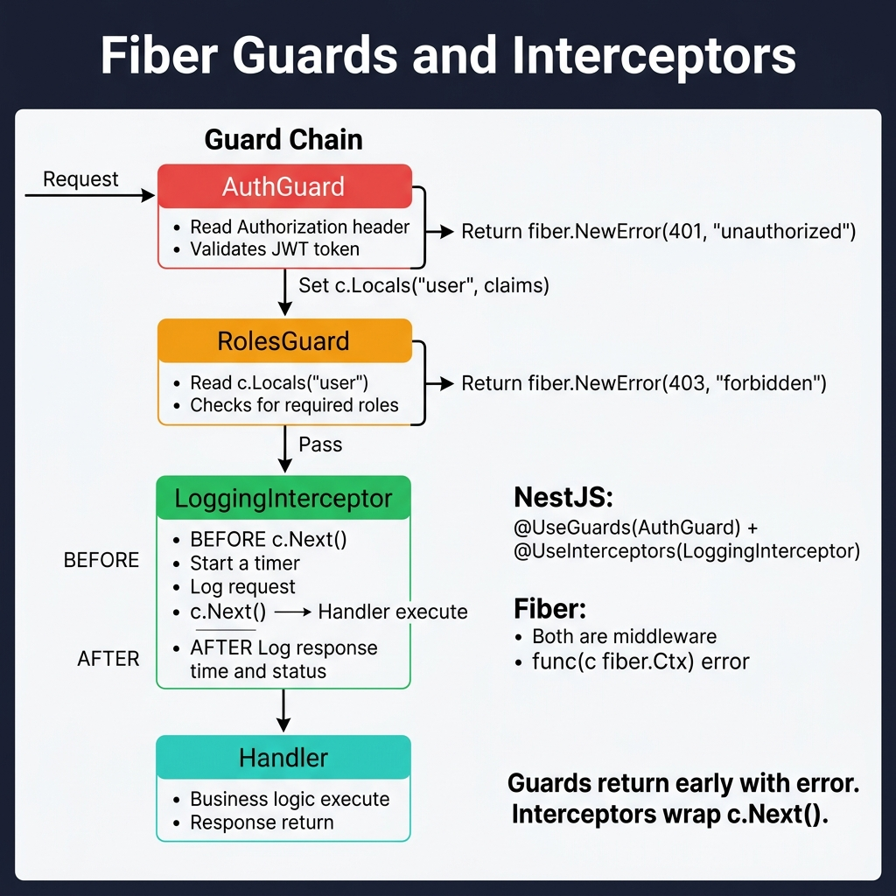
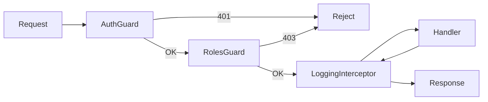

<!-- tags: golang -->
# 🛡️ Guards & Interceptors — NestJS Patterns → Fiber Middleware

> **Library**: Auth guards via JWT middleware + role checks; interceptors via before/after `c.Next()` pattern.

📅 Updated: 2026-04-19 · ⏱️ 14 min read

## 1. DEFINE

NestJS has separate `@UseGuards()` and `@UseInterceptors()` decorators. In Fiber, both are just middleware: a guard returns an error to block access, an interceptor wraps `c.Next()` to run code before and after the handler. Metadata is stored via `c.Locals()`.

| NestJS                     | Fiber                                        |
| -------------------------- | -------------------------------------------- |
| `@UseGuards(AuthGuard)`    | Auth middleware returning `fiber.NewError`   |
| `@UseInterceptors()`       | Before/after `c.Next()` wrapper              |
| `canActivate() → boolean`  | Return `error` or call `c.Next()`            |
| `@SetMetadata('roles',[])` | `c.Locals("roles", [...])`                   |

### Key Invariants

- **Guards should return early with `fiber.NewError()`.** Never call `c.Next()` on auth failure.
- **Type-assert `c.Locals()` values safely.** Panics crash the process if the value isn’t the expected type.

## 2. VISUAL

The guard chain shows how AuthGuard and RolesGuard gate access, while the interceptor wraps the handler with before/after logic.



*Figure: Request → AuthGuard (validates JWT, fail = 401, pass = c.Locals("user")) → RolesGuard (checks roles, fail = 403) → LoggingInterceptor (before: start timer; c.Next(); after: log duration) → Handler. In Fiber, both guards and interceptors are middleware with func(c fiber.Ctx) error signature.*

### Mermaid Fallback



## 3. CODE

### Example 1: Basic — Auth Guard

```go
package middleware

import (
    "strings"

    "github.com/gofiber/fiber/v3"
    "github.com/golang-jwt/jwt/v5"
)

// ━━━━━━━━━━━━━━━━━━━━━━━━━━━━━━━━━━━━━━━━━
// AuthGuard: parse JWT from Authorization header, store claims
// in Locals. RolesGuard: check role from Locals against allowed.
// ━━━━━━━━━━━━━━━━━━━━━━━━━━━━━━━━━━━━━━━━━
func AuthGuard(secret string) fiber.Handler {
    return func(c fiber.Ctx) error {
        header := c.Get("Authorization")
        if !strings.HasPrefix(header, "Bearer ") {
            return fiber.NewError(fiber.StatusUnauthorized, "missing token")
        }

        tokenStr := strings.TrimPrefix(header, "Bearer ")
        token, err := jwt.Parse(tokenStr, func(t *jwt.Token) (any, error) {
            return []byte(secret), nil
        })
        if err != nil || !token.Valid {
            return fiber.NewError(fiber.StatusUnauthorized, "invalid token")
        }

        claims := token.Claims.(jwt.MapClaims)
        c.Locals("userID", claims["sub"])
        c.Locals("role", claims["role"])

        return c.Next()
    }
}

func RolesGuard(roles ...string) fiber.Handler {
    return func(c fiber.Ctx) error {
        userRole, ok := c.Locals("role").(string)
        if !ok {
            return fiber.NewError(fiber.StatusForbidden, "no role assigned")
        }
        for _, r := range roles {
            if userRole == r {
                return c.Next()
            }
        }
        return fiber.NewError(fiber.StatusForbidden, "insufficient permissions")
    }
}
```

### Example 2: Intermediate — Logging Interceptor

```go
package middleware

import (
    "log/slog"
    "time"

    "github.com/gofiber/fiber/v3"
)

// ━━━━━━━━━━━━━━━━━━━━━━━━━━━━━━━━━━━━━━━━━
// LoggingInterceptor: log before c.Next(), measure duration,
// log after with status code and timing.
// ━━━━━━━━━━━━━━━━━━━━━━━━━━━━━━━━━━━━━━━━━
func LoggingInterceptor(c fiber.Ctx) error {
    start := time.Now()

    slog.Info("→ incoming", "method", c.Method(), "path", c.Path())

    err := c.Next()

    duration := time.Since(start)
    status := c.Response().StatusCode()

    if err != nil {
        slog.Error("← error", "status", status, "error", err, "duration", duration)
    } else {
        slog.Info("← response", "status", status, "duration", duration)
    }

    return err 
}
```

### Example 3: Advanced — Global Error Handler

```go
package main

import (
    "errors"
    "log/slog"

    "github.com/gofiber/fiber/v3"
)

func main() {
    // ━━━━━━━━━━━━━━━━━━━━━━━━━━━━━━━━━━━━━━━━━
    // Global ErrorHandler: centralizes all error responses.
    // Uses errors.As to extract fiber.Error for correct status codes.
    // ━━━━━━━━━━━━━━━━━━━━━━━━━━━━━━━━━━━━━━━━━
    app := fiber.New(fiber.Config{
        ErrorHandler: func(c fiber.Ctx, err error) error {
            code := fiber.StatusInternalServerError

            var e *fiber.Error
            if errors.As(err, &e) {
                code = e.Code
            }

            if code >= 500 {
                slog.Error("server error", "error", err, "path", c.Path())
            }

            return c.Status(code).JSON(fiber.Map{
                "error":   true,
                "message": err.Error(),
                "code":    code,
                "path":    c.Path(),
            })
        },
    })
}
```

---

## 4. PITFALLS

| # | Severity | Defect | Impact | Fix |
| --- | --- | --- | --- | --- |
| 1 | 🔴 Fatal | Calling `c.Next()` after returning an error in guard | Response partially sent, then handler runs → double-write panic | `return fiber.NewError(401, ...)` without calling `c.Next()` |
| 2 | 🔴 Fatal | Unsafe type assertion on `c.Locals()` | `c.Locals("role").(string)` panics if value is nil | Use comma-ok pattern: `role, ok := c.Locals("role").(string)` |

---

## 5. REF

| Resource | Link |
| --- | --- |
| Fiber | [docs.gofiber.io](https://docs.gofiber.io/) |
| Fiber Middleware | [docs.gofiber.io/category/-middleware](https://docs.gofiber.io/category/-middleware/) |

---

## 6. RECOMMEND

| Extension | When | Rationale | Resource |
| --- | --- | --- | --- |
| Binding | When you need to parse and validate request bodies | `c.Bind().JSON()` + struct tags | [../binding/01-json-form-validation.md](../binding/01-json-form-validation.md) |
