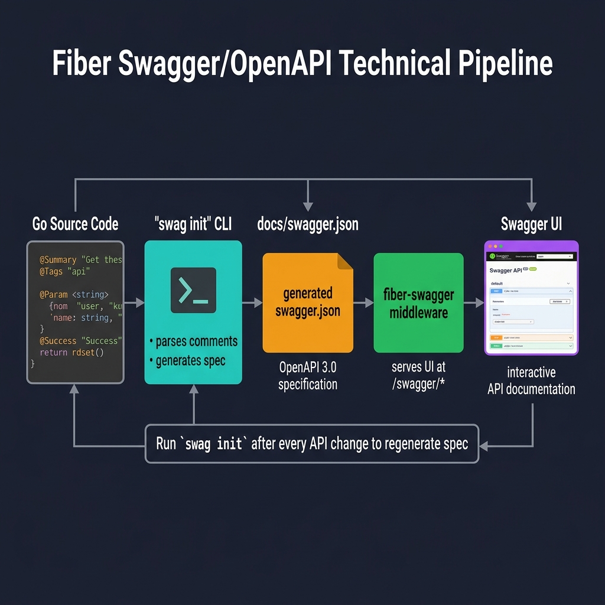
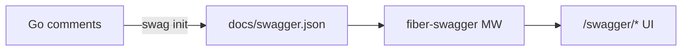

<!-- tags: golang -->
# 📖 Swagger & OpenAPI — NestJS @nestjs/swagger → Go swaggo with Fiber

> **Library**: `swaggo/swag` generates OpenAPI from Go comments; `fiber-swagger` serves the UI.

📅 Updated: 2026-04-19 · ⏱️ 8 min read

## 1. DEFINE

In NestJS, `@nestjs/swagger` uses decorators to generate OpenAPI specs. In Go, `swaggo/swag` reads Go comments (`// @Summary`, `// @Tags`) and generates `docs/` folder with `swagger.json`. Mount `fiber-swagger` middleware to serve the Swagger UI at `/swagger/*`.

| NestJS                            | Fiber                               |
| --------------------------------- | ----------------------------------- |
| `@ApiTags('users')`               | `// @Tags users` comment            |
| `SwaggerModule.setup('api', app)` | `swagger.HandlerDefault` middleware |

### Key Invariants

- **Run `swag init` in CI.** Stale docs drift from actual API; add `swag init` to build pipeline.
- **Comment format is strict.** Missing `// @Router` = endpoint not in spec.

## 2. VISUAL

The Swagger pipeline generates interactive API docs from Go source code annotations.



*Figure: Go source code (@Summary, @Tags, @Param annotations) → swag init CLI → docs/swagger.json (OpenAPI 3.0) → fiber-swagger middleware → Swagger UI at /swagger/*. Rule: run swag init after every API change.*

### Mermaid Fallback




## 3. CODE

### Example 1: Basic — Structuring Endpoint Tags

```go
    // ━━━━━━━━━━━━━━━━━━━━━━━━━━━━━━━━━━━━━━━━━
    // Swaggo comments: @Summary, @Tags, @Param, @Success,
    // @Router define the OpenAPI spec from Go code.
    // ━━━━━━━━━━━━━━━━━━━━━━━━━━━━━━━━━━━━━━━━━
    // ListUsers godoc
    // @Summary      List all users
    // @Tags         users
    // @Accept       json
    // @Produce      json
    // @Param        page  query  int  false  "Page number"
    // @Success      200  {object}  map[string]interface{}
    // @Router       /users [get]
    func ListUsers(c fiber.Ctx) error {
        return c.JSON(fiber.Map{"data": []fiber.Map{}})
    }
```

### Example 2: Intermediate — Bootstrapping Definitions

```go
    import (
        swagger "github.com/arsmn/fiber-swagger/v2"
        _ "myapp/docs"
    )

    // ━━━━━━━━━━━━━━━━━━━━━━━━━━━━━━━━━━━━━━━━━
    // Main entry: @title, @version, @host define the
    // global spec. Mount swagger.HandlerDefault.
    // ━━━━━━━━━━━━━━━━━━━━━━━━━━━━━━━━━━━━━━━━━
    // @title My API
    // @version 1.0
    // @host localhost:3000
    // @BasePath /api/v1
    func main() {
        app := fiber.New()
        app.Get("/swagger/*", swagger.HandlerDefault)
        app.Listen(":3000")
    }

    // Execution Target: swag init -g cmd/api/main.go
```

---

## 4. PITFALLS

| # | Severity | Defect | Impact | Fix |
| --- | --- | --- | --- | --- |
| 1 | 🔴 Fatal | Not running `swag init` after API changes | Swagger UI shows stale endpoints; clients integrate wrong API | Add `swag init -g main.go` to CI pipeline |
| 2 | 🟡 Common | Exposing `/swagger/*` in production | API spec visible to attackers for reconnaissance | Gate behind `APP_ENV != production` check or auth middleware |

---

## 5. REF

| Resource | Link |
| --- | --- |
| Swaggo | [github.com/swaggo/swag](https://github.com/swaggo/swag) |
| OpenAPI Specification | [swagger.io/specification/](https://swagger.io/specification/) |

---

## 6. RECOMMEND

| Extension | When | Rationale | Resource |
| --- | --- | --- | --- |
| Health Checks | When you need liveness/readiness probes | Custom `/health` endpoints + `gofiber/contrib/monitor` | [./02-health-check.md](./02-health-check.md) |
