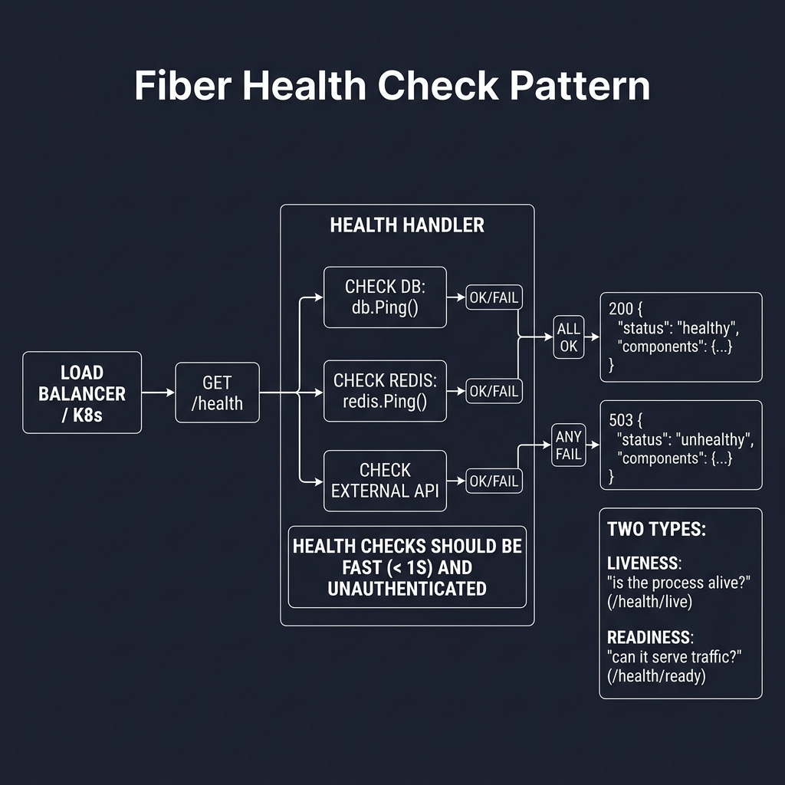
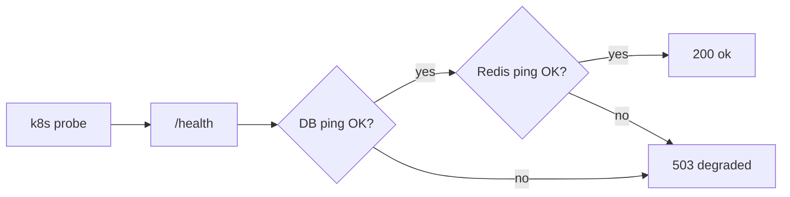

<!-- tags: golang -->
# 🏥 Health Check — NestJS Terminus → Fiber Health Endpoints

> **Library**: Custom `/health` handlers for liveness/readiness + `gofiber/contrib/monitor` for metrics.

📅 Updated: 2026-04-19 · ⏱️ 8 min read

## 1. DEFINE

Kubernetes needs liveness (is the process alive?) and readiness (can it serve traffic?) probes. Implement `/health` as a lightweight handler that pings DB and Redis with a 5s timeout. Use `gofiber/contrib/monitor` for a real-time metrics dashboard.

| NestJS                         | Fiber                          |
| ------------------------------ | ------------------------------ |
| `@nestjs/terminus`             | Custom handler functions       |
| `HealthCheckService.check([])` | Manual structural checks       |
| Monitor dashboard              | `gofiber/contrib/monitor`      |

### Key Invariants

- **Health checks must be fast.** Use `PingContext()` not full queries. 5s timeout max.
- **Return 503 on degraded.** Kubernetes uses HTTP status to decide routing; 200 = healthy, 503 = unhealthy.

## 2. VISUAL

Health checks verify all dependencies before reporting readiness to the load balancer.



*Figure: Load Balancer/K8s → GET /health → check DB (db.Ping), Redis (redis.Ping), external APIs → all OK = 200 healthy, any fail = 503 unhealthy. Liveness (/health/live) vs Readiness (/health/ready). Health checks: fast (<1s), unauthenticated.*

### Mermaid Fallback




## 3. CODE

### Example 1: Basic — Internal Route Endpoints

```go
    // ━━━━━━━━━━━━━━━━━━━━━━━━━━━━━━━━━━━━━━━━━
    // Basic liveness: returns uptime. No external
    // dependency checks (fast, always 200).
    // ━━━━━━━━━━━━━━━━━━━━━━━━━━━━━━━━━━━━━━━━━
    app.Get("/health", func(c fiber.Ctx) error {
        return c.JSON(fiber.Map{
            "status": "ok",
            "uptime": time.Since(startTime).String(),
        })
    })
```

### Example 2: Intermediate — Component Verifications

```go
    // ━━━━━━━━━━━━━━━━━━━━━━━━━━━━━━━━━━━━━━━━━
    // Readiness: ping DB + Redis with 5s timeout.
    // Return 503 if any component is down.
    // ━━━━━━━━━━━━━━━━━━━━━━━━━━━━━━━━━━━━━━━━━
    func healthHandler(db *gorm.DB, rdb *redis.Client, start time.Time) fiber.Handler {
        return func(c fiber.Ctx) error {
            ctx, cancel := context.WithTimeout(c.Context(), 5*time.Second)
            defer cancel()

            checks := make(map[string]Check)
            t := time.Now()
            sqlDB, _ := db.DB()
            if err := sqlDB.PingContext(ctx); err != nil {
                checks["database"] = Check{Status: "error", Error: err.Error()}
            } else {
                checks["database"] = Check{Status: "ok", Duration: time.Since(t).String()}
            }

            t = time.Now()
            if err := rdb.Ping(ctx).Err(); err != nil {
                checks["redis"] = Check{Status: "error", Error: err.Error()}
            } else {
                checks["redis"] = Check{Status: "ok", Duration: time.Since(t).String()}
            }

            overall := "ok"
            code := fiber.StatusOK
            for _, ch := range checks {
                if ch.Status != "ok" {
                    overall = "degraded"
                    code = fiber.StatusServiceUnavailable
                }
            }

            return c.Status(code).JSON(HealthStatus{
                Status: overall, Checks: checks,
                Uptime: time.Since(start).String(),
            })
        }
    }
```

### Example 3: Advanced — Internal Metrics Dashboard

```go
    import "github.com/gofiber/contrib/monitor"

    // ━━━━━━━━━━━━━━━━━━━━━━━━━━━━━━━━━━━━━━━━━
    // Metrics dashboard: real-time CPU, memory,
    // request stats at /metrics.
    // ━━━━━━━━━━━━━━━━━━━━━━━━━━━━━━━━━━━━━━━━━
    app.Get("/metrics", monitor.New())
```

---

## 4. PITFALLS

| # | Severity | Defect | Impact | Fix |
| --- | --- | --- | --- | --- |
| 1 | 🔴 Fatal | Running expensive queries in health check (e.g., `SELECT COUNT(*) FROM users`) | Health probe causes DB load spikes; check itself becomes the bottleneck | Use `sqlDB.PingContext(ctx)` only — tests connection, not data |
| 2 | 🟡 Common | No timeout on health check handler | Slow DB connection blocks k8s probe; pod marked unhealthy after timeout | Use `context.WithTimeout(ctx, 5*time.Second)` |

---

## 5. REF

| Resource | Link |
| --- | --- |
| Kubernetes probes | [kubernetes.io/docs/tasks/configure-pod-container](https://kubernetes.io/docs/tasks/configure-pod-container/configure-liveness-readiness-startup-probes/) |
| Fiber | [docs.gofiber.io](https://docs.gofiber.io/) |

---

## 6. RECOMMEND

| Extension | When | Rationale | Resource |
| --- | --- | --- | --- |
| CQRS Patterns | When you need to split read/write paths | Command/Query handler structs | [./03-graceful-cqrs.md](./03-graceful-cqrs.md) |
