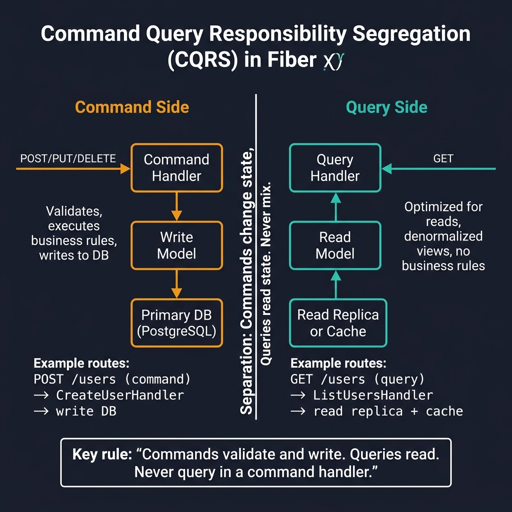
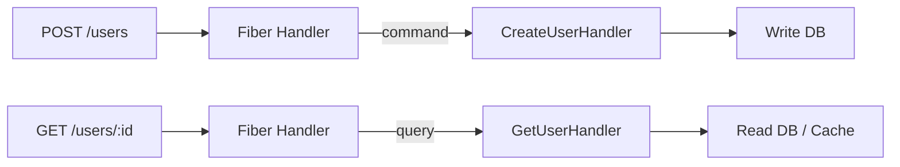

<!-- tags: golang -->
# 🔄 CQRS Pattern — NestJS @nestjs/cqrs → Go Command/Query with Fiber

> **Library**: Command/Query separation — struct-based handlers for writes, query handlers for reads.

📅 Updated: 2026-04-19 · ⏱️ 10 min read

## 1. DEFINE

NestJS uses `@nestjs/cqrs` with `CommandBus` and `QueryBus`. In Go, CQRS is implemented via separate handler structs: `CreateUserHandler` (command) and `GetUserHandler` (query). Fiber routes delegate to these handlers, passing `c.Context()` for cancellation.

| NestJS                               | Fiber / Go                                 |
| ------------------------------------ | ------------------------------------------ |
| `CommandBus.execute(command)`        | `handler.Handle(ctx, command)`             |
| `@CommandHandler(CreateUserCommand)` | Explicit execution structs                 |

### Key Invariants

- **Commands return created entity; queries return projection.** Don’t mix write and read models.
- **One handler per command/query.** Keep handlers focused and testable.

## 2. VISUAL

CQRS separates command (write) and query (read) paths for independent scaling and optimization.



*Figure: Command side (POST/PUT/DELETE → Command Handler → Write Model → Primary DB) vs Query side (GET → Query Handler → Read Model → Read Replica/Cache). Commands validate and write. Queries read. Never mix.*

### Mermaid Fallback




## 3. CODE

### Example 1: Advanced — Splitting Context Paths

```go
    // ━━━━━━━━━━━━━━━━━━━━━━━━━━━━━━━━━━━━━━━━━
    // CQRS: separate handler structs for commands
    // (writes) and queries (reads).
    // ━━━━━━━━━━━━━━━━━━━━━━━━━━━━━━━━━━━━━━━━━
    type UserHandler struct {
        createUser *commands.CreateUserHandler
        getUser    *queries.GetUserHandler
    }

    func (h *UserHandler) Create(c fiber.Ctx) error {
        var req struct {
            Name     string `json:"name" validate:"required"`
            Email    string `json:"email" validate:"required,email"`
            Password string `json:"password" validate:"required,min=8"`
        }
        if err := c.Bind().JSON(&req); err != nil {
            return fiber.NewError(fiber.StatusBadRequest, err.Error())
        }

        result, err := h.createUser.Handle(c.Context(), commands.CreateUserCommand{
            Name: req.Name, Email: req.Email, Password: req.Password,
        })
        if err != nil {
            return err 
        }
        return c.Status(fiber.StatusCreated).JSON(fiber.Map{"data": result})
    }

    func (h *UserHandler) Get(c fiber.Ctx) error {
        result, err := h.getUser.Handle(c.Context(), queries.GetUserQuery{
            ID: c.Params("id"),
        })
        if err != nil {
            return fiber.NewError(fiber.StatusNotFound, err.Error())
        }
        return c.JSON(fiber.Map{"data": result})
    }
```

---

## 4. PITFALLS

| # | Severity | Defect | Impact | Fix |
| --- | --- | --- | --- | --- |
| 1 | 🔴 Fatal | Mixing read and write logic in same handler | Read projections return stale data; write side-effects in query path | Separate `commands/` and `queries/` packages; one handler per operation |
| 2 | 🟡 Common | Running command projections synchronously | Slow writes block the API response; command handler becomes bottleneck | Use async event listeners for projection updates when scale demands |

---

## 5. REF

| Resource | Link |
| --- | --- |
| Fowler CQRS | [martinfowler.com/bliki/CQRS.html](https://martinfowler.com/bliki/CQRS.html) |
| Go Sync Errgroup | [pkg.go.dev/golang.org/x/sync/errgroup](https://pkg.go.dev/golang.org/x/sync/errgroup) |

---

## 6. RECOMMEND

| Extension | When | Rationale | Resource |
| --- | --- | --- | --- |
| Hub Index | When you need the full Fiber documentation overview | Module README with all section links | [../README.md](../README.md) |
