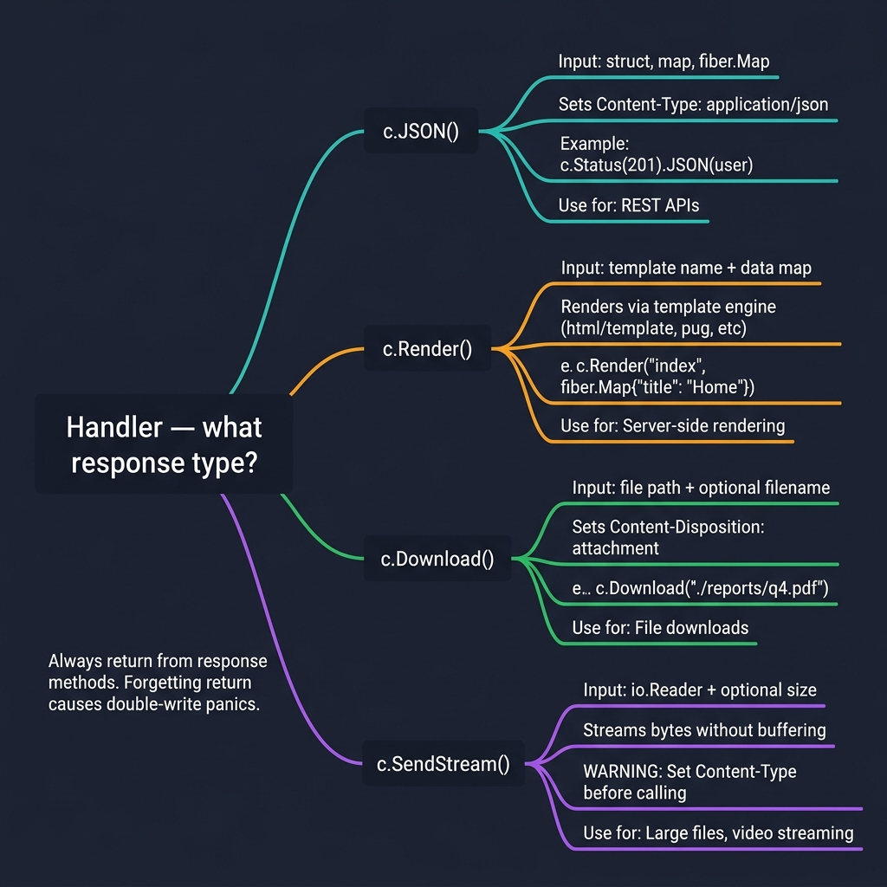
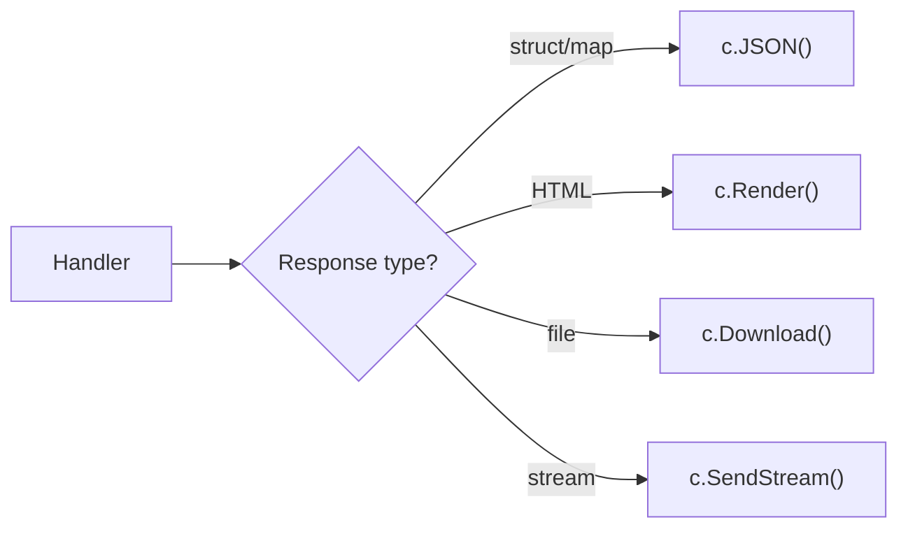

<!-- tags: golang -->
# 📤 JSON, HTML & Streaming — NestJS Response → Fiber

> **Library**: `c.JSON()` for API responses, `c.Render()` for templates, `c.SendStream()` for large files.

📅 Updated: 2026-04-19 · ⏱️ 10 min read

## 1. DEFINE

Fiber provides three response patterns: `c.JSON()` for structured API data, `c.Render()` for HTML templates (via pluggable engines), and `c.SendStream()`/`c.Download()` for file delivery. Status codes set via `c.Status(code)` chaining.

| NestJS                      | Fiber                           |
| --------------------------- | ------------------------------- |
| `return object`             | `return c.JSON(data)`           |
| `res.render()`              | `return c.Render("view", data)` |
| `res.download()`            | `return c.Download(path)`       |
| `StreamableFile`            | `return c.SendStream(reader)`   |

### Key Invariants

- **Always return from `c.JSON()`.** Forgetting `return` causes double-write panics.
- **Set Content-Type before `c.SendStream()`.** Otherwise browser displays binary as text.

## 2. VISUAL

The response method tree shows four paths from handler to client: JSON for APIs, Render for SSR, Download for files, SendStream for large data.



*Figure: Handler decision tree — c.JSON() (struct/map → application/json, for REST APIs), c.Render() (template + data → HTML, for SSR), c.Download() (file path → Content-Disposition: attachment), c.SendStream() (io.Reader → chunked bytes, warning: set Content-Type first). Rule: always return from response methods to prevent double-write panics.*

### Mermaid Fallback



## 3. CODE

### Example 1: Basic — JSON Reponses

```go
    // ━━━━━━━━━━━━━━━━━━━━━━━━━━━━━━━━━━━━━━━━━
    // JSON: return structs, maps, or fiber.Map.
    // Status codes via c.Status() chaining.
    // ━━━━━━━━━━━━━━━━━━━━━━━━━━━━━━━━━━━━━━━━━
    app.Get("/user", func(c fiber.Ctx) error {
        return c.JSON(fiber.Map{
            "id":   1,
            "name": "Alice",
        })
    })

    app.Get("/error", func(c fiber.Ctx) error {
        return c.Status(fiber.StatusNotFound).JSON(fiber.Map{
            "error": "not found",
        })
    })

    type User struct {
        ID   uint   `json:"id"`
        Name string `json:"name"`
    }

    app.Get("/user/:id", func(c fiber.Ctx) error {
        user := User{ID: 1, Name: "Alice"}
        return c.JSON(user)
    })
```

### Example 2: Intermediate — Template Rendering

```go
    import "github.com/gofiber/template/html/v2"

    // ━━━━━━━━━━━━━━━━━━━━━━━━━━━━━━━━━━━━━━━━━
    // HTML templates: use gofiber/template engine.
    // Pass data as fiber.Map to the template.
    // ━━━━━━━━━━━━━━━━━━━━━━━━━━━━━━━━━━━━━━━━━
    engine := html.New("./views", ".html")
    app := fiber.New(fiber.Config{Views: engine})

    app.Get("/", func(c fiber.Ctx) error {
        return c.Render("index", fiber.Map{
            "Title": "My App",
            "Users": users,
        })
    })
```

### Example 3: Advanced — Download and Stream

```go
    // ━━━━━━━━━━━━━━━━━━━━━━━━━━━━━━━━━━━━━━━━━
    // File streaming: c.SendStream() for large files,
    // c.Download() sets Content-Disposition automatically.
    // ━━━━━━━━━━━━━━━━━━━━━━━━━━━━━━━━━━━━━━━━━
    app.Get("/stream", func(c fiber.Ctx) error {
        file, _ := os.Open("large-file.csv")
        defer file.Close()
        c.Set("Content-Type", "text/csv")
        return c.SendStream(file)
    })

    app.Get("/download/:name", func(c fiber.Ctx) error {
        return c.Download("./files/" + c.Params("name"))
    })

    app.Get("/binary", func(c fiber.Ctx) error {
        data := []byte{0x89, 0x50, 0x4E, 0x47}
        c.Set("Content-Type", "application/octet-stream")
        return c.Send(data)
    })
```

---

## 4. PITFALLS

| # | Severity | Defect | Impact | Fix |
| --- | --- | --- | --- | --- |
| 1 | 🔴 Fatal | Not returning from `c.JSON()` call | Double-write: response partially sent, handler continues writing | Every `c.JSON()` must be preceded by `return` |
| 2 | 🟡 Common | Forgetting `defer file.Close()` in streaming | File descriptor leak under load | Always `defer file.Close()` after `os.Open()` |

---

## 5. REF

| Resource | Link |
| --- | --- |
| Fiber Context | [docs.gofiber.io/next/api/ctx](https://docs.gofiber.io/next/api/ctx) |

---

## 6. RECOMMEND

| Extension | When | Rationale | Resource |
| --- | --- | --- | --- |
| SSE & WebSocket | When you need server push or bidirectional real-time | SSE for notifications, WebSocket for chat | [./02-sse-websocket.md](./02-sse-websocket.md) |
