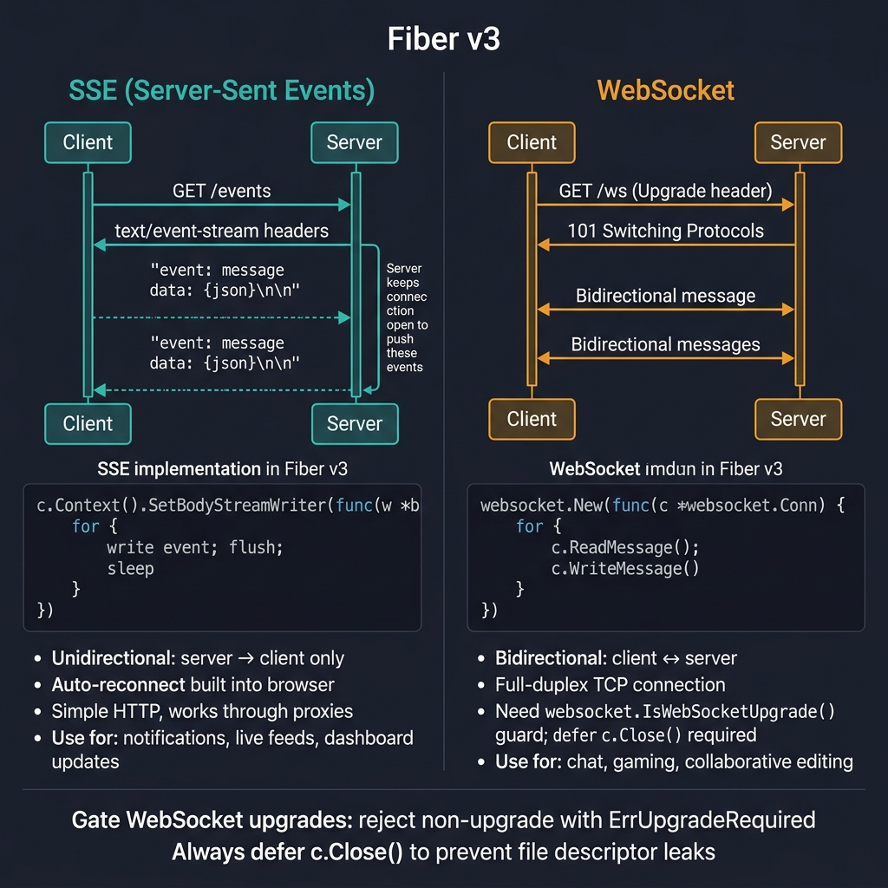
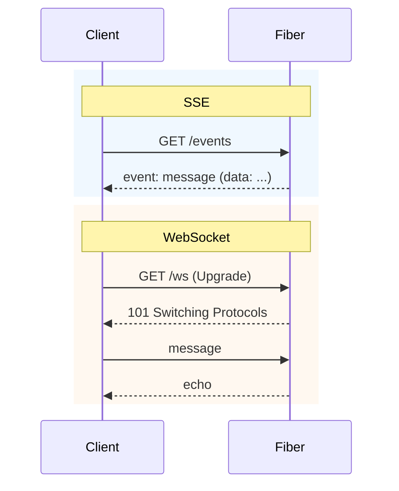

<!-- tags: golang -->
# 📡 SSE & WebSocket — NestJS @Sse/@WebSocket → Fiber

> **Library**: SSE via `SetBodyStreamWriter`, WebSocket via `gofiber/contrib/websocket`, room-based Hub pattern.

📅 Updated: 2026-04-19 · ⏱️ 10 min read

## 1. DEFINE

SSE in Fiber uses `c.Context().SetBodyStreamWriter()` with `text/event-stream` headers. WebSocket uses `gofiber/contrib/websocket` (wrapping gorilla/websocket). Always check `websocket.IsWebSocketUpgrade()` before upgrading.

| NestJS                       | Fiber                                 |
| ---------------------------- | ------------------------------------- |
| `@Sse('/events')`            | `c.Context().SetBodyStreamWriter()`   |
| `@WebSocketGateway()`        | `gofiber/contrib/websocket`           |
| `@SubscribeMessage()`        | Read loop in WebSocket handler        |

### Key Invariants

- **Gate WebSocket upgrades.** Reject non-upgrade requests with `fiber.ErrUpgradeRequired`.
- **Always `defer c.Close()` in WebSocket handlers.** Unclosed connections leak file descriptors.

## 2. VISUAL

The comparison shows SSE (unidirectional server push) versus WebSocket (bidirectional full-duplex) with implementation details.



*Figure: SSE — server pushes events over HTTP (text/event-stream), unidirectional, auto-reconnect, works through proxies. Use for: notifications, live feeds. WebSocket — bidirectional after 101 Upgrade, full-duplex TCP. Gate with websocket.IsWebSocketUpgrade(), always defer c.Close(). Use for: chat, gaming, collaborative editing.*

### Mermaid Fallback



## 3. CODE

### Example 1: Basic — Server Sent Events

```go
package main

import (
    "bufio"
    "fmt"
    "time"

    "github.com/gofiber/fiber/v3"
)

func main() {
    app := fiber.New()

    // ━━━━━━━━━━━━━━━━━━━━━━━━━━━━━━━━━━━━━━━━━
    // SSE: set event-stream headers, use SetBodyStreamWriter
    // with a bufio.Writer loop, flush after each event.
    // ━━━━━━━━━━━━━━━━━━━━━━━━━━━━━━━━━━━━━━━━━
    app.Get("/events", func(c fiber.Ctx) error {
        c.Set("Content-Type", "text/event-stream")
        c.Set("Cache-Control", "no-cache")
        c.Set("Connection", "keep-alive")

        c.Context().SetBodyStreamWriter(func(w *bufio.Writer) {
            for i := range 10 { 
                fmt.Fprintf(w, "id: %d\n", i)
                fmt.Fprintf(w, "event: message\n")
                fmt.Fprintf(w, "data: {\"count\": %d, \"time\": \"%s\"}\n\n",
                    i, time.Now().Format(time.RFC3339))
                w.Flush()
                time.Sleep(1 * time.Second)
            }
        })

        return nil
    })

    app.Listen(":3000")
}
```

### Example 2: Intermediate — WebSocket Echo

```go
package main

import (
    "log"

    "github.com/gofiber/fiber/v3"
    "github.com/gofiber/contrib/websocket"
)

func main() {
    app := fiber.New()

    // ━━━━━━━━━━━━━━━━━━━━━━━━━━━━━━━━━━━━━━━━━
    // WebSocket: check IsWebSocketUpgrade() first,
    // then websocket.New() with read/write loop.
    // ━━━━━━━━━━━━━━━━━━━━━━━━━━━━━━━━━━━━━━━━━
    app.Use("/ws", func(c fiber.Ctx) error {
        if websocket.IsWebSocketUpgrade(c) {
            return c.Next()
        }
        return fiber.ErrUpgradeRequired
    })

    app.Get("/ws", websocket.New(func(c *websocket.Conn) {
        defer c.Close()

        for {
            mt, msg, err := c.ReadMessage()
            if err != nil {
                log.Println("read error:", err)
                break
            }
            log.Printf("received: %s", msg)

            if err := c.WriteMessage(mt, msg); err != nil {
                log.Println("write error:", err)
                break
            }
        }
    }))

    log.Fatal(app.Listen(":3000"))
}
```

### Example 3: Advanced — Scoped Dispatching

```go
    // ━━━━━━━━━━━━━━━━━━━━━━━━━━━━━━━━━━━━━━━━━
    // Room-based Hub: manage connections per room with
    // sync.RWMutex. Join/Leave/Emit operations.
    // ━━━━━━━━━━━━━━━━━━━━━━━━━━━━━━━━━━━━━━━━━
    type RoomHub struct {
        mu    sync.RWMutex
        rooms map[string]map[*websocket.Conn]bool
    }

    func NewRoomHub() *RoomHub {
        return &RoomHub{rooms: make(map[string]map[*websocket.Conn]bool)}
    }

    func (h *RoomHub) Join(room string, conn *websocket.Conn) {
        h.mu.Lock()
        defer h.mu.Unlock()
        if h.rooms[room] == nil {
            h.rooms[room] = make(map[*websocket.Conn]bool)
        }
        h.rooms[room][conn] = true
    }

    func (h *RoomHub) Leave(room string, conn *websocket.Conn) {
        h.mu.Lock()
        defer h.mu.Unlock()
        if clients, ok := h.rooms[room]; ok {
            delete(clients, conn)
            if len(clients) == 0 {
                delete(h.rooms, room)
            }
        }
    }

    func (h *RoomHub) Emit(room string, payload []byte) {
        h.mu.RLock()
        defer h.mu.RUnlock()
        for conn := range h.rooms[room] {
            _ = conn.WriteMessage(websocket.TextMessage, payload)
        }
    }
```

---

## 4. PITFALLS

| # | Severity | Defect | Impact | Fix |
| --- | --- | --- | --- | --- |
| 1 | 🔴 Fatal | Not checking `IsWebSocketUpgrade()` before handler | Regular HTTP requests enter WebSocket handler and panic | Guard with `if !websocket.IsWebSocketUpgrade(c) { return fiber.ErrUpgradeRequired }` |
| 2 | 🔴 Fatal | Missing `defer c.Close()` in WebSocket handler | File descriptor leak; OS hits open file limit under load | Always `defer c.Close()` as first line in handler |

---

## 5. REF

| Resource | Link |
| --- | --- |
| SSE | [developer.mozilla.org](https://developer.mozilla.org/en-US/docs/Web/API/Server-sent_events) |
| Streaming | [docs.gofiber.io/next/api/ctx](https://docs.gofiber.io/next/api/ctx) |

---

## 6. RECOMMEND

| Extension | When | Rationale | Resource |
| --- | --- | --- | --- |
| JSON & Streaming | When you need standard HTTP responses | `c.JSON()`, `c.SendStream()`, `c.Download()` | [./01-json-html-streaming.md](./01-json-html-streaming.md) |
