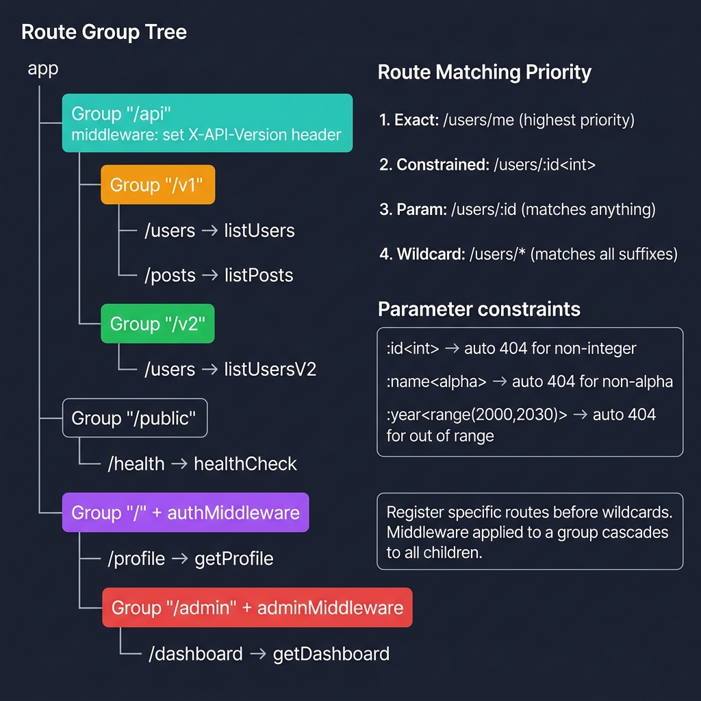
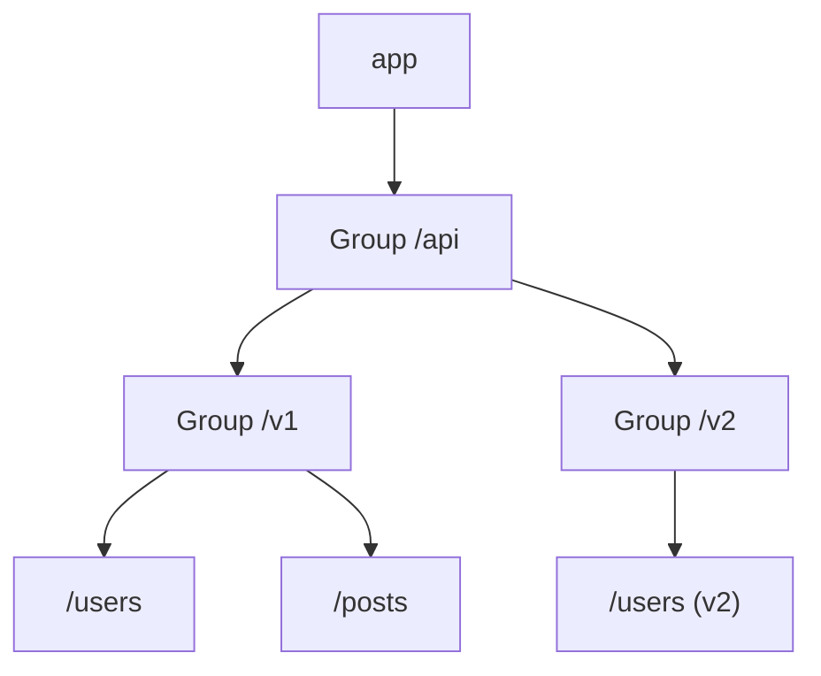

<!-- tags: golang -->
# 🔌 Routing & Groups — NestJS Routes → Fiber Groups & Params

> **Library**: Route groups with `app.Group()`, path params with `:id`, constraints with `<int>`, and wildcards.

📅 Updated: 2026-04-19 · ⏱️ 12 min read

## 1. DEFINE

Fiber routing uses `app.Get("/path", handler)` syntax with groups for prefix scoping. Unlike NestJS controller decorators, Fiber groups are explicit tree structures. Parameter constraints (`:id<int>`) reject invalid values at the router level, before your handler runs.

| NestJS                        | Fiber                                     |
| ----------------------------- | ----------------------------------------- |
| `@Get('users/:id')`           | `app.Get("/users/:id", handler)`          |
| `@Param('id')`                | `c.Params("id")`                          |
| `@Query('page')`              | `c.Query("page", "1")`                    |
| Controller modules            | `app.Group("/api")`                       |
| Route wildcards               | `:name`, `*`, `+`                         |
| Param constraints             | `:id<int>`, `:name<alpha>`                |

### Key Invariants

- **Register specific routes before wildcards.** `/users/:id` must come before `/users/*`; Fiber matches first-registered.
- **Use constraints to reject bad params early.** `:id<int>` returns 404 for `/users/abc` without hitting your handler.

## 2. VISUAL

The route group tree shows how `app.Group()` creates a prefix tree. Middleware applied to a group cascades to all child routes.



*Figure: Route Group Tree — /api (sets X-API-Version) → /v1 (users, posts) and /v2 (users). Auth group protects /profile; admin group adds adminMiddleware for /dashboard. Matching priority: exact → constrained (:id\<int\>) → param (:id) → wildcard (*). Constraints auto-reject invalid params with 404.*

### Mermaid Fallback



*Figure: Nested route groups — `app.Group()` creates a prefix tree.*

### Route Matching Order

```text
1. Exact:       /users/me        (registered first)
2. Constrained: /users/:id<int>  (only matches integers)
3. Param:       /users/:id       (matches anything)
4. Wildcard:    /users/*         (matches all suffixes)
```

## 3. CODE

### Example 1: Basic — Parameters & Wildcards

```go
package main

import (
    "log"
    "github.com/gofiber/fiber/v3"
)

func main() {
    app := fiber.New()

    // ━━━━━━━━━━━━━━━━━━━━━━━━━━━━━━━━━━━━━━━━━
    // Path params: :id (required), :query? (optional),
    // * (zero-or-more wildcard), + (one-or-more wildcard).
    // ━━━━━━━━━━━━━━━━━━━━━━━━━━━━━━━━━━━━━━━━━
    app.Get("/users", func(c fiber.Ctx) error {
        page := c.Query("page", "1")
        limit := c.Query("limit", "20")
        return c.JSON(fiber.Map{"page": page, "limit": limit})
    })

    app.Get("/users/:id", func(c fiber.Ctx) error {
        return c.JSON(fiber.Map{"id": c.Params("id")})
    })

    app.Get("/search/:query?", func(c fiber.Ctx) error {
        query := c.Params("query", "all")
        return c.JSON(fiber.Map{"query": query})
    })

    app.Get("/files/*", func(c fiber.Ctx) error {
        return c.JSON(fiber.Map{"path": c.Params("*")})
    })

    app.Get("/docs/+", func(c fiber.Ctx) error {
        return c.JSON(fiber.Map{"path": c.Params("+")})
    })

    log.Fatal(app.Listen(":3000"))
}
```

### Example 2: Intermediate — Groups & Constraints

```go
package main

import (
    "log"
    "github.com/gofiber/fiber/v3"
)

func main() {
    app := fiber.New()

    // ━━━━━━━━━━━━━━━━━━━━━━━━━━━━━━━━━━━━━━━━━
    // Nested groups: each Group() adds a prefix.
    // Constraints like <int>, <alpha>, <range(min,max)> validate at router level.
    // ━━━━━━━━━━━━━━━━━━━━━━━━━━━━━━━━━━━━━━━━━
    api := app.Group("/api")
    v1 := api.Group("/v1")

    users := v1.Group("/users")
    users.Get("/", listUsers)
    users.Get("/:id", getUser)

    posts := v1.Group("/posts")
    posts.Get("/", listPosts)

    // Constraints check parameter syntax early 
    app.Get("/users/:id<int>", func(c fiber.Ctx) error {
        return c.JSON(fiber.Map{"id": c.Params("id")})
    })

    app.Get("/page/:num<int;min(1)>", func(c fiber.Ctx) error {
        return c.JSON(fiber.Map{"page": c.Params("num")})
    })

    app.Get("/category/:name<alpha>", func(c fiber.Ctx) error {
        return c.JSON(fiber.Map{"category": c.Params("name")})
    })

    app.Get("/year/:year<range(2000,2030)>", func(c fiber.Ctx) error {
        return c.JSON(fiber.Map{"year": c.Params("year")})
    })

    log.Fatal(app.Listen(":3000"))
}
```

### Example 3: Advanced — Nested Groups

```go
package main

import (
    "log"
    "github.com/gofiber/fiber/v3"
)

func main() {
    // ━━━━━━━━━━━━━━━━━━━━━━━━━━━━━━━━━━━━━━━━━
    // Group middleware: inline function runs before all routes in the group.
    // Nesting groups creates layered middleware chains.
    // ━━━━━━━━━━━━━━━━━━━━━━━━━━━━━━━━━━━━━━━━━
    app := fiber.New()

    api := app.Group("/api", func(c fiber.Ctx) error {
        c.Set("X-API-Version", "1.0")
        return c.Next()
    })

    pub := api.Group("/public")
    pub.Get("/health", healthCheck)

    auth := api.Group("/", authMiddleware)
    auth.Get("/profile", getProfile)

    admin := auth.Group("/admin", adminMiddleware)
    admin.Get("/dashboard", getDashboard)

    app.Use(func(c fiber.Ctx) error {
        return c.Status(fiber.StatusNotFound).JSON(fiber.Map{
            "error": "route not found",
            "path":  c.Path(),
        })
    })

    log.Fatal(app.Listen(":3000"))
}
```

---

## 4. PITFALLS

| # | Severity | Defect | Impact | Fix |
| --- | --- | --- | --- | --- |
| 1 | 🔴 Fatal | Registering wildcard `*` route before specific routes | Wildcard catches all requests; specific routes never match | Register specific routes first, wildcards last |
| 2 | 🟡 Common | Not using param constraints | Handler receives string "abc" for `:id`, must parse manually | Use `:id<int>` to get automatic 404 for non-integer IDs |

---

## 5. REF

| Resource | Link |
| --- | --- |
| Fiber Routing Map | [docs.gofiber.io/guide/routing](https://docs.gofiber.io/guide/routing/) |

---

## 6. RECOMMEND

| Extension | When | Rationale | Resource |
| --- | --- | --- | --- |
| Versioning | When you need multiple API versions side by side | URI groups (`/v1`, `/v2`) or header-based version middleware | [./02-versioning-redirect.md](./02-versioning-redirect.md) |
