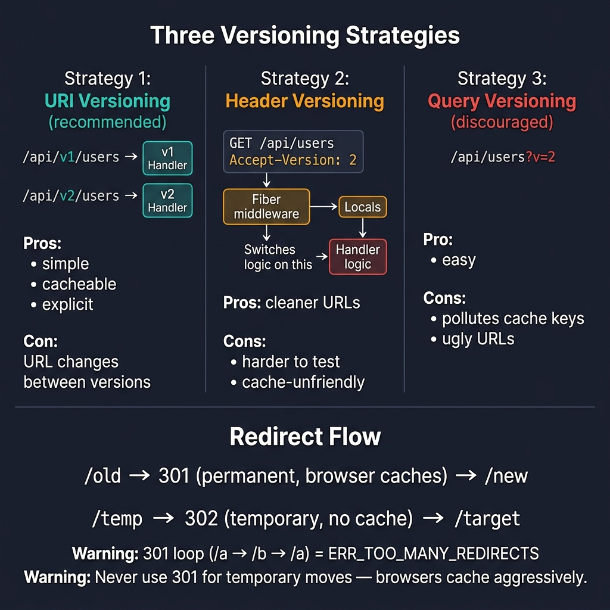
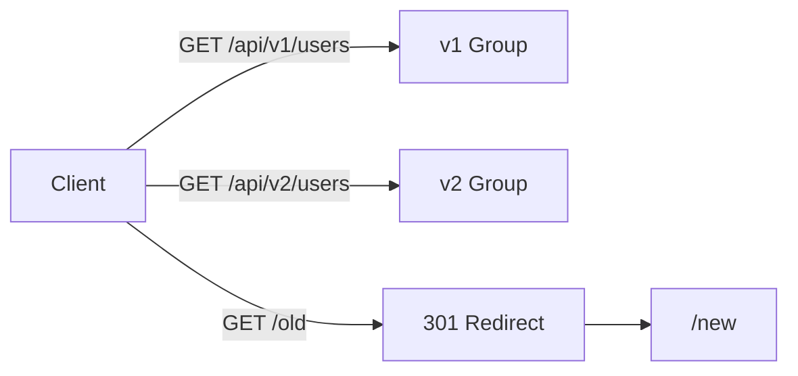

<!-- tags: golang -->
# 🔀 Versioning & Redirects — NestJS Versioning → Fiber

> **Library**: API versioning via URI groups or `Accept-Version` header; redirects with `c.Redirect()`.

📅 Updated: 2026-04-19 · ⏱️ 8 min read

## 1. DEFINE

Fiber has no built-in versioning decorator like NestJS. Instead, use `app.Group("/v1")` for URI versioning or custom middleware reading `Accept-Version` header. Redirects use `c.Redirect().To("/new")` (302) or `.Status(301).To("/new")` for permanent.

| NestJS                      | Fiber                                  |
| --------------------------- | -------------------------------------- |
| `enableVersioning()`        | `app.Group("/v1")`, `app.Group("/v2")` |
| `@Version('1')`             | Handler registered on version group    |
| `res.redirect('/new')`      | `c.Redirect().To("/new")`              |
| `HttpException(404)`        | `return fiber.ErrNotFound`             |

### Key Invariants

- **Never create redirect loops.** `/a` → `/b` → `/a` causes infinite browser redirects.
- **Use 301 only when permanent.** Browsers cache 301s aggressively; use 302 for temporary moves.

## 2. VISUAL

This comparison shows three versioning strategies and redirect patterns. URI versioning is recommended for most Fiber APIs.



*Figure: Three versioning strategies compared — URI (/api/v1/) is simple and cacheable (recommended), Header (Accept-Version) gives cleaner URLs but is harder to test, Query (?v=2) pollutes cache keys (discouraged). Redirect flow: 301 = permanent (browser caches forever), 302 = temporary. Warning: 301 loops cause ERR_TOO_MANY_REDIRECTS.*

### Mermaid Fallback



*Figure: URI versioning uses separate groups; legacy paths redirect to new locations.*

### Strategy Comparison

```text
URI versioning:    /api/v1/users  → simple, cacheable, explicit
Header versioning: Accept-Version: 2 → cleaner URLs, harder to test
Query versioning:  /api/users?v=2 → discouraged, pollutes cache keys
```

## 3. CODE

### Example 1: Basic — URI Versioning

```go
    // ━━━━━━━━━━━━━━━━━━━━━━━━━━━━━━━━━━━━━━━━━
    // URI versioning: separate groups per version.
    // Each group gets its own set of handlers.
    // ━━━━━━━━━━━━━━━━━━━━━━━━━━━━━━━━━━━━━━━━━
    app := fiber.New()

    v1 := app.Group("/api/v1")
    v1.Get("/users", listUsersV1)

    v2 := app.Group("/api/v2")
    v2.Get("/users", listUsersV2) 
```

### Example 2: Intermediate — Header Versioning

```go
    // ━━━━━━━━━━━━━━━━━━━━━━━━━━━━━━━━━━━━━━━━━
    // Header versioning: middleware reads Accept-Version,
    // stores in Locals, handler switches on version.
    // ━━━━━━━━━━━━━━━━━━━━━━━━━━━━━━━━━━━━━━━━━
    func VersionMiddleware(c fiber.Ctx) error {
        version := c.Get("Accept-Version", "1")
        c.Locals("api_version", version)
        return c.Next()
    }

    app.Use(VersionMiddleware)

    app.Get("/api/users", func(c fiber.Ctx) error {
        version := c.Locals("api_version").(string)
        switch version {
        case "2":
            return c.JSON(fiber.Map{"version": "v2", "data": users, "meta": meta})
        default:
            return c.JSON(fiber.Map{"version": "v1", "data": users})
        }
    })
```

### Example 3: Advanced — Redirects

```go
    // ━━━━━━━━━━━━━━━━━━━━━━━━━━━━━━━━━━━━━━━━━
    // Redirects: 301 (permanent) and 302 (temporary).
    // Catch-all 404 handler at the end.
    // ━━━━━━━━━━━━━━━━━━━━━━━━━━━━━━━━━━━━━━━━━
    app.Get("/old", func(c fiber.Ctx) error {
        return c.Redirect().Status(fiber.StatusMovedPermanently).To("/new")
    })

    app.Get("/temp", func(c fiber.Ctx) error {
        return c.Redirect().To("/target") 
    })

    // Catch-all 404 handler: must be registered last
    app.Use(func(c fiber.Ctx) error {
        return c.Status(fiber.StatusNotFound).JSON(fiber.Map{
            "error":  "route not found",
            "path":   c.Path(),
            "method": c.Method(),
        })
    })
```

---

## 4. PITFALLS

| # | Severity | Defect | Impact | Fix |
| --- | --- | --- | --- | --- |
| 1 | 🔴 Fatal | Redirect loop: `/a` redirects to `/b`, `/b` redirects to `/a` | Browser shows ERR_TOO_MANY_REDIRECTS | Verify all redirect targets are final destinations |
| 2 | 🟡 Common | Using 301 for temporary moves | Browser caches 301 forever; users can’t reach old URL even after reverting | Use 302 for temporary, 301 only for permanent moves |

---

## 5. REF

| Resource | Link |
| --- | --- |
| API Rest Guidelines | [restfulapi.net/versioning](https://restfulapi.net/versioning/) |

---

## 6. RECOMMEND

| Extension | When | Rationale | Resource |
| --- | --- | --- | --- |
| Middleware | When you need to intercept requests for versioning/auth | Before/after `c.Next()` pattern for cross-cutting concerns | [../middleware/01-builtin-custom.md](../middleware/01-builtin-custom.md) |
