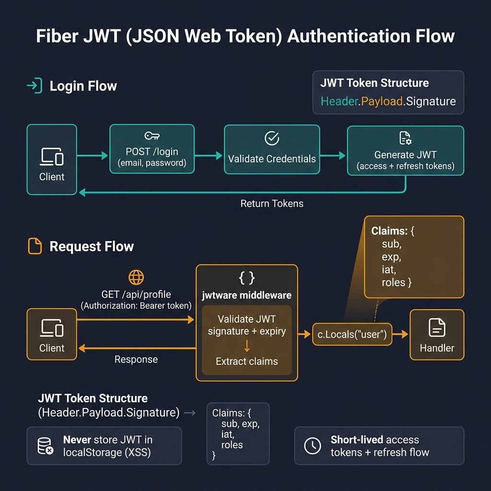
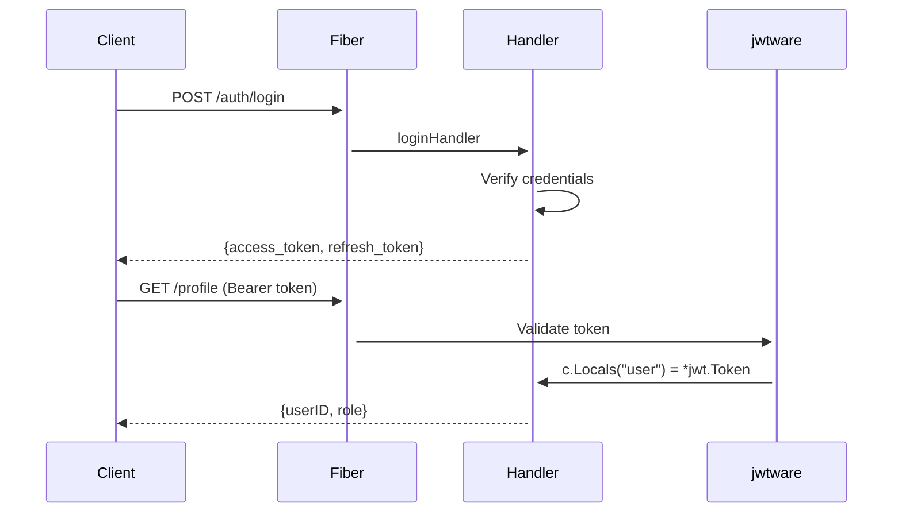

<!-- tags: golang -->
# 🔐 Authentication & JWT — NestJS Passport → Fiber JWT

> **Library**: `gofiber/contrib/jwt` middleware + `golang-jwt/jwt/v5` for token generation.

📅 Updated: 2026-04-19 · ⏱️ 14 min read

## 1. DEFINE

Fiber uses `jwtware.New()` from `gofiber/contrib/jwt` for JWT middleware. It validates the `Authorization: Bearer <token>` header and stores the parsed token in `c.Locals("user")`. Token generation uses `golang-jwt/jwt/v5` directly.

| NestJS                           | Fiber                                 |
| -------------------------------- | ------------------------------------- |
| `@nestjs/passport`               | `jwtware.New()`                       |
| `JwtService.sign(payload)`       | `jwt.NewWithClaims().SignedString()`  |
| `@UseGuards()`                   | `app.Use(jwtware.New(...))`           |
| `req.user`                       | `c.Locals("user")`                    |

### Key Invariants

- **Public routes BEFORE jwt middleware.** Routes registered after `jwtware.New()` require auth; put `/auth/login` before it.
- **Never hardcode secrets.** Load `JWT_SECRET` from environment config.

## 2. VISUAL

The JWT flow covers both login (token generation) and authenticated request processing.



*Figure: Login flow — POST /login → validate credentials → generate JWT (access + refresh). Request flow — Authorization: Bearer token → jwtware middleware → validate signature + expiry → extract claims → c.Locals("user") → Handler. Never store JWT in localStorage (XSS).*

### Mermaid Fallback




## 3. CODE

### Example 1: Basic — JWT Factory

```go
package auth

import (
    "time"
    "github.com/golang-jwt/jwt/v5"
)

type TokenPair struct {
    AccessToken  string `json:"access_token"`
    RefreshToken string `json:"refresh_token"`
    ExpiresIn    int64  `json:"expires_in"`
}

// ━━━━━━━━━━━━━━━━━━━━━━━━━━━━━━━━━━━━━━━━━
// JWT token factory: access (15min) + refresh (7d).
// Use HS256 signing with env-loaded secret.
// ━━━━━━━━━━━━━━━━━━━━━━━━━━━━━━━━━━━━━━━━━
func GenerateTokenPair(secret, userID, role string) (*TokenPair, error) {
    now := time.Now()

    accessClaims := jwt.MapClaims{
        "sub":  userID,
        "role": role,
        "exp":  now.Add(15 * time.Minute).Unix(),
        "iat":  now.Unix(),
    }
    accessToken, err := jwt.NewWithClaims(jwt.SigningMethodHS256, accessClaims).
        SignedString([]byte(secret))
    if err != nil {
        return nil, err
    }

    refreshClaims := jwt.MapClaims{
        "sub": userID,
        "exp": now.Add(7 * 24 * time.Hour).Unix(),
    }
    refreshToken, err := jwt.NewWithClaims(jwt.SigningMethodHS256, refreshClaims).
        SignedString([]byte(secret))
    if err != nil {
        return nil, err
    }

    return &TokenPair{
        AccessToken:  accessToken,
        RefreshToken: refreshToken,
        ExpiresIn:    900, 
    }, nil
}
```

### Example 2: Intermediate — Middleware Integrations

```go
package main

import (
    "log"

    "github.com/gofiber/fiber/v3"
    jwtware "github.com/gofiber/contrib/jwt"
    "github.com/golang-jwt/jwt/v5"
)

func main() {
    app := fiber.New()

    // ━━━━━━━━━━━━━━━━━━━━━━━━━━━━━━━━━━━━━━━━━
    // Public routes BEFORE jwtware. Routes after
    // jwtware.New() require valid Bearer token.
    // ━━━━━━━━━━━━━━━━━━━━━━━━━━━━━━━━━━━━━━━━━
    app.Post("/auth/login", loginHandler)

    app.Use(jwtware.New(jwtware.Config{
        SigningKey: jwtware.SigningKey{Key: []byte("secret")},
        ErrorHandler: func(c fiber.Ctx, err error) error {
            return c.Status(fiber.StatusUnauthorized).JSON(fiber.Map{
                "error": "invalid or expired token",
            })
        },
    }))

    app.Get("/profile", func(c fiber.Ctx) error {
        user := c.Locals("user").(*jwt.Token)
        claims := user.Claims.(jwt.MapClaims)

        return c.JSON(fiber.Map{
            "userID": claims["sub"],
            "role":   claims["role"],
        })
    })

    log.Fatal(app.Listen(":3000"))
}
```

### Example 3: Advanced — Authentication Handlers

```go
    // ━━━━━━━━━━━━━━━━━━━━━━━━━━━━━━━━━━━━━━━━━
    // Login handler: validate credentials, generate
    // token pair, return to client.
    // ━━━━━━━━━━━━━━━━━━━━━━━━━━━━━━━━━━━━━━━━━
    func loginHandler(c fiber.Ctx) error {
        var dto struct {
            Email    string `json:"email" validate:"required,email"`
            Password string `json:"password" validate:"required,min=8"`
        }
        if err := c.Bind().JSON(&dto); err != nil {
            return fiber.NewError(fiber.StatusBadRequest, err.Error())
        }

        user, err := userService.VerifyCredentials(c.Context(), dto.Email, dto.Password)
        if err != nil {
            return fiber.NewError(fiber.StatusUnauthorized, "invalid credentials")
        }

        tokens, err := auth.GenerateTokenPair(jwtSecret, user.ID, user.Role)
        if err != nil {
            return fiber.NewError(fiber.StatusInternalServerError, "token generation failed")
        }

        return c.JSON(tokens)
    }
```

---

## 4. PITFALLS

| # | Severity | Defect | Impact | Fix |
| --- | --- | --- | --- | --- |
| 1 | 🔴 Fatal | Hardcoding JWT secret in source code | Secret exposed in version control; attacker forges tokens | Load from `cfg.JWT.Secret` via envconfig |
| 2 | 🔴 Fatal | Registering protected routes BEFORE `jwtware.New()` | Endpoints accessible without authentication | Register public routes first, then `app.Use(jwtware.New(...))` |

---

## 5. REF

| Resource | Link | 
| --- | --- | 
| Fiber JWT Middleware | [docs.gofiber.io/contrib/next/jwt](https://docs.gofiber.io/contrib/next/jwt/) | 
| golang-jwt | [pkg.go.dev/github.com/golang-jwt/jwt/v5](https://pkg.go.dev/github.com/golang-jwt/jwt/v5) | 

---

## 6. RECOMMEND

| Extension | When | Rationale | Resource |
| --- | --- | --- | --- |
| Authorization | When you need role-based access control | `RequireRoles()` middleware after JWT | [./02-authorization-rbac.md](./02-authorization-rbac.md) |
