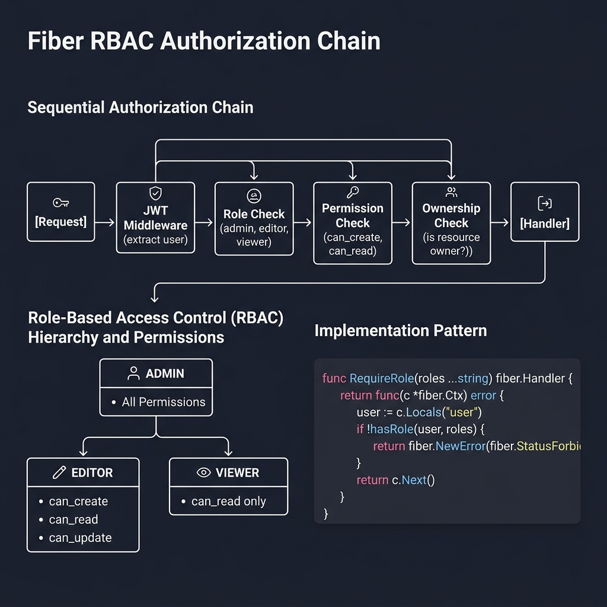
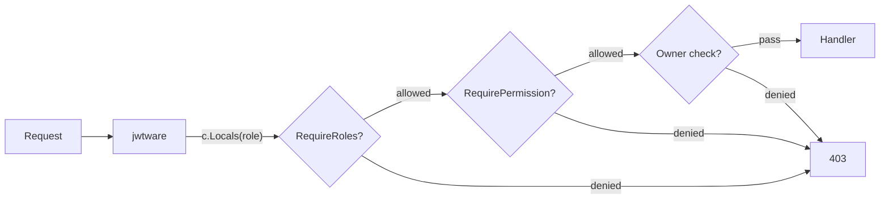

<!-- tags: golang -->
# 👤 Authorization & RBAC — NestJS Guards → Fiber Role Middleware

> **Library**: Role middleware + permission maps for RBAC; ownership guard for resource-level access.

📅 Updated: 2026-04-19 · ⏱️ 10 min read

## 1. DEFINE

After JWT authenticates the user, RBAC middleware checks if their role has permission. Three patterns: `RequireRoles()` for basic role checks, `RequirePermission()` for granular actions, and `RequireOwnerOrAdmin()` for object-level access.

| NestJS                       | Fiber                              |
| ---------------------------- | ---------------------------------- |
| `@Roles()`                   | `RequireRoles()`                   |
| `RolesGuard`                 | Return explicit error exclusions   |
| `@CheckPolicies(policy)`     | Permission filters                 |

### Key Invariants

- **RBAC runs AFTER JWT middleware.** Role is extracted from `c.Locals("role")` set by jwtware.
- **Type-assert Locals values.** `c.Locals()` returns `any`; unchecked assertion panics on missing values.

## 2. VISUAL

The RBAC authorization chain applies layered access control from role to resource ownership.



*Figure: Request → JWT middleware → Role Check (admin/editor/viewer) → Permission Check (can_create/can_read) → Ownership Check → Handler. Role hierarchy: admin = all, editor = create/read/update, viewer = read only.*

### Mermaid Fallback




## 3. CODE

### Example 1: Basic — Role Mapping

```go
    // ━━━━━━━━━━━━━━━━━━━━━━━━━━━━━━━━━━━━━━━━━
    // Basic role check: compare c.Locals("role")
    // against allowed roles list.
    // ━━━━━━━━━━━━━━━━━━━━━━━━━━━━━━━━━━━━━━━━━
    func RequireRoles(roles ...string) fiber.Handler {
        return func(c fiber.Ctx) error {
            userRole, ok := c.Locals("role").(string)
            if !ok {
                return fiber.NewError(fiber.StatusForbidden, "no role assigned")
            }
            for _, allowed := range roles {
                if userRole == allowed {
                    return c.Next()
                }
            }
            return fiber.NewError(fiber.StatusForbidden, "insufficient permissions")
        }
    }
```

### Example 2: Intermediate — Permissions

```go
    // ━━━━━━━━━━━━━━━━━━━━━━━━━━━━━━━━━━━━━━━━━
    // Permission map: role -> action -> allowed.
    // More granular than role-only checks.
    // ━━━━━━━━━━━━━━━━━━━━━━━━━━━━━━━━━━━━━━━━━
    var rolePermissions = map[string]map[string]bool{
        "admin":  {"users:read": true, "users:write": true, "users:delete": true},
        "editor": {"users:read": true, "posts:write": true},
        "viewer": {"users:read": true, "posts:read": true},
    }

    func RequirePermission(action string) fiber.Handler {
        return func(c fiber.Ctx) error {
            role, _ := c.Locals("role").(string)
            perms, ok := rolePermissions[role]
            if !ok || !perms[action] {
                return fiber.NewError(fiber.StatusForbidden, "permission denied: "+action)
            }
            return c.Next()
        }
    }
```

### Example 3: Advanced — Object Ownership

```go
    // ━━━━━━━━━━━━━━━━━━━━━━━━━━━━━━━━━━━━━━━━━
    // Object-level ownership: admin bypasses,
    // others must own the resource.
    // ━━━━━━━━━━━━━━━━━━━━━━━━━━━━━━━━━━━━━━━━━
    func RequireOwnerOrAdmin(getOwnerID func(c fiber.Ctx) (string, error)) fiber.Handler {
        return func(c fiber.Ctx) error {
            if c.Locals("role") == "admin" {
                return c.Next()
            }
            ownerID, err := getOwnerID(c)
            if err != nil {
                return fiber.NewError(fiber.StatusNotFound, err.Error())
            }
            if ownerID != c.Locals("userID").(string) {
                return fiber.NewError(fiber.StatusForbidden, "not your resource")
            }
            return c.Next()
        }
    }
```

---

## 4. PITFALLS

| # | Severity | Defect | Impact | Fix |
| --- | --- | --- | --- | --- |
| 1 | 🔴 Fatal | Using `c.Locals("role").(string)` without `ok` check | Panic if JWT token doesn’t contain `role` claim | Use `role, ok := c.Locals("role").(string)` with fallback |
| 2 | 🟡 Common | Checking roles only, not permissions | Admin endpoints accessible to any authenticated user | Use `RequirePermission("resource:action")` for granular control |

---

## 5. REF

| Resource | Link |
| --- | --- |
| Fiber Security | [docs.gofiber.io/category/-middleware](https://docs.gofiber.io/category/-middleware/) |
| OWASP | [cheatsheetseries.owasp.org](https://cheatsheetseries.owasp.org/) |

---

## 6. RECOMMEND

| Extension | When | Rationale | Resource |
| --- | --- | --- | --- |
| Transport Security | When you need CORS, CSRF, and security headers | Fiber built-in security middlewares | [./03-cors-csrf-helmet.md](./03-cors-csrf-helmet.md) |
