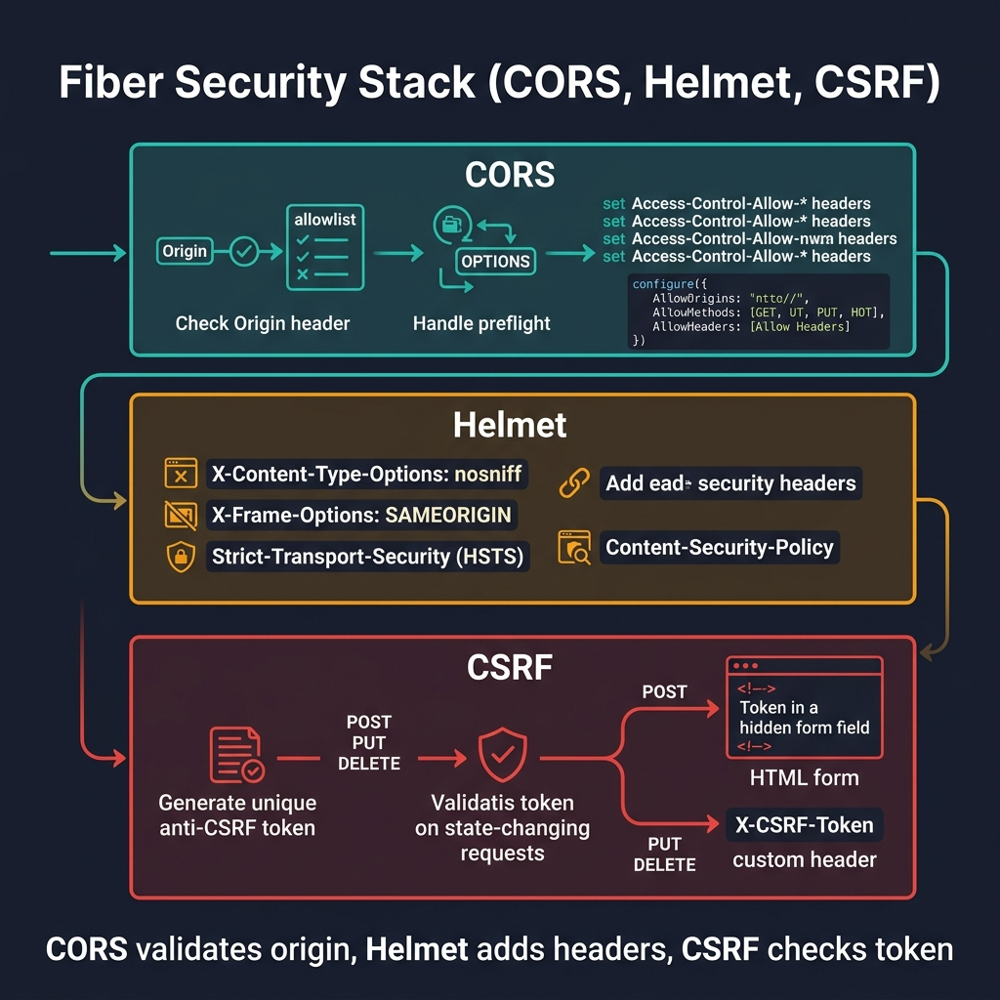
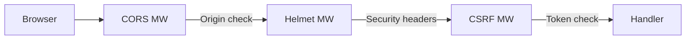

<!-- tags: golang -->
# 🛡️ CORS, CSRF & Helmet — NestJS → Fiber Built-in Middleware

> **Library**: Built-in `middleware/cors`, `middleware/helmet`, `middleware/csrf` for browser security.

📅 Updated: 2026-04-19 · ⏱️ 10 min read

## 1. DEFINE

Fiber provides three built-in security middlewares: **CORS** (controls which origins can call your API), **Helmet** (sets security response headers), and **CSRF** (prevents cross-site request forgery). All are imported from `gofiber/fiber/v3/middleware/`.

| NestJS              | Fiber Built-in      |
| ------------------- | ------------------- |
| `app.enableCors()`  | `middleware/cors`   |
| `app.use(helmet())` | `middleware/helmet` |
| `app.use(csurf())`  | `middleware/csrf`   |

### Key Invariants

- **Never use `AllowOrigins: ["*"]` with `AllowCredentials: true`.** Browsers reject this combination.
- **CSRF only for cookie-based auth.** If you use JWT Bearer tokens only, CSRF is not needed.

## 2. VISUAL

The security middleware stack chains CORS validation, Helmet headers, and CSRF token protection.



*Figure: Three-layer security stack — CORS (validates Origin, handles OPTIONS preflight), Helmet (X-Content-Type-Options, X-Frame-Options, HSTS, CSP), CSRF (generates/validates anti-CSRF token on POST/PUT/DELETE).*

### Mermaid Fallback




## 3. CODE

### Example 1: Basic — CORS

```go
    import "github.com/gofiber/fiber/v3/middleware/cors"

    // ━━━━━━━━━━━━━━━━━━━━━━━━━━━━━━━━━━━━━━━━━
    // CORS: whitelist specific origins.
    // Never use "*" with AllowCredentials.
    // ━━━━━━━━━━━━━━━━━━━━━━━━━━━━━━━━━━━━━━━━━
    app.Use(cors.New(cors.Config{
        AllowOrigins:     []string{"https://example.com", "http://localhost:3000"},
        AllowMethods:     []string{"GET", "POST", "PUT", "DELETE"},
        AllowHeaders:     []string{"Origin", "Content-Type", "Authorization"},
        AllowCredentials: true,
        MaxAge:           3600,
    }))
```

### Example 2: Intermediate — Helmet 

```go
    import "github.com/gofiber/fiber/v3/middleware/helmet"

    // ━━━━━━━━━━━━━━━━━━━━━━━━━━━━━━━━━━━━━━━━━
    // Helmet: sets X-Frame-Options, HSTS, CSP,
    // X-Content-Type-Options, Referrer-Policy.
    // ━━━━━━━━━━━━━━━━━━━━━━━━━━━━━━━━━━━━━━━━━
    app.Use(helmet.New(helmet.Config{
        XSSProtection:         "1; mode=block",
        ContentTypeNosniff:    "nosniff",
        XFrameOptions:         "DENY",
        HSTSMaxAge:            31536000,
        HSTSExcludeSubdomains: false,
        ContentSecurityPolicy: "default-src 'self'",
        ReferrerPolicy:        "strict-origin-when-cross-origin",
    }))
```

### Example 3: Advanced — CSRF 

```go
    import "github.com/gofiber/fiber/v3/middleware/csrf"

    // ━━━━━━━━━━━━━━━━━━━━━━━━━━━━━━━━━━━━━━━━━
    // CSRF: validates token in X-CSRF-Token header.
    // Only needed for cookie-based auth (not JWT).
    // ━━━━━━━━━━━━━━━━━━━━━━━━━━━━━━━━━━━━━━━━━
    app.Use(csrf.New(csrf.Config{
        KeyLookup:      "header:X-CSRF-Token",
        CookieName:     "csrf_",
        CookieSameSite: "Strict",
        CookieHTTPOnly: true,
        CookieSecure:   true,
        Expiration:     1 * time.Hour,
        ErrorHandler: func(c fiber.Ctx, err error) error {
            return c.Status(fiber.StatusForbidden).JSON(fiber.Map{
                "error": "CSRF token mismatch",
            })
        },
    }))
```

---

## 4. PITFALLS

| # | Severity | Defect | Impact | Fix |
| --- | --- | --- | --- | --- |
| 1 | 🔴 Fatal | Using `AllowOrigins: ["*"]` (wildcard) in production | Any website can make authenticated requests to your API | Whitelist specific origins: `["https://app.example.com"]` |
| 2 | 🟡 Common | Missing Helmet middleware | Responses lack `X-Frame-Options`, `HSTS`, `CSP` headers | Add `app.Use(helmet.New())` before route handlers |

---

## 5. REF

| Resource | Link |
| --- | --- |
| Fiber | [docs.gofiber.io/category/-middleware](https://docs.gofiber.io/category/-middleware/) |
| OWASP | [cheatsheetseries.owasp.org](https://cheatsheetseries.owasp.org/) |

---

## 6. RECOMMEND

| Extension | When | Rationale | Resource |
| --- | --- | --- | --- |
| Rate Limiting | When you need to throttle abusive requests | `middleware/limiter` with Redis store | [./04-rate-limiting.md](./04-rate-limiting.md) |
