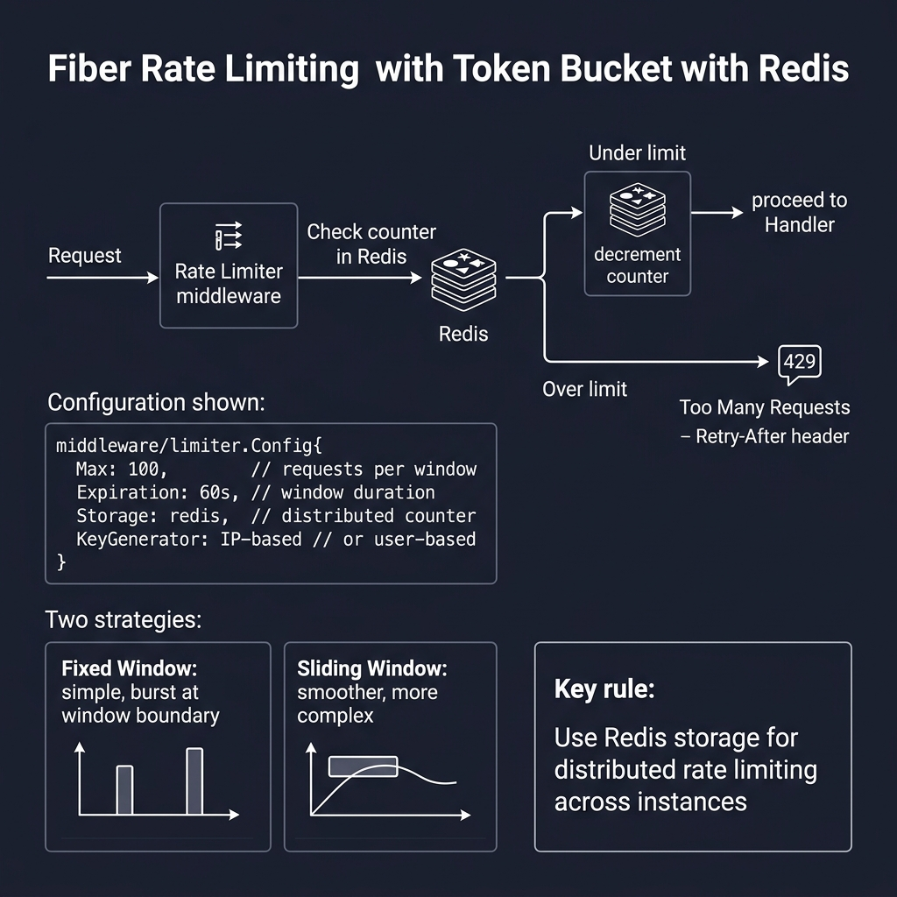
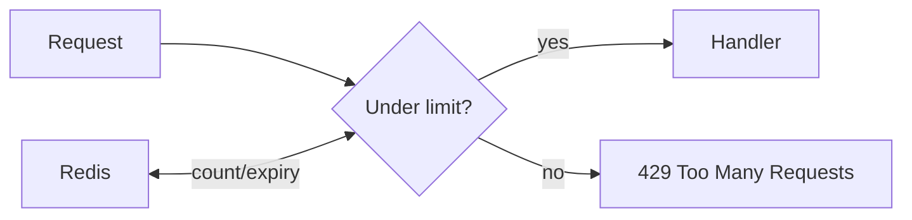

<!-- tags: golang -->
# ⏱️ Rate Limiting — NestJS Throttler → Fiber Built-in Limiter

> **Library**: `middleware/limiter` for request throttling; sliding window + Redis for distributed rate limits.

📅 Updated: 2026-04-19 · ⏱️ 8 min read

## 1. DEFINE

Fiber’s `middleware/limiter` throttles requests per client IP with configurable max count, time window, and storage backend. Use in-memory for single instances, Redis for distributed deployments. Apply globally or per-route.

| NestJS                      | Fiber                                       |
| --------------------------- | ------------------------------------------- |
| `@nestjs/throttler`         | `middleware/limiter`                        |
| `ThrottlerModule.forRoot()` | `app.Use(limiter.New(limiter.Config{...}))` |
| `@Throttle(10, 60)`         | `Max: 10, Expiration: 60 * time.Second`     |
| Redis store                 | `Storage: redisStore`                       |

### Key Invariants

- **Use `X-Forwarded-For` behind proxy.** Default key is `c.IP()` which returns proxy IP, not real client.
- **Separate limiters for sensitive endpoints.** Login/OTP need stricter limits (5/min) than general API (100/min).

## 2. VISUAL

Rate limiting uses Redis counters to throttle requests per IP or user across distributed instances.



*Figure: Request → Rate Limiter → Redis counter check → under limit = proceed → over limit = 429 + Retry-After. Config: Max (100/window), Expiration (60s), Storage (Redis), KeyGenerator (IP or user). Strategies: fixed window vs sliding window.*

### Mermaid Fallback




## 3. CODE

### Example 1: Basic — Global Limitations

```go
    import (
        "time"
        "github.com/gofiber/fiber/v3/middleware/limiter"
    )

    // ━━━━━━━━━━━━━━━━━━━━━━━━━━━━━━━━━━━━━━━━━
    // Global rate limit: 100 requests per minute.
    // LimitReached handler returns 429 JSON.
    // ━━━━━━━━━━━━━━━━━━━━━━━━━━━━━━━━━━━━━━━━━
    app.Use(limiter.New(limiter.Config{
        Max:        100,
        Expiration: 1 * time.Minute,
        LimitReached: func(c fiber.Ctx) error {
            return c.Status(fiber.StatusTooManyRequests).JSON(fiber.Map{
                "error": "rate limit exceeded",
            })
        },
    }))
```

### Example 2: Intermediate — Targeted Limits

```go
    // ━━━━━━━━━━━━━━━━━━━━━━━━━━━━━━━━━━━━━━━━━
    // Per-route limits: stricter for auth endpoints
    // (5/min login, 3/5min OTP).
    // ━━━━━━━━━━━━━━━━━━━━━━━━━━━━━━━━━━━━━━━━━
    loginLimiter := limiter.New(limiter.Config{
        Max:        5,
        Expiration: 1 * time.Minute,
    })
    app.Post("/auth/login", loginLimiter, loginHandler)

    otpLimiter := limiter.New(limiter.Config{
        Max:        3,
        Expiration: 5 * time.Minute,
    })
    app.Post("/auth/otp", otpLimiter, otpHandler)
```

### Example 3: Advanced — Distributed Redis Storage

```go
    import (
        "github.com/gofiber/fiber/v3/middleware/limiter"
        "github.com/gofiber/storage/redis/v3"
    )

    // ━━━━━━━━━━━━━━━━━━━━━━━━━━━━━━━━━━━━━━━━━
    // Redis-backed: shared counter across instances.
    // SlidingWindow for smoother rate limiting.
    // ━━━━━━━━━━━━━━━━━━━━━━━━━━━━━━━━━━━━━━━━━
    store := redis.New(redis.Config{
        Host: "localhost",
        Port: 6379,
    })

    app.Use(limiter.New(limiter.Config{
        Max:               100,
        Expiration:        1 * time.Minute,
        Storage:           store,
        LimiterMiddleware: limiter.SlidingWindow{}, 
    }))
```

---

## 4. PITFALLS

| # | Severity | Defect | Impact | Fix |
| --- | --- | --- | --- | --- |
| 1 | 🔴 Fatal | Using default `c.IP()` behind reverse proxy | All users share one IP; rate limit blocks everyone | Configure `app.Config.ProxyHeader = "X-Forwarded-For"` |
| 2 | 🟡 Common | Same rate limit for all endpoints | Login brute-force succeeds within general 100/min limit | Create separate `loginLimiter` with 5/min for auth routes |

---

## 5. REF

| Resource | Link |
| --- | --- |
| Fiber | [docs.gofiber.io/category/-middleware](https://docs.gofiber.io/category/-middleware/) |
| OWASP | [cheatsheetseries.owasp.org](https://cheatsheetseries.owasp.org/) |

---

## 6. RECOMMEND

| Extension | When | Rationale | Resource |
| --- | --- | --- | --- |
| Browser Blocks | When you need CORS + security headers | `middleware/cors` + `middleware/helmet` | [./03-cors-csrf-helmet.md](./03-cors-csrf-helmet.md) |
