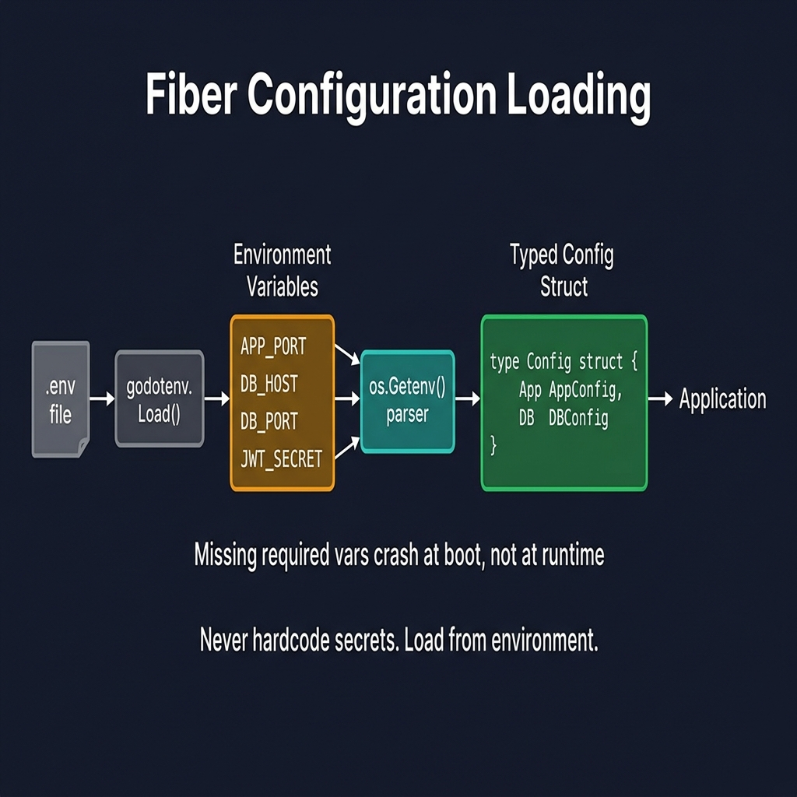
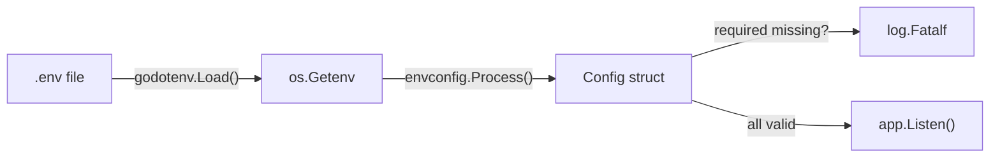

<!-- tags: golang, modules -->
# ⚙️ Configuration — NestJS ConfigModule → Go Viper/envconfig

> **Library**: Load env vars with `envconfig` struct tags, validate at startup with `required:"true"`.

📅 Updated: 2026-04-19 · ⏱️ 12 min read

## 1. DEFINE

NestJS uses `ConfigModule.forRoot()` with `.env` files. In Go, `godotenv.Load()` reads `.env` into `os.Getenv`, then `envconfig.Process()` maps them to typed structs with validation via `required:"true"`. App crashes fast at boot if required vars are missing.

| NestJS                                  | Go (envconfig)                                |
| --------------------------------------- | --------------------------------------------- |
| `ConfigModule.forRoot()`                | `godotenv.Load()` + `envconfig.Process()`     |
| `configService.get('DB')`               | `cfg.Database.Host`                           |
| `validate`                              | Struct tags: `required:"true"`                |

### Key Invariants

- **Fail fast at boot.** Use `log.Fatalf` on config errors — don’t serve traffic with missing vars.
- **Group related vars.** Separate `AppConfig`, `DatabaseConfig`, `JWTConfig` structs.

## 2. VISUAL

The configuration pipeline loads environment variables into typed structs at boot time.



*Figure: .env → godotenv.Load() → environment variables → os.Getenv() parser → typed Config struct (AppConfig, DBConfig). Missing required vars crash at boot, not at runtime.*

### Mermaid Fallback




## 3. CODE

### Example 1: Basic — Struct Mapping

```go
package config

import (
    "log"
    "github.com/kelseyhightower/envconfig"
    "github.com/joho/godotenv"
)

// ━━━━━━━━━━━━━━━━━━━━━━━━━━━━━━━━━━━━━━━━━
// Config structs: envconfig maps env vars to fields.
// required:"true" = crash at boot if missing.
// ━━━━━━━━━━━━━━━━━━━━━━━━━━━━━━━━━━━━━━━━━
type Config struct {
    App      AppConfig
    Database DatabaseConfig
    JWT      JWTConfig
}

type AppConfig struct {
    Name string `envconfig:"APP_NAME" default:"my-api"`
    Port string `envconfig:"PORT" default:"3000"`
    Env  string `envconfig:"APP_ENV" default:"development"`
}

type DatabaseConfig struct {
    Host     string `envconfig:"DB_HOST" required:"true"`
    Port     int    `envconfig:"DB_PORT" default:"5432"`
    User     string `envconfig:"DB_USER" required:"true"`
    Password string `envconfig:"DB_PASSWORD" required:"true"`
    Name     string `envconfig:"DB_NAME" required:"true"`
}

type JWTConfig struct {
    Secret   string `envconfig:"JWT_SECRET" required:"true"`
    ExpirySec int   `envconfig:"JWT_EXPIRY" default:"900"`
}

func Load() *Config {
    _ = godotenv.Load()
    var cfg Config
    if err := envconfig.Process("", &cfg.App); err != nil {
        log.Fatalf("App config: %v", err)
    }
    if err := envconfig.Process("", &cfg.Database); err != nil {
        log.Fatalf("DB config: %v", err)
    }
    if err := envconfig.Process("", &cfg.JWT); err != nil {
        log.Fatalf("JWT config: %v", err)
    }
    return &cfg
}
```

### Example 2: Intermediate — Framework Injection

```go
package main

import (
    "log"
    "github.com/gofiber/fiber/v3"
)

// ━━━━━━━━━━━━━━━━━━━━━━━━━━━━━━━━━━━━━━━━━
    // Wire config into Fiber app and services.
    // Config.Load() validates all required vars at boot.
// ━━━━━━━━━━━━━━━━━━━━━━━━━━━━━━━━━━━━━━━━━
func main() {
    cfg := config.Load()

    app := fiber.New(fiber.Config{
        AppName: cfg.App.Name,
    })

    db := database.Connect(cfg.Database)
    userService := users.NewService(db)

    log.Fatal(app.Listen(":" + cfg.App.Port))
}
```

---

## 4. PITFALLS

| # | Severity | Defect | Impact | Fix |
| --- | --- | --- | --- | --- |
| 1 | 🔴 Fatal | Not using `required:"true"` on critical env vars | App starts with empty DB credentials, fails on first query | Use `required:"true"` struct tags; app crashes at boot if missing |
| 2 | 🟡 Common | Hardcoding config values instead of env vars | Cannot change settings per environment without recompiling | Use `envconfig` tags with `default:"..."`  for safe defaults |

---

## 5. REF

| Resource | Link | 
| --- | --- | 
| envconfig | [github.com/kelseyhightower/envconfig](https://github.com/kelseyhightower/envconfig) | 
| Fiber Config | [docs.gofiber.io](https://docs.gofiber.io/) | 

---

## 6. RECOMMEND

| Extension | When | Rationale | Resource |
| --- | --- | --- | --- |
| Database | When you need GORM + connection pooling | Wire `cfg.Database` into `gorm.Open()` | [./02-database-orm.md](./02-database-orm.md) |
