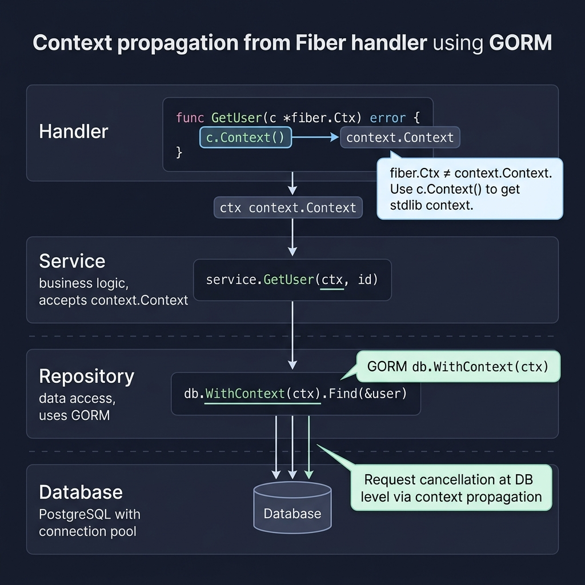
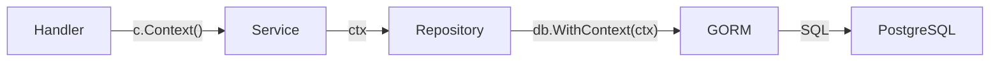

<!-- tags: golang -->
# 🗄️ Database & ORM — NestJS TypeORM → Go GORM with Fiber

> **Library**: GORM with Fiber — `db.WithContext(c.Context())` for request-scoped queries, repository pattern.

📅 Updated: 2026-04-19 · ⏱️ 12 min read

## 1. DEFINE

NestJS uses TypeORM repositories injected via `@InjectRepository()`. In Fiber+GORM, pass `*gorm.DB` to your repository struct, and always call `db.WithContext(c.Context())` to propagate request cancellation to database queries.

| NestJS / TypeORM          | Go / GORM + Fiber                      |
| ------------------------- | -------------------------------------- |
| `@Entity()`               | `type User struct` + GORM tags         |
| `repository.find()`       | `db.WithContext(ctx).Find(&users)`     |
| `repository.save()`       | `db.WithContext(ctx).Create(&user)`    |

### Key Invariants

- **Always use `db.WithContext(ctx)`.** Without context, queries ignore request cancellation and can block forever.
- **Check `.Error` after every GORM call.** GORM doesn’t panic; errors are returned silently via `.Error`.

## 2. VISUAL

Context propagation ensures request cancellation flows from handler through to the database.



*Figure: Handler (fiber.Ctx) → c.Context() → context.Context → Service → Repository → GORM db.WithContext(ctx) → Database. Warning: fiber.Ctx ≠ context.Context. Use c.Context() for stdlib context propagation.*

### Mermaid Fallback




## 3. CODE

### Example 1: Basic — Endpoint Integration

```go
package main

import (
    "github.com/gofiber/fiber/v3"
)

type User struct {
    ID    uint   `gorm:"primaryKey" json:"id"`
    Name  string `gorm:"size:100" json:"name"`
    Email string `gorm:"uniqueIndex" json:"email"`
}

// ━━━━━━━━━━━━━━━━━━━━━━━━━━━━━━━━━━━━━━━━━
// CRUD handlers: use db.WithContext(c.Context()) for
// request-scoped queries. Check .Error for failures.
// ━━━━━━━━━━━━━━━━━━━━━━━━━━━━━━━━━━━━━━━━━
func SetupRoutes(app *fiber.App, db *gorm.DB) {
    app.Get("/users", func(c fiber.Ctx) error {
        var users []User
        db.WithContext(c.Context()).Find(&users)
        return c.JSON(fiber.Map{"data": users})
    })

    app.Get("/users/:id", func(c fiber.Ctx) error {
        var user User
        if err := db.WithContext(c.Context()).First(&user, c.Params("id")).Error; err != nil {
            return fiber.NewError(fiber.StatusNotFound, "user not found")
        }
        return c.JSON(fiber.Map{"data": user})
    })

    app.Post("/users", func(c fiber.Ctx) error {
        var user User
        if err := c.Bind().JSON(&user); err != nil {
            return fiber.NewError(fiber.StatusBadRequest, err.Error())
        }
        db.WithContext(c.Context()).Create(&user)
        return c.Status(fiber.StatusCreated).JSON(fiber.Map{"data": user})
    })

    app.Delete("/users/:id", func(c fiber.Ctx) error {
        db.WithContext(c.Context()).Delete(&User{}, c.Params("id"))
        return c.JSON(fiber.Map{"message": "deleted"})
    })
}
```

### Example 2: Intermediate — Persistence Pattern

```go
package repository

import (
    "context"
    "gorm.io/gorm"
)

// ━━━━━━━━━━━━━━━━━━━━━━━━━━━━━━━━━━━━━━━━━
// Repository pattern: encapsulate GORM calls behind
// interface. Always accept context.Context parameter.
// ━━━━━━━━━━━━━━━━━━━━━━━━━━━━━━━━━━━━━━━━━
type UserRepository struct {
    db *gorm.DB
}

func NewUserRepository(db *gorm.DB) *UserRepository {
    return &UserRepository{db: db}
}

func (r *UserRepository) FindAll(ctx context.Context) ([]User, error) {
    var users []User
    err := r.db.WithContext(ctx).Find(&users).Error
    return users, err
}

func (r *UserRepository) FindByID(ctx context.Context, id string) (*User, error) {
    var user User
    err := r.db.WithContext(ctx).First(&user, id).Error
    return &user, err
}
```

---

## 4. PITFALLS

| # | Severity | Defect | Impact | Fix |
| --- | --- | --- | --- | --- |
| 1 | 🔴 Fatal | Calling `db.Find()` without `WithContext(ctx)` | Query ignores request cancellation; blocks forever if DB is slow | Always `db.WithContext(c.Context())` |
| 2 | 🟡 Common | Ignoring `.Error` from GORM operations | Silent failures: Create/Update appears to succeed but data not persisted | Check `if result.Error != nil` after every GORM call |

---

## 5. REF

| Resource | Link |
| --- | --- |
| GORM | [gorm.io/docs](https://gorm.io/docs/) |
| Fiber | [docs.gofiber.io](https://docs.gofiber.io/) |

---

## 6. RECOMMEND

| Extension | When | Rationale | Resource |
| --- | --- | --- | --- |
| DTOs | When you need request validation before DB operations | Separate DTO structs from GORM models | [./03-validation-dto.md](./03-validation-dto.md) |
