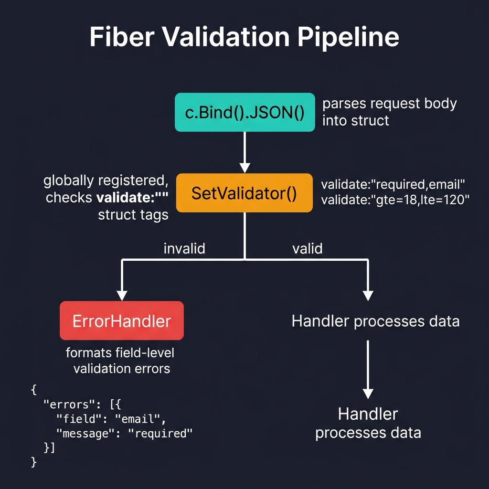
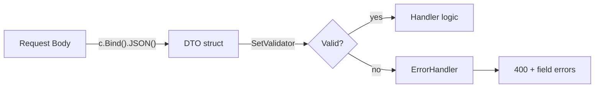

<!-- tags: golang -->
# ✅ Validation & DTO — NestJS Pipes → Fiber SetValidator

> **Library**: DTOs with `validate` struct tags + `app.SetValidator()` for global validation pipe.

📅 Updated: 2026-04-19 · ⏱️ 10 min read

## 1. DEFINE

NestJS uses `class-validator` decorators on DTO classes with `ValidationPipe`. In Fiber, define DTO structs with `validate` tags and register a global validator via `app.SetValidator()`. All `c.Bind()` calls auto-validate after this.

| NestJS                       | Fiber                                    |
| ---------------------------- | ---------------------------------------- |
| `ValidationPipe`             | `app.SetValidator(v)`                    |
| `class-validator`            | `validate:"required,email"` struct tags  |
| `@Body()`                    | `c.Bind().JSON()`                        |

### Key Invariants

- **Separate DTOs from GORM models.** DTO = request shape, Model = database shape. Never bind directly to models.
- **Custom error format in ErrorHandler.** Type-assert `validator.ValidationErrors` to return field-level messages.

## 2. VISUAL

The validation pipeline chains binding with struct-tag validation through a global validator.



*Figure: c.Bind().JSON() → SetValidator() (globally registered, checks validate tags) → valid = Handler, invalid = ErrorHandler (400 with field-level errors). Struct tags: validate:"required,email", validate:"gte=18,lte=120".*

### Mermaid Fallback




## 3. CODE

### Example 1: Basic — Global Validation Execution

```go
package main

import (
    "github.com/go-playground/validator/v10"
    "github.com/gofiber/fiber/v3"
)

type structValidator struct {
    validate *validator.Validate
}

func (v *structValidator) Validate(out any) error {
    return v.validate.Struct(out)
}

// ━━━━━━━━━━━━━━━━━━━━━━━━━━━━━━━━━━━━━━━━━
// Global validator: implement fiber.Validator interface.
// Register once, all Bind() calls auto-validate.
// ━━━━━━━━━━━━━━━━━━━━━━━━━━━━━━━━━━━━━━━━━
func main() {
    app := fiber.New()

    app.SetValidator(&structValidator{validate: validator.New()})
}
```

### Example 2: Intermediate — Data Transfer Objects

```go
// ━━━━━━━━━━━━━━━━━━━━━━━━━━━━━━━━━━━━━━━━━
// DTOs: separate structs for Create vs Update.
// Use pointer fields + omitempty for partial updates.
// ━━━━━━━━━━━━━━━━━━━━━━━━━━━━━━━━━━━━━━━━━
type CreateUserDTO struct {
    Name     string `json:"name" validate:"required,min=2,max=100"`
    Email    string `json:"email" validate:"required,email"`
    Password string `json:"password" validate:"required,min=8"`
    Age      int    `json:"age" validate:"gte=18,lte=120"`
    Role     string `json:"role" validate:"required,oneof=admin user"`
}

type UpdateUserDTO struct {
    Name  *string `json:"name,omitempty" validate:"omitempty,min=2"`
    Email *string `json:"email,omitempty" validate:"omitempty,email"`
}

app.Post("/users", func(c fiber.Ctx) error {
    var dto CreateUserDTO
    if err := c.Bind().JSON(&dto); err != nil {
        return fiber.NewError(fiber.StatusBadRequest, err.Error())
    }
    return c.Status(fiber.StatusCreated).JSON(dto)
})
```

### Example 3: Advanced — Custom Feedback Generation

```go
import "github.com/go-playground/validator/v10"

type ValidationError struct {
    Field   string `json:"field"`
    Message string `json:"message"`
}

// ━━━━━━━━━━━━━━━━━━━━━━━━━━━━━━━━━━━━━━━━━
// Custom error formatter: extract field-level validation
// errors and return structured JSON to the client.
// ━━━━━━━━━━━━━━━━━━━━━━━━━━━━━━━━━━━━━━━━━
func formatErrors(err error) []ValidationError {
    var errors []ValidationError
    if ve, ok := err.(validator.ValidationErrors); ok {
        for _, e := range ve {
            errors = append(errors, ValidationError{
                Field:   e.Field(),
                Message: e.Tag() + ": " + e.Param(),
            })
        }
    }
    return errors
}

app := fiber.New(fiber.Config{
    ErrorHandler: func(c fiber.Ctx, err error) error {
        if _, ok := err.(validator.ValidationErrors); ok {
            return c.Status(400).JSON(fiber.Map{
                "error":   "validation failed",
                "details": formatErrors(err),
            })
        }
        return c.Status(500).JSON(fiber.Map{"error": err.Error()})
    },
})
```

---

## 4. PITFALLS

| # | Severity | Defect | Impact | Fix |
| --- | --- | --- | --- | --- |
| 1 | 🔴 Fatal | Binding request directly to GORM model struct | Client can set `ID`, `CreatedAt`, or other protected fields | Use separate DTO structs; map DTO → Model in service layer |
| 2 | 🟡 Common | Returning raw `validator.ValidationErrors` to client | Exposes internal field names and Go type details | Use `formatErrors()` to return human-readable field messages |

---

## 5. REF

| Resource | Link |
| --- | --- |
| Validator | [github.com/go-playground/validator](https://github.com/go-playground/validator) |
| Fiber Bind | [docs.gofiber.io/next/api/bind](https://docs.gofiber.io/next/api/bind) |

---

## 6. RECOMMEND

| Extension | When | Rationale | Resource |
| --- | --- | --- | --- |
| Caching | When you need to cache validated responses | `middleware/cache` + Redis storage | [./04-caching.md](./04-caching.md) |
