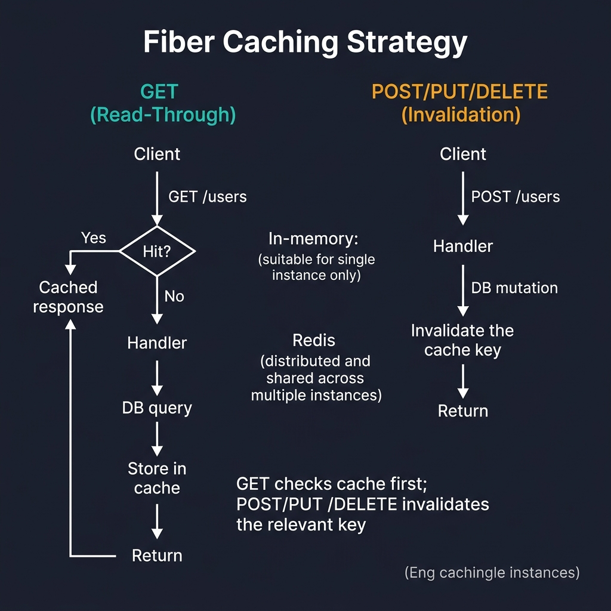
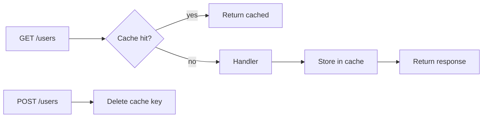

<!-- tags: golang -->
# 💾 Caching — NestJS CacheModule → Fiber Built-in Cache Middleware

> **Library**: Built-in `middleware/cache` for in-memory; `gofiber/storage/redis` for distributed caching.

📅 Updated: 2026-04-19 · ⏱️ 8 min read

## 1. DEFINE

Fiber’s `middleware/cache` stores response bodies by URL key with configurable TTL. For multi-instance deployments, plug in `gofiber/storage/redis` as the backing store. Invalidation must be manual — delete cache keys after writes.

| NestJS                               | Fiber                                        |
| ------------------------------------ | -------------------------------------------- |
| `CacheModule.register()`             | `middleware/cache`                           |
| `@UseInterceptors(CacheInterceptor)` | `app.Use(cache.New(...))`                    |
| `@CacheTTL(30)`                      | `cache.Config{Expiration: 30 * time.Second}` |

### Key Invariants

- **Include query string in cache key.** Default key is path only; `/users?page=1` and `/users?page=2` share one cache entry.
- **Invalidate on writes.** POST/PUT/DELETE must delete relevant cache keys or serve stale data.

## 2. VISUAL

The caching strategy uses read-through for GETs and cache invalidation for mutations.



*Figure: GET (read-through) — cache check → hit = return cached → miss = Handler → DB → store in cache. POST/PUT/DELETE (invalidation) — Handler → DB mutation → invalidate cache key. Storage: in-memory (single instance) or Redis (distributed).*

### Mermaid Fallback




## 3. CODE

### Example 1: Basic — Built-in Standard Memory

```go
    import "github.com/gofiber/fiber/v3/middleware/cache"

    // ━━━━━━━━━━━━━━━━━━━━━━━━━━━━━━━━━━━━━━━━━
    // In-memory cache: 30s TTL, CacheControl adds
    // Cache-Control headers for browser/CDN caching.
    // ━━━━━━━━━━━━━━━━━━━━━━━━━━━━━━━━━━━━━━━━━
    app.Use(cache.New(cache.Config{
        Expiration:   30 * time.Second,
        CacheControl: true,
    }))

    app.Get("/users", listUsers)
```

### Example 2: Intermediate — Endpoint-Specific Stores

```go
    import (
        "github.com/gofiber/fiber/v3/middleware/cache"
        "github.com/gofiber/storage/redis/v3"
    )

    // ━━━━━━━━━━━━━━━━━━━━━━━━━━━━━━━━━━━━━━━━━
    // Redis-backed cache: shared across instances.
    // Custom KeyGenerator includes query string.
    // ━━━━━━━━━━━━━━━━━━━━━━━━━━━━━━━━━━━━━━━━━
    store := redis.New(redis.Config{Host: "localhost", Port: 6379})

    cached := cache.New(cache.Config{
        Expiration: 1 * time.Minute,
        Storage:    store,
        KeyGenerator: func(c fiber.Ctx) string {
            return c.Path() + "?" + string(c.Request().URI().QueryString())
        },
    })

    app.Get("/users", cached, listUsers)
    app.Get("/posts", cached, listPosts)
```

### Example 3: Advanced — Dynamic Target Invalidation

```go
    // ━━━━━━━━━━━━━━━━━━━━━━━━━━━━━━━━━━━━━━━━━
    // Manual invalidation: delete cache key after write.
    // Key must match KeyGenerator format.
    // ━━━━━━━━━━━━━━━━━━━━━━━━━━━━━━━━━━━━━━━━━
    app.Post("/users", func(c fiber.Ctx) error {

        store.Delete("/users?")

        return c.Status(201).JSON(user)
    })
```

---

## 4. PITFALLS

| # | Severity | Defect | Impact | Fix |
| --- | --- | --- | --- | --- |
| 1 | 🔴 Fatal | Default cache key is path-only (no query string) | `/users?page=1` and `/users?page=2` return same cached response | Custom `KeyGenerator: func(c) { return c.Path() + "?" + queryString }` |
| 2 | 🟡 Common | Not invalidating cache on POST/PUT/DELETE | Clients see stale data after mutations | Call `store.Delete(key)` in write handlers |

---

## 5. REF

| Resource | Link |
| --- | --- |
| Cache Middleware | [docs.gofiber.io/category/-middleware](https://docs.gofiber.io/category/-middleware/) |
| Redis | [redis.io/docs/latest/develop/clients/go](https://redis.io/docs/latest/develop/clients/go/) |

---

## 6. RECOMMEND

| Extension | When | Rationale | Resource |
| --- | --- | --- | --- |
| Logging | When you need structured request logging | `middleware/logger` + `slog` for JSON output | [./05-logging.md](./05-logging.md) |
