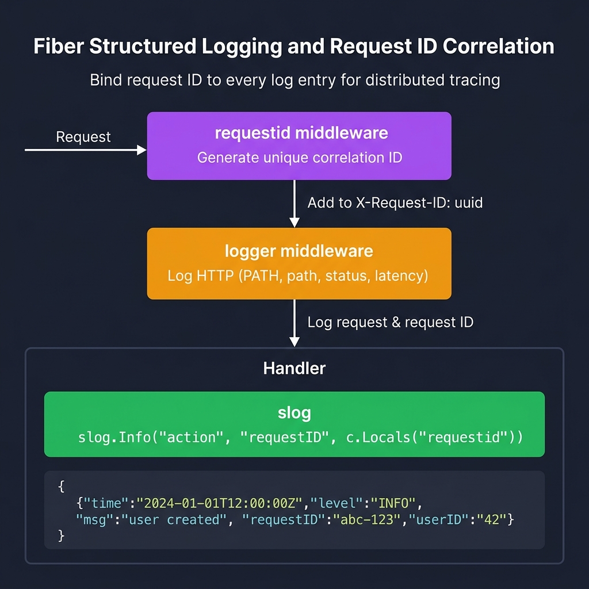

<!-- tags: golang -->
# 📋 Logging — NestJS Logger → Fiber Built-in Logger + slog

> **Library**: `middleware/logger` for HTTP request logs + `log/slog` for structured application logging.

📅 Updated: 2026-04-19 · ⏱️ 8 min read

## 1. DEFINE

Fiber’s `middleware/logger` logs every HTTP request with configurable format strings. For application-level logging, use Go 1.21+ `log/slog` with `requestid` middleware to correlate logs per request. Store the logger in `c.Locals()` for handler access.

| NestJS                    | Fiber                          |
| ------------------------- | ------------------------------ |
| `app.useLogger()`         | `middleware/logger`            |
| `Logger.log()`            | `slog.Info()`                  |
| Custom formatter          | `logger.Config{Format: "..."}` |

### Key Invariants

- **Always include request ID.** Without correlation, debugging distributed requests is impossible.
- **Use structured logging (`slog`), not `fmt.Printf`.** Unstructured logs are unsearchable in production.

## 2. VISUAL

Structured logging with request ID correlation enables distributed tracing across services.



*Figure: Request → requestid middleware (generates X-Request-ID) → logger middleware (logs method, path, latency) → Handler → slog.Info() with request ID. Structured output: JSON with time, level, msg, requestID, userID.*

### Mermaid Fallback


## 3. CODE

### Example 1: Basic — Built-in Linear Logging

```go
    import "github.com/gofiber/fiber/v3/middleware/logger"

    // ━━━━━━━━━━━━━━━━━━━━━━━━━━━━━━━━━━━━━━━━━
    // HTTP request logger: format string with placeholders.
    // Logs method, path, status, latency per request.
    // ━━━━━━━━━━━━━━━━━━━━━━━━━━━━━━━━━━━━━━━━━
    app.Use(logger.New(logger.Config{
        Format:     "${time} | ${status} | ${latency} | ${method} ${path}\n",
        TimeFormat: "2006-01-02 15:04:05",
        TimeZone:   "Local",
    }))

    // Output: 2026-03-23 06:15:00 | 200 | 1.2ms | GET /users
```

### Example 2: Intermediate — Structured Tracing

```go
    import (
        "log/slog"
        "github.com/gofiber/fiber/v3/middleware/requestid"
    )

    app.Use(requestid.New())

    // ━━━━━━━━━━━━━━━━━━━━━━━━━━━━━━━━━━━━━━━━━
    // Structured slog: attach request_id from middleware,
    // store in Locals for handler access.
    // ━━━━━━━━━━━━━━━━━━━━━━━━━━━━━━━━━━━━━━━━━
    app.Use(func(c fiber.Ctx) error {
        logger := slog.Default().With(
            "request_id", c.Locals("requestid"),
            "method", c.Method(),
            "path", c.Path(),
        )
        c.Locals("logger", logger)
        return c.Next()
    })

    // Handler context extraction:
    // logger := c.Locals("logger").(*slog.Logger)
    // logger.Info("fetching user", "id", c.Params("id"))
```

---

## 4. PITFALLS

| # | Severity | Defect | Impact | Fix |
| --- | --- | --- | --- | --- |
| 1 | 🔴 Fatal | Logging raw user input without sanitization | Log injection: attacker inserts fake log lines or escape sequences | Sanitize user strings before logging; use structured fields, not string interpolation |
| 2 | 🟡 Common | Using `fmt.Printf` instead of `slog` | Unstructured output; no JSON parsing for log aggregators | Use `slog.Info("msg", "key", value)` for searchable structured logs |

---

## 5. REF

| Resource | Link |
| --- | --- |
| slog | [pkg.go.dev/log/slog](https://pkg.go.dev/log/slog) |
| Fiber Logger | [docs.gofiber.io/category/-middleware](https://docs.gofiber.io/category/-middleware/) |

---

## 6. RECOMMEND

| Extension | When | Rationale | Resource |
| --- | --- | --- | --- |
| Sessions | When you need server-side state (login sessions) | `middleware/session` + Redis store | [./06-session-cookies.md](./06-session-cookies.md) |
