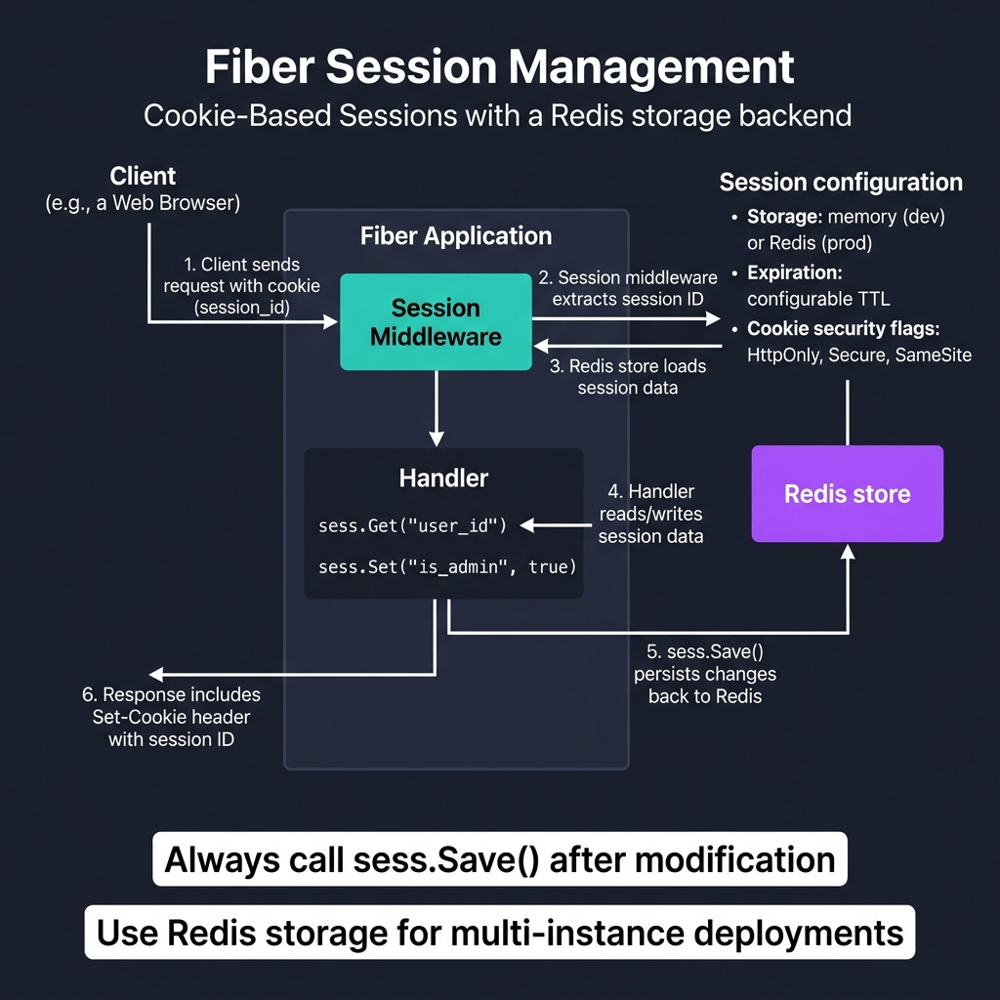
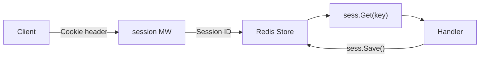

<!-- tags: golang -->
# 🍪 Session & Cookies — NestJS express-session → Fiber Built-in Session

> **Library**: `c.Cookie()` for raw cookies; `middleware/session` + Redis store for server-side sessions.

📅 Updated: 2026-04-19 · ⏱️ 8 min read

## 1. DEFINE

Fiber provides `c.Cookie()` for setting HTTP cookies and `middleware/session` for server-side session management. Sessions can be backed by in-memory store (single instance) or Redis (multi-instance). Always set `HTTPOnly`, `Secure`, and `SameSite` on cookies.

| NestJS                    | Fiber                           |
| ------------------------- | ------------------------------- |
| `express-session`         | `middleware/session`            |
| `req.session.userId`      | `sess.Set("userID", id)`        |
| `res.cookie('name', val)` | `c.Cookie(&fiber.Cookie{...})`  |
| `req.cookies.name`        | `c.Cookies("name")`             |

### Key Invariants

- **Always set `HTTPOnly: true` on auth cookies.** Without it, JavaScript can steal session tokens via XSS.
- **Use Redis store for sessions in production.** In-memory store loses all sessions on restart.

## 2. VISUAL

Session management uses cookie-based IDs with Redis for distributed storage.



*Figure: Client cookie (session_id) → Session middleware → Redis store loads data → Handler reads/writes (sess.Get, sess.Set) → sess.Save() persists to Redis → Set-Cookie response. Config: HttpOnly, Secure, SameSite flags.*

### Mermaid Fallback




## 3. CODE

### Example 1: Basic — Raw Cookies

```go
    // ━━━━━━━━━━━━━━━━━━━━━━━━━━━━━━━━━━━━━━━━━
    // Raw cookies: set with fiber.Cookie struct.
    // Always include HTTPOnly, Secure, SameSite.
    // ━━━━━━━━━━━━━━━━━━━━━━━━━━━━━━━━━━━━━━━━━
    app.Post("/prefs", func(c fiber.Ctx) error {
        c.Cookie(&fiber.Cookie{
            Name:     "theme",
            Value:    c.FormValue("theme"),
            MaxAge:   86400 * 30,
            HTTPOnly: true,
            Secure:   true,
            SameSite: "Strict",
        })
        return c.JSON(fiber.Map{"message": "saved"})
    })

    app.Get("/prefs", func(c fiber.Ctx) error {
        theme := c.Cookies("theme", "light") 
        return c.JSON(fiber.Map{"theme": theme})
    })

    app.Delete("/prefs", func(c fiber.Ctx) error {
        c.ClearCookie("theme")
        return c.JSON(fiber.Map{"message": "cleared"})
    })
```

### Example 2: Intermediate — Persistent Sessions

```go
    import (
        "github.com/gofiber/fiber/v3/middleware/session"
        "github.com/gofiber/storage/redis/v3"
    )

    // ━━━━━━━━━━━━━━━━━━━━━━━━━━━━━━━━━━━━━━━━━
    // Server-side sessions: Redis-backed for
    // multi-instance. Use session.FromContext(c).
    // ━━━━━━━━━━━━━━━━━━━━━━━━━━━━━━━━━━━━━━━━━
    store := redis.New(redis.Config{Host: "localhost", Port: 6379})

    sessionMiddleware, sessionStore := session.NewWithStore(store)
    app.Use(sessionMiddleware)

    app.Post("/login", func(c fiber.Ctx) error {
        sess := session.FromContext(c)
        sess.Set("userID", "user-123")
        sess.Set("role", "admin")
        if err := sess.Save(); err != nil {
            return err
        }
        return c.JSON(fiber.Map{"message": "logged in"})
    })

    app.Get("/profile", func(c fiber.Ctx) error {
        sess := session.FromContext(c)
        userID := sess.Get("userID")
        if userID == nil {
            return fiber.NewError(fiber.StatusUnauthorized, "not logged in")
        }
        return c.JSON(fiber.Map{"userID": userID})
    })

    app.Post("/logout", func(c fiber.Ctx) error {
        sess := session.FromContext(c)
        if err := sess.Destroy(); err != nil {
            return err
        }
        return c.JSON(fiber.Map{"message": "logged out"})
    })
```

---

## 4. PITFALLS

| # | Severity | Defect | Impact | Fix |
| --- | --- | --- | --- | --- |
| 1 | 🔴 Fatal | Missing `HTTPOnly: true` on session cookie | XSS attack can steal session token via `document.cookie` | Always set `HTTPOnly: true, Secure: true, SameSite: "Strict"` |
| 2 | 🔴 Fatal | Using in-memory session store in production | Container restart wipes all sessions; users logged out | Use `gofiber/storage/redis` for persistent session store |

---

## 5. REF

| Resource | Link |
| --- | --- |
| Fiber Session Middleware | [docs.gofiber.io/category/-middleware](https://docs.gofiber.io/category/-middleware/) |
| Set-Cookie | [developer.mozilla.org](https://developer.mozilla.org/en-US/docs/Web/HTTP/Headers/Set-Cookie) |

---

## 6. RECOMMEND

| Extension | When | Rationale | Resource |
| --- | --- | --- | --- |
| Error Handling | When you need centralized error responses | `fiber.Config{ErrorHandler}` + `fiber.NewError()` | [./07-error-handling.md](./07-error-handling.md) |
