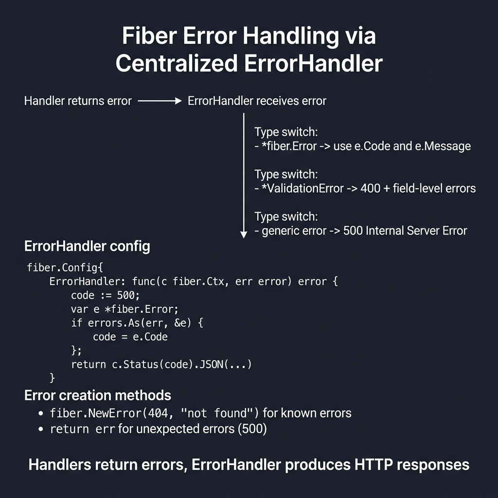
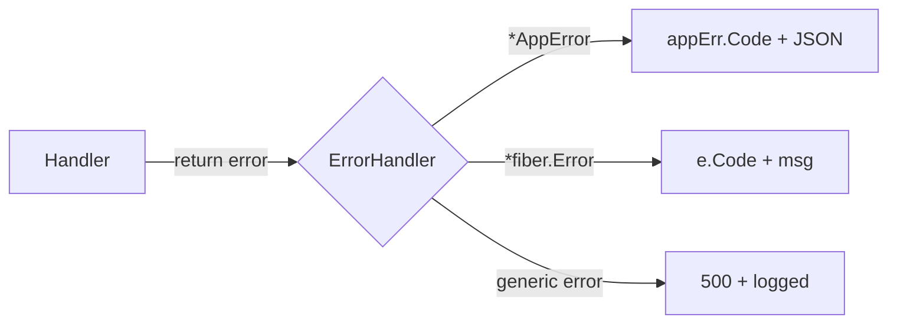

<!-- tags: golang, error-handling -->
# ❌ Error Handling — NestJS Exception Filters → Fiber ErrorHandler

> **Library**: `fiber.NewError()` for typed errors, `fiber.Config{ErrorHandler}` for centralized responses.

📅 Updated: 2026-04-19 · ⏱️ 12 min read

## 1. DEFINE

Fiber handlers return `error`. The global `ErrorHandler` in `fiber.Config` catches all returned errors and formats the response. Use `fiber.NewError(code, msg)` for HTTP-aware errors, custom `AppError` types for domain errors, and `middleware/recover` to catch panics.

| NestJS                              | Fiber                                   |
| ----------------------------------- | --------------------------------------- |
| `throw new HttpException()`         | `return fiber.NewError()`               |
| `throw new NotFoundException()`     | `return fiber.ErrNotFound`              |
| `@Catch() ExceptionFilter`          | `fiber.Config{ErrorHandler: func(...)}` |

### Key Invariants

- **Never expose raw `err.Error()` to clients in production.** Internal error details leak stack traces and implementation.
- **Use `errors.As()` in ErrorHandler.** Type-switch between `*AppError`, `*fiber.Error`, and generic errors.

## 2. VISUAL

Centralized error handling routes all handler errors through a single ErrorHandler for consistent responses.



*Figure: Handler returns error → ErrorHandler type-switches: *fiber.Error → use e.Code, *ValidationError → 400 + fields, generic error → 500. ErrorHandler config in fiber.Config{}. Error creation: fiber.NewError(404, "not found") for known, return err for unexpected.*

### Mermaid Fallback




## 3. CODE

### Example 1: Basic — Standard Framework Types

```go
    // ━━━━━━━━━━━━━━━━━━━━━━━━━━━━━━━━━━━━━━━━━
    // Built-in error types: use fiber.NewError() for
    // custom codes, or predefined fiber.ErrNotFound etc.
    // ━━━━━━━━━━━━━━━━━━━━━━━━━━━━━━━━━━━━━━━━━
    return fiber.NewError(fiber.StatusBadRequest, "invalid input")

    return fiber.ErrNotFound

    return fiber.ErrUnauthorized

    return fiber.ErrForbidden

    return fiber.NewError(fiber.StatusConflict, "email already exists")
```

### Example 2: Intermediate — Unified App Architectures

```go
    type AppError struct {
        Code    int    `json:"code"`
        Type    string `json:"type"`
        Message string `json:"message"`
        Detail  string `json:"detail,omitempty"`
    }

    func (e *AppError) Error() string { return e.Message }

    func BadRequest(msg string) *AppError {
        return &AppError{Code: 400, Type: "BAD_REQUEST", Message: msg}
    }

    func NotFound(msg string) *AppError {
        return &AppError{Code: 404, Type: "NOT_FOUND", Message: msg}
    }

    // ━━━━━━━━━━━━━━━━━━━━━━━━━━━━━━━━━━━━━━━━━
    // Centralized ErrorHandler: use errors.As() to type-switch
    // between AppError, fiber.Error, and generic errors.
    // ━━━━━━━━━━━━━━━━━━━━━━━━━━━━━━━━━━━━━━━━━
    app := fiber.New(fiber.Config{
        ErrorHandler: func(c fiber.Ctx, err error) error {
            code := fiber.StatusInternalServerError

            var appErr *AppError
            if errors.As(err, &appErr) {
                return c.Status(appErr.Code).JSON(appErr)
            }

            var e *fiber.Error
            if errors.As(err, &e) {
                code = e.Code
            }

            if code >= 500 {
                slog.Error("server error", "error", err, "path", c.Path())
            }

            return c.Status(code).JSON(fiber.Map{
                "code":    code,
                "type":    "ERROR",
                "message": err.Error(),
            })
        },
    })

    app.Get("/users/:id", func(c fiber.Ctx) error {
        user, err := service.FindByID(c.Context(), c.Params("id"))
        if err != nil {
            return NotFound("user not found") 
        }
        return c.JSON(user)
    })
```

### Example 3: Advanced — System Protection

```go
    import "github.com/gofiber/fiber/v3/middleware/recover"

    // ━━━━━━━━━━━━━━━━━━━━━━━━━━━━━━━━━━━━━━━━━
    // Panic recovery: middleware/recover catches panics,
    // converts them to 500 errors via ErrorHandler.
    // ━━━━━━━━━━━━━━━━━━━━━━━━━━━━━━━━━━━━━━━━━
    app.Use(recover.New(recover.Config{
        EnableStackTrace: true, 
    }))
```

---

## 4. PITFALLS

| # | Severity | Defect | Impact | Fix |
| --- | --- | --- | --- | --- |
| 1 | 🔴 Fatal | Returning raw `err.Error()` to client in production | Stack traces and internal paths exposed to attackers | Return generic message; log full error server-side |
| 2 | 🔴 Fatal | Not using `middleware/recover` | Unrecovered panic crashes the entire process | `app.Use(recover.New())` as first middleware |

---

## 5. REF

| Resource | Link |
| --- | --- |
| Error Handling | [docs.gofiber.io/guide/error-handling/](https://docs.gofiber.io/guide/error-handling/) |
| Go Errors | [pkg.go.dev/errors](https://pkg.go.dev/errors) |

---

## 6. RECOMMEND

| Extension | When | Rationale | Resource |
| --- | --- | --- | --- |
| Configuration | When you need environment-based config loading | `envconfig` struct tags + `godotenv` | [./01-configuration.md](./01-configuration.md) |
