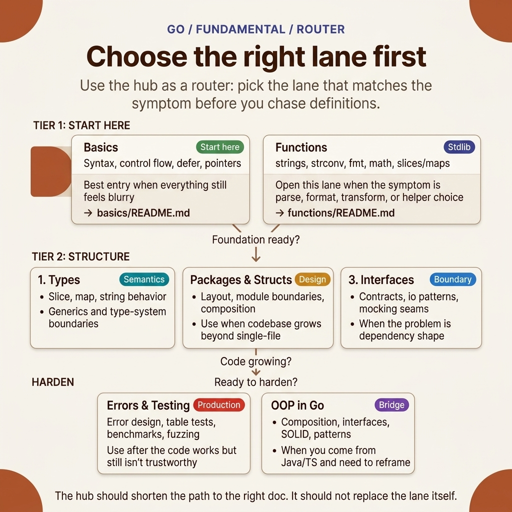

<!-- tags: golang, overview -->
# Go Fundamental

> The foundational layer of the Go language — from syntax and types to interfaces and testing.

📅 Updated: 2026-04-19 · ⏱️ 7 min read

## 1. DEFINE

Go fundamental is not a tutorial — it acts as a reference architecture for how you should understand the language. Each cluster resolves a distinct layer of confusion: syntax, types, functions, errors, packages, interfaces, structs, testing, and the OOP mental model.

This hub does not exist merely to list files. It exists to assist you in selecting the correct entry point for `fundamental`: where to begin, which articles should be read sequentially, and which lane to pivot to when encountering real-world symptoms.

### 1.1 Signals & Boundaries

- Open this hub when you know you are within the `fundamental` cluster but remain uncertain about which article to read first.
- The primary focus of this hub is to map pain points to the appropriate documentation, not to serve as a substitute for detailed articles.
- If you find yourself constantly jumping between articles while still feeling confused, it is typically because you selected the wrong initial lane, rather than a lack of definitions.

### 1.2 Learning Lanes

- `Basics — Syntax, variables, control flow, defer, pointers` is the natural entry point if you require a solid foothold before diving deeper.
- `TypeScript → Go` is a dedicated lane for developers transitioning their mental models from TS/JS to Go at the backend and platform levels.
- `Errors — Error handling, wrapping, sentinel, custom types` is more appropriate when you need to connect to an adjacent lane or extend from the foundation to production concerns.
- Treat this hub as a navigation map: after completing one article, return here to purposefully select your next destination.

## 2. VISUAL

This hub requires a static route map rather than a diagram-as-code approach. The most crucial aspect here is not learning additional syntax, but rather seeing at a glance which lane is worth opening first.



*Figure: Router map organizing the entire `fundamental` cluster by actual symptoms: foundation lane, stdlib lane, type semantics lane, boundary lane, design lane, and production hardening lane.*

After reviewing this map, you only need to answer one question: does your current issue reside in syntax, the helper family, type behavior, or design boundaries? Once the answer is clear, the pseudo-router below becomes truly valuable.

## 3. CODE

The router map provides visual directions. The pseudo-code below compresses that navigational logic into an artifact for the team.

### Example 1: Router artifact — selecting an article by reading objective

> **Objective**: Transform this hub into a navigation tool rather than a passive list of links.
> **Approach**: Map the learning objective or symptom directly to the appropriate opening file.
> **Example**: Select a lane based on concerns such as fundamentals, framework, concurrency, or production ops.
> **Complexity**: O(1) at the navigation level; the critical part is selecting the correct entry point.

```go
func chooseLane(goal string) string {
    switch goal {
    case "basics": return "./basics/README.md"
    case "typescript to go": return "./typescript-to-go/README.md"
    case "errors": return "./errors/README.md"
    case "functions": return "./functions/README.md"
    case "helper": return "./helper/README.md"
    case "interfaces": return "./interfaces/README.md"
    case "oop": return "./oop/README.md"
    case "packages": return "./packages/README.md"
    default: return "./README.md"
    }
}
```

This pseudo-router is not code meant to be executed in an application; it is a way to compress the navigational spirit of the hub into a concise artifact. Reading the hub with this mindset will help you maintain a more cohesive learning rhythm.

## 4. PITFALLS

A navigation hub is only valuable when used correctly — not by skimming and immediately jumping into the most complex article.

| # | Severity | Pitfall | Consequence | Fix |
| --- | --- | --- | --- | --- |
| 1 | 🔴 Fatal | Using the hub as a passive link list to skim | Fragmented learning and selecting the wrong entry point | Always start from a specific pain point or learning objective |
| 2 | 🟡 Common | Jumping straight into advanced articles without foundational context | Understanding terms in isolation and applying them incorrectly | Select a single entry point and follow the cluster's rhythm |
| 3 | 🔵 Minor | Failing to return to the hub after completing an article | Losing the connective rhythm between articles | Return to the hub after each lane to select the next logical step |

## 5. REF

| Resource | Type | Link | Notes |
| --- | --- | --- | --- |
| A Tour of Go | Official | https://go.dev/tour/ | The best general entry point when needing to reset foundational Go knowledge |
| Effective Go | Official | https://go.dev/doc/effective_go | Language idioms and philosophies after mastering basic syntax |
| Go User Manual | Official | https://go.dev/doc/ | The official router for the toolchain, modules, testing, and documentation |
| CodeReviewComments | Official | https://go.dev/wiki/CodeReviewComments | The most common idiomatic checklist when beginning Go code reviews |

## 6. RECOMMEND

After reading this article, the priority is not to memorize more definitions, but to cleanly transition to the correct related concept.

| Expansion | When to Read Next | Reason | File/Link |
| --- | --- | --- | --- |
| Basics — Syntax, variables, control flow, defer, pointers | When a clear, foundational entry point is required | Maintains a cohesive reading rhythm within the same cluster | [./basics/README.md](./basics/README.md) |
| TypeScript → Go | When carrying over mental models from Node.js/TypeScript | Provides a dedicated learning lane for migrating mental models, data models, concurrency, and rollouts | [./typescript-to-go/README.md](./typescript-to-go/README.md) |
| Errors — Error handling, wrapping, sentinel, custom types | When connecting to an adjacent lane | Maintains a cohesive reading rhythm within the same cluster | [./errors/README.md](./errors/README.md) |
| Functions — Built-in & Standard Library | When symptoms involve string parsing, formatting, numeric helpers, or slice/map helpers | Directly leverages stdlib primitives instead of writing unnecessary utilities | [./functions/README.md](./functions/README.md) |
| Helper — TS/JS → Go Conversion & Utilities | When translating a specific TS/JS idiom into Go | This cluster is optimized for recipe-level mapping rather than theory | [./helper/README.md](./helper/README.md) |
| Interfaces — Implicit contracts, `io`, mocking | When code begins touching dependency boundaries or test seams | This is the proper entry point for Go-style interface design | [./interfaces/README.md](./interfaces/README.md) |
| OOP in Go — Composition, interfaces, patterns | When coming from Java/TS/C++ and needing to reframe OOP mental models to Go idioms | Acts as a bridge between traditional OOP and Go: encapsulation, composition, SOLID, and patterns | [./oop/README.md](./oop/README.md) |
| Packages — Modules, layout, workspaces | When the repository grows beyond a single package or includes internal shared libraries | Maintains clean boundaries, tooling, and import graphs from an early stage | [./packages/README.md](./packages/README.md) |
| Structs — Composition, embedding, tags, options | When entity/config/API shapes become more complex than variable-level basics | Assists in understanding data boundaries and API surfaces at the struct level | [./structs/README.md](./structs/README.md) |
| Testing — Table-driven, benchmark, fuzz, integration | When working code is established and requires Go-idiomatic hardening | This is the natural progression after touching fundamentals | [./testing/README.md](./testing/README.md) |
| Types — Slices, maps, generics, type assertions | When symptoms involve collection semantics or generic abstraction | This lane explains type behaviors that go deeper than surface syntax | [./types/README.md](./types/README.md) |
| Go Programming | When switching Go clusters | Return to the root router to select a different lane | [../README.md](../README.md) |
