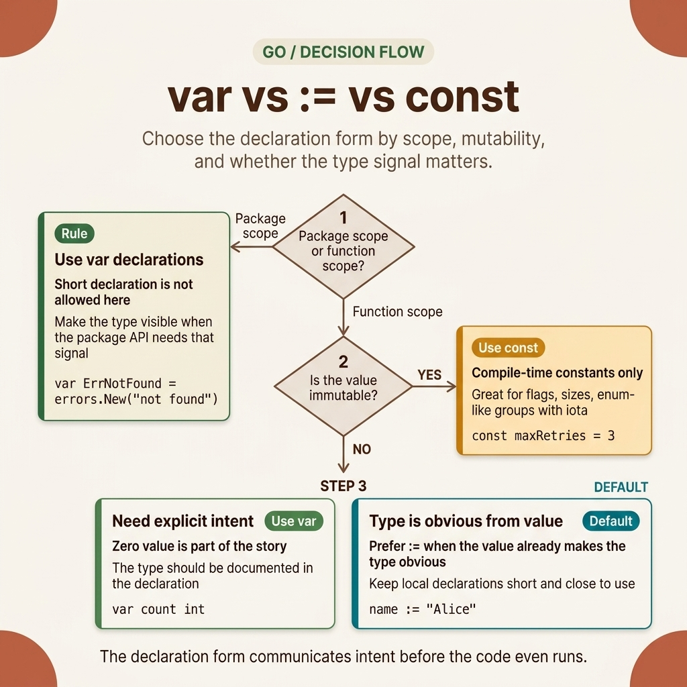
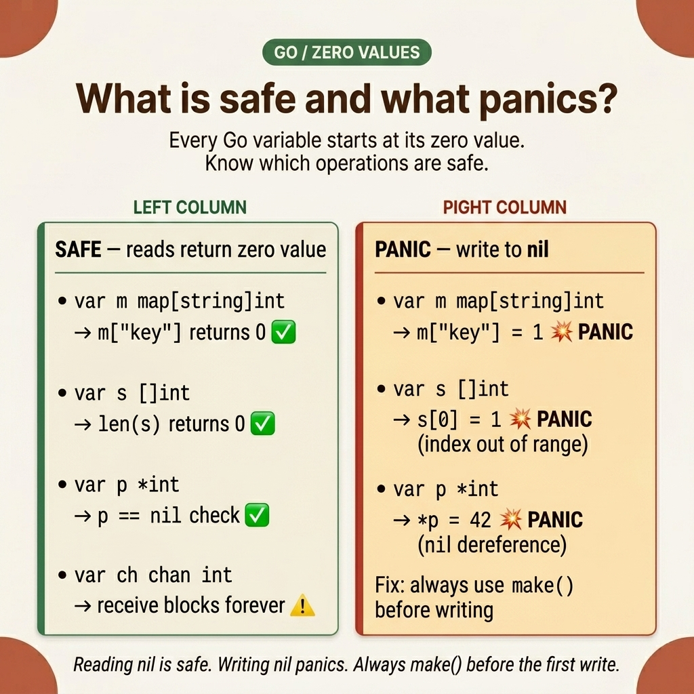

<!-- tags: golang -->

# 🟢 Go Basics — Basic Syntax

> Variables, constants, declarations, zero values — the foundational grip for reading and writing idiomatic Go

📅 Created: 2026-03-19 · 🔄 Updated: 2026-04-19 · ⏱️ 12 min read

| Aspect           | Detail                                                  |
| ---------------- | ------------------------------------------------------- |
| **Concept**      | Declarations, zero values, initial syntax decisions     |
| **Use case**     | Every Go program                                        |
| **Prerequisite** | None                                                    |
| **CLI**          | `go run`, `go build`, `go fmt`                          |

---

## 1. DEFINE

Imagine a Go snippet that seems incredibly basic, but the moment you shift context to debugging or code review, weak assumptions are easily exposed. At that moment, **Go Basics — Basic Syntax** is no longer just a well-formatted index; it becomes the place where you must firmly nail down the core mechanisms of the language.

You have just cloned a Go repository for the first time. Opening `main.go`, you see `:=` instead of `var`, functions returning `(int, error)` instead of throwing exceptions, and `for` being used in all three places where C/Java would use `for`, `while`, and `do-while`. There are no `class` keywords, no `public`/`private` modifiers. You need to write new code but aren't sure whether to declare a variable with `var` or `:=` — choose incorrectly and the code review gets rejected; choose correctly and the PR merges immediately.

This is the problem this article solves: understanding **why** Go syntax is designed the way it is, so every line of code you write is **idiomatic** — not just "translated" from Java or Python into Go. Control flow and `defer` will only be touched upon enough so you don't misread the code; deep dives into those topics reside in the adjacent lanes of this cluster.

### 1.1 Variables & Constants — Two Declaration Methods, Two Purposes

Go has **two variable declaration methods** — not due to a lack of consistency, but because they serve two distinct use cases:

| Syntax        | Description                    | Example              | When to use                          |
| ------------- | ------------------------------ | -------------------- | ------------------------------------ |
| `var x int`   | Explicit declaration           | `var count int = 10` | Package level, explicit type docs    |
| `x := value`  | Short declaration (infer type) | `name := "Go"`       | Inside functions, clear type parsing |
| `const X = 1` | Compile-time constant          | `const Pi = 3.14159` | Immutable values                     |
| `iota`        | Auto-increment constant        | Enum pattern         | Creating enum-likes in `const()` blocks |

> **Why both `var` and `:=`?** `var` is used at the package level (outside of functions) and when explicit types are needed for documentation. `:=` is only available within functions — it is more concise when the compiler can infer the type from the right-hand value. Choosing the wrong one won't cause a bug, but it violates Go conventions → code reviews will request a change.

### 1.2 Zero Values — Never Uninitialized

Go **does not permit uninitialized states** — every undeclared variable is assigned a zero value corresponding to its type:

| Type                                                      | Zero value |
| --------------------------------------------------------- | ---------- |
| `int`, `float64`                                          | `0`        |
| `string`                                                  | `""`       |
| `bool`                                                    | `false`    |
| `pointer`, `slice`, `map`, `channel`, `interface`, `func` | `nil`      |

> **Why?** Zero values eliminate an entire class of bugs caused by "forgetting to initialize" — the most common error in C/C++. `var buf bytes.Buffer` is immediately ready for use without a constructor. But **be careful**: a `nil map` allows reads (returning the zero value), but **writing to a nil map triggers a panic**.

### 1.3 Control Flow — Fewer Keywords, More Capabilities

Go **has only a single keyword for loops** — `for` handles the roles of `while`, `do-while`, and the classic C-for loop:

| Statement | Description                   | Note                            |
| --------- | ----------------------------- | ------------------------------- |
| `if`      | Supports init statements      | `if err := fn(); err != nil {}` |
| `for`     | The solitary loop             | Replaces `while` entirely       |
| `switch`  | Auto `break` (no fallthrough) | Use `fallthrough` if needed     |
| `select`  | Channel switch                | Blocking/non-blocking execution |
| `defer`   | Delay execution (LIFO stack)  | Cleanup resources               |

> **Why `if err := fn(); err != nil {}`?** The initialization statement within an `if` restricts the scope of `err` exclusively to that block — the variable does not leak outside, resulting in cleaner code. This is **Go idiom #1** that every Go developer must know.

### 1.4 Failure Modes

| Error                     | Cause                                          | Consequence                       | Fix                                  |
| ------------------------- | ---------------------------------------------- | --------------------------------- | ------------------------------------ |
| `unused variable` error   | Go enforces usage — unused = compile error     | Build fails                       | Use `_` or remove the variable       |
| `nil pointer dereference` | Dereferencing a nil pointer                    | Runtime panic                     | Check for nil before dereferencing   |
| `nil map` write panic     | Writing to an uninitialized map (no `make()`)  | Runtime panic                     | Always `make(map[K]V)` before writing |
| Shadowed variable         | `:=` inside an inner scope creates a new var   | Logic bug — outer var remains untouched | Use `=` in the inner scope           |

The tables and definitions show _what_ exists — but when facing a new line of code, you must still decide: `var` or `:=`? `const` or `var`? The decision tree below helps you choose correctly in three seconds.

---

The failure modes above sound easy to avoid — but there are genuine traps: using `:=` in a block scope creates a silent shadow variable, and `const` groups utilizing `iota` become offset when a new line is arbitrarily inserted. Those traps will appear in the PITFALLS section.

## 2. VISUAL

The tables and definitions have told you _what exists_. The most error-prone part is the decision that must be made the moment you are about to declare a new variable: `var`, `:=`, or `const`.



_Figure: Decision map grouping the three most critical questions before declaring a variable in Go: which scope, which mutability, and whether the type signal needs to be explicitly visible on the line itself._

This PNG does not replace detailed explanations. It strictly forces the correct thought process before you write. Once the decision flow is clear, the three examples below demonstrate why, even for the same variable, a change in context completely alters the declaration method you should use.



_Figure: Zero value safety matrix — reading a nil map/slice/pointer returns the zero value safely, but writing to any nil container triggers a runtime panic. Always call `make()` before the first write._

## 3. CODE

With **Go Basics — Basic Syntax**, we possess the map. Now we lower it down to code to see how each small choice in Go practically changes how a program executes.

### Example 1: Basic — Variables, Constants, Iota

You open a Go repo for the first time and see `Read | Write` yielding `3`. A colleague says, "those are bit flags using iota". You need to understand: how iota works, why `1 << iota` acts as permission flags, and when to use a `const()` block instead of `var`. But before that — the more basic question: what is the difference between `var x int` and `x := 10`?

Go has no `enum` keyword — `iota` within a `const()` block replaces it. `:=` is a short variable declaration exclusive to function scopes. `var` is used at the package level or when an explicit zero value is required.

Input: `Permission: Read | Write` · Output: `3` (binary `011`), `hasRead = true`

```go
package main

import "fmt"

// ✅ Constants with iota — Go lacks an enum keyword; iota replaces it
type Weekday int
const (
    Sunday    Weekday = iota  // 0
    Monday                     // 1
    Tuesday                    // 2
    Wednesday                  // 3
    Thursday                   // 4
    Friday                     // 5
    Saturday                   // 6
)

// ✅ Bit flags with iota — A common pattern for permissions & options
type Permission uint8
const (
    Read    Permission = 1 << iota  // 1  (001)
    Write                            // 2  (010)
    Execute                          // 4  (100)
)

func main() {
    // ✅ Short declaration — The most common within function bodies
    name := "Go"
    age := 15
    pi := 3.14159

// ✅ Multiple declaration — Groups related variables
    var (
        host    = "localhost"
        port    = 8080
        verbose = false
    )

// ✅ Type conversion — Go has NO implicit conversion
    // int → float64 must be explicit, and vice-versa
    var x int = 42
    var y float64 = float64(x)  // ⚠️ Must be cast explicitly
    var z int = int(y)          // ⚠️ Precision is lost if there are decimals

fmt.Println(name, age, pi, host, port, verbose, x, y, z)

// ✅ Bit flag usage — Combine and check using bitwise operators
    perm := Read | Write       // 3 (011)
    hasRead := perm&Read != 0  // true — bitwise AND check
    fmt.Println(perm, hasRead)
}
```

> **Conclusion**: `iota` + `const()` blocks are how Go creates enums without a dedicated keyword. The bit flags pattern (`1 << iota`) is commonplace in the standard library (`os.FileMode`, `net.Flag`). Type conversions are always explicit — Go refuses implicit casts to prevent silent data loss.
>
> **Caveat**: `iota` resets to 0 at **every new `const()` block** — if you split constants into two separate blocks, the count restarts. Furthermore, `iota` is not type-safe across packages: `Weekday(42)` compiles perfectly fine even though 42 is not a valid weekday.
>
> **When to use**: To declare groups of related constants (enum representations, bit flags, permission sets). If a string representation is needed, provide a `String()` method or employ `go generate` alongside `stringer`.

Variables and constants form the foundation. But real Go code commences with `if`, `for`, `switch` — and this is where Go drastically diverges from C/Java: there are fewer keywords, but each keyword is far more capable.

---

Variables and constants are clear. But control flow in Go features unique idiomatic patterns — let us explore them.

### Example 2: Intermediate — Control Flow & Idiomatic Patterns

You write a handler with four consecutive `if err != nil` checks. The reviewer comments: "use init statements in the `if` to scope the variables" and "replace the if-else chain with a `switch`". You are accustomed to `while` loops from other languages, but Go only provides `for`. Why does Go suggest `for range` instead of `forEach`? And what exactly is a type switch?

Go deliberately designed control flow to be minimalist: a single `for` keyword replaces `for`, `while`, and `do-while`. The `if` init statement strictly scopes variables — preventing leaks. `switch` statements do not require explicit `break` calls (it is implicit) and fully support type assertions.

Input: `if f, err := os.Open(...); err != nil {}` · Output: `err` is scoped to the if block and does not leak externally

```go
package main

import (
    "fmt"
    "os"
    "strings"
)

func main() {
    // ✅ if with init statement — err is tightly scoped to the if block
    if f, err := os.Open("config.yaml"); err != nil {
        fmt.Println("Error:", err)
    } else {
        defer f.Close()
        fmt.Println("Opened:", f.Name())
    }
    // f and err are inaccessible here — they are scoped directly to the if block

// ✅ for — GO ONLY POSSESSES 1 LOOP KEYWORD
    // Classic for (Go 1.22+ supports ranging over integers)
    for i := range 5 {
        fmt.Println(i)
    }

// While-style — omits the init and post statements
    count := 0
    for count < 10 {
        count++
    }

// Range over slice — i=index, v=COPY of element
    fruits := []string{"apple", "banana", "cherry"}
    for i, fruit := range fruits {
        fmt.Printf("%d: %s\n", i, fruit)
    }

// Range over map — ordering is NOT deterministic
    scores := map[string]int{"alice": 95, "bob": 87}
    for name, score := range scores {
        fmt.Printf("%s: %d\n", name, score)
    }

// Range over string — iterates over runes (Unicode code points), NOT bytes
    for i, r := range "Hello, 世界" {
        fmt.Printf("byte %d: %c (U+%04X)\n", i, r, r)
    }

// ✅ Switch — auto break; explicit break is NOT needed per case (unlike C/Java)
    day := "Monday"
    switch day {
    case "Monday", "Tuesday", "Wednesday", "Thursday", "Friday":
        fmt.Println("Weekday")
    case "Saturday", "Sunday":
        fmt.Println("Weekend")
    default:
        fmt.Println("Unknown")
    }

// ✅ Type switch — runtime type assertion
    var val interface{} = "hello"
    switch v := val.(type) {
    case string:
        fmt.Println("String:", strings.ToUpper(v))
    case int:
        fmt.Println("Int:", v*2)
    default:
        fmt.Printf("Unknown type: %T\n", v)
    }
}
```

> **Why does Go lack a `while` loop?**
> Rob Pike (Go co-creator) stated: _"If you have a `for` that can do everything, why add `while`?"_ `for condition {}` is a `while` loop; `for {}` is a `do-while` or infinite loop. Fewer keywords equate to reduced cognitive load and fewer bugs when aggressively switching contexts between loop styles.
>
> **Why do `switch` statements auto-break?**
> In C, forgetting a `break` within a switch introduces a fall-through bug — arguably one of the most common oversights. Go safely reverses the default: every case auto-breaks. You must explicitly employ the `fallthrough` keyword when you genuinely desire that behavior. The result is fewer bugs and clearer intent.
>
> **Why does `range` over strings iterate by rune instead of byte?**
> Go strings are UTF-8 byte sequences. Iterating strictly by bytes truncates multi-byte characters (e.g., "世" = 3 bytes). `range` automatically decodes it into a rune, returning `(byte_index, rune)` — ensuring proper Unicode handling without corrupting data.

> **Conclusion**: Go's control flow retains minimal keywords but accommodates every use case. `if` init statements perfectly scope variables, `for` assumes control of all looping structures, and `switch` statements auto-break. Each design choice systematically eliminates an entire class of prevalent bugs typically found in C/Java.
>
> **Caveat**: `for range` over maps **is not deterministic in ordering** — if tests depend on iteration order, they will periodically fail at random. `fallthrough` in a switch is rarely used and fundamentally confusing — only introduce it when fall-through behavior is absolutely non-negotiable.
>
> **When to use**: `if` init statements when scoping is required (especially for `err`). `switch` when encountering ≥ 3 conditional branches. Type switches when managing `interface{}` or `any` dynamics.

Control flow maneuvers logic. However, when resources emerge — file handles, database connections, mutex locks — you must strictly guarantee their proper cleanup regardless of where the function eventually returns. This is precisely where `defer` becomes an absolute necessity.

---

Control flow is securely handled. Let us pivot to the more precarious territory: defer, panic, and recover — the exact location where resource leaks and production crashes routinely originate.

### Example 3: Advanced — Defer, Panic, Recover & Pointers

You write a function that opens a file, processes it, and returns. The function has three return paths. Each path must call `f.Close()`. Miss one and the file descriptor leaks. `defer f.Close()` placed right after `os.Open()` guarantees cleanup regardless of which path executes.

This example also covers `panic`/`recover` for unrecoverable errors and pointer semantics for modify-in-place operations.

Input: `defer f.Close()` after `os.Open()` · Output: the file is always closed, regardless of the return path

```go
package main

import (
    "fmt"
    "os"
)

// ✅ Defer — operates on a LIFO stack, executing unconditionally when the parent function yields
func readFile(path string) error {
    f, err := os.Open(path)
    if err != nil {
        return err
    }
    defer f.Close()  // ✅ Guaranteed cleanup — runs even if a panic occurs later

// ... processing the file
    return nil
}

// ✅ Multiple defers — LIFO structure (Last In, First Out)
func multiDefer() {
    defer fmt.Println("1st defer")  // Initial push → executed last
    defer fmt.Println("2nd defer")
    defer fmt.Println("3rd defer")  // Final push → executed first
    // Standard Output: 3rd → 2nd → 1st
}

// ✅ Pointers — Go has pointers but no pointer arithmetic
func pointers() {
    x := 42
    p := &x     // &x = get the address of x
    *p = 100    // *p = dereference and modify the value at that address
    fmt.Println(x)  // 100 — x was modified through the pointer

// Passing a pointer lets the function modify the original variable
    y := 10
    double(&y)
    fmt.Println(y)  // 20

// new() allocates zeroed memory and returns a pointer
    n := new(int)  // *int, value = 0 (zero value)
    *n = 42
    fmt.Println(*n)
}

func double(n *int) {
    *n *= 2  // modifies the value at the address n points to
}

// ✅ Panic + Recover — only for truly unrecoverable errors
func safeDivide(a, b float64) (result float64, err error) {
    defer func() {
        if r := recover(); r != nil {
            err = fmt.Errorf("recovered: %v", r)
        }
    }()

if b == 0 {
        panic("division by zero")  // ❌ In production, return an error instead of panicking
    }
    return a / b, nil
}

func main() {
    multiDefer()
    pointers()

result, err := safeDivide(10, 0)
    fmt.Println(result, err)  // 0 recovered: division by zero
}
```

> **Why `defer` instead of `finally`?**
> Java's `finally` lives far from the resource it cleans up — you open a file at line 10, close it at line 50. `defer` sits right next to `Open()`, making the intent visible: "this resource will be cleaned up." `defer` also runs during a `panic`, serving as `try-finally` and exception handler in one keyword.
>
> **Why pointers without pointer arithmetic?**
> Pointer arithmetic (`ptr + offset`) is the root cause of buffer overflows in C. Go keeps pointers for modify-in-place and avoiding struct copies, but removes arithmetic. The garbage collector can track every pointer safely. Trade-off: less flexibility, guaranteed memory safety.
>
> **When should you use `panic`?**
> Only when the program **cannot continue**: `init()` fails to load required config, a critical invariant is violated (programming bug), or `Must*` patterns like `regexp.MustCompile`. For expected errors, always `return error`.

> **Conclusion**: Place `defer` immediately after `Open/Lock/Begin` calls. Use `panic`/`recover` only for genuinely unrecoverable states — prefer returning `error` for everything else. Use pointers when you need modify-in-place or want to avoid copying large structs. See [03-defer-panic-recover.md](./03-defer-panic-recover.md) for a deep dive.

---

## 4. PITFALLS

The syntax is clear. The real danger is code that looks correct but fails silently at runtime or during code review.

| #   | Severity  | Pitfall                              | Consequence                             | Fix                                             |
| --- | --------- | ------------------------------------ | --------------------------------------- | ----------------------------------------------- |
| 1   | 🔴 Fatal  | Writing to a `nil map`               | Runtime panic — program crashes         | Use `make(map[K]V)` before writing              |
| 2   | 🔴 Fatal  | `defer` inside a loop               | File descriptors exhausted → OOM        | Close inside the loop body, or extract a function |
| 3   | 🟡 Common | `:=` shadows a variable in outer scope | Outer variable stays unchanged — silent bug | Use `=` to modify the outer variable            |
| 4   | 🟡 Common | Modifying `range` loop variable      | Changes a copy, not the original        | Use `slice[i]` to modify in place               |
| 5   | 🟡 Common | Relying on map iteration order       | Tests pass sometimes, fail randomly     | Sort keys before iterating                      |
| 6   | 🔵 Minor  | Unused imports or variables          | Compile error                           | Use `_` or remove the unused code               |
| 7   | 🔵 Minor  | Unnecessary `fallthrough` in switch  | Confuses reviewers                      | Rely on auto-break; use `fallthrough` only when required |

You now know how to declare variables, control flow, and manage resources with `defer`. The next step: exploring each topic in depth.

---

Syntax foundations and common traps are covered. The references below go deeper into Go's design decisions.

## 5. REF

| Resource                       | Type     | Link                                                                      | Notes                                    |
| ------------------------------ | -------- | ------------------------------------------------------------------------- | ---------------------------------------- |
| Go Tour                        | Official | [go.dev/tour](https://go.dev/tour/)                                       | Interactive intro to Go syntax           |
| Effective Go                   | Official | [go.dev/doc/effective_go](https://go.dev/doc/effective_go)                | Idiomatic conventions and best practices |
| Go Spec                        | Official | [go.dev/ref/spec](https://go.dev/ref/spec)                                | Authoritative language specification     |
| Go Blog — Declaration Syntax   | Blog     | [go.dev/blog/declaration-syntax](https://go.dev/blog/declaration-syntax)  | Why Go declarations read left to right   |

---

## 6. RECOMMEND

Go basics are covered. Each topic below takes one concept from this article and explores it in depth.

| Expand to                     | When                              | Reason                                                       | File                                                                     |
| ----------------------------- | --------------------------------- | ------------------------------------------------------------ | ------------------------------------------------------------------------ |
| Control Flow & Loops          | Deeper `for`, `switch`, `select`  | Range integers (Go 1.22+), labeled breaks, type switches     | [02-control-flow-loops.md](./02-control-flow-loops.md)                   |
| Pointers & Memory             | Stack vs heap, escape analysis    | When Go allocates on the heap vs stack — and why it matters  | [04-pointers-memory.md](./04-pointers-memory.md)                         |
| Defer, Panic, Recover         | Resource cleanup patterns         | Defer argument capture, named returns, production patterns   | [03-defer-panic-recover.md](./03-defer-panic-recover.md)                 |
| Slices, Maps, Strings         | Complex data types                | Slice internals, map behavior, string/[]byte conversion      | [../types/01-slices-maps-strings.md](../types/01-slices-maps-strings.md) |

---

**Navigation**: [← README](../README.md) · [→ Control Flow & Loops](./02-control-flow-loops.md)
