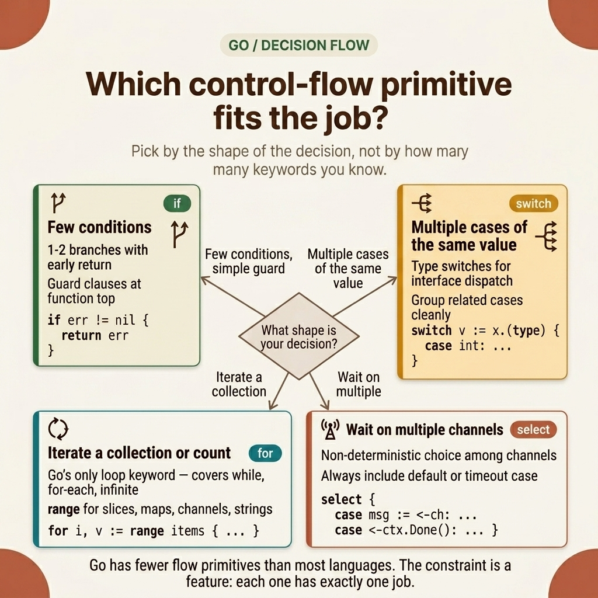
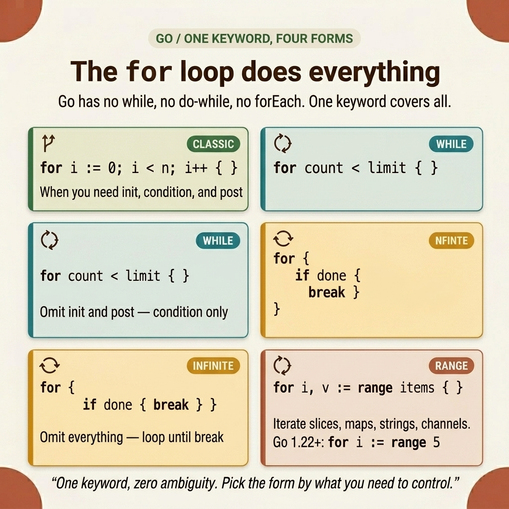

<!-- tags: golang --> # 🔀 Điều khiển luồng & vòng lặp — if, for, switch, select > Go điều khiển luồng logic bằng bốn từ khóa. `for` thay thế `while` . `switch` tự động ngắt. `select` ghép kênh channels . Ít từ khóa hơn, ít lỗi hơn.

📅 Đã tạo: 20-03-2026 · 🔄 Đã cập nhật: 19-04-2026 · ⏱️ 12 phút đọc

| Khía cạnh | Chi tiết |
| ----------------- | ---------------------------------------------------------------------------- |
| **Khái niệm** | Go điều khiển luồng nguyên thủy: `if` , `for` , `switch` , `select` |
| **Trường hợp sử dụng** | Phân nhánh logic, lặp, ghép kênh channel |
| **Thông tin chi tiết quan trọng** | `for` thay thế `while` . `switch` tự động ngắt. `select` xử lý channels . |
| ** Go triết lý** | Ít từ khóa hơn → ít tải nhận thức hơn → ít lỗi hơn |

---

## 1. ĐỊNH NGHĨA

Bạn chuyển từ Java sang Go và tiếp cận `while` . Trình biên dịch từ chối nó. Bạn viết một trường hợp `switch` và quên `break` . Mã hoạt động - vì Go tự động ngắt. Bạn thử `forEach` trên slice . Nó không tồn tại. `for range` thực hiện công việc. Go thu gọn 6–8 từ khóa luồng điều khiển điển hình được tìm thấy trong C/Java thành bốn: `if` , `for` , `switch` và `select` . Mỗi từ khóa hấp thụ nhiều vai trò. Kết quả: ít cú pháp để ghi nhớ hơn, ít cơ hội hơn cho các lỗi cổ điển như lỗi sai `switch` của C hoặc lỗi vô hạn ngẫu nhiên của Java `while(true)` .

### 1.1 Từ khóa luồng điều khiển

| Tuyên bố | Mục đích | Ví dụ |
| --------- | ------------------------------- | ------------------------------- |
| `if` | Có điều kiện với tùy chọn init | `if err := fn(); err != nil {}` |
| `for` | Từ khóa vòng lặp duy nhất | `for i := 0; i < n; i++ {}` |
| `switch` | Đa nhánh có tính năng tự động ngắt | `switch v.(type) {}` |
| `select` | bộ ghép kênh Channel | `select { case <-ch: }` |
| `goto` | Nhảy nhãn (hiếm) | Đường dẫn dọn dẹp lỗi |
| `defer` | Cuộc gọi hoãn lại (LIFO stack ) | `defer f.Close()` |

> **Tại sao không `while` ?** Rob Pike: *"Nếu `for` có thể làm mọi thứ, tại sao lại thêm `while` ?"* `for condition {}` là một vòng lặp while. `for {}` là một vòng lặp vô hạn. Một từ khóa. Không mơ hồ.

### 1.2 Đối với các biến thể vòng lặp

| Biến thể | Cú pháp | Tương đương trong C/Java |
| ------------- | ----------------------------- | -------------------- |
| Cổ điển | `for i := 0; i < n; i++ {}` | Kiểu C cho |
| Trong khi | `for condition {}` | vòng lặp while |
| Vô hạn | `for {}` | trong khi (đúng) |
| Phạm vi slice | `for i, v := range slice {}` | forEach |
| Phạm vi map | `for k, v := range map {}` | forEach khóa-giá trị |
| Chuỗi phạm vi | `for i, r := range "utf8" {}` | Lặp lại rune Unicode |
| Phạm vi channel | `for v := range ch {}` | Nhận cho đến khi đóng |
| Số nguyên phạm vi | `for i := range 5 {}` | Go 1.22+ chỉ |

> **Tại sao chuỗi `range string` yield rune?** Go chuỗi là chuỗi byte UTF-8. Một ký tự đơn như "世" chiếm 3 byte. `range` giải mã từng ký tự thành một chữ rune, trả về `(byteIndex, rune)` — xử lý Unicode chính xác mà không cần giải mã thủ công.

### 1.3 Cơ chế chuyển mạch

| Tính năng | Mô tả |
| ---------------- | -------------------------------------------- |
| Tự động ngắt | Mỗi trường hợp tự động chấm dứt |
| Đa giá trị | `case "a", "b", "c":` khớp với any |
| Vô cảm | `switch { case x > 0: }` thay thế if-else |
| Công tắc loại | `switch v := x.(type) { case int: }` |
| `fallthrough` | Chọn tham gia rõ ràng để thực hiện trường hợp tiếp theo |

> **Tại sao tự động ngắt?** Việc quên `break` trong câu lệnh chuyển đổi C sẽ gây ra lỗi ngầm. Go đảo ngược mặc định: các trường hợp tự động bị hỏng. Chỉ sử dụng `fallthrough` khi bạn thực sự cần nó.

### 1.4 Select Ghép kênh `select` chặn cho đến khi một trong các thao tác channel của nó sẵn sàng:

| Mẫu | Cú pháp | Hành vi |
| ------------- | ------------------------------------ | -------------------------- |
| Đa- channel | `select { case <-ch1: case <-ch2: }` | Chặn cho đến khi sẵn sàng |
| Hết giờ | `case <-time.After(1s):` | Giới hạn thời gian chờ đợi |
| Không chặn | trường hợp `default:` | Tiến hành ngay lập tức |
| Hủy bỏ | `case <-ctx.Done():` | Tôn trọng tín hiệu ngữ cảnh |

> **Điều gì sẽ xảy ra nếu hai channels sẵn sàng đồng thời?** Go chọn ngẫu nhiên một. Điều này ngăn ngừa nạn đói và đảm bảo sự công bằng trên channels .

### 1.5 Chế độ lỗi

| Lỗi | Nguyên nhân | Sửa chữa |
| ---------------------------- | ---------------------------------------- | -------------------------------------- |
| Vòng lặp vô hạn | Thiếu điều kiện thoát vòng lặp | Luôn có điều kiện giới hạn hoặc `break` |
| `time.After` rò rỉ trong vòng lặp | Tạo bộ đếm thời gian mới mỗi lần lặp | Sử dụng `time.NewTimer` với `.Stop()` |
| Lồng nhau `break` sai lửa | `break` thoát khỏi `select` , không phải bên ngoài `for` | Sử dụng dấu ngắt có nhãn: `break outerLoop` |
| Đột biến sao chép phạm vi | Sửa đổi bản sao, không phải bản gốc | Sử dụng chỉ mục: `slice[i].field = val` |

---

Các từ khóa và cơ chế của chúng rất rõ ràng. Nhưng làm thế nào để bạn chọn đúng khi phải đối mặt với quyết định phân nhánh cho time đầu tiên?

## 2. HÌNH ẢNH  *Hình: Quyết định map cho luồng điều khiển Go — bắt đầu với loại câu hỏi (nhánh? lặp lại? đợi channel ?) và đi đến từ khóa chính xác. `if` cho các nhánh đơn giản, `switch` cho hơn 3 điều kiện, `for` cho tất cả các vòng lặp, `select` cho ghép kênh channel .*

Quyết định map trả lời "từ khóa nào?" Các ví dụ bên dưới cho thấy cách mỗi từ khóa hoạt động trong mã sản xuất.  _Hình: Bốn dạng đặc trưng của vòng lặp Go 's `for` — cổ điển, while, vô hạn và phạm vi — mỗi dạng được chọn theo những gì bạn cần kiểm soát. Một từ khóa thay thế `for` , `while` , `do-while` và `forEach` ._

## 3. MÃ

### Ví dụ 1: Cơ bản — Câu lệnh If init & For Range

> **Mục tiêu**: Phạm vi chặt chẽ các biến lỗi bằng cách sử dụng câu lệnh init `if` .
> **Phương pháp tiếp cận**: Kết hợp việc khởi tạo `if` với lần lặp `for range` .
> **Độ phức tạp**: Cơ bản```go
package main

import (
    "fmt"
    "os"
)

func main() {
    // err is scoped to this if block — it does not leak.
    if f, err := os.Open("config.yaml"); err != nil {
        fmt.Println("Cannot open:", err)
    } else {
        defer f.Close()
        fmt.Println("Opened:", f.Name())
    }

    // Range returns (index, copy). Modifying the copy does not change the slice.
    fruits := []string{"Apple", "Banana", "Cherry"}
    for i, fruit := range fruits {
        fmt.Printf("[%d] %s\n", i, fruit)
    }

    // Go 1.22+: range over integers
    for i := range 5 {
        fmt.Print(i, " ")
    }
}
```> **Bài học rút ra**: Câu lệnh init `if` giới hạn `err` trong khối có liên quan. `for range` xử lý các chỉ số và giá trị trong một dòng, thay thế các vòng đếm thủ công.

### Ví dụ 2: Trung cấp — Chuyển mẫu & Type Switch > **Mục tiêu**: Thay thế chuỗi `if-else` dài bằng biểu thức chuyển đổi rõ ràng hơn.
> **Phương pháp tiếp cận**: Sử dụng công tắc vô cảm cho phạm vi và type switch để kiểm tra loại runtime .
> **Độ phức tạp**: Trung cấp```go
package main

import "fmt"

// Expressionless switch replaces if-else chains for range checks.
func classify(score int) string {
    switch {
    case score >= 90:
        return "A — Excellent"
    case score >= 80:
        return "B — Good"
    default:
        return "F — Fail"
    }
}

// Type switch extracts the concrete type from an interface.
func describe(val any) string {
    switch v := val.(type) {
    case int:
        return fmt.Sprintf("integer: %d", v)
    case string:
        return fmt.Sprintf("string(%d chars): %q", len(v), v)
    default:
        return fmt.Sprintf("unknown type: %T", v)
    }
}

func main() {
    fmt.Println(classify(85))   // B — Good
    fmt.Println(describe(42))   // integer: 42
}
```> **Điểm rút ra**: Vô biểu thức `switch` đọc rõ ràng hơn chuỗi `if-else` khi so sánh các phạm vi. Công tắc loại trích xuất một cách an toàn các loại cụ thể từ các giá trị `any` / `interface{}` mà không cần xác nhận thủ công.

### Ví dụ 3: Nâng cao — Select + Hết thời gian + Hủy ngữ cảnh

> **Mục tiêu**: Ghép kênh channels với hỗ trợ thời gian chờ và hủy.
> **Phương pháp tiếp cận**: Sử dụng `select` để chạy đua kết quả channel với `time.After` và `ctx.Done()` để tắt máy một cách nhẹ nhàng.
> **Độ phức tạp**: Nâng cao```go
package main

import (
    "context"
    "fmt"
    "time"
)

// select races the result against a timeout deadline.
func fetchWithTimeout(url string, timeout time.Duration) (string, error) {
    result := make(chan string, 1)

    go func() {
        time.Sleep(100 * time.Millisecond) // simulate network call
        result <- fmt.Sprintf("Response from %s", url)
    }()

    select {
    case data := <-result:
        return data, nil
    case <-time.After(timeout):
        return "", fmt.Errorf("timeout after %v", timeout)
    }
}

// ctx.Done() exits the worker loop when the parent cancels.
func worker(ctx context.Context, tasks <-chan int) {
    for {
        select {
        case <-ctx.Done():
            fmt.Println("worker: context cancelled")
            return
        case task, ok := <-tasks:
            if !ok {
                return // channel closed
            }
            fmt.Println("processing:", task)
        }
    }
}

func main() {
    data, err := fetchWithTimeout("api.example.com", 300*time.Millisecond)
    if err != nil {
        fmt.Println(err)
    } else {
        fmt.Println(data)
    }
}
```> **Takeaway**: `select` biến các thao tác channel thành điểm quyết định — bất kỳ channel nào kích hoạt trước sẽ thắng. `time.After` cung cấp ranh giới thời gian chờ. `ctx.Done()` cho phép cha mẹ ra hiệu tắt máy mà không cần buộc phải tắt goroutines .

---

## 4. Cạm bẫy

| # | Mức độ nghiêm trọng | Cạm bẫy | Hậu quả | Sửa chữa |
| --- | --------- | --------------------------------------------- | --------------------------------------------- | -------------------------------------------------- |
| 1 | 🔴 Gây tử vong | `time.After` bên trong một vòng lặp chặt chẽ | Tạo bộ đếm thời gian mới mỗi lần lặp → rò rỉ bộ nhớ | Sử dụng `time.NewTimer` và gọi `.Stop()` sau khi sử dụng |
| 2 | 🔴 Gây tử vong | `break` bên trong `select` trong vòng lặp `for` | Phá vỡ `select` , không phải vòng lặp bên ngoài | Sử dụng dấu ngắt có nhãn: `break outerLoop` |
| 3 | 🟡 Chung | Sửa đổi biến vòng lặp `for range` | Thay đổi bản sao chứ không phải phần tử gốc | Sử dụng quyền truy cập chỉ mục: `slice[i].field = val` |
| 4 | 🟡 Chung | Dựa vào thứ tự lặp map | Thứ tự được sắp xếp ngẫu nhiên — các bài kiểm tra trở nên không ổn định | Sắp xếp các khóa trước khi lặp |
| 5 | 🔵 Nhỏ | Sử dụng `fallthrough` trong switch | Gây nhầm lẫn cho người đánh giá; hiếm khi có sự lựa chọn đúng đắn | Để lại tự động ngắt; chỉ sử dụng `fallthrough` khi không thể tránh khỏi |

---

## 5. GIỚI THIỆU

| Tài nguyên | Loại | Liên kết | Lưu ý |
| ---------------------- | -------- | --------------------------------------------------------------------------------------------------------------- | ------------------------------- |
| Go Spec — Tuyên bố | Chính thức | [go.dev/ref/spec#Statements](https://go.dev/ref/spec#Statements) | Thông số ngôn ngữ có thẩm quyền |
| Go Tour — Kiểm soát luồng | Chính thức | [go.dev/tour/flowcontrol/1](https://go.dev/tour/flowcontrol/1) | Hướng dẫn tương tác |
| Hiệu quả Go — Kiểm soát | Chính thức | [go.dev/doc/effective_go#control-structures](https://go.dev/doc/effective_go#control-structures) | Mẫu thành ngữ |

---

## 6. KHUYẾN NGHỊ

Luồng điều khiển cho chương trình biết phải làm gì. Câu hỏi tiếp theo: điều gì xảy ra khi có sự cố xảy ra - các tập tin vẫn mở, hoạt động sản xuất bị gián đoạn, tài nguyên bị rò rỉ?

| Mở rộng sang | Khi nào | Lý do | Tập tin |
| ------------------------- | ------------------------------ | ---------------------------------------------- | --------------------------------------------------------------- |
| Defer , Panic , Recover | Dọn dẹp tài nguyên trên các đường dẫn trở lại | `defer` đảm bảo dọn dẹp; `recover` bắt hoảng loạn | [03-defer-panic-recover.md](./03-defer-panic-recover.md) |
| Pointers & Bộ nhớ | Hiểu từng giá trị so với pointer | Go chuyển các bản sao theo mặc định; pointers sửa đổi bản gốc | [04-pointers-memory.md](./04-pointers-memory.md) |
| Cú pháp & Biến | Xem lại khai báo `var` so với `:=` | Cú pháp cơ bản mà bài viết này xây dựng trên | [01-syntax-variables.md](./01-syntax-variables.md) |
| Goroutines & Channels | Đưa `select` đi sâu hơn vào concurrency | `select` là cổng vào các mẫu Go concurrency | [../../concurrency/01-goroutines-and-channels.md](../../concurrency/01-goroutines-and-channels.md) |

---

**Điều hướng**: [← Syntax & Variables](./01-syntax-variables.md) · [→ Defer, Panic, Recover](./03-defer-panic-recover.md)