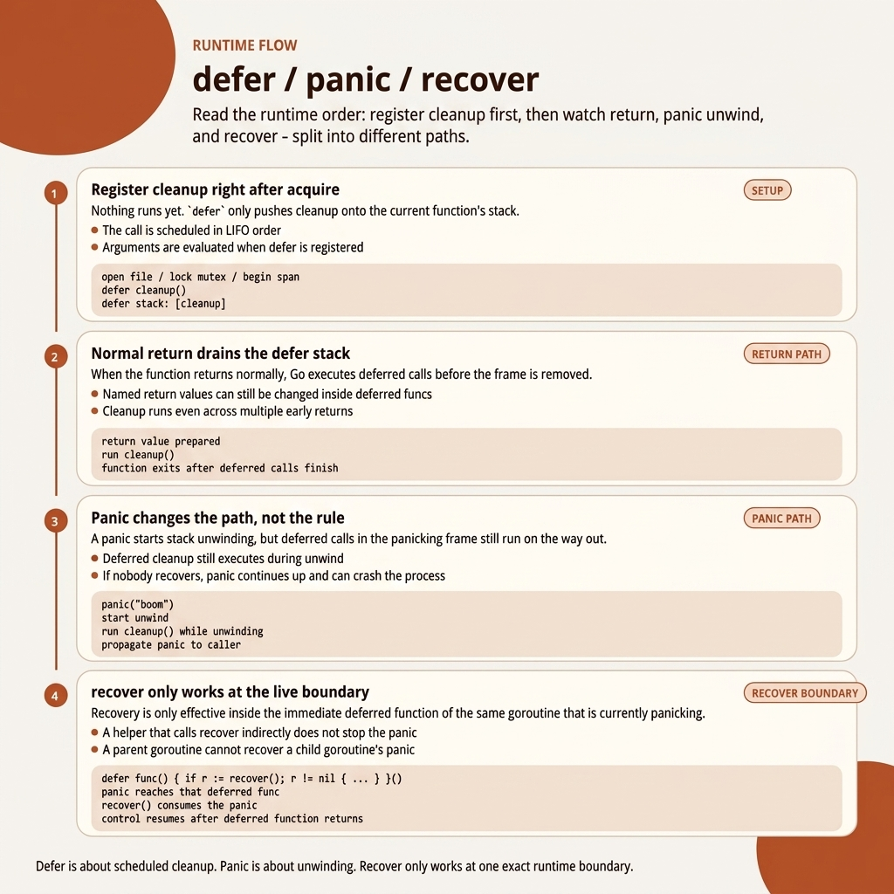
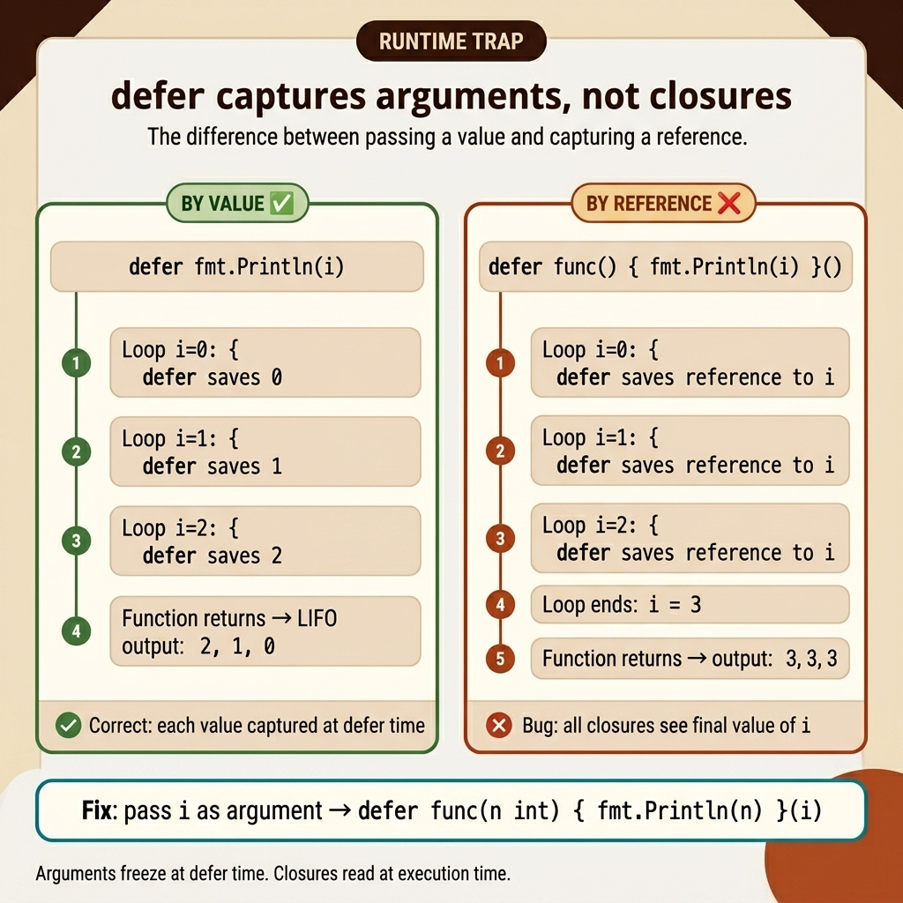

<!-- tags: golang, error-handling --> # ⏸️ Defer , Panic , Recover — Quản lý tài nguyên & Khôi phục lỗi

> Defer stack , panic / recover quy trình, mô hình dọn dẹp tài nguyên — yếu tố cần thiết trong sản xuất

📅 Đã tạo: 20-03-2026 · 🔄 Đã cập nhật: 19-04-2026 · ⏱️ 20 phút đọc

| Khía cạnh | Chi tiết |
| --------------- | ---------------------------------------------------------------------------------------------------------------------------------- |
| **Khái niệm** | Defer stack , panic lan truyền, recover ranh giới, thời gian dọn dẹp |
| **Trường hợp sử dụng** | Dọn dẹp tệp/socket/khóa, lỗi khởi động, ranh giới panic , khôi phục giao dịch |
| **Thông tin chi tiết quan trọng** | `defer` là nguyên thủy của luồng điều khiển để dọn dẹp; `panic` / `recover` là các công cụ ranh giới, không phải mô hình lỗi mặc định |

## 1. ĐỊNH NGHĨA

> _Hãy tưởng tượng việc viết một hàm mở một tệp, kết nối với database và lấy một khóa — và nó có 5 điểm trả về khác nhau. Chỉ thiếu một thao tác đóng sẽ tạo ra rò rỉ tài nguyên. Thiếu một lần mở khóa sẽ kích hoạt deadlock ._

### 1.1 Cơ chế Defer — Runtime là gì

Khi Go runtime gặp `defer` , nó:

1. **Đánh giá tất cả các đối số ngay lập tức** — nắm bắt các giá trị của chúng tại thời điểm chính xác đó.
2. **Đẩy bản ghi defer vào defer stack ** của goroutine hiện tại.
3. **Trì hoãn thực thi** cho đến khi hàm kèm theo kết thúc.

### 1.2 Ghi lại đối số — Quy tắc chi tiết Go áp dụng hai cơ chế cốt lõi để ghi lại các đối số:

| Cơ chế | Ví dụ | Khi nào cần đánh giá |
| ---------------- | -------------------------------- | ------------------------------------ |
| Lập luận trực tiếp | `defer f(x)` | **Ngay sau khi thực hiện** |
| Closure | `defer func() { use(x) }()` | **Khi defer chạy** |
| Pointer receiver | `defer obj.Method()` ( pointer ) | **Khi defer chạy** (thông qua pointer ) |
| Giá trị receiver | `defer obj.Method()` (giá trị) | **Ngay sau khi thực hiện** (bản sao)|

### 1.3 Tương tác trả về được đặt tên — Cơ học sâu

Các biến trả về được đặt tên nằm trong khung stack của hàm kèm theo. closure bị trì hoãn có thể đọc và sửa đổi chúng trước khi hàm thực sự trả về.```go
func queryDB(id int) (user User, err error) {
    defer func() {
        if err != nil {
            err = fmt.Errorf("queryDB(id=%d): %w", id, err)
        }
    }()
    // ...if the query fails, err will automatically be richly wrapped
}
```### 1.4 `measureTime("name")()` — Giải phẫu mẫu

Mẫu `defer f()()` là một lệnh gọi kép: lệnh gọi bên ngoài chạy ngay lập tức để thiết lập, hàm trả về chạy ở defer time .```go
// ✅ CORRECT: start time captured at the defer line, cleanup runs on return
defer measureTime("fn")()
```### 1.5 Panic Lưu lượng```
panic("msg")
    ↓
① Current function stops executing immediately
    ↓
② All deferred functions in scope run in LIFO order
    ↓
③ If any defer calls recover() → panic stops, function returns with named return values
    ↓
④ If no recover → panic propagates up the call stack, crashing the goroutine
```## 2. HÌNH ẢNH

Các nhà phát triển thường bị nhầm lẫn nhất khi ba luồng khác nhau tương tác với nhau: thực thi defer bình thường, giải nén panic và bắt [[E6]]].  _Hình: dấu vết trạng thái Runtime — đăng ký defer , panic thư giãn và ranh giới duy nhất nơi recover bắt được panic ._  _Hình: So sánh song song giữa việc chụp đối số defer (theo giá trị — chính xác) so với việc chụp closure (theo tham chiếu — lỗi). Đối số đóng băng tại `defer` time ; closures đọc biến khi thực thi time ._

## 3. MÃ

### Ví dụ 1: Cơ bản — Defer để dọn dẹp tài nguyên

> **Mục tiêu**: Đảm bảo đóng tài nguyên trong tất cả các lần kiểm tra xác thực sớm một cách an toàn.```go
package main

import (
    "database/sql"
    "fmt"
    "io"
    "net/http"
    "os"
    "sync"
)

// ✅ File cleanup — defer right after Open
func copyFile(src, dst string) (int64, error) {
    source, err := os.Open(src)
    if err != nil {
        return 0, fmt.Errorf("open source: %w", err)
    }
    defer source.Close() 

    dest, err := os.Create(dst)
    if err != nil {
        return 0, fmt.Errorf("create dest: %w", err)
    }
    defer dest.Close()

    n, err := io.Copy(dest, source)
    dest.Sync()

    return n, err
}

func fetchURL(url string) ([]byte, error) {
    resp, err := http.Get(url)
    if err != nil {
        return nil, err
    }
    defer resp.Body.Close()

    return io.ReadAll(resp.Body)
}
```> **Takeaway**: Đặt `defer resp.Body.Close()` ngay sau `http.Get()` thành công. Thiếu nó làm rò rỉ bộ mô tả tập tin một cách âm thầm.

### Ví dụ 2: Trung cấp — Defer Gotchas & Trả về có tên

> **Mục tiêu**: Hiểu thời điểm defer đánh giá các đối số so với khi closures nắm bắt các tham chiếu trực tiếp.```go
package main

import (
    "fmt"
    "os"
)

// GOTCHA 1: Arguments evaluated immediately
func deferArgsTrap() {
    x := 10
    defer fmt.Println("defer with arg:", x) // ✅ x=10 captured NOW
    x = 20
}

// GOTCHA 3: Defer within loops causes Resource Leaks
func deferInLoopBAD(files []string) {
    for _, path := range files {
        f, _ := os.Open(path)
        defer f.Close() // ❌ BAD! Defer closure hits exclusively AFTER the function returns
    }
}
```> **Takeaway**: Closures ghi lại các tham chiếu đến các biến chứ không phải các bản sao. Các đối số được truyền trực tiếp đến defer ​​được đánh giá tại dòng defer .

### Ví dụ 3: Nâng cao — Panic / Recover trong Sản xuất

> **Mục tiêu**: Phát hiện các lỗi bên trong trình xử lý HTTP và trả về lỗi JSON hợp lệ thay vì làm hỏng máy chủ.```go
package main

import (
    "log"
    "net/http"
    "runtime/debug"
)

func recoveryMiddleware(next http.Handler) http.Handler {
    return http.HandlerFunc(func(w http.ResponseWriter, r *http.Request) {
        defer func() {
            if err := recover(); err != nil {
                stack := debug.Stack()
                log.Printf("PANIC recovered: %v\nStack:\n%s", err, stack)
                
                w.WriteHeader(http.StatusInternalServerError)
                w.Write([]byte(`{"error":"internal server error"}`))
            }
        }()
        next.ServeHTTP(w, r)
    })
}

// ✅ Safe abstract goroutine wrapper
func safeGo(fn func()) {
    go func() {
        defer func() {
            if r := recover(); r != nil {
                log.Printf("Goroutine isolated panic: %v", r)
            }
        }()
        fn()
    }()
}
```> **Takeaway**: Phần mềm trung gian khôi phục ở ranh giới HTTP sẽ ngăn chặn một trình xử lý hoảng loạn làm hỏng toàn bộ máy chủ.

### Ví dụ 4: Expert — Defer Nhóm tài nguyên & chuỗi dọn dẹp dựa trên

> **Mục tiêu**: Xây dựng chuỗi dọn dẹp chạy nhiều chức năng giải phóng tài nguyên theo thứ tự ngược lại, thu thập tất cả lỗi.```go
package main

import (
    "errors"
    "log"
)

type CleanupFunc func() error

type ResourceManager struct {
    cleanups []CleanupFunc
}

func (rm *ResourceManager) Add(name string, fn CleanupFunc) {
    rm.cleanups = append(rm.cleanups, func() error {
        log.Printf("Cleaning: %s", name)
        return fn()
    })
}

func (rm *ResourceManager) CleanupAll() error {
    var errs []error
    for i := len(rm.cleanups) - 1; i >= 0; i-- {
        if err := rm.cleanups[i](); err != nil {
            errs = append(errs, err)
        }
    }
    return errors.Join(errs...)
}
```> **Bài học rút ra**: Khi nhiều tài nguyên phụ thuộc lẫn nhau, chuỗi dọn dẹp với việc thực thi theo thứ tự ngược và thu thập lỗi sẽ ngăn chặn các lỗi dọn dẹp một phần che giấu các lỗi khác.

## 4. Cạm bẫy

| # | Mức độ nghiêm trọng | Lỗi | Sửa chữa |
| --- | --------- | ---------------------------------------------- | --------------------------------------------- |
| 1 | 🔴 Gây tử vong | Defer bên trong một vòng lặp = rò rỉ tài nguyên | Trích xuất thành một hàm hoặc đóng rõ ràng |
| 2 | 🔴 Gây tử vong | Panic vượt qua ranh giới goroutine | Sử dụng trình bao bọc `safeGo()` với recover |
| 3 | 🟡 Chung | `defer f(x)` — x được đánh giá ngay lập tức | Sử dụng closure để nắm bắt các bản cập nhật một cách có chủ đích |

## 5. GIỚI THIỆU

| Tài nguyên | Liên kết |
| --- | --- |
| Go Blog: Defer | https://go.dev/blog/ defer - panic -and- recover |
| Go Thông số | https://go.dev/ref/spec#Defer_statements |


---

**Điều hướng**: [← Syntax & Variables](./01-syntax-variables.md) · [→ Pointers & Memory](./04-pointers-memory.md)