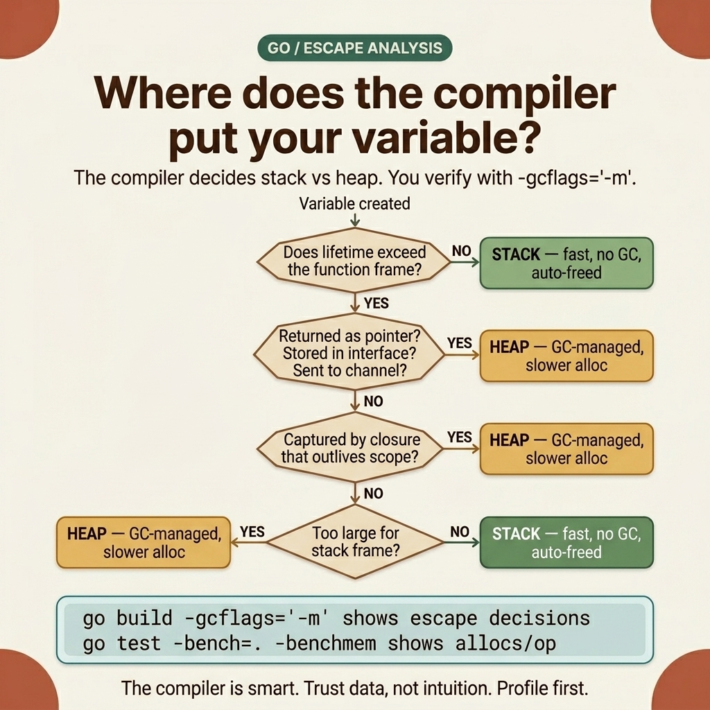

<!-- tags: golang, memory --> # 🎯 Pointers & Bộ nhớ — Stack , Heap , Escape, Alloc

> Stack so với heap , pointer ngữ nghĩa, đường dẫn phân bổ, escape analysis và điều chỉnh phân bổ trong Go .

📅 Đã tạo: 20-03-20 · 🔄 Cập nhật: 19-04-2026 · ⏱️ 24 phút đọc

| Khía cạnh | Chi tiết |
| --- | --- |
| **Khái niệm** | Pointer ngữ nghĩa, stack so với heap , phân bổ, escape analysis |
| **Trường hợp sử dụng** | Đọc kết quả đầu ra của trình biên dịch một cách chính xác, giảm phân bổ/op, tránh áp lực GC |
| ** Go stdlib** | `unsafe` , `testing` , `sync` , `bytes` , `strings` |
| **Thông tin chi tiết quan trọng** | Go không cho phép bạn chọn stack hoặc heap theo cú pháp; trình biên dịch và runtime quyết định |

---

## 1. ĐỊNH NGHĨA

Hãy tưởng tượng bạn nhận được một sự hồi quy sau những gì có vẻ như là một sự tối ưu hóa vô hại. Trình xử lý cũ trả về `User` theo giá trị. Một bộ tái cấu trúc đã thay đổi nó thành `*User` để "giảm bản sao". Những người trợ giúp khác đã được đổi thành `new(T)` . benchmarks nhỏ không có vấn đề gì. Nhưng dưới lưu lượng truy cập thực tế, `allocs/op` tăng vọt, cấu hình heap tăng lên và GC làm chậm đường đi nóng.

Nếu bạn đã từng ở trong tình huống đó, bạn biết vấn đề không phải là " pointer có tốt hơn một giá trị hay không". Vấn đề là sử dụng một mô hình tinh thần đơn giản trong đó trình biên dịch, runtime , stack tăng trưởng, heap phân bổ và escape analysis đều can thiệp. Bài viết này thay thế mô hình tinh thần đó bằng một mô hình chính xác để xem xét mã, benchmarks và gỡ lỗi.

### Giá trị 1.1 so với ngữ nghĩa Pointer Trong Go , câu hỏi đầu tiên không phải là " stack hay heap ", mà là "chúng ta đang chuyển một giá trị hay đang chuyển quyền truy cập vào một đối tượng được chia sẻ".

| Cơ chế | Đã qua cái gì | Hậu quả cốt lõi |
| --- | --- | --- |
| `func f(x T)` | Bản sao của `T` | Hàm nhận một giá trị riêng; những thay đổi không ảnh hưởng đến người gọi |
| `func f(x *T)` | Địa chỉ tới `T` | Hàm có thể thay đổi dữ liệu gốc nhưng phải đối mặt với `nil` và trạng thái chia sẻ |
| Phương thức value receiver | Một bản sao của receiver | An toàn cho các loại nhỏ và trạng thái bất biến |
| Phương thức pointer receiver | Địa chỉ của receiver | Sử dụng khi cần thay đổi hoặc tránh sao chép lớn structs |

A pointer chỉ giải quyết được hai điều:

- Tránh sao chép một giá trị lớn hoặc nhạy cảm với đột biến
- Cho phép nhiều đoạn code nhìn thấy cùng một đối tượng

A pointer **không** tự động có nghĩa là:

- Đối tượng chắc chắn nằm trên heap - Mã chắc chắn là nhanh hơn
- Phần GC sẽ có phần khó hơn hoặc dễ hơn time ### 1.2 Ý nghĩa thực sự của Stack so với Heap Trong Go `stack` và `heap` không phải là từ khóa. Chúng là hai không gian bộ nhớ khác nhau mà runtime và trình biên dịch select cho dữ liệu của bạn.

| Bất động sản | Stack | Heap |
| --- | --- | --- |
| Phân bổ | Được gắn với khung stack hoặc bộ lưu trữ sao lưu trình biên dịch nội bộ | Được quản lý bởi runtime |
| Trọn đời | Kết thúc khi frame không còn cần dữ liệu | Được mở rộng cho đến khi không thể truy cập được đối tượng |
| Chi phí | Cực kỳ rẻ nếu trình biên dịch có tuổi thọ ngắn | Đắt hơn do có sự tham gia của người cấp phát và GC |
| Quyền sở hữu | Nằm gần với luồng thực thi hiện tại | Có thể tồn tại lâu hơn phạm vi của chức năng hiện tại |
| GC | Không cần đánh dấu/quét đối với khung stack | Garbage Collector có liên quan |

Điểm quan trọng nhất: trong Go , **bạn không viết cú pháp để chọn stack hoặc heap **. Bạn viết mã. Trình biên dịch phân tích nó. Nếu trình biên dịch chứng minh rằng đối tượng không cần phải tồn tại lâu hơn phạm vi hiện tại thì nó có thể giữ đối tượng đó trên stack hoặc trong các thanh ghi. Nếu không chứng minh được điều này thì đối tượng phải đi đến heap .

### 1.3 Đường dẫn phân bổ: `var` , `new` , `make` , Chữ tổng hợp

Đây là nơi nhiều người học Go bị lừa bởi cú pháp.

| Cú pháp | Nó làm gì | Những gì nó **không** đảm bảo |
| --- | --- | --- |
| `var x T` | Tạo giá trị 0 của `T` | Không đảm bảo `x` nằm trên stack hoặc heap |
| `x := T{...}` | Tạo một giá trị `T` | Không đảm bảo giá trị sẽ không thoát |
| `new(T)` | Trả về `*T` trỏ đến giá trị 0 | Không có nghĩa là "luôn luôn heap " |
| `make([]T, ...)` | Tạo tiêu đề slice / map / channel runtime | Không có nghĩa là bộ lưu trữ dự phòng chắc chắn nằm trên stack |
| `&T{...}` | Trả về pointer thành một chữ tổng hợp | Không tự động có nghĩa là "xấu" hoặc " heap -heavy" |

Những điểm cần lưu ý:

- `new(T)` cung cấp cho bạn ** pointer ngữ nghĩa**
- `make` tạo runtime -các cấu trúc được quản lý như slices , maps và channels - Vị trí dữ liệu thực tế cuối cùng là một vấn đề escape analysis và runtime Nếu bạn chỉ ghi nhớ `new = heap` , bạn sẽ đọc sai kết quả đầu ra của trình biên dịch ngay từ đầu.

### 1.4 Escape Analysis : Quyết định ẩn giấu

Phân tích thoát là giai đoạn mà trình biên dịch đặt câu hỏi trực tiếp:

> "Đối tượng này có cần tồn tại lâu hơn phạm vi nơi nó được tạo không?"

Nếu câu trả lời là "không", trình biên dịch có thể giữ nó trên stack . Nếu câu trả lời là "có" hoặc "Tôi không thể chứng minh là không", trình biên dịch phải đặt đối tượng vào heap .

Các tín hiệu phổ biến khiến vật thể trốn thoát:

- Trả về pointer cho dữ liệu cục bộ
- Truyền một giá trị vào interface trong đó trình biên dịch không thể giữ nó thuần túy cục bộ
- Chụp một biến cục bộ trong closure có thể tồn tại lâu hơn khung chính
- Chuyển một tham chiếu tới một goroutine khác 
- Tạo một đối tượng quá lớn hoặc có hình dạng ngăn cản trình biên dịch giữ nó trên stack Hai sự thật phải được phân biệt rõ ràng:

1. Sử dụng pointer **không đủ** để kết luận một đối tượng nằm trên heap 2. Không sử dụng pointer **không đảm bảo** đối tượng nằm trên stack ### 1.5 Các kiểu bất biến và lỗi

Đây là lớp chuyên gia của chủ đề này: những sự thật luôn đúng cho dù bạn có thích hay không.

- `new(T)` trả về a `*T` , nhưng vị trí vẫn do trình biên dịch quyết định.
- `return &x` hợp lệ trong Go vì trình biên dịch có thể chuyển `x` sang heap khi cần.
- Tiêu đề slice có thể cục bộ, nhưng phần hỗ trợ array của nó mới là điều bạn thực sự quan tâm khi thảo luận về phân bổ.
- `[]T` vs `[]*T` không chỉ là sự lựa chọn về phong cách. Chúng thay đổi vị trí bộ đệm, chi phí quét GC và mô hình đột biến.
- Benchmarks đừng kể toàn bộ câu chuyện nếu bạn không xem kỹ hồ sơ `allocs/op` , `B/op` , và heap .

Lý thuyết cho đến thời điểm này đã đủ để ngừng nhầm lẫn tên với cơ chế. Nhưng nếu bạn không hình dung được vòng đời của đối tượng, bạn vẫn sẽ đoán sai về nơi việc phân bổ thực sự xảy ra.

---

Các chế độ lỗi ở trên đáng để đọc lại trước khi gỡ lỗi phân bổ tiếp theo session . Bẫy phổ biến nhất: nhìn thấy `new(T)` và kết luận " heap ", hoặc chuyển từ `[]T` sang `[]*T` mà không kiểm tra địa phương và [[E71]]] chi phí quét.

## 2. HÌNH ẢNH

Các bảng và các bất biến mô tả _những gì tồn tại_ — nhưng thời gian tồn tại không xuất hiện rõ ràng. Bạn chỉ thấy hậu quả thông qua số lượng phân bổ, cấu hình heap hoặc áp lực GC . Đây là lý do tại sao phần trực quan phải nhắm trực tiếp vào mô hình tinh thần chứ không chỉ vẽ sơ đồ pointer đẹp.  *Hình: Thẻ mô hình trí tuệ phân tách bốn khía cạnh khó hiểu nhất của hành vi bộ nhớ Go : đường dẫn giá trị cục bộ, huyền thoại pointer , đường dẫn thoát chung và quy tắc đo lường thay vì đoán.*

Khi bốn ý tưởng này được đặt đúng vị trí, đoạn mã bên dưới sẽ trở nên có giá trị: bạn sẽ đọc các ví dụ bằng cách hỏi _trình biên dịch nhìn thấy thời gian tồn tại bao lâu?_ thay vì đoán _điều này có trên heap hay stack ?_.  _Hình: Cây quyết định escape analysis của trình biên dịch - bốn câu hỏi xác định vị trí stack so với heap . Xác minh bằng `go build -gcflags='-m'` thay vì đoán._

## 3. MÃ

Bây giờ chúng ta có mô hình tinh thần cho ** Pointers & Memory — Stack , Heap , Escape, Alloc**. Chúng ta hãy map mã hóa để xem mọi quyết định nhỏ - giá trị hoặc pointer , phân bổ trước hay không, gộp chung hoặc tạo mới - thực sự thay đổi hành vi phân bổ như thế nào.

### Ví dụ 1: Cơ bản — Ngữ nghĩa pointer khác với ngữ nghĩa giá trị như thế nào

> **Mục tiêu**: Nêu rõ sự khác biệt giữa quyền truy cập sao chép và quyền truy cập chia sẻ trước khi thảo luận stack / heap .
> **Phương pháp**: Sử dụng struct đủ lớn để cho thấy việc sao chép là thật nhưng đủ nhỏ để tránh khiến bạn cho rằng pointers ​​luôn là tối ưu.
> **Ví dụ**: `markShippedByValue(order)` không sửa đổi thứ tự ban đầu; `markShippedByPointer(&order)` thì có.
> **Độ phức tạp**: O(1) time , O(1) không gian.```go
package main

import "fmt"

type Order struct {
	ID       int64
	Status   string
	Amount   int64
	Currency string
}

func markShippedByValue(o Order) {
	// o is a copy of the caller's value.
	o.Status = "shipped"
}

func markShippedByPointer(o *Order) {
	if o == nil {
		return
	}
	// o points to the exact object the caller holds.
	o.Status = "shipped"
}

func main() {
	order := Order{
		ID:       42,
		Status:   "pending",
		Amount:   150_000,
		Currency: "VND",
	}

	markShippedByValue(order)
	fmt.Println("after value call:", order.Status) // pending

	markShippedByPointer(&order)
	fmt.Println("after pointer call:", order.Status) // shipped
}
```> **Bài học rút ra**: Ở cấp độ cơ bản, pointer chủ yếu là một sự lựa chọn về mặt ngữ nghĩa: bạn muốn biến đổi đối tượng gốc hoặc làm việc với một bản sao.
> **Caveat**: Không có gì trong ví dụ này đủ để kết luận liệu đối tượng có nằm trên stack hay heap . Pointer ngữ nghĩa và vị trí phân bổ là hai câu hỏi khác nhau.
> **Khi nào nên sử dụng**: Khi bạn đang xem lại mã và cần phân biệt giữa lỗi ngữ nghĩa sao chép và lỗi phân bổ/lỗi trọn đời.

### Ví dụ 2: Trung cấp — `new` , `&value` , closures , và escape analysis > **Mục tiêu**: Kết nối lý thuyết escape analysis với các mẫu Go hàng ngày.
> **Cách tiếp cận**: Đặt các hàm trông giống nhau cạnh nhau nhưng có thời gian tồn tại khác nhau, sau đó đọc `-gcflags="-m -m"` dọc theo mã.
> **Ví dụ**: `buildValue()` trả về một giá trị, `buildPointer()` trả về pointer , `captureInClosure()` giữ một biến cục bộ tồn tại thông qua closure .
> **Độ phức tạp**: O(1) time , O(1) dung lượng mỗi cuộc gọi; phần quan trọng là hành vi phân bổ.```go
package main

import "fmt"

type User struct {
	ID   int64
	Name string
}

func buildValue() User {
	u := User{ID: 1, Name: "Lan"}
	return u
}

func buildPointer() *User {
	u := User{ID: 2, Name: "Minh"}
	return &u
}

func buildWithNew() *User {
	u := new(User)
	u.ID = 3
	u.Name = "Anh"
	return u
}

func captureInClosure() func() string {
	label := "request-hot-path"
	return func() string {
		return label
	}
}

func main() {
	fmt.Println(buildValue())
	fmt.Println(buildPointer())
	fmt.Println(buildWithNew())

	next := captureInClosure()
	fmt.Println(next())
}
```

```bash
go build -gcflags="-m -m" main.go
```

```text
# illustrative output, exact wording varies by Go version
./main.go:14:6: can inline buildValue
./main.go:20:2: u escapes to heap
./main.go:24:10: new(User) escapes to heap
./main.go:31:2: label escapes to heap
```> **Tại sao `new(User)` không phải luôn là "cú pháp heap "?**
> `new(User)` chỉ có nghĩa là bạn muốn một `*User` . Vị trí Heap hoặc stack vẫn phụ thuộc vào việc pointer đó có cần tồn tại lâu hơn phạm vi hiện tại hay không. Trong ví dụ này, `buildWithNew()` trả về a pointer , do đó đối tượng phải tồn tại sau khi hàm kết thúc; do đó, trình biên dịch đặt nó trên heap . Nhưng trong một đường dẫn khác, nếu pointer chỉ được sử dụng nội bộ và không thoát, trình biên dịch có thể giữ đối tượng cục bộ.
>
> **Tại sao closures thường khiến mọi người hiểu sai về phân bổ?**
> Nhìn bề ngoài, nó chỉ là một biến chuỗi `label` nhỏ. Nhưng closure tách thời gian tồn tại của `label` khỏi khung stack hiện tại. Khi closure có thể tồn tại lâu hơn hàm gốc của nó, trình biên dịch phải chọn đường dẫn an toàn.

> **Takeaway**: Phân tích thoát không quan tâm bạn thích cú pháp nào. Nó chỉ quan tâm liệu một đối tượng có cần tồn tại ngoài phạm vi hiện tại hay không.
> **Hãy cẩn thận**: Không ghi nhớ từng dòng đầu ra của trình biên dịch như một quy tắc cứng nhắc. Cùng một khối mã có thể yield đầu ra hơi khác nhau tùy thuộc vào phiên bản trình biên dịch.
> **Khi nào nên sử dụng**: Khi đọc `-gcflags="-m -m"` và ánh xạ các thông báo của trình biên dịch tới đúng vấn đề tồn tại trong mã nguồn của bạn.

### Ví dụ 3: Nâng cao — Áp lực phân bổ thường xuất phát từ hình dạng của đường dẫn dữ liệu

> **Mục tiêu**: Cho thấy rằng áp lực phân bổ không chỉ đến từ `return &x` mà còn đến từ việc chọn `[]T` so với `[]*T` , phân bổ trước so với không phân bổ và buộc runtime liên tục tăng dung lượng lưu trữ hỗ trợ.
> **Phương pháp tiếp cận**: So sánh hai đường dẫn dữ liệu thực hiện cùng một công việc: tích lũy người dùng và trả về kết quả. Một đường dẫn liên tục tạo pointers và nối thêm mà không cần phân bổ trước; cái còn lại giữ `[]User` liền kề và phân bổ dung lượng trả trước chính xác.
> **Ví dụ**: `buildPointerSlice` vs `buildValueSlice` .
> **Độ phức tạp**: O(n) time ; hành vi phân bổ là khác nhau rõ ràng.```go
package main

import "fmt"

type User struct {
	ID   int64
	Name string
}

func buildPointerSlice(n int) []*User {
	var users []*User
	for i := 0; i < n; i++ {
		u := &User{
			ID:   int64(i),
			Name: fmt.Sprintf("user-%d", i),
		}
		users = append(users, u)
	}
	return users
}

func buildValueSlice(n int) []User {
	users := make([]User, 0, n)
	for i := 0; i < n; i++ {
		users = append(users, User{
			ID:   int64(i),
			Name: fmt.Sprintf("user-%d", i),
		})
	}
	return users
}

func main() {
	fmt.Println(len(buildPointerSlice(4)))
	fmt.Println(len(buildValueSlice(4)))
}
```

```bash
go test -bench=. -benchmem
```> **Tại sao `[]*User` không phải lúc nào cũng tệ mà thường đắt hơn bạn nghĩ?**
> `[]*User` rất hữu ích khi mọi đối tượng đều yêu cầu danh tính riêng, đột biến chung hoặc quá lớn để sao chép giá trị có hiệu quả. Nhưng sự đánh đổi là có nhiều đối tượng hơn trên heap , vị trí bộ nhớ kém hơn và yêu cầu GC quét thêm nhiều pointers . Để xử lý dữ liệu hàng loạt hoặc các đường dẫn đọc nhiều, `[]User` thường cung cấp bố cục bộ nhớ nhỏ gọn và thân thiện với bộ nhớ đệm.
>
> **Tại sao việc phân bổ trước lại quan trọng hơn nhiều người nhận ra?**
> Nếu bạn đã biết `n` , việc sử dụng `make([]User, 0, n)` không chỉ làm giảm việc tái phân bổ. Nó cũng làm giảm số lần phần sao lưu array phải phát triển và sao chép dữ liệu cơ bản của nó. Trong một đường dẫn nóng, kiểu tối ưu hóa đơn giản này bền vững hơn nhiều so với việc thử các thủ thuật với `unsafe` package .

> **Bài học rút ra**: Một phần đáng kể áp lực phân bổ bắt nguồn từ hình dạng dữ liệu và mô hình tăng trưởng, không chỉ một dòng `return &x` duy nhất.
> **Hãy cẩn thận**: Không tái cấu trúc một cách máy móc tất cả `[]*T` thành `[]T` . Nếu đối tượng cơ bản bắt buộc phải chia sẻ đột biến hoặc chứa lượng dữ liệu khổng lồ thì sự cân bằng về hiệu suất sẽ hoàn toàn khác.
> **Khi nào nên sử dụng**: Khi điều tra `allocs/op` cao bên trong các đường dẫn xử lý hàng loạt, lớp tuần tự hóa hoặc mã tổng hợp dữ liệu.

### Ví dụ 4: Expert — Tối ưu hóa phân bổ mà không lừa dối chính mình

> **Mục tiêu**: Biến mô hình tinh thần thành một mẫu có thể đo lường được: phân bổ trước, tái sử dụng bộ đệm và đo điểm chuẩn bằng cách sử dụng `allocs/op` .
> **Cách tiếp cận**: Sử dụng `bytes.Buffer` theo đường dẫn nóng, nhưng không tạo liên tục các cái mới; tích hợp `sync.Pool` cùng với benchmarks để xác định các khu vực thực sự có thể tối ưu hóa.
> **Ví dụ**: Hiển thị tải trọng liên tục bằng cách sử dụng `strings.Builder` / `bytes.Buffer` , được đo bằng `testing.B` .
> **Độ phức tạp**: O(n) time mỗi lần kết xuất; giá trị thực sự nằm ở việc cắt giảm số lượng phân bổ và giảm bớt áp lực GC .```go
package main

import (
	"bytes"
	"fmt"
	"sync"
	"testing"
)

var payloadPool = sync.Pool{
	New: func() any {
		return new(bytes.Buffer)
	},
}

func renderWithPool(id int64, status string) string {
	buf := payloadPool.Get().(*bytes.Buffer)
	buf.Reset()
	defer payloadPool.Put(buf)

	// Buffer is reused across multiple calls instead of allocating fresh per request.
	fmt.Fprintf(buf, `{"id":%d,"status":"%s"}`, id, status)

	// String() generates its own distinct string result, so returning the buffer to the pool is entirely safe here.
	return buf.String()
}

func BenchmarkRenderWithPool(b *testing.B) {
	b.ReportAllocs()
	for i := 0; i < b.N; i++ {
		_ = renderWithPool(int64(i), "ok")
	}
}

func main() {
	_ = renderWithPool(1, "ok")
}
```

```bash
go test -bench=RenderWithPool -benchmem
```> **Tại sao `sync.Pool` là tối ưu hóa có điều kiện chứ không phải phép thuật?**
> `sync.Pool` chỉ hữu ích khi bạn liên tục tạo ra các đối tượng tạm thời có thời gian tồn tại rất ngắn và có thể xác minh là an toàn để sử dụng lại. Nó không thể thay thế logic nghiệp vụ solid , không thể khắc phục bố cục dữ liệu kém và không đóng vai trò là bộ nhớ đệm liên tục. GC có thể quét toàn bộ hồ bơi theo ý mình. Nếu bạn không thể chứng minh rõ ràng rằng một đối tượng nằm trực tiếp trên đường dẫn nóng gây ra áp lực phân bổ có thể kiểm chứng được thì việc giới thiệu `sync.Pool` chỉ khiến mã khó đọc hơn.
>
> **Tại sao benchmark phải bao gồm phần tường thuật về việc phân bổ?**
> Nếu chỉ nhìn vào `ns/op` , bạn dễ dàng bỏ lỡ thực tế là heap đang tăng giá nhanh chóng hoặc GC đang trả một khoản thuế nặng nề cho bạn vì khối lượng công việc được duy trì liên tục. Các số liệu `allocs/op` và `B/op` là nơi mô hình tinh thần trở thành bằng chứng thực nghiệm.

> **Bài học rút ra**: Tối ưu hóa phân bổ tốt là tối ưu hóa dựa trên bằng chứng. Nó bắt đầu hoàn toàn từ vòng đời của đối tượng và hình dạng dữ liệu, không phải bằng cách phân tán pointers hoặc `sync.Pool` một cách mù quáng ở khắp mọi nơi.
> **Cẩn thận**: Nếu tải trọng nhỏ, thông lượng tối thiểu hoặc đường dẫn thực thi không "nóng", mã đơn giản hầu như luôn có giá trị hơn việc tiết kiệm một vài phân bổ nhỏ.
> **Khi nào nên sử dụng**: Khi bạn có bằng chứng chắc chắn thông qua benchmarks hoặc hồ sơ chứng minh rằng áp lực phân bổ đang thực sự góp phần lớn vào độ trễ của hệ thống hoặc tình trạng xáo trộn bộ nhớ.

Hiểu được con đường đúng đắn vẫn chưa đủ, bởi vì miền này rất dễ bị _nói những sự thật cá nhân nhưng lại đưa ra những quyết định sai lầm trên toàn cầu_. Phần cạm bẫy nêu rõ điều này cụ thể xảy ra ở đâu.

## 4. Cạm bẫy

Lý thuyết là rõ ràng. Điều còn lại là tránh những kết luận nghe có vẻ đúng nhưng lại dẫn đến tối ưu hóa sai lầm trong quá trình đánh giá và sản xuất mã.

| # | Mức độ nghiêm trọng | Lỗi | Hậu quả | Sửa chữa |
| --- | --- | --- | --- | --- |
| 1 | 🔴 Gây tử vong | Giả sử `new(T)` luôn phân bổ trên heap | Đọc sai đầu ra của trình biên dịch, tối ưu hóa các điểm sai | Kiểm tra tuổi thọ; chạy `-gcflags="-m -m"` trên đường dẫn thực |
| 2 | 🔴 Gây tử vong | Sử dụng `*T` ở mọi nơi vì " pointers nhanh hơn" | Lỗi đột biến chung, địa phương kém, chi phí quét GC cao hơn | Sử dụng pointers cho nhu cầu ngữ nghĩa hoặc chi phí được đo lường, không phải thói quen |
| 3 | 🔴 Gây tử vong | Trả lại đối tượng về `sync.Pool` mà không cần đặt lại trạng thái | Rò rỉ dữ liệu giữa các yêu cầu, lỗi không thể tái tạo | Gọi `Reset()` hoặc 0 đối tượng trước `Put()` |
| 4 | 🟡 Chung | Chuyển từ `[]T` sang `[]*T` sớm | Nhiều đối tượng heap hơn, vị trí bộ đệm kém hơn | Giữ `[]T` cho các đường dẫn theo đợt/đọc nhiều trừ khi cần nhận dạng chung |
| 5 | 🟡 Chung | Chỉ đo điểm chuẩn `ns/op` , bỏ qua `allocs/op` và `B/op` | Nhanh benchmarks , nhưng sản xuất là GC -bound | Luôn báo cáo số liệu phân bổ cùng với độ trễ |
| 6 | 🟡 Chung | Viết lại kiến ​​trúc sau một dòng đầu ra escape analysis | Kỹ thuật quá mức mà không khắc phục được nút thắt cổ chai thực sự | Kiểm tra chéo đầu ra của trình biên dịch với cấu hình benchmarks và heap |
| 7 | 🔵 Nhỏ | Khó hiểu " stack / heap " với bộ nhớ "an toàn/không an toàn" | Trừu tượng sai trong đánh giá mã | Tách ba câu hỏi: ngữ nghĩa, tuổi thọ, đo lường |

Khi bạn nhìn thấy những cái bẫy này, bước tiếp theo đúng đắn không phải là tìm kiếm mọi phân bổ. Thay vào đó: đọc bằng chứng ở lớp bên phải (trình biên dịch, benchmark , hồ sơ) và chỉ sau đó đưa ra kết luận.

---

## 5. GIỚI THIỆU

| Tài nguyên | Loại | Liên kết | Ghi chú |
| --- | --- | --- | --- |
| Go Thông số | Chính thức | [go.dev/ref/spec](https://go.dev/ref/spec) | Nguồn chính xác cho giá trị, pointer và ngữ nghĩa tổng hợp theo nghĩa đen |
| Có hiệu lực Go | Chính thức | [go.dev/doc/effective_go](https://go.dev/doc/effective_go) | Thành ngữ thực tế để chọn giá trị so với pointers |
| GC Hướng dẫn | Chính thức | [tip.golang.org/doc/gc-guide](https://tip.golang.org/doc/gc-guide) | GC chi phí và điều chỉnh bộ nhớ |
| `sync.Pool` tài liệu | Chính thức | [pkg.go.dev/sync#Pool](https://pkg.go.dev/sync#Pool) | Yêu cầu và cảnh báo đối với nhóm đối tượng |
| `unsafe` tài liệu | Chính thức | [pkg.go.dev/unsafe](https://pkg.go.dev/unsafe) | quy tắc `unsafe.Pointer` và quy định bù trừ struct |
| Lập hồ sơ chương trình Go | Chính thức | [go.dev/blog/profiling-go-programs](https://go.dev/blog/profiling-go-programs) | Kết nối các câu hỏi phân bổ với bằng chứng hồ sơ cụ thể |

## 6. KHUYẾN NGHỊ Go những điều cơ bản được đề cập. Mỗi chủ đề dưới đây lấy một khái niệm từ bài viết này và khám phá nó một cách sâu sắc.

| Gia hạn | Khi nào nên đọc tiếp | Lý do | Tập tin |
| --- | --- | --- | --- |
| Defer , Panic , Recover | Trộn tuổi thọ của đối tượng với thời gian dọn dẹp | Tách biệt vòng đời của đối tượng khỏi việc dọn dẹp tài nguyên | [./03-defer-panic-recover.md](./03-defer-panic-recover.md) |
| Kiểm soát luồng & vòng lặp | Lỗi phân bổ gắn liền với closures bên trong vòng lặp | Nhiều phân bổ ngẫu nhiên bắt đầu từ ngữ nghĩa vòng lặp | [./02-control-flow-loops.md](./02-control-flow-loops.md) |
| Slices , Maps , Chuỗi | Các câu hỏi về việc hỗ trợ tăng trưởng arrays , slice , chuyển đổi | Bước tiếp theo tự nhiên ngoài ngữ nghĩa pointer vào bố cục bộ sưu tập | [../types/01-slices-maps-strings.md](../types/01-slices-maps-strings.md) |
| Hồ sơ Hiệu suất | Bạn nghi ngờ phân bổ áp lực và cần bằng chứng cứng rắn | Kết nối `allocs/op` với cấu hình heap và biểu đồ ngọn lửa | [../../advanced/05-performance-pprof.md](../../advanced/05-performance-pprof.md) |
| GC Nội bộ | Hiểu mức tăng trưởng heap và nhịp độ GC | Bước tiếp theo hợp lý sau khi nắm vững hành vi stack / heap | [../../advanced/01-garbage-collector.md](../../advanced/01-garbage-collector.md) |
| `sync.Pool` & Vùng đệm | Đường dẫn nóng tạo quá nhiều đối tượng tạm thời | Chuyển từ lý luận phân bổ sang các mẫu tái sử dụng đối tượng | [../../concurrency/04-sync-pool.md](../../concurrency/04-sync-pool.md) |

---

**Điều hướng tuần tự**: [← Defer/Panic](./03-defer-panic-recover.md) · [→ Types](../types/README.md)