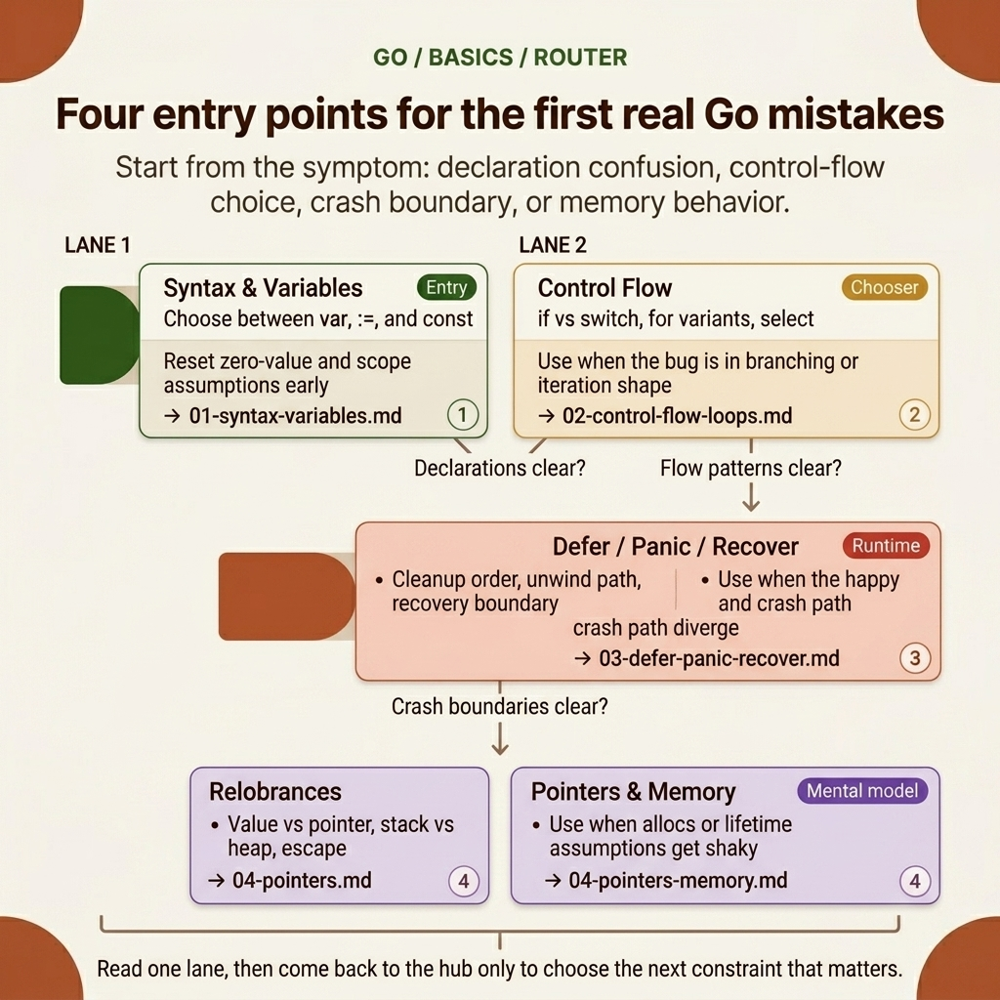

<!-- tags: golang, overview -->

# Basics — Syntax, Variables, Control Flow, Defer, Pointers

> Go fundamentals: from basic syntax and control flow to defer/panic/recover, stack, heap, pointer semantics, and memory allocation in Go.

📅 Updated: 2026-04-19 · ⏱️ 6 min read

## 1. DEFINE

Go syntax looks trivial until a code review exposes a shadowed variable, a misused defer, or a pointer that escaped to the heap. **Basics** covers the four foundational layers where those bugs originate.

This hub maps pain points to the correct article in `fundamental/basics`. Use it to pick an entry point — not to skim links.

### 1.1 Signals & Boundaries

- Open this hub when you know you are within the `fundamental/basics` cluster but remain uncertain about which article to read first.
- This hub maps pain points to articles. It does not replace them.
- If you find yourself constantly jumping between articles while still feeling confused, it is typically because you selected the wrong initial lane, rather than a lack of definitions.

### 1.2 Learning Lanes

- `Go Basics — Basic Syntax` — start here for declarations, zero values, and type fundamentals.
- `Control Flow & Loops` — start here when the question involves branching, iteration, or `select` semantics.
- `Defer, Panic, Recover` — start here when the issue involves cleanup ordering, crash boundaries, or rollback logic.
- `Pointers & Memory` — start here when the issue involves `allocs/op`, heap profiling, closure capture, or value-vs-pointer decisions.
- After each article, return here to select the next lane.

## 2. VISUAL

The `fundamental/basics` lane is intended to correct mental models, so the visuals here prioritize quick scannability over sequential descriptions. The PNG below helps you choose the correct entry point based on actual symptoms rather than reading the entire cluster sequentially.



_Figure: The `basics` router map divides lanes by the four most common foundational errors: declaration, control flow, crash boundary, and memory behavior._

Once you understand which layer you are struggling with, the code section below does only one thing: it compresses that navigational logic into an artifact short enough to remember and reuse during code reviews or further self-study.

## 3. CODE

The flow is conceptually clear. Now, let us distill it down to an artifact that a Go team can read, review, and maintain as an execution standard.

### Example 1: Router artifact — selecting an article by reading objective

> **Objective**: Transform this hub into a navigation tool rather than a passive link list.
> **Approach**: Map the learning objective or symptom directly to the appropriate opening file.
> **Example**: Select a lane based on concerns such as fundamentals, framework, concurrency, or production ops.
> **Complexity**: O(1) at the navigation level; the critical part is selecting the correct entry point.

```go
func chooseLane(goal string) string {
    switch goal {
    case "syntax variables": return "./01-syntax-variables.md"
    case "control flow loops": return "./02-control-flow-loops.md"
    case "defer panic recover": return "./03-defer-panic-recover.md"
    case "stack heap pointer alloc": return "./04-pointers-memory.md"
    case "pointers memory": return "./04-pointers-memory.md"
    default: return "./README.md"
    }
}
```

This pseudo-router is not code meant to be executed in an application; it is a way to compress the navigational spirit of the hub into a concise artifact. Reading the hub with this mindset will help you maintain a more cohesive learning rhythm.

## 4. PITFALLS

The most dangerous part of **Basics — Syntax, variables, control flow, defer, pointers** usually does not lie in the theory itself, but in small decisions that drastically alter the outcome.

| # | Severity | Pitfall | Consequence | Fix |
| --- | --- | --- | --- | --- |
| 1 | 🔴 Fatal | Skimming the hub as a passive link list | Reader picks the wrong entry point | Start from a specific pain point or symptom |
| 2 | 🟡 Common | Jumping to advanced articles without foundational context | Terms memorized in isolation, applied incorrectly | Pick one entry point and follow the sequence |
| 3 | 🔵 Minor | Not returning to the hub after finishing an article | Reader loses the thread between articles | Return here after each lane to pick the next step |

## 5. REF

| Resource | Type | Link | Notes |
| --- | --- | --- | --- |
| A Tour of Go — Basics | Official | https://go.dev/tour/basics/1 | Quick reset for syntax, declarations, and basic flows |
| A Tour of Go — Flow Control | Official | https://go.dev/tour/flowcontrol/1 | The official entry point for `if`, `for`, `switch`, and `defer` |
| Go Spec — Statements | Official | https://go.dev/ref/spec#Statements | The source of truth for control flow semantics |
| Effective Go — Control Structures | Official | https://go.dev/doc/effective_go#control-structures | Pragmatic idioms when writing flow control in real-world code |

## 6. RECOMMEND

After reading this article, the priority is not to memorize more definitions, but to cleanly transition to the correct related concept.

| Expansion | When to Read Next | Reason | File/Link |
| --- | --- | --- | --- |
| Go Basics — Basic Syntax | When declarations, zero values, or shadowing are unclear | Covers the foundation all other articles assume | [./01-syntax-variables.md](./01-syntax-variables.md) |
| Control Flow & Loops | When branching, iteration, or `select` is the focus | Bridges syntax knowledge to real control-flow decisions | [./02-control-flow-loops.md](./02-control-flow-loops.md) |
| Defer, Panic, Recover — Resource Management & Error Recovery | When the flow begins touching cleanup, crash boundaries, or rollback logic | This is where basic syntax encounters runtime semantics for the first time | [./03-defer-panic-recover.md](./03-defer-panic-recover.md) |
| Pointers & Memory — Stack, Heap, Escape, Alloc | When symptoms tap into allocs, escape analysis, or GC pressure | Directly enters the lane explaining lifetime and allocation behaviors | [./04-pointers-memory.md](./04-pointers-memory.md) |
| Go Programming | When switching Go clusters | Return to the root router to select a different lane | [../README.md](../README.md) |
