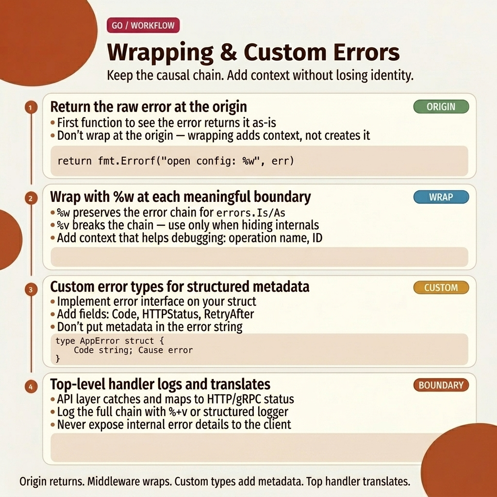

<!-- tags: golang, error-handling -->
# ❌ Error Handling — Wrapping, Sentinel, Custom Errors

> Go treats errors as values — no exceptions, no try-catch. You wrap errors with context using `%w`, inspect chains with `errors.Is()`, and extract structured types with `errors.As()`.

📅 Created: 2026-03-20 · 🔄 Updated: 2026-04-19 · ⏱️ 17 min read

| Aspect          | Detail                                                  |
| --------------- | ------------------------------------------------------- |
| **Concept**     | Error wrapping, sentinel errors, custom error types     |
| **Use case**    | Structured failure handling across service layers        |
| **Key insight** | `%w` preserves the chain; `errors.Is/As` inspects it    |
| **Go proverb**  | "Don't just check errors, handle them gracefully"       |

---

## 1. DEFINE

Your API handler calls a service, which calls a repository, which calls PostgreSQL. The query fails with `connection refused`. The handler logs: `"something went wrong"`. Three hours later, the on-call engineer still cannot find the root cause because every layer swallowed the original error and replaced it with a fresh string.

This is the problem Go's error wrapping solves. Each layer adds its own context — function name, parameter values, operation description — while preserving the original failure at the bottom of the chain. When the error reaches the handler, `errors.Is(err, pgx.ErrNoRows)` still returns `true`, even through three layers of wrapping. The engineer reads one log line and knows exactly which query, which parameter, and which infrastructure failure caused the problem.

But there is a trap. Using `%v` instead of `%w` in `fmt.Errorf` silently breaks the chain. The error message looks identical in logs, but `errors.Is` stops working. Tests pass because they compare strings. Production breaks because the middleware checks error types.

### 1.1 Error Types — 4 Patterns

Go provides four error patterns. Each serves a different purpose:

| Type            | Description                          | Use case                                    |
| --------------- | ------------------------------------ | ------------------------------------------- |
| **Sentinel**    | Package-level exported variable      | `var ErrNotFound = errors.New("not found")` |
| **Custom type** | Struct implementing the `error` interface | Carries HTTP status, operation name, metadata |
| **Wrapped**     | Error chain via `fmt.Errorf("context: %w", err)` | Adds breadcrumbs while preserving the root cause |
| **Opaque**      | Returns `error` without exposing internals | Hides implementation details across package boundaries |

> **Why sentinel errors?** Comparing error strings is brittle. If the database driver changes `"not found"` to `"no rows"`, your `err.Error() == "not found"` check breaks silently. Sentinel variables like `ErrNotFound` give you a stable, type-safe comparison target via `errors.Is(err, ErrNotFound)`.

### 1.2 Error Functions (Go 1.13+)

| Function                     | Description                                     |
| ---------------------------- | ----------------------------------------------- |
| `errors.New("msg")`          | Create a simple error value                     |
| `fmt.Errorf("ctx: %w", err)` | Wrap an error with additional context            |
| `errors.Is(err, target)`     | Walk the chain and check for a specific sentinel |
| `errors.As(err, &target)`    | Walk the chain and extract a specific error type |
| `errors.Unwrap(err)`         | Return the next error in the chain               |
| `errors.Join(err1, err2)`    | Combine multiple errors into one (Go 1.20+)      |

> **Why `%w` instead of `%v`?** `%v` converts the wrapped error into a flat string — `errors.Is` and `errors.As` can no longer traverse the chain. `%w` preserves the original error as a linked value, keeping the entire chain inspectable.

### 1.3 Failure Modes

| # | Severity  | Defect                                  | Consequence                                  | Fix                                             |
|---|-----------|----------------------------------------|----------------------------------------------|------------------------------------------------|
| 1 | 🔴 Fatal  | Using `%v` instead of `%w`            | Error chain breaks; `errors.Is` returns false | Always use `%w` when wrapping errors            |
| 2 | 🔴 Fatal  | Comparing error strings (`err.Error() == "..."`) | Breaks when error messages change         | Use sentinel variables with `errors.Is`         |
| 3 | 🟠 Major  | Calling `panic` for expected failures  | Crashes the entire process                   | Return `error` for expected conditions          |
| 4 | 🟡 Common | Wrapping at every layer without adding value | Log messages become unreadable chains    | Add context only when it provides new information |

---

The four error types and their functions form the foundation. The visual below shows how wrapping builds a chain — and how `errors.Is` traverses it.

## 2. VISUAL

The most dangerous aspect of error handling is not the syntax — it is the invisible chain. When three layers each wrap an error, developers need to see the full unwrap path to understand why `errors.Is` matches or fails.



*Figure: Error wrapping chain from repository through service to handler. Each `%w` wrap preserves the original error. `errors.Is` traverses the entire chain from top to bottom. Using `%v` at any layer severs the chain permanently.*

With the chain mechanics visible, the code section below demonstrates three escalating patterns: sentinel errors with wrapping, custom error types with `errors.As`, and multi-layer chains with `errors.Join`.

## 3. CODE

With **Error Handling — Wrapping, Sentinel, Custom Errors**, the wrapping chain is clear. Now we map it to code: sentinel errors for stable comparisons, custom types for rich metadata, and `errors.Join` for aggregating validation failures.

### Example 1: Basic — Sentinel Errors & Wrapping

You open a config file. The file does not exist. Your function wraps the error with the file path, and the caller checks `os.ErrNotExist` through the chain. One wrap, one check — the simplest pattern.

> **Objective**: Wrap an `os` error with context and verify it through the chain using `errors.Is`.
> **Approach**: `fmt.Errorf("readConfig(%s): %w", path, err)` preserves the chain. `errors.Is(err, os.ErrNotExist)` traverses it.
> **Example**: `readConfig("/nonexistent")` → wrapped error → `errors.Is` still finds `os.ErrNotExist`.

```go
package main

import (
    "errors"
    "fmt"
    "os"
)

// ✅ Sentinel errors — package level, exported
var (
    ErrNotFound     = errors.New("not found")
    ErrUnauthorized = errors.New("unauthorized")
    ErrForbidden    = errors.New("forbidden")
)

// ✅ Always check errors — Go idiom #1
func readConfig(path string) ([]byte, error) {
    data, err := os.ReadFile(path)
    if err != nil {
        // ✅ Wrap with context using %w — preserve error chain
        return nil, fmt.Errorf("readConfig(%s): %w", path, err)
    }
    return data, nil
}

func main() {
    data, err := readConfig("/nonexistent")
    if err != nil {
        fmt.Println("Error:", err)
        // Error: readConfig(/nonexistent): open /nonexistent: no such file or directory

        // ✅ errors.Is() traverses the chain — finds os.ErrNotExist despite wrapping
        if errors.Is(err, os.ErrNotExist) {
            fmt.Println("File does not exist")
        }
        return
    }
    fmt.Println(string(data))
}
```

> **Conclusion**: `%w` adds the file path for debugging without breaking the chain. The caller uses `errors.Is` to match `os.ErrNotExist` through the wrap. If you replace `%w` with `%v`, the log looks the same — but `errors.Is` silently stops working.
>
> **When to use**: Sentinel errors work best when callers from other packages need to check for specific conditions. Export the sentinel (`var ErrNotFound`) and wrap with context at each layer.

Sentinel errors handle simple identity checks. But when you need to carry structured metadata — HTTP status codes, operation names, request IDs — a custom error type is the right tool.

---

### Example 2: Intermediate — Custom Error Types

Your API returns HTTP 404, but the handler cannot extract the status code from a plain `error`. You need a `struct` that satisfies the `error` interface while carrying fields for HTTP code, operation name, and the underlying error.

> **Objective**: Build a custom error type that carries structured metadata and supports `errors.Is`/`errors.As` chain traversal.
> **Approach**: `AppError` struct with `Error()` and `Unwrap()` methods. Constructor helpers enforce consistent creation.
> **Example**: `GetUser(42)` returns an `AppError`. The handler extracts the HTTP status code via `errors.As`.

```go
package main

import (
    "errors"
    "fmt"
    "net/http"
)

// ✅ Custom error type — carries structured context
type AppError struct {
    Code    int    `json:"code"`
    Message string `json:"message"`
    Op      string `json:"op"`    // Operation that failed
    Err     error  `json:"-"`     // Underlying error (wrapped)
}

func (e *AppError) Error() string {
    if e.Err != nil {
        return fmt.Sprintf("[%s] %s: %v", e.Op, e.Message, e.Err)
    }
    return fmt.Sprintf("[%s] %s", e.Op, e.Message)
}

// ✅ Implement Unwrap() so errors.Is/As can traverse through AppError
func (e *AppError) Unwrap() error {
    return e.Err
}

// ✅ Constructor helpers — enforcing consistent error creation
func NewNotFoundError(op string, err error) *AppError {
    return &AppError{Code: http.StatusNotFound, Message: "not found", Op: op, Err: err}
}

func NewValidationError(op, msg string) *AppError {
    return &AppError{Code: http.StatusBadRequest, Message: msg, Op: op}
}

// ✅ Service using custom errors
var ErrUserNotFound = errors.New("user not found")

func GetUser(id int64) (*struct{ Name string }, error) {
    if id <= 0 {
        return nil, NewValidationError("GetUser", "id must be positive")
    }
    return nil, NewNotFoundError("GetUser", fmt.Errorf("id=%d: %w", id, ErrUserNotFound))
}

func main() {
    _, err := GetUser(42)
    if err != nil {
        // ✅ errors.Is — sentinel check through the chain
        if errors.Is(err, ErrUserNotFound) {
            fmt.Println("User not found!")
        }

        // ✅ errors.As — extract typed error to access structured fields
        var appErr *AppError
        if errors.As(err, &appErr) {
            fmt.Printf("HTTP %d: %s (op: %s)\n", appErr.Code, appErr.Message, appErr.Op)
        }
    }
}
```

> **Why both `errors.Is` and `errors.As`?**
> `errors.Is` answers "is this specific sentinel somewhere in the chain?" — a boolean identity check. `errors.As` answers "is there an `*AppError` somewhere in the chain, and if so, give me a reference to it." You need both: `Is` for routing decisions, `As` for extracting metadata like HTTP status codes or operation names.
>
> **Conclusion**: Custom error types turn errors from opaque strings into structured data. `Unwrap()` keeps the chain traversable. Constructor helpers enforce consistent creation across the codebase.

Custom types handle single errors with rich metadata. But validation often fails for multiple reasons at once — missing name, invalid email, weak password. Go 1.20's `errors.Join` aggregates them into a single error value.

---

### Example 3: Advanced — Error Wrapping Chain & Multi-error

Your handler calls a service, which calls a repository. Each layer wraps the error with its function name. The final error message reads like a call stack: `handler.GetUser: service.GetUser: query users WHERE id=42: connection refused`. Meanwhile, your validation function collects multiple errors and returns them as one.

> **Objective**: Build a 3-layer wrapping chain and aggregate multiple validation errors with `errors.Join`.
> **Approach**: Each layer uses `fmt.Errorf("layer: %w", err)`. Validation collects errors into a slice and joins them.
> **Example**: `handler_GetUser(42)` produces a full call-path error. `validateUser("", "a")` produces two errors in one.

```go
package main

import (
    "errors"
    "fmt"
)

// ✅ Error wrapping chain — each layer adds its context
func repository_FindUser(id int64) error {
    return fmt.Errorf("query users WHERE id=%d: %w", id, errors.New("connection refused"))
}

func service_GetUser(id int64) error {
    err := repository_FindUser(id)
    if err != nil {
        return fmt.Errorf("service.GetUser: %w", err)
    }
    return nil
}

func handler_GetUser(id int64) error {
    err := service_GetUser(id)
    if err != nil {
        return fmt.Errorf("handler.GetUser: %w", err)
    }
    return nil
}

// ✅ Multi-error — aggregate validation failures into one error
func validateUser(name, email string) error {
    var errs []error
    if name == "" {
        errs = append(errs, errors.New("name is required"))
    }
    if email == "" {
        errs = append(errs, errors.New("email is required"))
    }
    if len(email) > 0 && len(email) < 5 {
        errs = append(errs, errors.New("email too short"))
    }
    return errors.Join(errs...)  // nil if no errors ← elegant!
}

func main() {
    // ✅ Error chain shows full call path
    err := handler_GetUser(42)
    fmt.Println(err)
    // handler.GetUser: service.GetUser: query users WHERE id=42: connection refused

    // ✅ Multi-error — both failures reported in one value
    err = validateUser("", "a")
    if err != nil {
        fmt.Println(err)
        // name is required
        // email too short
    }
}
```

> **Why layer wrapping instead of logging at each layer?**
> Logging at every layer produces duplicate messages — the same error appears three times in three log files. Wrapping defers the logging decision to the top layer (the handler or middleware). Each layer contributes context; only the top layer decides whether to log, return HTTP, or trigger an alert.
>
> **Conclusion**: The wrapping chain creates a structured call path. `errors.Join` (Go 1.20+) aggregates multiple independent failures into one error that `errors.Is` can still inspect. Both patterns keep error handling explicit without duplicating log output.

---

## 4. PITFALLS

Error handling syntax is simple. The real danger is code that compiles, passes tests, and breaks silently in production.

| # | Severity  | Error                                          | Consequence                                         | Fix                                                      |
|---|-----------|-----------------------------------------------|-----------------------------------------------------|----------------------------------------------------------|
| 1 | 🔴 Fatal  | Using `%v` instead of `%w` in `fmt.Errorf`   | Chain breaks; `errors.Is/As` return false            | Always use `%w` to preserve the error chain              |
| 2 | 🔴 Fatal  | Comparing `err.Error() == "not found"`        | Breaks when the error message text changes           | Define sentinel variables; use `errors.Is(err, ErrNotFound)` |
| 3 | 🟡 Common | Wrapping the same error at every layer        | Log output becomes a 200-character unreadable chain  | Add context only when the layer provides new information |
| 4 | 🟡 Common | Calling `panic` for business logic errors     | Process crashes; no graceful degradation             | Reserve `panic` for programming bugs; return `error` otherwise |
| 5 | 🔵 Minor  | Forgetting `Unwrap()` on custom error types   | `errors.Is/As` cannot traverse through the type      | Implement `Unwrap() error` on every wrapper type         |

---

## 5. REF

| Resource       | Type     | Link                                                                     | Notes                                  |
| -------------- | -------- | ------------------------------------------------------------------------ | -------------------------------------- |
| Go Errors Blog | Official | [go.dev/blog/go1.13-errors](https://go.dev/blog/go1.13-errors)           | Introduces `%w`, `errors.Is`, `errors.As` |
| Effective Go   | Official | [go.dev/doc/effective_go#errors](https://go.dev/doc/effective_go#errors) | Idiomatic error handling conventions    |

---

## 6. RECOMMEND

Error wrapping and custom types are covered. The next step depends on whether you need deeper chain mechanics or a completely different error domain.

| Expansion             | When                                    | Rationale                                                        | File/Link                                         |
| --------------------- | --------------------------------------- | ---------------------------------------------------------------- | ------------------------------------------------- |
| Sentinel + Wrapping + Join | When combining sentinels, wrapping chains, and multi-error patterns | Deep dive into `errors.Join` (Go 1.20+), `errors.Is` with wrapped sentinels, and multi-error inspection | [02-sentinel-wrapping-join.md](./02-sentinel-wrapping-join.md) |

---

**Navigation**: [← Interfaces](../interfaces/README.md) · [→ Sentinel, Wrapping, Join](./02-sentinel-wrapping-join.md)
