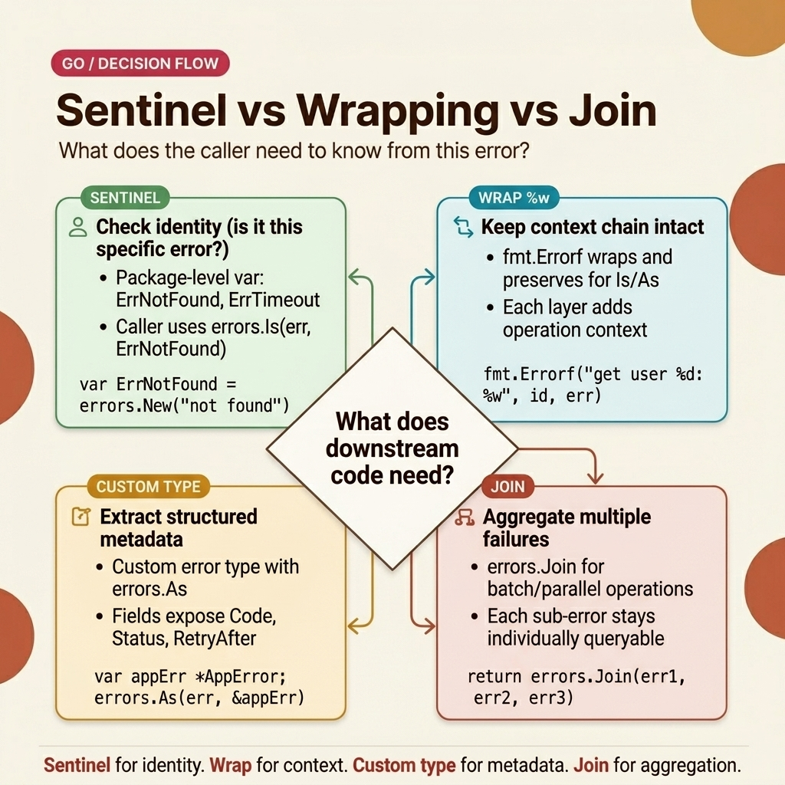

<!-- tags: golang, error-handling -->

# 🔗 Sentinel Errors, Wrapping & errors.Join — Go Error Patterns

> Go 1.13+ introduced error wrapping with `%w`. Go 1.20 added `errors.Join` for multi-error aggregation. Together with sentinel variables and custom types, these tools form Go's complete error handling strategy.

📅 Created: 2026-03-23 · 🔄 Updated: 2026-04-19 · ⏱️ 14 min read

| TS/NestJS                           | Go                                         |
| ----------------------------------- | ------------------------------------------ |
| `throw new Error("msg")`            | `errors.New("msg")`                        |
| `class NotFoundError extends Error` | `var ErrNotFound = errors.New("not found")` |
| `error.cause`                       | `fmt.Errorf("...: %w", err)`              |
| `AggregateError`                    | `errors.Join(err1, err2)` (Go 1.20+)      |
| `instanceof NotFoundError`          | `errors.Is(err, ErrNotFound)`              |
| `error as CustomError`              | `errors.As(err, &target)`                 |

| Aspect          | Detail                                                        |
| --------------- | ------------------------------------------------------------- |
| **Concept**     | Sentinel errors, semantic wrapping, and multi-error aggregation |
| **Use case**    | Type-safe error routing across service layers                  |
| **Key insight** | `errors.Is()` walks the entire chain to find a sentinel match   |
| **Go proverb**  | "Errors are values — program with them"                       |

---

## 1. DEFINE

Your `GetUser(id)` returns `"not found"` as a string. But "not found" means two different things: a missing database record (return HTTP 404) and a network timeout where the database was unreachable (return HTTP 503). Comparing `err.Error() == "not found"` cannot distinguish them. When the database driver updates its message from `"not found"` to `"no rows in result set"`, your comparison breaks silently — no compile error, no test failure, just a wrong HTTP status code in production.

Sentinel errors solve this. `var ErrNotFound = errors.New("not found")` creates a stable pointer. `errors.Is(err, ErrNotFound)` compares by identity, not by string content. The driver can change its message freely — your sentinel check still works.

But sentinels alone are not enough. When a repository wraps a GORM error into your sentinel, you lose the original stack trace. `fmt.Errorf("UserRepo.FindByID: %w", err)` preserves the chain. And when validation produces three failures at once, `errors.Join` aggregates them into a single error that `errors.Is` can still inspect.

### Architectural Error Patterns

| Technique           | Description                                           | Use case                                     |
| ------------------- | ----------------------------------------------------- | -------------------------------------------- |
| **Sentinel errors** | Package-level `var ErrFoo = errors.New(...)`          | Stable identity checks across packages        |
| **Wrapping `%w`**   | `fmt.Errorf("context: %w", err)` preserves the chain | Adding breadcrumbs while keeping root cause   |
| **`errors.Is`**     | Walks the chain to match a specific sentinel          | Routing decisions (404 vs 500)                |
| **`errors.As`**     | Walks the chain to extract a specific error type      | Accessing metadata (HTTP code, operation name) |
| **`errors.Join`**   | Aggregates multiple errors into one (Go 1.20+)        | Validation failures, batch operations         |

### Failure Modes

| #   | Severity  | Defect                                   | Consequence                                 | Fix                                                 |
| --- | --------- | ---------------------------------------- | ------------------------------------------- | --------------------------------------------------- |
| 1   | 🔴 Fatal  | Creating `errors.New()` inside a function | Each call returns a different pointer — `errors.Is` never matches | Define sentinels at package level as `var` |
| 2   | 🔴 Fatal  | Missing `Unwrap()` on a custom error type | `errors.Is/As` cannot traverse through it   | Implement `Unwrap() error` on every wrapper type    |
| 3   | 🟡 Common | Forgetting `nil` check after `errors.Join` | `errors.Join` returns `nil` when passed zero errors — safe, but callers may not expect it | Document that empty join = nil            |

---

With the theory established, the visual below shows how sentinel, wrapping, and join interact in a real service architecture.

## 2. VISUAL

The hardest part of error handling is seeing the chain. Three layers of wrapping produce a linked list of errors. `errors.Is` walks this list from top to bottom. `errors.Join` creates a tree instead of a list — one error with multiple children.



*Figure: Decision map for choosing between sentinel, wrapping, custom type, and join. Start with the simplest option (sentinel) and escalate only when the use case demands richer metadata or aggregation.*

With the decision map routed, the code section below demonstrates each pattern in isolation and then combines them in a production-style error handler.

## 3. CODE

The decision map is established. Now we anchor each branch in code: sentinel errors for stable comparisons, wrapping chains for call-path tracing, custom types for structured metadata, and `errors.Join` for multi-error validation.

### Example 1: Basic — Sentinel Errors

Your application has six common failure modes: not found, unauthorized, forbidden, conflict, validation, and internal error. Each one needs a stable identity that callers can check without parsing strings.

> **Objective**: Define package-level sentinel errors with stable pointer identity.
> **Approach**: `var ErrNotFound = errors.New("not found")` at package level — one pointer, shared across all callers.
> **Rule**: Never create sentinels inside functions. `errors.New()` inside a function returns a new pointer on every call — `errors.Is` will never match.

```go
package apperror

import "errors"

// ✅ Sentinel errors — package-level constants
// Convention: Err prefix + PascalCase name
var (
	ErrNotFound      = errors.New("not found")
	ErrUnauthorized  = errors.New("unauthorized")
	ErrForbidden     = errors.New("forbidden")
	ErrConflict      = errors.New("conflict")
	ErrValidation    = errors.New("validation error")
	ErrInternal      = errors.New("internal server error")
)

// Usage:
//   return apperror.ErrNotFound
//   if errors.Is(err, apperror.ErrNotFound) { ... }
```

> **Conclusion**: Sentinel variables give callers a stable comparison target. `errors.Is(err, apperror.ErrNotFound)` works regardless of how many layers wrap the error. The sentinel pointer never changes — unlike string messages, which break silently when upgraded.
>
> **When to use**: Export sentinels when callers from other packages need to match specific failure conditions. Keep them in a dedicated `apperror` package for discoverability.

Sentinels identify *what* went wrong. But when you need to trace *where* it went wrong — which repository, which service, which parameter — wrapping adds that context.

---

### Example 2: Intermediate — Error Wrapping Chain

Your HTTP handler calls a service, which calls a repository. The repository maps a GORM error into your sentinel. The service wraps it with the operation name. The handler checks the sentinel and returns the correct HTTP status.

> **Objective**: Build a 3-layer wrapping chain (repository → service → handler) that preserves sentinel identity.
> **Approach**: Repository maps ORM errors to app sentinels. Service wraps with `%w`. Handler inspects with `errors.Is`.
> **Example**: `FindByID` returns `apperror.ErrNotFound`. `GetByID` wraps it with the user ID. The handler matches `ErrNotFound` through the chain and returns HTTP 404.

```go
package service

import (
	"context"
	"errors"
	"fmt"

	"myapp/internal/apperror"

	"gorm.io/gorm"
	"github.com/gofiber/fiber/v2"
)

// ✅ Repository — maps ORM error to app sentinel
func (r *UserRepo) FindByID(ctx context.Context, id string) (*User, error) {
	var user User
	err := r.db.WithContext(ctx).First(&user, "id = ?", id).Error
	if errors.Is(err, gorm.ErrRecordNotFound) {
		// Map ORM error → app sentinel
		return nil, apperror.ErrNotFound
	}
	if err != nil {
		return nil, fmt.Errorf("UserRepo.FindByID: %w", err)
	}
	return &user, nil
}

// ✅ Service — wraps with operation context
func (s *UserService) GetByID(ctx context.Context, id string) (*User, error) {
	user, err := s.repo.FindByID(ctx, id)
	if err != nil {
		return nil, fmt.Errorf("UserService.GetByID(%s): %w", id, err)
	}
	return user, nil
}

// ✅ Handler — checks sentinel through the wrapping chain
func handler(c fiber.Ctx) error {
	user, err := userService.GetByID(c.Context(), c.Params("id"))
	if err != nil {
		// errors.Is traverses: handler wrap → service wrap → sentinel ✅
		if errors.Is(err, apperror.ErrNotFound) {
			return fiber.NewError(404, "user not found")
		}
		return err // → 500
	}
	return c.JSON(user)
}
```

> **Why map GORM errors to app sentinels?**
> Your handler should not know about GORM. If you switch from GORM to `pgx`, every `errors.Is(err, gorm.ErrRecordNotFound)` check in the handler layer breaks. The repository translates ORM-specific errors into app-level sentinels. The handler depends only on `apperror.ErrNotFound` — database implementation stays hidden behind the repository boundary.
>
> **Conclusion**: The wrapping chain reads like a call stack: `UserService.GetByID(abc123): not found`. Each layer adds exactly one piece of context. `errors.Is` walks the chain from top to bottom and finds the sentinel at the root.

Sentinel + wrapping covers identity checks with context. But when your error handler needs structured data — HTTP status code, error type slug, user-facing message — a custom error type carries that metadata.

---

### Example 3: Advanced — Custom Error Type + errors.As

Your API returns JSON error responses with a `type` field (`NOT_FOUND`, `BAD_REQUEST`), an HTTP status code, and a human-readable message. A plain `error` interface cannot carry these fields. You need a struct.

> **Objective**: Build a custom error type that carries HTTP status, error type, message, and the underlying cause.
> **Approach**: `AppError` struct with `Error()` and `Unwrap()`. Constructor helpers enforce consistency. A central error handler uses `errors.As` to extract the struct.
> **Example**: The handler calls `errors.As(err, &appErr)` to extract the HTTP status code and return a structured JSON response.

```go
package apperror

import "fmt"

// ✅ Custom error type — carries structured metadata
type AppError struct {
	Code    int    // HTTP status code
	Type    string // Error type slug (NOT_FOUND, BAD_REQUEST)
	Message string // User-facing message
	Cause   error  // Original error (wrapped)
}

func (e *AppError) Error() string {
	if e.Cause != nil {
		return fmt.Sprintf("%s: %v", e.Message, e.Cause)
	}
	return e.Message
}

// ✅ Unwrap — allows errors.Is/As to traverse through AppError
func (e *AppError) Unwrap() error {
	return e.Cause
}

// ✅ Constructors — enforce consistent creation
func NewNotFound(msg string, cause error) *AppError {
	return &AppError{Code: 404, Type: "NOT_FOUND", Message: msg, Cause: cause}
}

func NewBadRequest(msg string, cause error) *AppError {
	return &AppError{Code: 400, Type: "BAD_REQUEST", Message: msg, Cause: cause}
}

// ✅ Central error handler — errors.As extracts the AppError struct
func errorHandler(c fiber.Ctx, err error) error {
	var appErr *AppError
	if errors.As(err, &appErr) {
		return c.Status(appErr.Code).JSON(fiber.Map{
			"type":    appErr.Type,
			"message": appErr.Message,
		})
	}
	// Fallback — unknown error type
	return c.Status(500).JSON(fiber.Map{"message": "internal error"})
}
```

> **Why `errors.As` instead of type assertion?**
> A direct type assertion `err.(*AppError)` only matches the top-level error. If the `AppError` is wrapped inside another error, the assertion fails. `errors.As` walks the entire chain — it finds the `AppError` even through multiple wrapping layers. This makes your error handler resilient to future wrapping changes.
>
> **Conclusion**: Custom error types turn Go's `error` interface into structured data. The central error handler uses `errors.As` once, extracting all metadata in a single check. New error types (e.g., `NewForbidden`, `NewConflict`) slot in without changing the handler logic.

Custom types handle single errors with metadata. But validation routinely produces multiple errors at once. Go 1.20's `errors.Join` solves this.

---

### Example 4: Expert — errors.Join (Go 1.20+)

Your `validateUser` function checks name, email, and age. All three can fail independently. Instead of returning on the first failure, you collect all errors and return them as one.

> **Objective**: Aggregate multiple validation errors into a single `error` value that `errors.Is` can still inspect.
> **Approach**: Collect errors into a `[]error` slice. `errors.Join(errs...)` combines them. Returns `nil` when the slice is empty.
> **Example**: `validateUser` with empty name and invalid age returns both errors in one value.

```go
package validation

import "errors"

// ✅ Multi-error validation using errors.Join (Go 1.20+)
func validateUser(u *User) error {
	var errs []error

	if u.Name == "" {
		errs = append(errs, errors.New("name is required"))
	}
	if u.Email == "" {
		errs = append(errs, errors.New("email is required"))
	}
	if u.Age < 18 {
		errs = append(errs, errors.New("must be 18+"))
	}

	// Returns nil if errs is empty — no wrapper, no allocation
	return errors.Join(errs...)
}

// Usage:
// err := validateUser(user)
// if err != nil {
//     fmt.Println(err)
//     // name is required
//     // must be 18+
// }
// errors.Is(err, specificErr) still works — Join preserves Is/As traversal
```

> **Why `errors.Join` instead of a custom `ValidationError` struct?**
> `errors.Join` is a standard library function — no custom types, no boilerplate. It returns `nil` when passed zero errors, which eliminates the need for an `if len(errs) > 0` check. And `errors.Is` can inspect each individual error inside the joined result. For most validation use cases, `errors.Join` is simpler than a dedicated struct.
>
> **When to prefer a custom struct**: When you need structured fields (HTTP code, field name, validation rule) attached to each error. In that case, create a `ValidationError` struct and join multiple instances.
>
> **Conclusion**: `errors.Join` aggregates multiple independent failures into one error value. `errors.Is` inspects each child. Combined with sentinel errors, this covers batch validation, parallel operations, and cleanup teardown where multiple steps can fail independently.

---

## 4. PITFALLS

The syntax of sentinels, wrapping, and join is straightforward. The bugs hide in subtle misuse that compiles, passes tests, and breaks in production.

| #   | Severity  | Defect                                       | Consequence                                    | Fix                                                  |
| --- | --------- | -------------------------------------------- | ---------------------------------------------- | ---------------------------------------------------- |
| 1   | 🔴 Fatal  | Using `%v` instead of `%w`                  | Chain breaks — `errors.Is/As` return false      | Always use `%w` in `fmt.Errorf`                      |
| 2   | 🔴 Fatal  | Creating sentinels inside functions           | Each call returns a new pointer — `errors.Is` never matches | Define sentinels at package level as `var`     |
| 3   | 🟡 Common | Over-wrapping at every layer                 | Error message becomes a 300-character chain    | Wrap only when the layer adds new context             |
| 4   | 🟡 Common | Logging and wrapping at the same layer       | Same error appears twice in logs               | Either log or wrap — not both                        |
| 5   | 🔵 Minor  | Ignoring `errors.Join` return value of `nil` | Safe but surprising — joining zero errors returns `nil`, not an empty error | Document that empty join = nil          |

---

## 5. REF

| Resource        | Type     | Link                                                                     | Notes                                          |
| --------------- | -------- | ------------------------------------------------------------------------ | ---------------------------------------------- |
| Go Blog         | Official | [go.dev/blog/go1.13-errors](https://go.dev/blog/go1.13-errors)           | Introduces `%w`, `errors.Is`, `errors.As`       |
| Effective Go    | Official | [go.dev/doc/effective_go#errors](https://go.dev/doc/effective_go#errors) | Idiomatic error handling patterns and conventions |

---

## 6. RECOMMEND

Sentinel errors, wrapping, custom types, and join are covered. The next step depends on whether you need to revisit the basics or dive into testing error chains.

| Expansion               | When                                     | Rationale                                                        | File/Link                                          |
| ----------------------- | ---------------------------------------- | ---------------------------------------------------------------- | -------------------------------------------------- |
| Error Wrapping Basics   | When you need a refresher on `%w`, `errors.Is/As` fundamentals | Covers the three code examples (basic, intermediate, advanced) from scratch | [01-wrapping-custom.md](./01-wrapping-custom.md) |

---

**Navigation**: [← Error Wrapping](./01-wrapping-custom.md) · [→ Interfaces](../interfaces/01-implicit-io-patterns.md)
