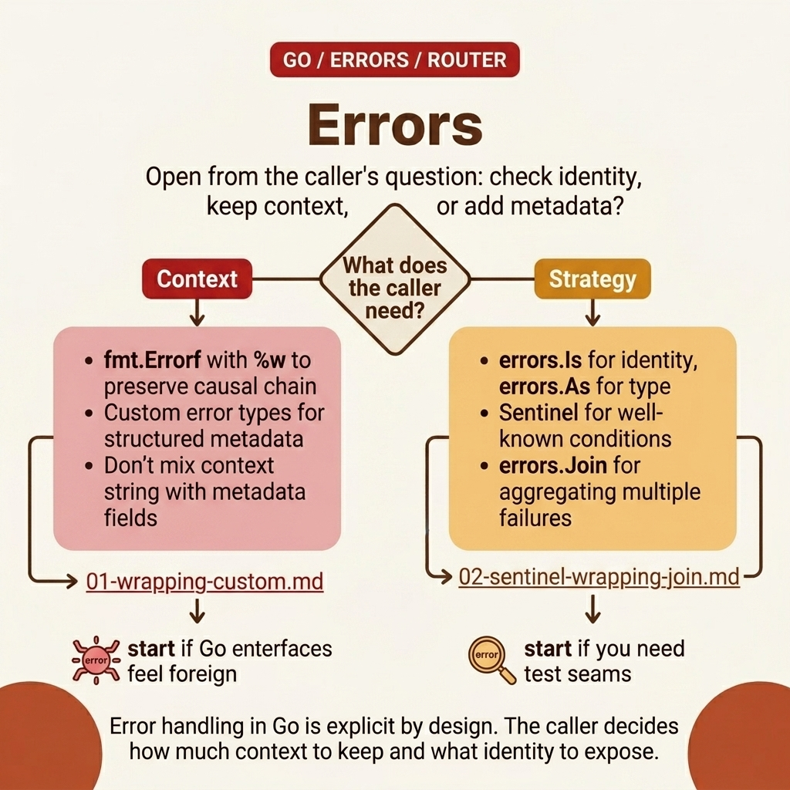

<!-- tags: golang, overview -->

# Errors — Error handling, wrapping, sentinel, custom types

> Go error patterns: explicit handling, wrapping chains, sentinel errors, errors.Join (Go 1.20+).

📅 Updated: 2026-04-19 · ⏱️ 6 min read

## 1. DEFINE

Go treats errors as values — no exceptions, no try-catch. But the simplicity is deceptive: a misplaced `%v` instead of `%w` silently breaks your entire error chain. **Errors** covers the two critical layers where those bugs originate.

This hub does not exist to list files. It exists to help you choose the right entrance to `fundamental/errors`: where to start, which articles to read together, and when you encounter real symptoms, which lane.

### 1.1 Signals & Boundaries

- Open this hub when you know you're in the `fundamental/errors` cluster but aren't sure which article to read first.
- The focus of the hub is to map pain points to the correct document, not to replace each detail.
- If you keep jumping between articles and still feel confused, the problem is usually choosing the wrong starting lane — not a lack of definitions.

### 1.2 Learning Lanes

- `Error Handling — Wrapping, Sentinel, Custom Errors` is the natural entry point if you want a clear grip before diving in.
- `Sentinel Errors, Wrapping & errors.Join — Go Error Patterns` is more suitable when you need to join to an adjacent lane or extend from the platform to a production concern.
- Use this hub as a navigation map: after reading one article, go back to the next point with purpose.

## 2. VISUAL

The `errors` lane is most useful when you open it from the caller's question: do you need to check identity (`Is`), preserve context chain (`%w`), or extract structured metadata (`As`)?



_Figure: Router map of `errors` divides the cluster into two main paths: wrapping/custom errors to hold cause and context, and sentinel/Is/As/Join to select the correct error surface for branching and aggregation._

Once you know what kind of meaning the caller needs from the error, the pseudo-router below acts as a navigation artifact.

## 3. CODE

Flow is clear at the conceptual level. Now we reduce it to an artifact that a Go team can read, review, and keep as an implementation standard.

### Example 1: Router artifact — select articles according to reading goals.

> **Goal**: Turn this hub into a navigation tool instead of a passive link table.
> **Approach**: Map learning goals or symptoms to the correct starting file.
> **Example**: Choose lanes by concern: error wrapping, sentinel patterns, or error aggregation.
> **Complexity**: O(1) at navigation level; what matters is choosing the right entry point.

```text
func chooseLane(goal string) string {
    switch goal {
    case "wrapping custom": return "./01-wrapping-custom.md"
    case "sentinel wrapping join": return "./02-sentinel-wrapping-join.md"
    default: return "./README.md"
    }
}
```

This pseudo-router is not code to run in your application; it compresses the hub's navigation logic into a concise artifact.

## 4. PITFALLS

The most dangerous part of **Errors — Error handling, wrapping, sentinel, custom types** often lies not in the theory, but in a few seemingly small decisions that change the outcome.

| #   | Severity  | Error | Consequence | Fix                                                 |
| --- | --------- | ------------------------------------------- | ----------------------------------- | --------------------------------------------------- |
| 1   | 🔴 Fatal  | Use the hub as a list of links to surf | Learning is fragmentary and choosing the wrong entry point | Always start from a pain point or specific learning goal |
| 2   | 🟡 Common | Jump straight into a deep post when there is no base lane yet | Understanding terms is fragmentary and easy to misapply | Choose an entry point and then follow the cluster rhythm |
| 3   | 🔵 Minor  | Not returning to the hub after reading | Lost rhythm and connection between articles | Return to the hub after each lane to choose the next step |

## 5. REF

| Resource                       | Type | Link                                   | Note |
| ------------------------------ | -------- | -------------------------------------- | ------------------------------------------------------------- |
| Working with Errors in Go 1.13 | Official | https://go.dev/blog/go1.13-errors      | Key changes for `%w`, `errors.Is`, `errors.As` |
| `errors` package               | Official | https://pkg.go.dev/errors              | Standard API reference for chain, join, unwrap |
| Effective Go — Errors          | Official | https://go.dev/doc/effective_go#errors | Practical conventions for error handling in idiomatic code |

## 6. RECOMMEND

The core of **Errors** is settled. The extensions below connect error handling to adjacent concerns.

| Extend | When should I continue reading? | Reason | File/Link                                                        |
| ----------------------------------------------------------- | ------------------------------- | ----------------------------------------- | ---------------------------------------------------------------- |
| Error Handling — Wrapping, Sentinel, Custom Errors          | When you need a clear entry point | Keep a seamless reading rhythm within the same cluster | [./01-wrapping-custom.md](./01-wrapping-custom.md)               |
| Sentinel Errors, Wrapping & errors.Join — Go Error Patterns | When you want to connect to the next lane | Keep a seamless reading rhythm within the same cluster | [./02-sentinel-wrapping-join.md](./02-sentinel-wrapping-join.md) |
| Go Programming                                              | When you need to change Go cluster | Return to the original router to choose another lane | [../README.md](../README.md)                                     |
