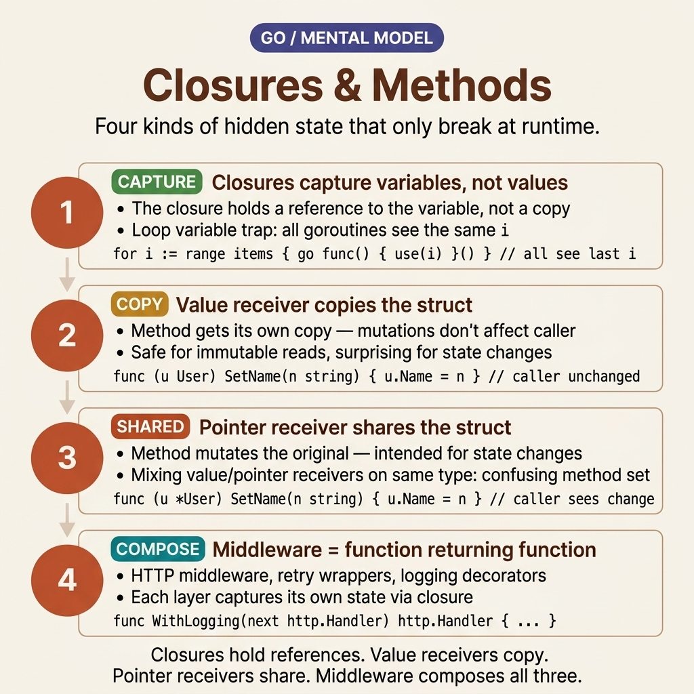

<!-- tags: golang --> # ⚙️ Hàm — Closures , Biến phân, Phương thức

> Hàm Go : hạng nhất, closures , đối số biến đổi, phương thức receivers 📅 Đã tạo: 20-03-2026 · 🔄 Đã cập nhật: 19-04-2026 · ⏱️ 17 phút đọc

| Khía cạnh | Chi tiết |
| ----------------- | ------------------------------ |
| **Khái niệm** | Hàm như giá trị, phương thức trên các loại |
| **Trường hợp sử dụng** | Tái sử dụng mã, composition |
| **Thông tin chi tiết quan trọng** | Giá trị receiver so với pointer receiver |
| ** Go triết lý** | Hàm > phương thức khi không cần trạng thái |

---

## 1. ĐỊNH NGHĨA

> *Bạn đang viết phần mềm trung gian HTTP. Nó cần đếm các yêu cầu, giới hạn tốc độ theo IP và đưa trình ghi nhật ký vào ngữ cảnh yêu cầu. Tất cả điều này tóm lại là trả về một hàm - `func(http.Handler) http.Handler` - nhưng hàm đó phải "ghi nhớ" trạng thái: bộ đếm, cấu hình và bộ ghi nhật ký. Đây là nơi closures tỏa sáng: một chức năng mang môi trường sống của chính nó.*
>
> * Các hàm Go là công dân hạng nhất: chúng có thể được gán cho các biến, được truyền dưới dạng đối số hoặc được trả về từ các hàm khác. closure là một hàm được kết hợp với các biến đã nắm bắt của nó - một cấu trúc đủ mạnh để triển khai phần mềm trung gian, mẫu factory , trình xử lý sự kiện và mẫu tùy chọn mà không cần các lớp hoặc đối tượng. Phương thức receivers chi phối một thứ hoàn toàn khác: value receivers sử dụng bản sao, trong khi pointer receivers sử dụng tham chiếu. Sự nhầm lẫn giữa hai điều này là nguyên nhân sâu xa của vô số lỗi khó nắm bắt.*

### Tính năng chức năng

 Các hàm Go sở hữu **6 tính năng** khiến chúng trở thành công dân hạng nhất thực sự:

| Tính năng | Mô tả | Ví dụ |
| ---------------- | -------------- | ----------------------------- |
| Trả lại nhiều lần | Trả về nhiều giá trị | `func() (int, error)` |
| Trả về có tên | Giá trị trả về được đặt tên | `func() (n int, err error)` |
| Thay đổi | Đối số biến | `func(nums ...int)` |
| Hạng nhất | Gán cho biến | `fn := func() {}` |
| Closure | Nắm bắt các biến bên ngoài | `func() { x++ }` |
| Defer | Thực hiện khi trở lại | `defer f.Close()` |

**Tại sao nhiều trả về?** Go thiếu ngoại lệ — lỗi phải được trả về rõ ràng dưới dạng giá trị thứ hai. Mẫu `(result, error)` buộc người gọi phải xử lý lỗi một cách rõ ràng thay vì để chúng lọt qua như các khối thử/bắt bị lãng quên.

### Phương thức Receivers Lựa chọn giữa **Value vs [[E35]]] receiver ** là một trong những quyết định quan trọng nhất khi xác định một phương thức trong Go :

| Receiver | Cú pháp | Sửa đổi? | Sao chép? | Sử dụng khi |
| ----------- | ----------------------------- | --------- | ------- | ------------------------ |
| **Giá trị** | `func (s Struct) Method()` | ❌ | Sao chép | Chỉ đọc, nhỏ structs |
| ** Pointer ** | `func (s *Struct) Method()` | ✅ | Pointer | Đột biến, lớn structs |

**Tại sao không phải lúc nào cũng sử dụng pointer receivers ?** Giá trị receivers có một lợi thế khác biệt: tối ưu hóa trình biên dịch - không cần thoát heap , không cần theo dõi thu gom rác. Đối với [[E40]]] nhỏ, chỉ đọc, giá trị receivers nhanh hơn và ngầm thread -an toàn.

---

Lý thuyết đã rõ ràng — bây giờ chúng ta hãy xem cách cơ chế chụp closure và [[E30]]] hoạt động trực quan.

Những khái niệm này trông có vẻ đơn giản — nhưng những cái bẫy chết người ẩn nấp: closure nắm bắt việc biến các vòng lặp thành các mối nguy tham chiếu và phương pháp interfaces đánh giá khác nhau giữa pointers so với các giá trị. Những cái bẫy đó được giải nén trong những cái bẫy.

## 2. HÌNH ẢNH

Chủ đề này hiếm khi bị phá vỡ vì cú pháp. Nó bị hỏng do trạng thái ẩn: nội dung closure giữ lại, nội dung receiver sao chép và phương thức mà interface nhìn thấy. Hình ảnh bên dưới hợp nhất ba nguồn gây nhầm lẫn đó thành một mô hình tinh thần. 

*Hình: Thẻ mô hình trí tuệ của closures và các phương thức được đặt cạnh nhau làm nổi bật bốn khái niệm chính: closure chụp, giá trị receivers , pointer receivers và kiểu phần mềm trung gian composition .*

Khi trạng thái ẩn được hiển thị, mã bên dưới sẽ trở nên hiệu quả hơn nhiều. Bạn sẽ đọc từng ví dụ như một bài kiểm tra về quyền sở hữu và ngữ nghĩa đột biến, thay vì chỉ khai báo hàm độc lập.

## 3. MÃ

Với **Hàm - Closures , Biến thể, Phương thức**, chúng tôi đã thiết lập một mô hình tinh thần cho trạng thái ẩn và ngữ nghĩa receiver . Bây giờ, hãy xem mã để xem mọi lựa chọn - giá trị hoặc pointer receiver , closure hoặc struct , chụp hoặc sao chép - thực sự thay đổi hành vi đột biến như thế nào.

### Ví dụ 1: Cơ bản — Hàm & Trả về nhiều kết quả

Bạn gọi `os.Open(path)` và nhận được 2 giá trị: `file` và `error` . Nếu đến từ Java hoặc Python, bạn đã quen với việc thử/bắt - nhưng Go không có ngoại lệ. Tại sao? Bởi vì các ngoại lệ có thể bị "quên" - không có gì buộc bạn phải viết khối thử/bắt đó. Go bắt buộc xử lý lỗi rõ ràng thông qua nhiều lần trả về `(result, error)` .

Kết hợp các kết quả trả về được đặt tên cho các phép tính phức tạp và biến đổi `...T` cho danh sách đối số linh hoạt.

Đầu vào: `divide(10, 3)` · Đầu ra: `(3.33, nil)` · `divide(10, 0)` · Đầu ra: `(0, "division by zero")````go
package main

import (
    "errors"
    "fmt"
)

// ✅ Multiple returns — idiomatic Go error handling
func divide(a, b float64) (float64, error) {
    if b == 0 {
        return 0, errors.New("division by zero")
    }
    return a / b, nil
}

// ✅ Named returns — useful for complex functions
func stats(nums []int) (min, max, sum int) {
    if len(nums) == 0 {
        return
    }
    min, max = nums[0], nums[0]
    for _, n := range nums {
        if n < min { min = n }
        if n > max { max = n }
        sum += n
    }
    return  // naked return — returns named values implicitly
}

// ✅ Variadic function
func sumAll(nums ...int) int {
    total := 0
    for _, n := range nums {
        total += n
    }
    return total
}

func main() {
    result, err := divide(10, 3)
    if err != nil {
        fmt.Println("Error:", err)
        return
    }
    fmt.Println("Result:", result)

	min, max, sum := stats([]int{3, 1, 4, 1, 5, 9, 2, 6})
    fmt.Printf("min=%d max=%d sum=%d\n", min, max, sum)

	fmt.Println(sumAll(1, 2, 3, 4, 5))     // 15
    nums := []int{10, 20, 30}
    fmt.Println(sumAll(nums...))              // Spread slice
}
```> **Tại sao Go thiếu ngoại lệ?**
> Nhiều lần trả về `(result, error)` buộc người gọi phải xử lý lỗi một cách rõ ràng — bạn không thể "quên" một lần thử/bắt. Trả về được đặt tên rất hữu ích cho các hàm phức tạp, nhưng trả về trần trụi (gọi `return` mà không có đối số) có thể gây nhầm lẫn — hãy sử dụng chúng một cách tiết kiệm và chỉ trong các hàm ngắn.

> **Takeaway**: `(result, error)` là thành ngữ Go . Variadic `...T` chấp nhận 0 hoặc nhiều đối số - bạn có thể trải rộng slice bằng cách sử dụng `nums...` . Trả về được đặt tên tổ chức các phép tính phức tạp nhưng tránh trả về trần trụi trong các hàm dài.
>
> **Caveat**: Trả về được đặt tên khởi tạo các biến có giá trị 0 khi bắt đầu hàm — đừng quên gán giá trị trước khi trả về. Biến thể lây lan với `append(a, b...)` — quên `...` dẫn đến lỗi biên dịch.
>
> **Khi nào nên sử dụng**: Nhiều lần trả về cho hàm any có thể bị lỗi. Biến đổi cho các chức năng tiện ích (như trình ghi nhật ký hoặc trình định dạng). Trả về được đặt tên cho các hàm trả về 3 giá trị trở lên.

Nhiều trả về cung cấp khả năng xử lý lỗi rõ ràng. Nhưng khi bạn cần "ghi nhớ" trạng thái của nhiều cuộc gọi — bộ đếm, cấu hình, chuỗi xử lý — closures là giải pháp.

### Ví dụ 2: Hàm trung cấp — Closures & Hàm bậc cao hơn

Bạn cần triển khai bộ giới hạn tốc độ cho máy chủ HTTP. Mỗi điểm cuối yêu cầu một bộ đếm và cấu hình riêng biệt nhưng vẫn sử dụng logic đếm giống hệt nhau. Việc tạo `RateLimiter` struct cho mọi điểm cuối là một công việc nặng nhọc. Closures giải quyết vấn đề này một cách tinh tế: `func makeRateLimiter(limit int) func() bool` — mỗi lệnh gọi tới `makeRateLimiter(100)` mang lại một hàm "ghi nhớ" giới hạn và bộ đếm cụ thể của chính nó.

Mẫu này mở rộng sang phần mềm trung gian (trình xử lý gói), trình vòng lặp (độ phân giải bước trạng thái) và nhà máy (tạo hàm dựa trên cấu hình).

Đầu vào: `multiplier(3)(5)` · Đầu ra: `15` — closure chụp `factor=3` từ phạm vi bên ngoài```go
package main

import "fmt"

// ✅ Function as parameter (higher-order)
func apply(nums []int, fn func(int) int) []int {
    result := make([]int, len(nums))
    for i, n := range nums {
        result[i] = fn(n)
    }
    return result
}

// ✅ Function returning function (closure factory)
func multiplier(factor int) func(int) int {
    return func(n int) int {
        return n * factor  // ✅ Captures `factor` from outer scope
    }
}

// ✅ Closure as iterator
func fibonacci() func() int {
    a, b := 0, 1
    return func() int {
        a, b = b, a+b
        return a
    }
}

// ✅ Middleware pattern (very common in Go)
type Handler func(string) string

func withLogging(h Handler) Handler {
    return func(input string) string {
        fmt.Printf("Input: %s\n", input)
        result := h(input)
        fmt.Printf("Output: %s\n", result)
        return result
    }
}

func main() {
    // ✅ Higher-order functions
    doubled := apply([]int{1, 2, 3}, func(n int) int { return n * 2 })
    fmt.Println(doubled)  // [2 4 6]

	// ✅ Closure factory
    triple := multiplier(3)
    fmt.Println(triple(5))  // 15

	// ✅ Iterator pattern
    fib := fibonacci()
    for i := range 10 { // Go 1.22+
        fmt.Print(fib(), " ")
    }
    fmt.Println()  // 1 1 2 3 5 8 13 21 34 55

	// ✅ Middleware
    handler := withLogging(func(s string) string {
        return "Hello, " + s
    })
    handler("Go")
}
```> **Tại sao closures chụp tham chiếu thay vì sao chép giá trị?**
> A closure phải "ghi nhớ" các biến từ phạm vi bên ngoài. Nếu nó sao chép giá trị, các sửa đổi tiếp theo (như `counter++` ) sẽ không bao giờ phản ánh trong các lệnh gọi trong tương lai. Go closures capture **variables** (theo tham chiếu), không phải giá trị — đây là lý do tại sao `fibonacci()` hoạt động chính xác: với mỗi lệnh gọi, `a` và `b` được cập nhật tuần tự.

> **Takeaway**: Closure = hàm + biến được ghi lại. Các hàm bậc cao hơn ( `apply` ) bật map /các mẫu bộ lọc. Các mẫu phần mềm trung gian bao bọc logic xung quanh các trình xử lý - một mô hình cực kỳ phổ biến trong các khung HTTP.
>
> **Caveat**: Closures chụp **biến** (tham chiếu) — không phải giá trị. Trong các vòng lặp (trước Go 1.22): tất cả closures được sinh ra sẽ tham chiếu cùng một lần lặp biến cuối cùng trừ khi bạn buộc phải sao chép nó qua `v := v` .
>
> **Khi nào nên sử dụng**: Bộ giới hạn tốc độ, phần mềm trung gian, bộ lặp, nhà máy. Bất cứ khi nào bạn cần đóng gói trạng thái mà không cần khai báo rõ ràng struct . Closures giữ trạng thái trong một hàm. Khi trạng thái cần được liên kết với một loại dữ liệu cụ thể, phương thức receivers sẽ đính kèm hành vi trực tiếp vào structs .

### Ví dụ 3: Nâng cao — Phương thức Receivers Bạn xác định một `Counter` struct bằng phương thức `Inc()` . Bạn gọi `c.Inc()` - nhưng bộ đếm không tăng. Lỗi ở đâu? A value receiver : `func (c Counter) Inc()` nhận được một bản sao hoàn chỉnh của `c` , tăng bản sao và ngay lập tức loại bỏ nó khi thoát. Bạn phải sử dụng pointer receiver `func (c *Counter) Inc()` để biến đổi chính struct ban đầu.

Nhưng việc quyết định giữa giá trị và pointer receivers không chỉ là về đột biến. Quy tắc thiết lập phương thức yêu cầu sự hài lòng interface : loại giá trị chỉ đáp ứng interfaces được trang bị giá trị receivers . Trộn receivers có nghĩa là loại của bạn không triển khai interfaces một cách nhất quán.

Đầu vào: `p.Translate(1, 1)` với pointer receiver · Đầu ra: `p` được sửa đổi tại chỗ```go
package main

import (
    "fmt"
    "math"
)

type Point struct {
    X, Y float64
}

// ✅ Value receiver — does NOT modify original
func (p Point) Distance(other Point) float64 {
    dx := p.X - other.X
    dy := p.Y - other.Y
    return math.Sqrt(dx*dx + dy*dy)
}

// ✅ Pointer receiver — CAN modify original
func (p *Point) Translate(dx, dy float64) {
    p.X += dx
    p.Y += dy
}

// ✅ Stringer interface (like toString)
func (p Point) String() string {
    return fmt.Sprintf("(%g, %g)", p.X, p.Y)
}

// ✅ Method on custom type (non-struct)
type StringSlice []string

func (ss StringSlice) Contains(target string) bool {
    for _, s := range ss {
        if s == target {
            return true
        }
    }
    return false
}

func main() {
    p := Point{3, 4}
    origin := Point{0, 0}
    fmt.Println(p.Distance(origin))  // 5

	p.Translate(1, 1)
    fmt.Println(p)  // (4, 5) — modified!

	tags := StringSlice{"go", "rust", "python"}
    fmt.Println(tags.Contains("go"))    // true
    fmt.Println(tags.Contains("java"))  // false
}
```> **Tại sao bạn nên sử dụng pointer receivers cho tất cả các phương thức nếu chỉ có một phương thức yêu cầu nó?**
> Quy tắc đặt phương thức: loại giá trị chỉ đáp ứng interfaces yêu cầu giá trị receivers . Loại pointer đáp ứng cả hai. Việc trộn receivers đảm bảo loại của bạn không thể phù hợp nhất quán với các yêu cầu interface . Ngoài cơ chế biên dịch, tính nhất quán mang lại cho các nhà phát triển sự tự tin ngay lập tức: "mọi phương thức đều cần `*T` " — loại bỏ nhu cầu đi sâu và kiểm tra độ an toàn của từng thao tác riêng biệt.

> **Takeaway**: Giá trị receivers dành cho các trường hợp sử dụng chỉ đọc và [[E38]]] nhỏ. Pointer receivers hoàn toàn dành cho các đột biến và lớn structs . Các phương thức cũng có thể được xác định trên các loại tùy chỉnh không phải struct (ví dụ: `StringSlice` ) để nối thêm hành vi dành riêng cho miền.
>
> **Caveat**: Các phương thức có giá trị receivers thỏa mãn interfaces — nhưng các phương thức có pointer receivers KHÔNG tự động đáp ứng chúng cho các loại giá trị. Việc trộn lẫn receivers tạo ra độ tin cậy interface lởm chởm. Nguyên tắc nhỏ: nếu 1 phương thức cần pointer , hãy nâng tất cả chúng lên pointer receivers .
>
> **Khi nào nên sử dụng**: Pointer receivers bao gồm khoảng ≥90% loại hình sản xuất. Giá trị dự trữ receivers dành riêng cho các loại nhỏ, không thể thay đổi trong đó thread -safety là rất quan trọng.

---

## 4. Cạm bẫy

Cơ chế cốt lõi của **Hàm - Closures , Biến thể, Phương thức** phải rõ ràng. Việc còn lại là nhận ra cú pháp có vẻ _gần đúng_ nhưng cuối cùng lại đưa các lỗi đột biến thầm lặng vào thẳng quá trình sản xuất.

| # | Mức độ nghiêm trọng | Lỗi | Hậu quả | Sửa chữa |
|---|----------|------|-------------|------|
| 1 | 🔴 Gây tử vong | Giá trị receiver dành cho đột biến | Các thay đổi bị mất — phương thức làm thay đổi một bản sao bị cô lập | Thực thi pointer receiver `*T` |
| 2 | 🔴 Gây tử vong | Nil pointer receiver gặp sự cố | Runtime panic | Xác minh `if t == nil` khi bắt đầu phương thức |
| 3 | 🟡 Chung | Giá trị hỗn hợp và pointer receivers | Sự hài lòng không nhất quán interface | Chọn 1 phong cách thống nhất cho toàn bộ kiểu |
| 4 | 🟡 Chung | Closure chụp biến vòng lặp (pre Go 1.22) | Tất cả [[E26]]] sinh ra đều trỏ đến biến lặp cuối cùng | Thêm `v := v` bên trong thân vòng lặp để buộc sao chép |
| 5 | 🔵 Nhỏ | Trả về được đặt tên kết hợp với defer | `defer` âm thầm sửa đổi tên trả về | Chuẩn hóa logic thứ tự thực hiện của bạn |

### 🔴 Cạm bẫy #1 — Đột biến giá trị receivers "nuốt chửng"

Có lẽ lỗi phổ biến nhất mà người mới gặp phải. Bạn viết một phương thức để sửa đổi một trường, quá trình kiểm tra sẽ chạy - nhưng trường này vẫn không thay đổi:```go
type User struct{ Name string }

func (u User) SetName(name string) { u.Name = name } // ❌ value receiver = pure copy
func (u *User) SetName(name string) { u.Name = name } // ✅ pointer receiver
```A value receiver ​​hoạt động trên **bản sao** của struct . Các sửa đổi sẽ chết ngay khi phạm vi phương thức kết thúc - người gọi không bao giờ quan sát các thay đổi. Trình biên dịch không đưa ra cảnh báo nào vì mã này hợp lệ về mặt cú pháp.

### 🔴 Cạm bẫy #2 — Nil pointer receiver hoảng loạn Go cho phép `nil` pointers gọi các phương thức - nhưng ngay khi phương thức đó cố gắng truy cập vào một trường cấu trúc, nó sẽ hoảng sợ:```go
var u *User // nil
u.SetName("Alice") // panic: nil pointer dereference
```**Khắc phục**: Luôn kiểm tra nil trong nội dung phương thức: `if u == nil { return }` . Ngoài ra, hãy đảm bảo các nhà xây dựng của bạn từ chối hoặc phá vỡ các ranh giới trả về nil một cách phổ biến.

---

Bạn đã khám phá Closures & Các phương thức từ những điều cơ bản cơ bản cho đến hàm bậc cao hơn design patterns . Các tài nguyên dưới đây sẽ đưa bạn đi sâu hơn.

## 5. GIỚI THIỆU

| Tài nguyên | Loại | Liên kết | Ghi chú |
| ------------ | -------- | ------------------------------------------------------------------------------ | ----- |
| Go Hàm | Hướng dẫn | [go.dev/tour/moretypes/24](https://go.dev/tour/moretypes/24) | Giá trị hàm, closures |
| Phương pháp | Hướng dẫn | [go.dev/tour/methods/1](https://go.dev/tour/methods/1) | Phương thức receivers |
| Có hiệu lực Go | Chính thức | [go.dev/doc/effective_go#functions](https://go.dev/doc/effective_go#functions) | Thực tiễn tốt nhất |
| Go Thông số | Chính thức | [go.dev/ref/spec#Function_types](https://go.dev/ref/spec#Function_types) | Đặc tả ngôn ngữ |

---

## 6. KHUYẾN NGHỊ

Nền tảng của **Hàm - Closures , Biến thể, Phương thức** đã được giải quyết. Các phần mở rộng bên dưới kết nối các giá trị hàm và phương thức receivers với hệ thống loại rộng hơn, ranh giới interface và vòng đời sản xuất.

| Gia hạn | Khi nào | Tại sao | Tệp/Liên kết |
| ------------------------------ | ------------------------- | ------------------------------ | --------- |
| Struct Thẻ, Tùy chọn & Builder | Khi người xây dựng cần cấu hình phức tạp | Nơi closures và các phương thức đáp ứng thiết kế API | [../structs/02-tags-options-builder.md](../structs/02-tags-options-builder.md) |
| Interfaces — Ẩn, io.Reader/Writer | Khi các loại hàm phải vượt qua các dòng phụ thuộc | Kết nối các giá trị hàm vào cơ chế Go của interface | [../interfaces/01-implicit-io-patterns.md](../interfaces/01-implicit-io-patterns.md) |
| Type Assertion , Embedding & Bí danh | Khi các bộ phương thức và sự hài lòng của interface cảm thấy mơ hồ | Cơ chế loại chạy bên dưới hành vi receiver | [../types/03-type-assertion-embedding.md](../types/03-type-assertion-embedding.md) |
| Generics — Các ràng buộc và mẫu | Xây dựng những người trợ giúp bậc cao có thể tái sử dụng an toàn kiểu | Chuyển đổi tự nhiên sau closures cho các tiện ích có thể tái sử dụng | [../types/02-generics.md](../types/02-generics.md) |
| Bối cảnh | Khi phần mềm trung gian closure yêu cầu hết thời gian chờ hoặc hủy | Nơi logic chức năng đáp ứng vòng đời yêu cầu | [../../concurrency/03-context.md](../../concurrency/03-context.md) |

**Điều hướng**: [← Types](../types/README.md) · [→ strings](./02-strings.md)