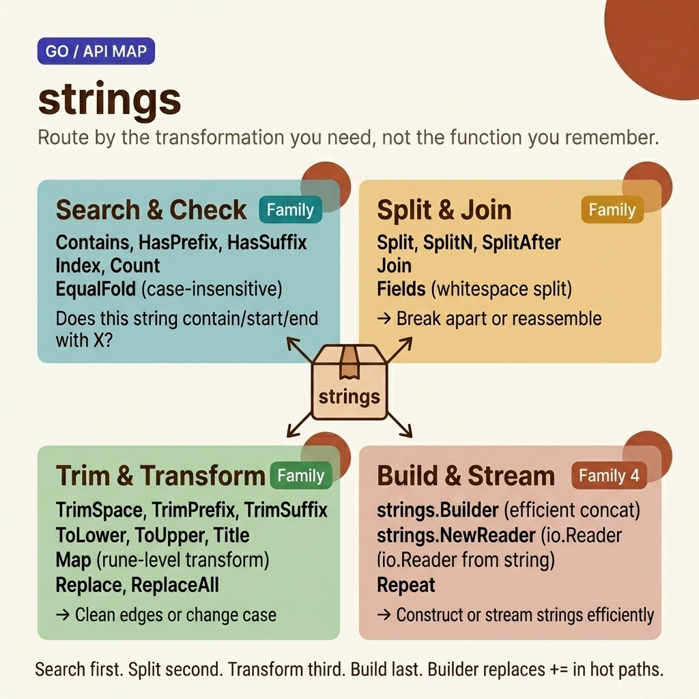

<!-- tags: golang, packages -->
# 📝 Strings — Package `strings` & String Manipulation

> A comprehensive guide to the most common string processing functions in Go: search, split, join, replace, trim, and case conversion — all from the standard `strings` package.

📅 Created: 2026-03-23 · 🔄 Updated: 2026-04-19 · ⏱️ 20 min read

| Aspect        | Detail                                                |
| ------------- | ----------------------------------------------------- |
| **Package**   | `strings`                                             |
| **Use case**  | Search, split, join, replace, trim, format strings    |
| **Go stdlib** | `strings`, `unicode`, `unicode/utf8`                  |
| **Immutable** | Go strings are immutable — all operations create new strings |

---

## 1. DEFINE

`strings.Contains()`, `strings.Split()`, `strings.ReplaceAll()` — Go's standard library covers almost every string operation a developer needs. However, Go strings are UTF-8 byte slices: `len("Hello")` returns 10 (bytes), not 8 (runes).

> *You receive an HTTP request body containing a JSON string. You need to parse the `Content-Type` field, trim excess whitespace, split the header value, replace template placeholders, and verify the email domain. All of these are string operations — and they appear absolutely everywhere in backend code.*
>
> *The `strings` package is the all-in-one toolkit for common string operations. But there is one crucial rule you must internalize: Go strings are **immutable** — you cannot modify a string once it is created. Every operation like `Replace`, `ToUpper`, or `Trim` allocates and returns a brand-new string. This fundamentally impacts performance when concatenating strings inside loops — which is exactly why `strings.Builder` exists.*

### Go String Characteristics

| Characteristic | Detail                                            |
| -------------- | ------------------------------------------------- |
| **Encoding**   | UTF-8 by default                                  |
| **Immutable**  | Unchangeable — every operation allocates a new string |
| **Type**       | `string` — a read-only sequence of bytes          |
| **Rune**       | `rune` (alias for `int32`) — represents 1 Unicode code point |
| **Zero value** | `""` (empty string)                               |
| **Comparable** | Can be compared with `==`, `<`, `>`               |

### Function Families in `strings`

| Family         | Primary Functions                                                 |
| -------------- | ----------------------------------------------------------------- |
| **Search**     | `Contains`, `HasPrefix`, `HasSuffix`, `Index`, `Count`            |
| **Split/Join** | `Split`, `SplitN`, `Fields`, `Join`                               |
| **Transform**  | `ToUpper`, `ToLower`, `Title`, `Map`                              |
| **Trim**       | `Trim`, `TrimSpace`, `TrimPrefix`, `TrimSuffix`, `TrimLeft/Right` |
| **Replace**    | `Replace`, `ReplaceAll`, `NewReplacer`                            |
| **Builder**    | `strings.Builder` — efficient string building and concatenation   |
| **Reader**     | `strings.NewReader` — creates an `io.Reader` from a string        |

---

The organization above shows *what* is available — but when facing a specific task, you still have to choose: `Contains` or `Index`? `Split` or `Fields`? The decision tree below answers that in 5 seconds.

These string functions look friendly — but severe performance traps lurk: string concatenation inside loops causes O(n²) complexity due to immutability, and `len()` returns the byte count, not the rune count. Those traps are unpacked in PITFALLS.

## 2. VISUAL

The `strings` package is much wider than it initially appears, so the best way to learn it is not by memorizing function names alphabetically. An image-first approach helps you route by transformation type before zooming in on specific helpers.



*Figure: API-family map dividing `strings` into four easily scannable operational families: search/check, split/join, trim/transform, and build/stream.*

Once the job family is clear, the code below is worth reading slowly. Each example demonstrates how you swap helpers for the same string task the moment requirements touch performance limits or boundary parsing.

## 3. CODE

With **Strings — Package `strings` & String Manipulation**, we laid out the map for UTF-8 mechanics and the Builder pattern. Now, let's step down into the code to see how each choice — `Contains` vs `Index`, `Split` vs `Fields`, or `+=` vs `Builder` — directly alters performance and correctness.

### Example 1: Basic — Search & Check Functions

You receive user input: an email address. You need to validate it: does it contain an `@`? Does it start with a whitespace? Does it end with `.com`? Previously you might write a regex — but `strings.Contains`, `strings.HasPrefix`, and `strings.HasSuffix` are entirely sufficient.

The `strings` package provides search and check functions optimized for UTF-8, avoiding regex overhead.

Input: `strings.Contains("hello@go.dev", "@")` · Output: `true`

```go
package main

import (
	"fmt"
	"strings"
)

func main() {
	s := "Hello, Go World! Welcome to Go programming."

	// ━━━━━ Contains / HasPrefix / HasSuffix ━━━━━
	fmt.Println(strings.Contains(s, "Go"))          // true
	fmt.Println(strings.ContainsAny(s, "aeiou"))    // true — contains at least 1 character from the set
	fmt.Println(strings.ContainsRune(s, 'W'))       // true

	fmt.Println(strings.HasPrefix(s, "Hello"))      // true
	fmt.Println(strings.HasSuffix(s, "ing."))       // true

	// ━━━━━ Index / LastIndex ━━━━━
	fmt.Println(strings.Index(s, "Go"))             // 7  — first occurrence
	fmt.Println(strings.LastIndex(s, "Go"))          // 30 — last occurrence

	// ━━━━━ Count ━━━━━
	fmt.Println(strings.Count(s, "Go"))              // 2 — occurs twice
	fmt.Println(strings.Count("cheese", "e"))        // 3

	// ━━━━━ EqualFold — case-insensitive compare ━━━━━
	fmt.Println(strings.EqualFold("Go", "go"))       // true
	fmt.Println(strings.EqualFold("Go", "GO"))       // true

	// ━━━━━ Repeat ━━━━━
	fmt.Println(strings.Repeat("Go! ", 3))           // "Go! Go! Go! "
}
```

> `Contains(s, substr)` checks the **entire substring**. `ContainsAny(s, chars)` searches for **any single character** from the set. `EqualFold` provides case-insensitive comparison without `ToLower()` — faster because no new string is allocated.

> **Takeaway**: Use `Contains` for substrings, `ContainsAny` for character sets, and `EqualFold` for case-insensitive checks. `Count` tallies non-overlapping occurrences.
>
> **Caveat**: `Contains("", "")` returns `true` — the empty string is universally deemed to be "contained" within any string. `Count` is strictly non-overlapping: `Count("aaa", "aa")` equals 1, not 2.
>
> **When to use**: `Contains` for basic validation. `HasPrefix`/`HasSuffix` for routing or MIME-type checks. `EqualFold` for comparing user input securely — outperforming `ToLower` + `==` by avoiding allocation.

Search functions tell you *if* something is present. Next — once found, you need to split, join, and replace.

### Example 2: Intermediate — Split, Join, Fields & Replace

A CSV parser receives the line `"Alice,30,Engineer"`. You need to: split by `,`, transform the fields, and join them back into JSON. Regex is overkill and ~10x slower. `strings.Split` + `strings.Join` + `strings.Fields` handle this.

`Fields` is invaluable for log parsing: it splits by whitespace (including tabs and multiple spaces) without a `\s+` regex.

Input: `strings.Split("a,b,c", ",")` · Output: `["a", "b", "c"]`

```go
package main

import (
	"fmt"
	"strings"
)

func main() {
	// ━━━━━ Split / SplitN ━━━━━
	csv := "apple,banana,cherry,date"

	parts := strings.Split(csv, ",")
	fmt.Println(parts)                               // [apple banana cherry date]
	fmt.Println(len(parts))                           // 4

	// SplitN — restricts the number of resulting elements
	first2 := strings.SplitN(csv, ",", 2)
	fmt.Println(first2)                               // [apple banana,cherry,date]

	// SplitAfter — retains the delimiter
	fmt.Println(strings.SplitAfter(csv, ","))
	// [apple, banana, cherry, date]

	// ━━━━━ Fields — split by whitespace ━━━━━
	text := "  Hello   World   Go  "
	words := strings.Fields(text)
	fmt.Println(words)                                // [Hello World Go]
	// ✅ Fields automatically handles multiple spaces, tabs, and newlines

	// ━━━━━ Join ━━━━━
	joined := strings.Join(words, " → ")
	fmt.Println(joined)                               // "Hello → World → Go"

	// ━━━━━ Replace / ReplaceAll ━━━━━
	original := "foo bar foo baz foo"

	// Replace — restricts the number of replacements
	fmt.Println(strings.Replace(original, "foo", "FOO", 2))
	// "FOO bar FOO baz foo"

	// ReplaceAll — replaces all occurrences
	fmt.Println(strings.ReplaceAll(original, "foo", "qux"))
	// "qux bar qux baz qux"

	// ━━━━━ NewReplacer — multiple replacements ━━━━━
	// ✅ Significantly more efficient than chaining multiple ReplaceAll calls
	r := strings.NewReplacer(
		"<", "&lt;",
		">", "&gt;",
		"&", "&amp;",
	)
	html := r.Replace("<div>Hello & World</div>")
	fmt.Println(html)
	// "&lt;div&gt;Hello &amp; World&lt;/div&gt;"
}
```

> `ReplaceAll` scans the entire string per call → N replacements = N scans. `NewReplacer` compiles a trie once and scans once → O(n) instead of O(n×k). Use it for HTML escaping and batch transformations.

> **Takeaway**: Use `Split` for exact delimiters and `Fields` for whitespace. `NewReplacer` executes batch replacements in O(n). `SplitN` limits results — useful for parsing keys.
>
> **Caveat**: `Split("", sep)` returns `[""]` (a slice containing 1 empty element), not an empty slice. `Fields("")` correctly returns `[]` (an empty slice). Their behavior diverges at the edges — test thoroughly before assuming symmetry.
>
> **When to use**: `Split` drives CSV/TSV parsing. `Fields` handles command-line arguments and log parsing. `SplitN(s, "=", 2)` resolves key=value formats safely. Turn to `NewReplacer` whenever you have ≥ 3 replacement pairs.

Split and Join handle delimiter-based operations. Trimming whitespace, transforming characters, or extracting patterns requires a different set of functions.

### Example 3: Intermediate — Trim, Transform & Map

User input is universally dirty: leading spaces, trailing tabs, mixed casing, erratic special characters. Before persisting anything to the database, you must normalize it: `"  Hello, WORLD!!!  "` → `"hello world"`. Standard pipeline: Trim → ToLower → Map (filter non-alpha).

`strings.Map` acts as a Swiss Army knife: it accepts a function `func(rune) rune`, applies it across every rune, removes the character if it returns `-1`, or transforms it if it returns anything else.

Input: `strings.TrimSpace("  hello  ")` · Output: `"hello"`

```go
package main

import (
	"fmt"
	"strings"
	"unicode"
)

func main() {
	// ━━━━━ Trim functions ━━━━━
	s := "  \t Hello, World! \n  "

	fmt.Printf("[%s]\n", strings.TrimSpace(s))
	// [Hello, World!]

	// Trim — remove specific characters from both ends
	fmt.Println(strings.Trim("***Hello***", "*"))        // "Hello"
	fmt.Println(strings.TrimLeft("***Hello***", "*"))     // "Hello***"
	fmt.Println(strings.TrimRight("***Hello***", "*"))    // "***Hello"

	// TrimPrefix / TrimSuffix — remove exact prefix/suffix
	fmt.Println(strings.TrimPrefix("Mr. Smith", "Mr. "))  // "Smith"
	fmt.Println(strings.TrimSuffix("file.go", ".go"))    // "file"

	// TrimFunc — remove chars matching custom predicate
	cleaned := strings.TrimFunc("123Hello456", func(r rune) bool {
		return unicode.IsDigit(r)
	})
	fmt.Println(cleaned)                                  // "Hello"

	// ━━━━━ Transform ━━━━━
	fmt.Println(strings.ToUpper("hello go"))              // "HELLO GO"
	fmt.Println(strings.ToLower("HELLO GO"))              // "hello go"

	// ✅ ToTitle — casts each character to titlecase (DOES NOT capitalize word formats)
	fmt.Println(strings.ToTitle("hello go"))              // "HELLO GO"

	// ━━━━━ Map — transform individual runes ━━━━━
	// ✅ ROT13 cipher example
	rot13 := strings.Map(func(r rune) rune {
		switch {
		case r >= 'a' && r <= 'z':
			return 'a' + (r-'a'+13)%26
		case r >= 'A' && r <= 'Z':
			return 'A' + (r-'A'+13)%26
		}
		return r
	}, "Hello World")
	fmt.Println(rot13)                                    // "Uryyb Jbeyq"

	// ━━━━━ Cut (Go 1.18+) — split precisely at the first occurrence ━━━━━
	// ✅ Exceptional for clean "key=value" parsing
	before, after, found := strings.Cut("user=admin", "=")
	fmt.Printf("key=%s, value=%s, found=%v\n", before, after, found)
	// key=user, value=admin, found=true

	// CutPrefix / CutSuffix (Go 1.20+)
	rest, ok := strings.CutPrefix("Bearer token123", "Bearer ")
	fmt.Printf("token=%s, ok=%v\n", rest, ok)
	// token=token123, ok=true
}
```

> The standard `key=value` pattern used to dictate: `i := strings.Index(s, "="); key, val := s[:i], s[i+1:]` — throwing manual checks around `i == -1`. `Cut` modernizes this entirely by returning `(before, after, found)` — infinitely cleaner and panic-free. `CutPrefix` and `CutSuffix` (Go 1.20+) replace the old `HasPrefix` + `TrimPrefix` combo loop.

> **Takeaway**: `TrimSpace` sanitizes raw inputs. `Map` manipulates at the character-level. `Cut`/`CutPrefix`/`CutSuffix` are strictly idiomatic modern Go — always prioritize them over `Index` + manual slicing.
>
> **Caveat**: `Trim` removes individual **characters** listed in the cutset, not an entire substring: `Trim("abba", "ab")` logically yields `""`. Stick to `TrimPrefix` or `TrimSuffix` for substring removal. Similarly, `ToTitle` DOES NOT capitalize the first letter of words — it uppercases everything across the board.
>
> **When to use**: `TrimSpace` on all user input. `Cut` for structured strings (Go 1.18+). `Map` strictly for Unicode normalization, manual ciphers, or heavy character filtering.

You know how to search, split, and trim — but every single one of those functions allocates a new string. Concatenating strings in a loop via `+=` generates catastrophic O(n²) bottlenecks. Production code strictly requires `strings.Builder`.

### Example 4: Advanced — strings.Builder & Performance

You are generating HTML by concatenating strings in a loop: `result += "<li>" + item + "</li>"`. With 10,000 items, it takes 2 seconds. Why? Go strings are immutable — every `+=` allocates a new string, copying old contents plus the new addition. That is O(n²) memory allocation.

`strings.Builder` solves this: an internal `[]byte` buffer, `WriteString` appends without copying. `Grow(n)` pre-allocates to avoid re-allocation. Result: 100x faster for large string building.

Input: 10,000 passes of `builder.WriteString(item)` · Output: 1 string, 1 allocation buffer

```go
package main

import (
	"fmt"
	"strings"
	"time"
)

// ━━━━━ Benchmark: + operator vs Builder ━━━━━

func concatPlus(n int) string {
	s := ""
	for i := range n { // Go 1.22+
		s += "x" // ❌ Every iteration maps to a new allocation → O(n²)
	}
	return s
}

func concatBuilder(n int) string {
	var b strings.Builder
	b.Grow(n) // ✅ Pre-allocate — circumvents persistent re-allocation
	for i := range n { // Go 1.22+
		b.WriteByte('x') // ✅ Appends directly across the internal buffer
	}
	return b.String() // ✅ Finalizes into one string exclusively at the end
}

// ━━━━━ Real-world: Build SQL query ━━━━━

func buildSelectQuery(table string, columns []string, conditions map[string]string) string {
	var b strings.Builder

	b.WriteString("SELECT ")

	if len(columns) == 0 {
		b.WriteString("*")
	} else {
		b.WriteString(strings.Join(columns, ", "))
	}

	b.WriteString(" FROM ")
	b.WriteString(table)

	if len(conditions) > 0 {
		b.WriteString(" WHERE ")
		i := 0
		for col, val := range conditions {
			if i > 0 {
				b.WriteString(" AND ")
			}
			b.WriteString(col)
			b.WriteString(" = '")
			b.WriteString(val)
			b.WriteString("'")
			i++
		}
	}

	return b.String()
}

func main() {
	n := 100_000

	// ❌ Plus operator — catastrophically slow with expanding strings
	start := time.Now()
	_ = concatPlus(n)
	fmt.Printf("+ operator: %v\n", time.Since(start))

	// ✅ Builder — scales hundreds of times faster
	start = time.Now()
	_ = concatBuilder(n)
	fmt.Printf("Builder:    %v\n", time.Since(start))

	// ✅ Real-world SQL builder
	query := buildSelectQuery("users",
		[]string{"id", "name", "email"},
		map[string]string{"status": "active", "role": "admin"},
	)
	fmt.Println(query)
	// SELECT id, name, email FROM users WHERE status = 'active' AND role = 'admin'
}
```

> **Why is `strings.Builder` hundreds of times faster than `+=`?**
> The `+=` operator spawns a new string allocation every single pass (immutability rule) → copying all prior bytes + the single new byte → O(n²). A `Builder` allocates an internal `[]byte` buffer, allowing O(1) amortized byte appending. Using `Grow(n)` pre-allocates the exact capacity necessary to avoid resizing penalties altogether.

> **Takeaway**: `strings.Builder` is conceptually **mandatory** whenever you concatenate strings iteratively inside a loop. Utilize `Grow()` to lock down memory capacity early. Never deploy `+=` in large-scale iterative operations.
>
> **Caveat**: `Builder` is definitively not thread-safe. Do not reuse a builder post `String()` rendering — internal buffers run the risk of becoming illegally shared. Explicitly call `Reset()` if reuse is unavoidable.
>
> **When to use**: Concatenating ≥ 3 strings aggressively or dynamically inside loops. Use `fmt.Sprintf` for static, localized templating. Restrict `+` strictly to binding 2 strings outside loops.

---

## 4. PITFALLS

The mechanics of **Strings** should be clear. What is left is recognizing syntax that looks _almost right_ but introduces UTF-8 bugs or performance issues into production.

| # | Severity | Bug | Consequence | Fix |
|---|----------|-----|-------------|-----|
| 1 | 🔴 Fatal | Using `+=` in loops | O(n²) performance — thousands of allocations | Use `strings.Builder` with `Grow()` |
| 2 | 🔴 Fatal | Using `len(s)` for character count | Corrupted slicing on multibyte UTF-8 | Use `utf8.RuneCountInString(s)` |
| 3 | 🟡 Common | Indexing `s[i]` expecting a rune | Unicode characters sliced destructively | Iterate with `for _, r := range s` |
| 4 | 🟡 Common | Using deprecated `strings.Title()` | Incorrect Unicode handling | Use `golang.org/x/text/cases` |
| 5 | 🔵 Minor | `strings.Split("", ",")` returning `[""]` | Logic errors on empty input | Check `len(s) == 0` first |

### 🔴 Pitfall #1 — String concatenation causing O(n²) disasters

Go strings are immutable. Every `+=` creates a new string by copying all prior bytes + the new byte. In a 10,000-iteration loop: 10,000 allocations, each larger than the last — O(n²). Production impact: API response times degrade from 5ms to 500ms.

```go
// ❌ O(n²) — every += invocation spawns a fresh string allocation
var s string
for i := 0; i < 10000; i++ {
    s += strconv.Itoa(i)
}

// ✅ O(n) — direct buffered writes, finalized with a single allocation
var b strings.Builder
b.Grow(50000) // preemptive memory allocation
for i := 0; i < 10000; i++ {
    b.WriteString(strconv.Itoa(i))
}
result := b.String()
```

### 🔴 Pitfall #2 — Subjugating bytes under the guise of characters

`len("Hello 🌍")` returns `14` (bytes), not `10` (characters). The emoji 🌍 occupies 4 bytes. Use `utf8.RuneCountInString()` for character counts, or convert to `[]rune(s)`.

### Pitfall #2 detail: len() counts bytes

```go
package main

import (
	"fmt"
	"unicode/utf8"
)

func main() {
s := "Hello 🌍"

	fmt.Println(len(s))                        // 14 (bytes)
	fmt.Println(utf8.RuneCountInString(s))     // 10 (characters)
	fmt.Println(len([]rune(s)))                // 10 (characters)

	// ⚠️ s[0] is a byte, NOT a character
	fmt.Printf("byte: %d, char: %c\n", s[0], []rune(s)[0])
}
```

---

You have explored Go strings from basic API operations through UTF-8 depths. The resources below go further.

## 5. REF

| Resource                | Type     | Link                                                                         | Notes |
| ----------------------- | -------- | ---------------------------------------------------------------------------- | ----- |
| `strings` package       | Official | [pkg.go.dev/strings](https://pkg.go.dev/strings)                             | Full API reference documentation |
| `unicode/utf8` package  | Official | [pkg.go.dev/unicode/utf8](https://pkg.go.dev/unicode/utf8)                   | Rune counting and validation |
| Go Blog — Strings in Go | Blog     | [go.dev/blog/strings](https://go.dev/blog/strings)                           | Internal representation |
| Effective Go — Printing | Official | [go.dev/doc/effective_go#printing](https://go.dev/doc/effective_go#printing) | Format verbs |
| `golang.org/x/text`     | External | [pkg.go.dev/golang.org/x/text](https://pkg.go.dev/golang.org/x/text)         | Complex i18n and global casing operations |

---

## 6. RECOMMEND

The foundations of **Strings** are settled. The extensions below deploy string handling into production contexts.

| Extension                 | When                            | Why                                       | File/Link |
| ------------------------- | ------------------------------- | ----------------------------------------- | --------- |
| `regexp` | Complex pattern matching | Regex for advanced search and replace | [pkg.go.dev/regexp](https://pkg.go.dev/regexp) |
| `unicode` | Unicode categorization | `unicode.IsLetter()`, `unicode.IsDigit()` | [pkg.go.dev/unicode](https://pkg.go.dev/unicode) |
| `golang.org/x/text` | i18n and casing | Proper Unicode casing and collation | [pkg.go.dev/golang.org/x/text](https://pkg.go.dev/golang.org/x/text) |
| `bytes` package | Working with `[]byte` like strings | Avoid string↔[]byte conversions | [pkg.go.dev/bytes](https://pkg.go.dev/bytes) |
| `strconv` | Numeric parsing and formatting | `Atoi`, `Itoa`, `ParseFloat` | [./03-strconv.md](./03-strconv.md) |

---

**Navigation**: [← Closures & Methods](./01-closures-methods.md) · [→ strconv](./03-strconv.md)
