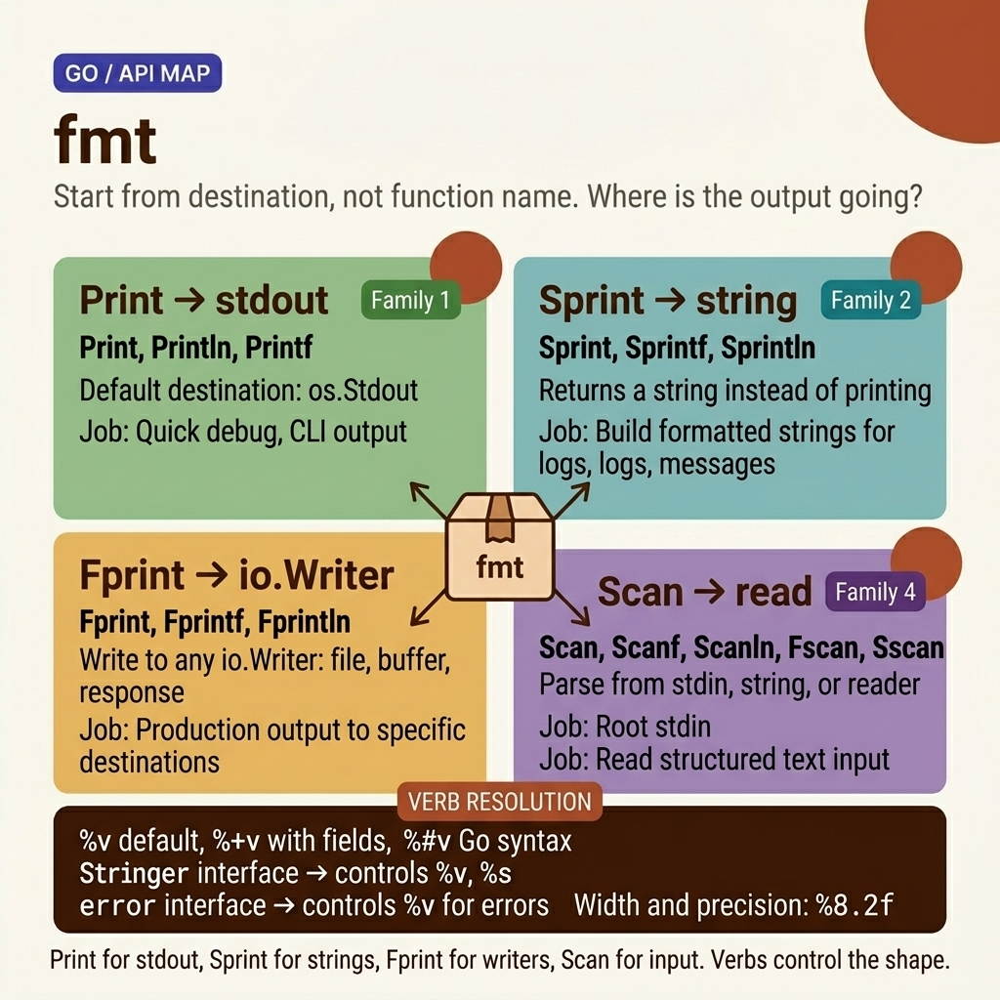

<!-- tags: golang --> # 🖨️ Fmt — Định dạng, In & Quét

> Package `fmt` là trung tâm định dạng I/O trung tâm trong Go : quy trình in, xây dựng chuỗi format và quét đầu vào. Việc hiểu các động từ format sẽ tăng tốc quá trình gỡ lỗi và đảm bảo kết quả đầu ra chính xác.

📅 Đã tạo: 23-03-2026 · 🔄 Đã cập nhật: 19-04-2026 · ⏱️ 15 phút đọc

| Khía cạnh | Chi tiết |
| -------------- | ----------------------------------------- |
| ** Package ** | `fmt` |
| **Trường hợp sử dụng** | In, chuỗi format , quét đầu vào, gỡ lỗi |
| ** Interfaces ** | `Stringer` , `GoStringer` , `Formatter` |
| **Quy tắc chính** | `%v` dành cho trường chung, `%+v` dành cho trường struct |

---

## 1. ĐỊNH NGHĨA `fmt.Sprintf("%v", obj)` thuận tiện nhưng chậm hơn 5 lần so với `strconv.Itoa()` . `fmt.Errorf("%w", err)` kết thúc chuỗi lỗi; `%v` thì không. Sản xuất Go yêu cầu biết khi nào nên sử dụng `fmt` , khi nào cần tiếp cận `strconv` và khi nào nên xoay sang `strings.Builder` .

> *Bạn đang gỡ lỗi sản xuất. API trả về dữ liệu sai nhưng bạn không thể biết được ở bước nào. Bạn cần in các giá trị biến, đầu ra nhật ký format và tạo thông báo lỗi có ngữ cảnh. Trong Go , tất cả đầu ra được định dạng đều chảy qua một package : `fmt` .*
>
> * `fmt` nhiều hơn `println` . Đây là bộ công cụ định dạng linh hoạt: `Sprintf` xây dựng chuỗi một cách an toàn, `Fprintf` ghi vào any `io.Writer` (tệp, phản hồi HTTP, bộ đệm) và `Errorf` với `%w` tạo ra các lỗi bao bọc để duy trì chuỗi nguyên nhân. Nắm vững `fmt` có nghĩa là nắm vững cách Go giao tiếp — với nhà phát triển qua nhật ký, với người gọi qua lỗi và với khách hàng qua phản hồi API.*

### Chức năng in

| Chức năng | Đầu ra | Dòng mới? | Format ? |
| ---------- | ------------- | -------- | ------- |
| `Print` | thiết bị xuất chuẩn | ❌ | ❌ |
| `Println` | thiết bị xuất chuẩn | ✅ | ❌ |
| `Printf` | thiết bị xuất chuẩn | ❌ | ✅ |
| `Sprint` | chuỗi trả về | ❌ | ❌ |
| `Sprintf` | chuỗi trả về | ❌ | ✅ |
| `Sprintln` | chuỗi trả về | ✅ | ❌ |
| `Fprint` | io.Writer | ❌ | ❌ |
| `Fprintf` | io.Writer | ❌ | ✅ |
| `Errorf` | lỗi trả về | ❌ | ✅ |

### Format Động từ — Bảng tham khảo

| Động từ | Mô tả | Đầu ra ví dụ |
| ----- | ------------------------ | ------------------------- |
| `%v` | Mặc định format | `{Alice 25}` |
| `%+v` | Struct với tên trường | `{Name:Alice Age:25}` |
| `%#v` | Biểu diễn cú pháp Go | `main.User{Name:"Alice"}` |
| `%T` | Loại | `main.User` |
| `%d` | Số nguyên (thập phân) | `42` |
| `%b` | Số nguyên (nhị phân) | `101010` |
| `%o` | Số nguyên (bát phân) | `52` |
| `%x` | Số nguyên (chữ thường hex) | `2a` |
| `%X` | Số nguyên (chữ hoa hex) | `2A` |
| `%f` | Phao (thập phân) | `3.141593` |
| `%e` | Phao (khoa học) | `3.141593e+00` |
| `%g` | Phao (nhỏ gọn) | `3.14159` |
| `%s` | Chuỗi | `hello` |
| `%q` | Chuỗi trích dẫn | `"hello"` |
| `%c` | Nhân vật (rune) | `A` |
| `%p` | Pointer địa chỉ | `0xc000014080` |
| `%t` | Boolean | `true` |
| `%%` | Nghĩa đen % | `%` |

### Chiều rộng và độ chính xác

| Cú pháp | Mô tả | Đầu ra ví dụ |
| ------- | -------------------------- | -------------- |
| `%10d` | Chiều rộng 10, căn phải | ` 42` |
| `%-10d` | Chiều rộng 10, căn trái | `42 ` |
| `%010d` | Chiều rộng 10, không đệm | `0000000042` |
| `%.2f` | 2 chữ số thập phân | `3.14` |
| `%8.2f` | Chiều rộng 8, 2 số thập phân | ` 3.14` |
| `%.5s` | Cắt chuỗi còn 5 ký tự | `Hello` |

---

Các động từ format này trông quen thuộc — nhưng có bẫy thực sự: `%v` trên pointer in địa chỉ thay vì giá trị và `Sprintf` trong vòng lặp nóng sẽ tạo ra cơn bão phân bổ. Những cái bẫy đó xuất hiện trong PITFALS.

## 2. HÌNH ẢNH `fmt` trông giống như một hình phẳng package , nhưng mô hình tinh thần chính xác bắt đầu từ *destination* thay vì tên hàm. Hình ảnh bên dưới sắp xếp lại API thành các nhóm gia đình: đầu ra đi đâu, chuỗi được tạo như thế nào và điều gì kiểm soát độ phân giải động từ.  *Hình: Họ API map dành cho `fmt` nhóm bốn họ — `Print` , `Sprint` , `Fprint` , `Scan` — sau đó neo lớp phân giải động từ trong đó `Stringer` , `error` , chiều rộng và độ chính xác bắt đầu định hình đầu ra thực tế.*

Khi thứ tự đích và độ phân giải hiển thị, mã bên dưới sẽ không còn cảm giác giống như "ghi nhớ động từ". Thay vào đó, bạn sẽ hiểu tại sao cùng một giá trị lại tạo ra kết quả hoàn toàn khác khi bạn chuyển đổi họ hoặc động từ.

## 3. MÃ

Với **Fmt — Định dạng, In & Quét**, chúng tôi đã ánh xạ các động từ và mẫu đầu ra format . Bây giờ, hãy bước vào mã để xem mỗi lựa chọn — `%v` so với `%+v` , `Sprintf` so với `Fprintf` , `Stringer` so với thủ công format — thực sự thay đổi kết quả gỡ lỗi và chất lượng nhật ký như thế nào.

### Ví dụ 1: Cơ bản — Hàm in & Động từ Format Bạn đang gỡ lỗi struct và cần tên trường cộng với giá trị. `Println` chỉ in giá trị. `Printf("%v")` cũng chỉ in các giá trị. `Printf("%+v")` thêm tên trường. `Printf("%#v")` cũng thêm tên loại - nhưng khi nào bạn nên sử dụng tên loại nào? `fmt` package có 3 nhóm động từ: chung ( `%v` , `%T` ), số nguyên ( `%d` , `%x` ) và chuỗi ( `%s` , `%q` ) — mỗi động từ phục vụ một mục đích riêng biệt.

Đầu vào: `fmt.Printf("%+v", User{"Go", 15})` · Đầu ra: `{Name:Go Age:15}````go
package main

import "fmt"

type User struct {
	Name string
	Age  int
}

func main() {
	u := User{"Alice", 25}

	// ━━━━━ Print vs Println vs Printf ━━━━━
	fmt.Print("no newline")
	fmt.Println("with newline")
	fmt.Printf("formatted: %s is %d years old\n", u.Name, u.Age)

	// ━━━━━ %v variants ━━━━━
	fmt.Printf("%%v:  %v\n", u)       // {Alice 25}
	fmt.Printf("%%+v: %+v\n", u)     // {Name:Alice Age:25}
	fmt.Printf("%%#v: %#v\n", u)     // main.User{Name:"Alice", Age:25}
	fmt.Printf("%%T:  %T\n", u)      // main.User

	// ━━━━━ Number formats ━━━━━
	n := 255
	fmt.Printf("Decimal:  %d\n", n)   // 255
	fmt.Printf("Binary:   %b\n", n)   // 11111111
	fmt.Printf("Octal:    %o\n", n)   // 377
	fmt.Printf("Hex:      %x\n", n)   // ff
	fmt.Printf("Hex:      %X\n", n)   // FF
	fmt.Printf("Unicode:  %U\n", 'A') // U+0041

	// ━━━━━ Float formats ━━━━━
	pi := 3.14159265358979
	fmt.Printf("Default:    %f\n", pi)   // 3.141593
	fmt.Printf("Scientific: %e\n", pi)   // 3.141593e+00
	fmt.Printf("Compact:    %g\n", pi)   // 3.14159265358979
	fmt.Printf("2 decimals: %.2f\n", pi) // 3.14

	// ━━━━━ String formats ━━━━━
	s := "Hello"
	fmt.Printf("String:  %s\n", s)    // Hello
	fmt.Printf("Quoted:  %q\n", s)    // "Hello"
	fmt.Printf("Bytes:   %x\n", s)    // 48656c6c6f

	// ━━━━━ Pointer ━━━━━
	p := &n
	fmt.Printf("Pointer: %p\n", p)    // 0xc000014088
}
```> `%v` xuất ra `{Alice 25}` — bạn không thể biết trường nào là trường nào. `%+v` xuất ra `{Name:Alice Age:25}` — rõ ràng. `%#v` thậm chí còn cung cấp cú pháp Go `main.User{Name:"Alice", Age:25}` - sẵn sàng sao chép-dán. `%T` cung cấp tên loại - hữu ích khi interface ẩn loại bê tông.

> **Takeaway**: `%v` cho đầu ra chung, `%+v` để gỡ lỗi structs , `%#v` cho kết xuất mã, `%T` để kiểm tra loại. Định dạng số: `%d` thập phân, `%x` hex, `%b` nhị phân.

Những điều cơ bản về in ấn được đề cập. Nhưng format động từ đi sâu hơn: `%+v` , `%#v` , chiều rộng/độ chính xác và Stringer interface .

### Ví dụ 2: Trung cấp — Chiều rộng, Đệm & Chạy nước rút

Bạn in một bảng dữ liệu ra terminal: các cột dính vào nhau, các số bị lệch. `Printf` cung cấp chiều rộng và phần đệm: `%10d` căn phải trong vòng 10 ký tự, `%-10s` căn trái, `%08x` căn lề bằng số 0. `Sprintf` trả về một chuỗi thay vì in — sử dụng chuỗi đó để xây dựng các chuỗi được định dạng để ghi nhật ký và báo cáo.

Đầu vào: `fmt.Sprintf("%-10s %5d", "Go", 42)` · Đầu ra: `"Go 42"````go
package main

import "fmt"

func main() {
	// ━━━━━ Width & Alignment ━━━━━
	fmt.Printf("|%10d|\n", 42)     // |        42|   right-aligned
	fmt.Printf("|%-10d|\n", 42)    // |42        |   left-aligned
	fmt.Printf("|%010d|\n", 42)    // |0000000042|   zero-padded
	fmt.Printf("|%+d|\n", 42)     // |+42|          show sign
	fmt.Printf("|%+d|\n", -42)    // |-42|          show sign

	// ━━━━━ Float precision ━━━━━
	fmt.Printf("|%10.2f|\n", 3.14)   // |      3.14|
	fmt.Printf("|%-10.2f|\n", 3.14)  // |3.14      |

	// ━━━━━ String width ━━━━━
	fmt.Printf("|%15s|\n", "hello")    // |          hello|
	fmt.Printf("|%-15s|\n", "hello")   // |hello          |
	fmt.Printf("|%.3s|\n", "hello")    // |hel|   truncate

	// ━━━━━ Sprintf — build formatted string ━━━━━
	name := "API"
	version := 2
	url := fmt.Sprintf("https://example.com/%s/v%d", name, version)
	fmt.Println(url) // https://example.com/API/v2

	// ━━━━━ Errorf — create formatted error ━━━━━
	id := 42
	err := fmt.Errorf("user %d not found", id)
	fmt.Println(err) // user 42 not found

	// ✅ Wrap error (Go 1.13+)
	originalErr := fmt.Errorf("connection refused")
	wrappedErr := fmt.Errorf("failed to get user %d: %w", id, originalErr)
	fmt.Println(wrappedErr) // failed to get user 42: connection refused

	// ━━━━━ Tabular output ━━━━━
	type Product struct {
		Name  string
		Price float64
		Stock int
	}
	products := []Product{
		{"Laptop", 999.99, 5},
		{"Mouse", 29.99, 150},
		{"Keyboard", 79.99, 42},
	}

	fmt.Printf("%-12s %10s %6s\n", "PRODUCT", "PRICE", "STOCK")
	fmt.Println("─────────────────────────────────")
	for _, p := range products {
		fmt.Printf("%-12s %10.2f %6d\n", p.Name, p.Price, p.Stock)
	}
}
```> `%w` bao bọc lỗi — bảo toàn toàn bộ chuỗi lỗi. `errors.Is()` và `errors.As()` có thể duyệt chuỗi để tìm ra nguyên nhân gốc rễ. Nếu không có `%w` , chuỗi lỗi sẽ bị mất và người gọi không thể kiểm tra kiểu. `%v` định dạng lỗi thành một chuỗi đơn giản - mất hoàn toàn thông tin loại.

> **Takeaway**: `Sprintf` để xây dựng chuỗi, `Errorf` + `%w` cho error wrapping . Chiều rộng và phần đệm cho đầu ra dạng bảng. `%010d` zero-pad, `%-10s` căn trái. Format động từ được bao phủ. Tiếp theo: Stringer/GoStringer tùy chỉnh, `fmt.Formatter` interface và các lựa chọn thay thế ghi nhật ký hiệu suất cao.

### Ví dụ 3: Nâng cao — Stringer Interface & Fprint

Bạn có `Money` struct với `Amount` và `Currency` . Mỗi time bạn in, bạn viết thủ công `fmt.Printf("%s %.2f", m.Currency, m.Amount)` . Triển khai `fmt.Stringer` interface (một phương thức `String() string` ) và `fmt.Println(m)` sẽ tự động gọi phương thức đó - DRY và nhất quán.

Họ `Fprint` ghi vào any `io.Writer` (tệp, mạng, bộ đệm) thay vì thiết bị xuất chuẩn - tạo thành nền tảng của ghi nhật ký có cấu trúc và kết xuất mẫu.

Đầu vào: `fmt.Println(Money{42.5, "USD"})` · Đầu ra: `USD 42.50````go
package main

import (
	"fmt"
	"os"
	"strings"
)

// ━━━━━ Stringer interface — custom %v output ━━━━━

type Color struct {
	R, G, B uint8
}

// ✅ Implement fmt.Stringer → controls %v and %s output
func (c Color) String() string {
	return fmt.Sprintf("#%02X%02X%02X", c.R, c.G, c.B)
}

// ✅ Implement fmt.GoStringer → controls %#v output
func (c Color) GoString() string {
	return fmt.Sprintf("Color{R:%d, G:%d, B:%d}", c.R, c.G, c.B)
}

// ━━━━━ Custom type with Stringer ━━━━━

type LogLevel int

const (
	DEBUG LogLevel = iota
	INFO
	WARN
	ERROR
)

func (l LogLevel) String() string {
	names := [...]string{"DEBUG", "INFO", "WARN", "ERROR"}
	if int(l) < len(names) {
		return names[l]
	}
	return fmt.Sprintf("LogLevel(%d)", l)
}

func main() {
	// ━━━━━ Stringer in action ━━━━━
	red := Color{255, 0, 0}
	fmt.Println(red)              // #FF0000
	fmt.Printf("Color: %v\n", red) // Color: #FF0000
	fmt.Printf("Go:    %#v\n", red) // Go: Color{R:255, G:0, B:0}

	// ━━━━━ Enum formatting ━━━━━
	level := WARN
	fmt.Printf("Level: %v (%d)\n", level, level) // Level: WARN (2)

	// ━━━━━ Fprint — write to any io.Writer ━━━━━
	// ✅ Write to stderr
	fmt.Fprintln(os.Stderr, "This goes to stderr")

	// ✅ Write to strings.Builder
	var b strings.Builder
	fmt.Fprintf(&b, "Name: %s, Age: %d", "Bob", 30)
	result := b.String()
	fmt.Println(result) // Name: Bob, Age: 30

	// ✅ Write to file
	f, err := os.CreateTemp("", "output-*.txt")
	if err != nil {
		fmt.Println("Error:", err)
		return
	}
	defer f.Close()
	defer os.Remove(f.Name())

	fmt.Fprintf(f, "Report generated\n")
	fmt.Fprintf(f, "Users: %d\n", 42)
}
```> **Tại sao Stringer interface là mẫu quan trọng nhất trong `fmt` ?**
> Việc triển khai `String() string` trên một loại tùy chỉnh có nghĩa là `fmt.Println(myType)` sẽ tự động gọi phương thức đó. Không cần ghi đè `toString()` hoặc decorator — chỉ một phương thức. Áp dụng nó để ghi nhật ký enum ( `LogLevel.String()` ), định dạng màu, hiển thị tiền. `Fprint` + `io.Writer` tách đích đầu ra khỏi logic định dạng.

> **Takeaway**: Stringer cho đầu ra `%v` / `%s` tùy chỉnh. GoStringer cho `%#v` . `Fprint*` để ghi vào any `io.Writer` . Kết hợp với `strings.Builder` để xây dựng chuỗi hiệu quả.

---

## 4. Cạm bẫy

Cơ chế cốt lõi của **Fmt — Định dạng, In & Quét** rất rõ ràng. Những gì còn lại là cú pháp nhận dạng có vẻ _gần như đúng_ nhưng lại đưa ra các lỗi format hoặc bẫy hiệu suất trong quá trình sản xuất.

| # | Mức độ nghiêm trọng | Lỗi | Hậu quả | Sửa chữa |
|---|----------|------|-------------|------|
| 1 | 🔴 Gây tử vong | Vòng lặp vô hạn Stringer - `String()` gọi `Sprintf` bằng receiver | Stack tràn panic | Sử dụng các trường trực tiếp, không phải `%v` với receiver |
| 2 | 🟡 Chung | `Printf` thiếu `
` | Đầu ra không chuyển sang dòng tiếp theo | Nối `
` hoặc sử dụng `Println` |
| 3 | 🟡 Chung | Động từ không khớp → đầu ra `%!d(string=hello)` | Đầu ra gỡ lỗi trở nên không thể đọc được | Nối động từ với đúng loại |
| 4 | 🟡 Chung | `Sprintf` chậm hơn `strconv` khi chuyển đổi số | Suy giảm hiệu suất trong các đường dẫn nóng | Ưu tiên `strconv.Itoa()` khi bạn chỉ cần number→string |
| 5 | 🔵 Nhỏ | `%w` chỉ hoạt động bên trong `Errorf` | Biên dịch tốt nhưng hoạt động không chính xác tại runtime | `%w` chỉ xử lý các lỗi thông qua `fmt.Errorf` |

### 🔴 Cạm bẫy #1 — Sự cố vòng lặp vô hạn của Stringer

Bạn viết một phương thức `String()` cho kiểu `MyType` và bên trong nó gọi `fmt.Sprintf("%v", m)` — vô tình tạo ra đệ quy vô hạn:```go
type MyType struct{ Name string }

func (m MyType) String() string {
    return fmt.Sprintf("MyType: %v", m) // ❌ %v calls String() again → infinite loop!
}
// Fix: fmt.Sprintf("MyType: %s", m.Name)  ← use the field directly
````fmt` thấy `%v` trên loại có `String()` → gọi `String()` → gặp lại `%v` → gọi `String()` → tràn stack . Lỗi này chỉ xuất hiện ở runtime — trình biên dịch không đưa ra cảnh báo.

---

Bạn đã khám phá `fmt` package từ `Printf` thông qua các trình định dạng tùy chỉnh. Các tài nguyên dưới đây sẽ đưa bạn sâu hơn.

## 5. GIỚI THIỆU

| Tài nguyên | Loại | Liên kết | Ghi chú |
| ------------------------ | -------- | ----------------------------------------------------------------------------------------------------------------------- | ----- |
| `fmt` package | Chính thức | [pkg.go.dev/fmt](https://pkg.go.dev/fmt) | Tham chiếu API |
| Có hiệu lực Go — In ấn | Chính thức | [go.dev/doc/effective_go#printing](https://go.dev/doc/effective_go#printing) | Thực tiễn tốt nhất |
| Format bảng động từ | Bên ngoài | [yourbasic.org/golang/fmt-printf-reference-cheat-sheet](https://yourbasic.org/golang/fmt-printf-reference-cheat-sheet/) | Tham khảo nhanh |

---

## 6. KHUYẾN NGHỊ

Nền tảng của **Fmt — Định dạng, In & Quét** rất rõ ràng. Các tiện ích mở rộng bên dưới giúp bạn đưa định dạng vào sản xuất bằng tính năng ghi nhật ký có cấu trúc, căn chỉnh CLI và tạo mẫu.

| Gia hạn | Khi nào | Tại sao | Tệp/Liên kết |
| -------------------- | -------------- | -------------------------------------- | --------- |
| `log` / `slog` | Ghi nhật ký có cấu trúc | Ghi nhật ký sản xuất thay vì fmt.Println | [pkg.go.dev/log/slog](https://pkg.go.dev/log/slog) |
| `text/tabwriter` | Đầu ra dạng bảng được căn chỉnh | Tự động căn chỉnh cột | [pkg.go.dev/text/tabwriter](https://pkg.go.dev/text/tabwriter) |
| `text/template` | Tạo văn bản phức tạp | Công cụ tạo mẫu tích hợp | [pkg.go.dev/text/template](https://pkg.go.dev/text/template) |
| `encoding/json` | Đầu ra có cấu trúc | Sắp xếp JSON cho API | [pkg.go.dev/encoding/json](https://pkg.go.dev/encoding/json) |
| `fmt.Formatter` | Động từ format tùy chỉnh | Triển khai cho các loại tùy chỉnh phức tạp | [pkg.go.dev/fmt#Formatter](https://pkg.go.dev/fmt#Formatter) |

---

**Điều hướng**: [← strconv](./03-strconv.md) · [→ math](./05-math.md)