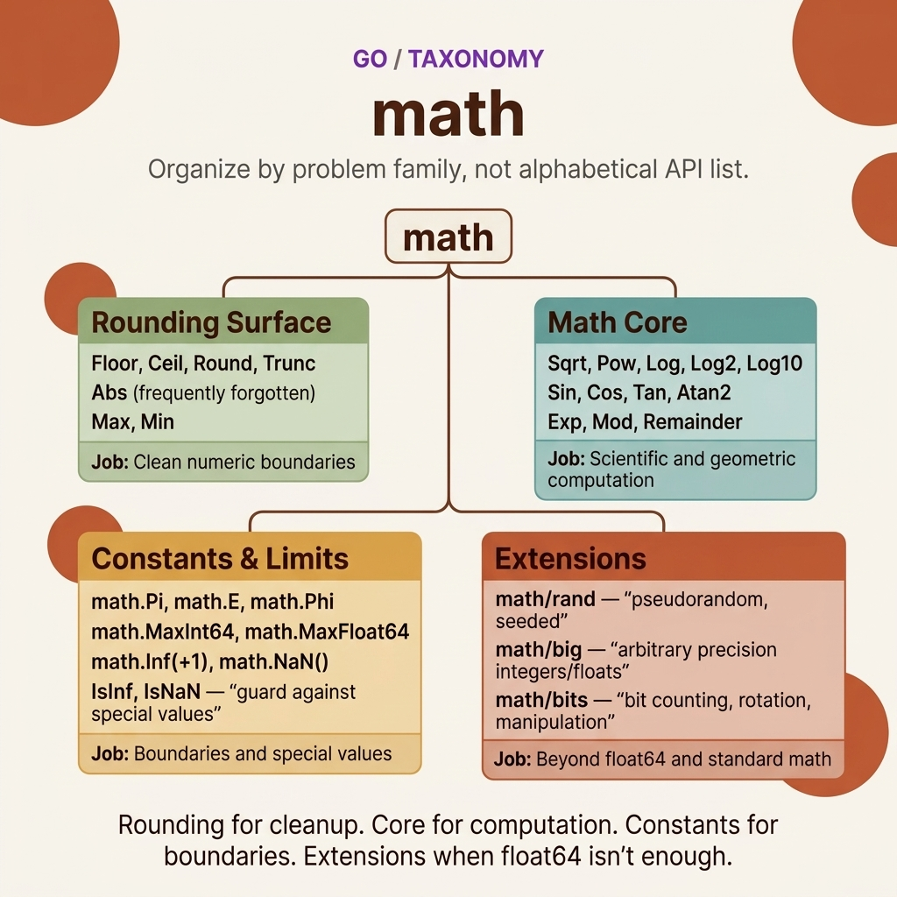

<!-- tags: golang --> # 🔢 Toán — Hàm số & Hằng

> Package `math` cung cấp các hàm toán học cơ bản: abs, min/max, round, sqrt, pow, lượng giác — và các hằng số tới hạn như Pi và MaxInt.

📅 Đã tạo: 23-03-2026 · 🔄 Đã cập nhật: 19-04-2026 · ⏱️ 16 phút đọc

| Khía cạnh | Chi tiết |
| -------------- | --------------------------------------------- |
| ** Package ** | `math` , `math/rand/v2` , `math/big` |
| **Trường hợp sử dụng** | Số học, số ngẫu nhiên, độ chính xác tùy ý |
| **Loại đầu vào** | `float64` (chủ yếu), `int` (tối thiểu/tối đa Go 1,21+) |
| **Quy tắc chính** | Luôn kiểm tra NaN/Inf khi làm việc với float |

---

## 1. ĐỊNH NGHĨA

> *Bạn đang tính phí vận chuyển dựa trên khoảng cách. Hoặc làm tròn giá cho một hóa đơn. Hoặc thực hiện thuật toán phân cụm cần khoảng cách Euclide. Hoặc tạo ra dữ liệu thử nghiệm ngẫu nhiên không thể đoán trước. Tất cả những thứ này đều yêu cầu thư viện chuẩn của `math` — Go bao gồm `math` , `math/rand/v2` và `math/big` .*
>
> *Điều đầu tiên cần biết: hầu hết các hàm trong `math` đều chấp nhận và trả về `float64` . Đây là lý do tại sao bạn không thể gọi `math.Sqrt(25)` bằng `int` - bạn phải truyền: `math.Sqrt(float64(25))` . Go 1.21 đã thêm `min` / `max` tích hợp cho loại any comparable — giảm đáng kể bản soạn sẵn. Và `math/rand/v2` ( Go 1.22+) thay thế hoàn toàn `math/rand` cũ bằng API đơn giản hơn và nguồn mặc định mạnh hơn về mặt mật mã.*

### Nhóm chức năng `math` package được tổ chức thành **6 nhóm chức năng** — mỗi nhóm giải quyết một miền khác nhau:

| Gia đình | Chức năng |
| -------------- | -------------------------------------------------------- |
| **Cơ bản** | `Abs` , `Max` , `Min` , `Ceil` , `Floor` , `Round` |
| **Nguồn/Gốc** | `Pow` , `Sqrt` , `Cbrt` , `Exp` , `Log` , `Log2` , `Log10` |
| **Trig** | `Sin` , `Cos` , `Tan` , `Asin` , `Acos` , `Atan` , `Atan2` |
| **Đặc biệt** | `IsNaN` , `IsInf` , `NaN` , `Inf` , `Mod` , `Remainder` |
| **Một chút** | `math/bits` — `OnesCount` , `Len` , `LeadingZeros` |
| **Ngẫu nhiên** | `math/rand/v2` — `IntN` , `Float64` , `N[T]` |
| **Lớn** | `math/big` — `Int` , `Float` , `Rat` (độ chính xác tùy ý) |

**Tại sao `math/rand/v2` thay vì `math/rand` ?** package cũ có trạng thái toàn cầu, không thread -safe nếu không gieo hạt thủ công và có API dài dòng ( `rand.Intn(n)` so với `rand.IntN(n)` của v2). v2 sử dụng `ChaCha8` PRNG theo mặc định — phân phối nhanh hơn, tốt hơn và không cần gieo hạt thủ công.

### Các hằng số quan trọng

| Hằng số | Giá trị / Mô tả |
| ----------------------------- | ------------------------------------ |
| `math.Pi` | 3.14159265358979... |
| `math.E` | 2.71828182845904... (số Euler) |
| `math.MaxInt` | Giá trị tối đa của `int` |
| `math.MinInt` | Giá trị tối thiểu của `int` |
| `math.MaxFloat64` | 1.7976931348623157e+308 |
| `math.SmallestNonzeroFloat64` | 5e-324 |
| `math.MaxInt64` | 9223372036854775807 |

### Tích hợp tối thiểu/tối đa ( Go 1.21+)```text
Go < 1.21:  math.Max(float64, float64) float64  ← float64 only
Go >= 1.21: min(x, y)  /  max(x, y)             ← built-in, any comparable type
```**Tại sao phải đến Go 1.21?** Các hàm generic tích hợp cần có generics ( Go 1.18+) và time bổ sung để khái quát hóa hệ thống loại. Trước đó, bạn phải viết các trình trợ giúp theo loại cụ thể hoặc sử dụng `math.Max` với float64.

---

Các hàm toán học này trông có vẻ chuẩn — nhưng vẫn tồn tại những bẫy nguy hiểm: so sánh float64 với `==` không thành công do mất độ chính xác và tràn số nguyên diễn ra âm thầm. Những cái bẫy đó xuất hiện trong PITFALS.

## 2. HÌNH ẢNH

Với `math` , vấn đề không phải là package thiếu tổ chức. Vấn đề là bạn dễ dàng gộp tất cả các hàm số vào một nhóm tinh thần và quên rằng mỗi nhóm trả lời một loại câu hỏi về cơ bản khác nhau. Hình ảnh dưới đây phân tách các nhóm đó trước tiên.  *Hình: Thẻ phân loại cho làn `math` chia package theo nhóm bài toán: bề mặt làm tròn, lõi toán học, hằng số và giới hạn số, cùng với các phần mở rộng như ngẫu nhiên, số lớn và trợ giúp bit.*

Sau khi đã rõ loại vấn đề, mã bên dưới sẽ hiển thị các chi tiết đáng tập trung vào: cách các số âm thay đổi hành vi làm tròn, nơi xuất hiện sự mất độ chính xác và khi nào bạn phải để lại `math` cho `math/big` hoặc `math/bits` .

## 3. MÃ

Với **Toán học — Hàm số & Hằng số**, giờ đây chúng ta có map của các phép toán số. Hãy bước vào mã để xem mỗi lựa chọn — `math.Round` so với cắt ngắn thủ công, `math/rand` so với `crypto/rand` — thực sự thay đổi độ chính xác và bảo mật như thế nào.

### Ví dụ 1: Cơ bản — Hàm & Hằng toán học

Bạn đang tính khoảng cách Euclide giữa 2 điểm: `d = √((x₂-x₁)² + (y₂-y₁)²)` . Bạn cần `math.Sqrt` , `math.Pow` . Tính chu vi của một hình tròn: `C = 2πr` — mã cứng `3.14159` ? Thay vào đó, hãy sử dụng `math.Pi` - nó chính xác đến hơn 15 chữ số. Package `math` cung cấp các hằng số ( `Pi` , `E` , `MaxFloat64` ) và các hàm ( `Abs` , `Ceil` , `Floor` , `Round` ) cho tất cả các nhu cầu số học cơ bản.

Đầu vào: `math.Sqrt(16)` · Đầu ra: `4` · `math.Pi` · Đầu ra: `3.141592653589793````go
package main

import (
	"fmt"
	"math"
)

func main() {
	// ━━━━━ Constants ━━━━━
	fmt.Printf("Pi:       %.10f\n", math.Pi)         // 3.1415926536
	fmt.Printf("E:        %.10f\n", math.E)          // 2.7182818285
	fmt.Printf("MaxInt64: %d\n", math.MaxInt64)       // 9223372036854775807

	// ━━━━━ Abs ━━━━━
	fmt.Println(math.Abs(-42.5))                       // 42.5

	// ✅ Go 1.21+ built-in min/max (works with int, float, string)
	fmt.Println(min(3, 7))                    // 3
	fmt.Println(max(3, 7))                    // 7
	fmt.Println(min("apple", "banana"))       // "apple"

	// ━━━━━ Rounding ━━━━━
	x := 2.7
	fmt.Println(math.Floor(x))                         // 2
	fmt.Println(math.Ceil(x))                          // 3
	fmt.Println(math.Round(x))                         // 3
	fmt.Println(math.Trunc(x))                         // 2

	// ✅ Round to N decimal places
	price := 19.456
	rounded := math.Round(price*100) / 100
	fmt.Printf("%.2f\n", rounded)                      // 19.46

	// ━━━━━ Power & Root ━━━━━
	fmt.Println(math.Pow(2, 10))                       // 1024
	fmt.Println(math.Sqrt(144))                        // 12
	fmt.Println(math.Cbrt(27))                         // 3
	fmt.Println(math.Log(math.E))                      // 1
	fmt.Println(math.Log2(1024))                       // 10
	fmt.Println(math.Log10(1000))                      // 3

	// ━━━━━ Mod & Remainder ━━━━━
	fmt.Println(math.Mod(10, 3))                       // 1
	fmt.Println(math.Remainder(10, 3))                 // 1

	// ━━━━━ Special values ━━━━━
	fmt.Println(math.IsNaN(math.NaN()))                // true
	fmt.Println(math.IsInf(math.Inf(1), 1))            // true (positive infinity)
	fmt.Println(math.IsInf(math.Inf(-1), -1))          // true (negative infinity)
}
```> Các nhà thiết kế Go đã quyết định chống lại việc nạp chồng hàm. `Abs` cho `int` là tầm thường: `if n < 0 { n = -n }` . Go 1.21+ có loại `min` / `max` tích hợp cho any comparable loại - nhưng vẫn không có loại generic `Abs` tích hợp sẵn. Làm tròn đến N chữ số thập phân: `math.Round(x*100)/100` — thủ thuật nhân rồi chia.

> **Bài học rút ra**: `math.Pi` , `math.E` cho các hằng số. Tích hợp `min` / `max` ( Go 1.21+) thay thế `math.Max/Min` . `math.Round(x*N)/N` cho N chữ số thập phân. Luôn kiểm tra `IsNaN` / `IsInf` sau các thao tác float.

Những điều cơ bản về toán học được bao phủ. Nhưng số học dấu phẩy động có những bẫy chính xác mà nhiều nhà phát triển bỏ qua.

### Ví dụ 2: Trung cấp — Số ngẫu nhiên (toán/rand/v2)

Bạn cần tạo mã thông báo ngẫu nhiên cho ID session , một cổng ngẫu nhiên để kiểm tra hoặc xáo trộn danh sách phát. Go 1.22+ cung cấp cho `math/rand/v2` một API sạch hơn và tự động gieo hạt (không còn `rand.Seed()` như v1). Nhưng `math/rand` không an toàn về mặt mật mã - phù hợp với logic trò chơi, nhưng đối với mã thông báo bảo mật, bạn phải sử dụng `crypto/rand` .

Đầu vào: `rand.IntN(100)` · Đầu ra: int ngẫu nhiên trong `[0, 100)` · `rand.Float64()` · Đầu ra: float ngẫu nhiên trong `[0, 1)````go
package main

import (
	"fmt"
	"math/rand/v2"
)

func main() {
	// ━━━━━ math/rand/v2 (Go 1.22+) ━━━━━
	// ✅ Automatically seeded, no need for rand.Seed()

	// Random int [0, n)
	fmt.Println(rand.IntN(100))          // random 0-99

	// Random float [0.0, 1.0)
	fmt.Println(rand.Float64())          // random 0.0-0.999...

	// ✅ Generic N[T] — works with any integer type
	var n int32 = rand.N[int32](1000)
	fmt.Println(n)                        // random int32 0-999

	// ━━━━━ Random in range [min, max] ━━━━━
	randomInRange := func(min, max int) int {
		return rand.IntN(max-min+1) + min
	}
	fmt.Println(randomInRange(1, 6))     // dice roll: 1-6

	// ━━━━━ Random element from slice ━━━━━
	colors := []string{"red", "green", "blue", "yellow"}
	randomColor := colors[rand.IntN(len(colors))]
	fmt.Println("Random color:", randomColor)

	// ━━━━━ Shuffle slice ━━━━━
	deck := []int{1, 2, 3, 4, 5, 6, 7, 8, 9, 10}
	rand.Shuffle(len(deck), func(i, j int) {
		deck[i], deck[j] = deck[j], deck[i]
	})
	fmt.Println("Shuffled:", deck)

	// ━━━━━ Random string ━━━━━
	const charset = "abcdefghijklmnopqrstuvwxyzABCDEFGHIJKLMNOPQRSTUVWXYZ0123456789"
	randomString := func(length int) string {
		b := make([]byte, length)
		for i := range b {
			b[i] = charset[rand.IntN(len(charset))]
		}
		return string(b)
	}
	fmt.Println("Random ID:", randomString(8))
}
```> package cũ : trạng thái toàn cầu, thủ công `rand.Seed()` , API chi tiết ( `Intn` so với `IntN` ). v2 sử dụng `ChaCha8` PRNG — gieo hạt tự động, thread -an toàn, phân phối tốt hơn. Generic `rand.N[T]()` cho loại ngẫu nhiên an toàn. `Shuffle` sử dụng Fisher-Yates - O(n) tại chỗ.

> **Bài học rút ra**: `rand.IntN(n)` cho [0,n), `rand.Float64()` cho [0,1). `Shuffle` để ngẫu nhiên hóa slices . Chuỗi ngẫu nhiên: xây dựng từ bộ ký tự với `IntN(len(charset))` .

Độ chính xác của phao được bảo hiểm. Tiếp theo: `math/big` cho độ chính xác tùy ý, `crypto/rand` cho số học ngẫu nhiên an toàn và an toàn tràn.

### Ví dụ 3: Nâng cao — Hình học, Thống kê & Số lớn

Tính toán Fibonacci(200)? `int64` tràn ở mức Fibonacci(93). Tính lãi kép trên 500 kỳ? `float64` mất độ chính xác. Package `math/big` giải quyết vấn đề này: `big.Int` cho số nguyên có kích thước không giới hạn, `big.Float` cho số học chính xác tùy ý.

Kết hợp với hình học (khoảng cách, diện tích) và thống kê (trung bình, độ lệch chuẩn) để hiển thị `math` package trong bối cảnh sản xuất.

Đầu vào: `big.NewInt(0).Fib(200)` · Đầu ra: số có 42 chữ số, không tràn```go
package main

import (
	"fmt"
	"math"
	"math/big"
	"sort"
)

// ━━━━━ Geometry functions ━━━━━

func distance(x1, y1, x2, y2 float64) float64 {
	return math.Hypot(x2-x1, y2-y1) // ✅ Hypot = sqrt(x² + y²) — numerically stable
}

func degToRad(deg float64) float64 {
	return deg * math.Pi / 180
}

func radToDeg(rad float64) float64 {
	return rad * 180 / math.Pi
}

// ━━━━━ Statistics ━━━━━

func mean(nums []float64) float64 {
	sum := 0.0
	for _, n := range nums {
		sum += n
	}
	return sum / float64(len(nums))
}

func median(nums []float64) float64 {
	sorted := make([]float64, len(nums))
	copy(sorted, nums)
	sort.Float64s(sorted)

	n := len(sorted)
	if n%2 == 0 {
		return (sorted[n/2-1] + sorted[n/2]) / 2
	}
	return sorted[n/2]
}

func stddev(nums []float64) float64 {
	avg := mean(nums)
	sumSq := 0.0
	for _, n := range nums {
		diff := n - avg
		sumSq += diff * diff
	}
	return math.Sqrt(sumSq / float64(len(nums)))
}

func main() {
	// ━━━━━ Geometry ━━━━━
	d := distance(0, 0, 3, 4)
	fmt.Printf("Distance: %.2f\n", d) // 5.00

	angle := math.Atan2(4, 3)
	fmt.Printf("Angle: %.2f rad = %.2f deg\n", angle, radToDeg(angle))

	// ━━━━━ Statistics ━━━━━
	data := []float64{4, 8, 15, 16, 23, 42}
	fmt.Printf("Mean:   %.2f\n", mean(data))
	fmt.Printf("Median: %.2f\n", median(data))
	fmt.Printf("StdDev: %.2f\n", stddev(data))

	// ━━━━━ math/big — Arbitrary precision ━━━━━
	// ✅ Compute Fibonacci(100) — exceeds int64 range
	a := big.NewInt(0)
	b := big.NewInt(1)
	for i := range 100 { // Go 1.22+
		a.Add(a, b)
		a, b = b, a
	}
	fmt.Printf("Fibonacci(100) = %s\n", a.String())
	// 354224848179261915075

	// ✅ Big factorial
	factorial := big.NewInt(1)
	for i := int64(1); i <= 50; i++ {
		factorial.Mul(factorial, big.NewInt(i))
	}
	fmt.Printf("50! = %s\n", factorial.String())
}
```> **Tại sao nên sử dụng `math.Hypot` thay vì `sqrt(x²+y²)` thủ công ?**
> `Hypot` xử lý tràn/tràn theo cách ổn định về mặt số học — khi `x` hoặc `y` cực kỳ lớn hoặc nhỏ, công thức thủ công có thể tràn tại `x²` . `Hypot` chuẩn hóa trước khi tính toán. Các hàm thống kê (trung bình/trung bình/stddev) là các khối xây dựng - stdlib của Go không bao gồm chúng; bạn phải tự thực hiện chúng hoặc sử dụng `gonum` .

> **Takeaway**: `math/big` để có độ chính xác tùy ý (ngoài int64/float64). `math.Hypot` cho khoảng cách ổn định về mặt số lượng. Thống kê yêu cầu thực hiện thủ công hoặc thư viện bên ngoài.

---

## 4. Cạm bẫy

Cơ chế cốt lõi của **Toán học — Hàm số & Hằng số** rất rõ ràng. Những gì còn lại là cú pháp nhận dạng có vẻ _gần như đúng_ nhưng lại đưa ra các lỗi dấu phẩy động hoặc các vấn đề bảo mật trong quá trình sản xuất.

| # | Mức độ nghiêm trọng | Lỗi | Hậu quả | Sửa chữa |
|---|----------|------|-------------|------|
| 1 | 🔴 Gây tử vong | So sánh NaN: `NaN != NaN` | Điều kiện luôn sai | Sử dụng `math.IsNaN()` |
| 2 | 🔴 Gây tử vong | Tràn số nguyên không có lỗi | Giá trị sai im lặng | Kiểm tra: `if a > math.MaxInt64 - b` |
| 3 | 🟡 Chung | Độ chính xác nổi: `0.1 + 0.2 != 0.3` | Lỗi logic khi so sánh | Epsilon: `math.Abs(a-b) < 1e-9` |
| 4 | 🟡 Chung | `math.Max/Min` chỉ chấp nhận float64 (trước Go 1.21) | Chi phí chuyển đổi loại | Tích hợp `min()` / `max()` Go 1.21+ |
| 5 | 🔵 Nhỏ | `rand.IntN(0)` hoảng loạn | Runtime sự cố | Kiểm tra `n > 0` trước khi gọi |

### 🔴 Cạm bẫy số 1 — NaN là một "vi-rút" trong mã của bạn `NaN` (Không phải số) là một giá trị đặc biệt: **mọi so sánh với NaN đều trả về sai**, bao gồm `NaN == NaN` . Khi NaN xuất hiện trong một phép tính pipeline , nó sẽ lan truyền qua mọi thao tác: `NaN + 5 = NaN` , `NaN * 0 = NaN` . Kết quả: một báo cáo hiển thị `NaN` cho cột doanh thu và không ai biết nó bắt đầu sai từ khi nào.

**Khắc phục**: Kiểm tra `math.IsNaN()` sau mỗi lần chia float. Đặc biệt lưu ý rằng `0.0 / 0.0 = NaN` (nó không panic thích chia số nguyên cho 0).

### 🔴 Cạm bẫy #2 — Tràn số nguyên ở chế độ im lặng Go không panic khi tràn số nguyên - nó **bao quanh** bằng cách sử dụng số học mô-đun. `math.MaxInt64 + 1` bằng `math.MinInt64` (một số âm!). Trong tính toán tài chính, điều này biến `+$9.2 quintillion` thành `-$9.2 quintillion` mà không có bất kỳ lỗi nào.

**Khắc phục**: Kiểm tra trước khi thêm: `if a > math.MaxInt64 - b { /* overflow */ }` . Hoặc sử dụng `math/big` cho các số vượt quá phạm vi.

---

Bạn đã khám phá phép toán package từ cơ bản đến độ chính xác tùy ý. Các tài nguyên dưới đây đi sâu hơn.

## 5. GIỚI THIỆU

| Tài nguyên | Loại | Liên kết | Ghi chú |
| -------------- | -------- | ---------------------------------------------------------- | ----- |
| `math` package | Chính thức | [pkg.go.dev/math](https://pkg.go.dev/math) | Tham chiếu API |
| `math/rand/v2` | Chính thức | [pkg.go.dev/math/rand/v2](https://pkg.go.dev/math/rand/v2) | Go 1.22+ ngẫu nhiên |
| `math/big` | Chính thức | [pkg.go.dev/math/big](https://pkg.go.dev/math/big) | Độ chính xác tùy ý |
| `math/bits` | Chính thức | [pkg.go.dev/math/bits](https://pkg.go.dev/math/bits) | Thao tác bit |

---

## 6. KHUYẾN NGHỊ

Nền tảng của **Toán học — Hàm số & Hằng số** rất rõ ràng. Các tiện ích mở rộng bên dưới giúp bạn đưa các phép toán số vào sản xuất với tính toán ngẫu nhiên, số lớn và tính toán khoa học an toàn bằng tiền điện tử.

| Gia hạn | Khi nào | Tại sao | Tệp/Liên kết |
| ------------------------- | ------------------------ | ------------------------------- | --------- |
| `math/bits` | Thao tác bit | OnesCount, Len, RotateLeft | [pkg.go.dev/math/bits](https://pkg.go.dev/math/bits) |
| `crypto/rand` | Bảo mật quan trọng ngẫu nhiên | Số ngẫu nhiên mật mã | [pkg.go.dev/crypto/rand](https://pkg.go.dev/crypto/rand) |
| `gonum.org/v1/gonum` | Máy tính khoa học | Đại số tuyến tính, thống kê, FFT | [gonum.org](https://gonum.org) |
| `math/cmplx` | số phức | Mandelbrot, xử lý tín hiệu | [pkg.go.dev/math/cmplx](https://pkg.go.dev/math/cmplx) |
| `constraints` generic | Toán an toàn kiểu | Kẹp, Abs cho loại số any | [pkg.go.dev/golang.org/x/exp/constraints](https://pkg.go.dev/golang.org/x/exp/constraints) |

---

**Điều hướng**: [← fmt](./04-fmt.md) · [→ slices & maps](./06-slices-maps.md)